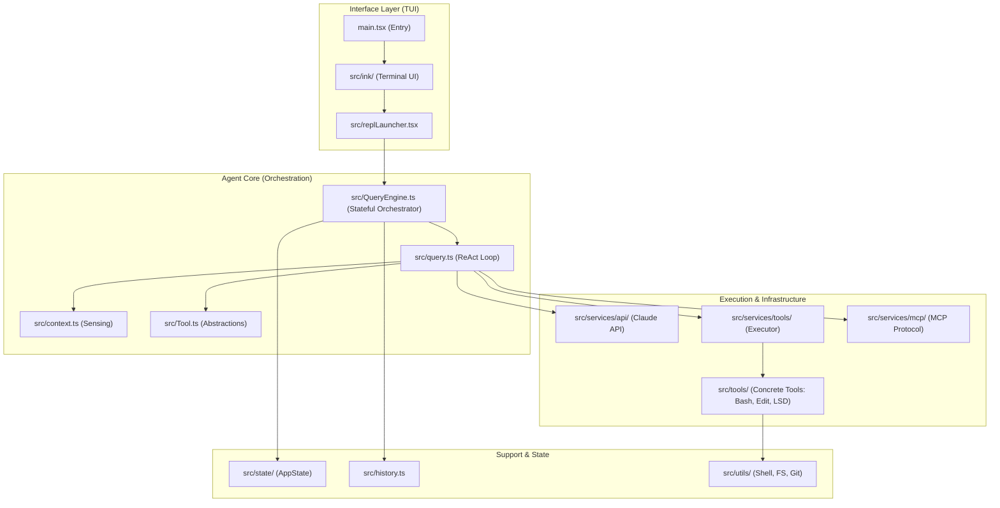
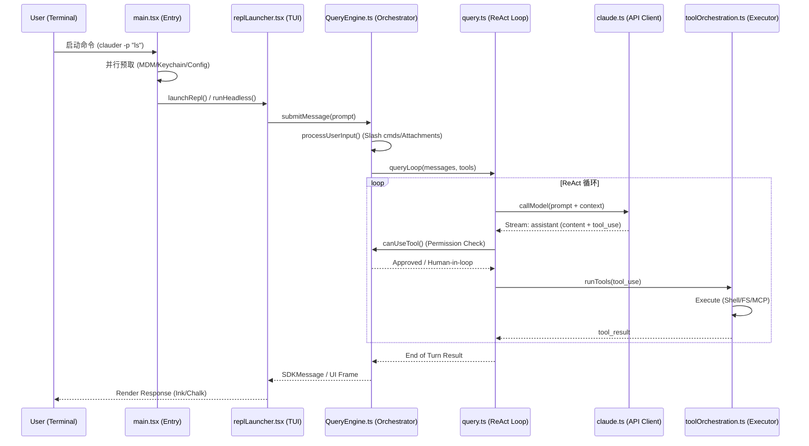

# 第一章：全局架构与设计哲学 (Deep Architecture & Design)

本章节将深入剖析 `claude-code` (CCR) 的工程实现，从底层依赖到高层编排，解构其作为现代 Agent 运行时的技术栈。

## 1.1 模块依赖拓扑 (Module Dependency Topology)

通过对项目的解构，我们可以将 CCR 的源代码分为 **Agent 核心 (Core)**、**基础设施 (Infra)** 和 **业务/领域逻辑 (Logic)** 三个维度。

### 核心模块职责简述：
- **Agent Core**: 负责对话状态管理、Prompt 组装以及 “思考-行动” 循环的驱动。
- **Infrastructure**: 处理网络通信 (API)、多模型协议 (MCP) 以及应用全局状态。
- **Execution Layer**: 落实 Agent 的物理影响，包含对文件系统、Shell 和外部服务的操作。

---

## 1.2 核心处理管道 (Execution Trace)

追踪一条典型的用户输入从 CLI 到输出动作的执行链路：

### 1.2.1 处理时序图 (Process Sequence Diagram)

### 1.2.2 关键类与函数表

| 阶段 | 关键类 / 函数 | 位置 | 作用描述 |
| :--- | :--- | :--- | :--- |
| **入口** | `main()` | `src/main.tsx` | 执行高性能启动预取 (MDM, Keychain)，解析 CLI 参数。 |
| **交互启动** | `launchRepl()` | `src/replLauncher.tsx` | 初始化终端 UI (Ink) 并启动交互式 REPL 会话。 |
| **输入预处理** | `processUserInput()` | `src/utils/processUserInput/` | 解析斜杠命令，对输入进行规范化和附件处理。 |
| **编排提交** | `QueryEngine.submitMessage()` | `src/QueryEngine.ts` | 转换用户输入为消息对象，触发模型推理 Turn。 |
| **循环驱动** | `queryLoop()` | `src/query.ts` | **核心 ReAct 循环**，控制多轮 Tool 使用与上下文压缩。 |
| **模型调用** | `deps.callModel()` | `src/services/api/claude.ts` | 封装 Anthropic SDK，处理流式响应与错误重试。 |
| **执行动作** | `runTools()` | `src/services/tools/toolOrchestration.ts` | 并行/串行执行 LLM 要求的工具调用。 |
| **响应渲染** | `normalizeMessage()` | `src/utils/queryHelpers.ts` | 将模型输出或工具结果转换为 UI 渲染器可识别的格式。 |

---

## 1.3 “思考-行动” (ReAct) 主循环步骤

CCR 的主循环位于 `src/query.ts` 的 `queryLoop` 异步生成器中。其执行逻辑如下：

1.  **Context assembly (上下文组装)**:
    - 调用 `fetchSystemPromptParts` 抓取当前环境信息（Git、文件树、已安装工具）。
    - 注入系统提示词 (System Prompt) 及对话历史。
2.  **Inference (模型采样)**:
    - 调用 `callModel` 进行流式交互。
    - 监听 `tool_use` 块的出现。
3.  **Verification (权限检查)**:
    - 每一个 `tool_use` 都会通过 `canUseTool` 钩子进行拦截。
    - 如果是敏感操作且处于 `manual` 模式，会挂起并由 `interactiveHelpers.tsx` 弹出 UI 请求人类确认。
4.  **Execution (工具执行)**:
    - 调用 `runTools` 进入确定性执行层。
    - 捕获 `stdout`、`stderr` 或系统生成的 `tool_result`。
5.  **Feedback (反馈闭环)**:
    - 将 `tool_result` 包装为 `user` 角色的消息。
    - 检查是否触发了上下文压缩 (Compaction) 以缩减 Token 占用。
    - **跳转至步骤 1** 开启下一轮推理，直到模型给出 `stop_reason: "end_turn"`。

---

## 1.4 核心组件索引表 (Developer Index)

| 类别 | 关键项 | 文件 / 路径 | 说明 |
| :--- | :--- | :--- | :--- |
| **核心** | `QueryEngine` | `src/QueryEngine.ts` | Stateful 编排器，管理 `mutableMessages`。 |
| **核心** | `queryLoop` | `src/query.ts` | ReAct 循环的物理实现地点。 |
| **工具** | `Tool` 接口 | `src/Tool.ts` | 所有新工具必须实现的类型规范。 |
| **提示词**| `SystemPrompt` | `src/utils/queryContext.ts` | 系统级提示词的动态生成逻辑。 |
| **提示词**| `Tool Prompts` | `src/tools/*/prompt.ts` | 每个工具自带的元描述（供 LLM 阅读）。 |
| **配置** | `GlobalConfig` | `src/utils/config.ts` | 配置文件 (`~/.claude.json`) 的读写逻辑。 |
| **状态** | `AppState` | `src/state/AppStateStore.ts` | 管理 Token 消耗、MCP 状态、UI 状态的全局 Store。 |

---

> [!IMPORTANT]
> **架构深度总结**：
> CCR 的设计精髓在于通过 `QueryEngine` (状态层) 和 `queryLoop` (逻辑层) 的解耦，实现了极其复杂的“带状态异步流”。开发者在扩展 CCR 时，通常只需在 `src/tools` 中新增工具实现，并确保其满足 `Tool` 契约，即可无缝融入上述 ReAct 循环。
