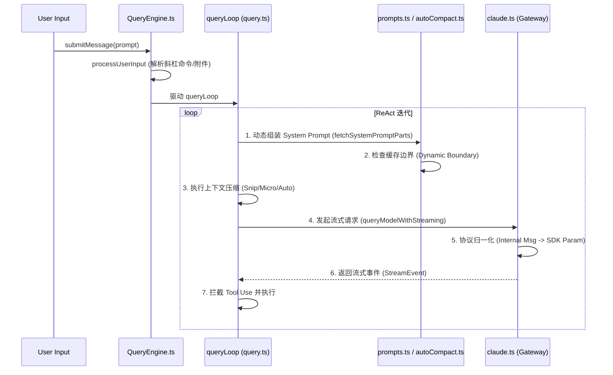

# 第二章：推理引擎、提示词工程与 LLM 抽象 (The Brain: Reasoning & Context)

本章深入探讨 `claude-code` (CCR) 的核心推理逻辑，重点解构其如何通过精密的 **Prompt 架构**、**上下文生命周期管理**以及**高度解解耦的 LLM 抽象层**，构建出一个工业级的 Agent 运行环境。

---

## 2.1 编排器与状态流转 (QueryEngine State Machine)

`QueryEngine` 是 CCR 的状态中枢，其核心任务是协调“用户意图解析”与“异步推理循环”。

### 2.1.1 核心处理时序图

---

## 2.2 提示词架构：缓存优化与模块化 (Prompt Architecture)

CCR 的提示词设计是其高性能的关键，核心逻辑位于 `src/constants/prompts.ts`。

### 2.2.1 动静分离边界 (Static/Dynamic Boundary)
为了最大化利用 Anthropic 的 **Prompt Caching** 功能，CCR 引入了 `SYSTEM_PROMPT_DYNAMIC_BOUNDARY`：
- **静态部分 (Static)**：包含 `getSimpleIntroSection` (角色定位)、`getSimpleDoingTasksSection` (行为准则) 等。这些内容在所有会话中保持高度一致，使用 `global` 缓存域。
- **动态部分 (Dynamic)**：包含 `computeSimpleEnvInfo` (当前目录、Git 状态)、`getMcpInstructionsSection` (外部工具指令) 等。这些内容随环境变化，放在边界之后。

### 2.2.2 提示词模块索引
| 模块名称 | 实现函数 | 作用描述 |
| :--- | :--- | :--- |
| **基础规则** | `getSimpleSystemSection` | 定义 TUI 渲染规则、权限模式及 Hook 机制。 |
| **工程哲学** | `getSimpleDoingTasksSection` | 注入“不做无效重构”、“不在未读代码前提建议”等核心 Agent 准则。 |
| **工具指南** | `getUsingYourToolsSection` | 引导模型优先使用专用工具 (FileEdit) 而非 Bash。 |
| **环境感知** | `computeSimpleEnvInfo` | 自动抓取 OS、Shell、Cwd 等 `<env>` 元数据。 |

---

## 2.3 上下文生命周期：感知与压缩 (Context Lifecycle)

CCR 如何将海量工作区信息塞进有限的 Prompt 窗口？

### 2.3.1 XML 上下文包装 (XML Wrapping)
CCR 极度依赖结构化的 XML 标签来区分不同维度的上下文：
- `<env>`: 环境元数据。
- `<ls>`: 目录树快照。
- `<system-reminder>`: 跨回合的系统级提醒，用于纠正模型幻觉。

### 2.3.2 三层并行压缩矩阵
| 层次 | 逻辑实现 | 触发条件 | 效果 |
| :--- | :--- | :--- | :--- |
| **剪枝 (Snip)** | `snipCompact.ts` | 每一轮请求前 | 物理移除冗余的中间执行过程，只保留关键节点。 |
| **微压缩 (Micro)** | `microCompact.ts` | 局部 Token 压力验证 | 对超长文件读取结果进行语义截断。 |
| **自动摘要 (Auto)** | `autoCompact.ts` | Token > 阈值 (如 13k) | 启动递归 Agent 提取历史里程碑，建立 `compact_boundary`。 |

---

## 2.4 LLM 抽象层：多厂商解耦 (LLM Abstraction)

底层调用逻辑位于 `src/services/api/claude.ts`，它是一个全功能的 API 网关。

### 2.4.1 协议归一化 (Normalization)
核心文件 `src/utils/messages.ts` 实现了从 **领域模型** 到 **通信模型** 的映射：
- **函数**：`normalizeMessagesForAPI`
- **逻辑**：将内部的 `Message` 对象（带 UUID、状态、本地附件）转换为 SDK 所需的 `BetaMessageParam`。这种设计使得业务逻辑与 Anthropic SDK 彻底解耦。

### 2.4.2 多厂商适配与自愈
- **抽象网关**：通过 `getAPIProvider()` 支持 Anthropic 1P、AWS Bedrock 和 Google Vertex AI。
- **故障自愈**：在 `withRetry.ts` 和 `claude.ts` 中集成了对 **413 (Payload Too Large)** 的拦截，一旦发现溢出，立即触发 `reactiveCompact` 强制压缩并重试，对用户无感。

---

## 2.5 给 Agent 开发者的 3 项核心借鉴 (Key Takeaways)

> [!TIP]
> ### 1. 缓存感知型 Prompt 设计 (Cache-Aware Design)
> **思想**：将 Prompt 视为代码，区分“恒定区”与“变量区”。
> **技巧**：通过物理边界符分隔 Prompt 数组，并在发送时根据边界切分，确保大部分 Token 始终命中缓存，显著降低 API 成本和延迟。

> [!TIP]
> ### 2. 强类型消息归一化 (Message Normalization)
> **思想**：不要让业务代码直接接触 SDK 对象。
> **技巧**：建立内部的 `Message` 领域模型，只在网关层进行一对一转换。这使得你可以在不改动核心引擎的情况下，轻松适配新的模型厂商或修改 Prompt 注入逻辑。

> [!TIP]
> ### 3. 环境作为“第一公民” (Environment Pre-sensing)
> **思想**：Agent 的行为应基于对环境的“深度观察”，而不仅仅是“对话历史”。
> **技巧**：在每一轮 `queryLoop` 中动态更新 `<env>` 和 `<ls>`，让 Agent 对当前工作目录的变化保持生理级的敏感，这是实现 CLI 工具级可靠性的基础。
