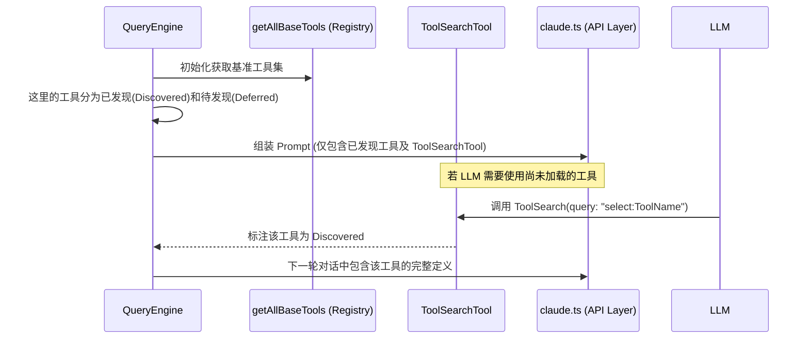

# 第三章：工具与能力系统 (The Hands: Tool & Capability System)

本章深入探讨 `claude-code` (CCR) 如何定义、发现并执行“确定性操作”（Tools），以及它如何通过工具反馈循环构建其闭环推理能力。

---

## 3.1 工具全景清单 (Built-in Tools Index)

CCR 拥有丰富的内置工具库，按职责可分为以下五大类：

| 分类 | 核心工具名称 | 物理路径 | 权限级别 | 核心能力描述 |
| :--- | :--- | :--- | :--- | :--- |
| **文件系统** | `FileRead`, `FileEdit`, `Glob`, `Grep` | `src/tools/FileReadTool/` | `Safe`/`Unsafe` | 文件的全文本读取、基于 Unified Diff 的精准编辑、文件搜索。 |
| **系统控制** | `Bash`, `PowerShell`, `Config` | `src/tools/BashTool/` | `Unsafe` | 物理终端指令执行、环境变量与系统配置管理。 |
| **逻辑与引擎** | `Agent`, `ToolSearch`, `Skill`, `Workflow` | `src/tools/ToolSearchTool/` | `Safe` | 子代理派发、工具发现（延迟加载）、自定义技能激活、工作流编排。 |
| **任务/团队** | `Task*`, `Team*` | `src/tools/Task*/` | `Safe` | 异步任务生命周期管理、多 Agent 团队协作与通信。 |
| **外部集成** | `MCP`, `WebSearch`, `LSP`, `WebFetch` | `src/tools/MCPTool/` | `Safe` | MCP 协议桥接、Web 实时搜索、语言服务器协议集成。 |

---

## 3.3 工具注册与动态发现机制

CCR 采用“静态加载 + 动态搜索”的混合机制。为了节省上下文窗口，并非所有工具 schema 都会随初始请求发送。

### 3.3.1 发现与注册时序图



---

## 3.4 工具调用与反馈循环 (Execution Feedback Loop)

CCR 的核心推进逻辑是基于 `AsyncGenerator` 的异步流式反馈。

### 3.4.1 调用反馈时序图 (修正版)

```mermaid
sequenceDiagram
    participant LLM as Anthropic API
    participant LOOP as queryLoop (query.ts)
    participant EXEC as toolExecution (runToolUse)
    participant UI as REPL / Terminal UI
    participant TOOL as Concrete Tool (e.g. Bash)

    LLM-->>LOOP: 1. 返回 assistant 消息 (包含 tool_use 块)
    LOOP->>EXEC: 2. 发起工具执行请求 (runTools)
    
    EXEC->>UI: 3. 发送权限请求 (canUseTool)
    UI-->>EXEC: 4. 用户批准 / 自动规则放行

    EXEC->>TOOL: 5. 调用物理执行 (tool.call)
    TOOL-->>EXEC: 6. 返回结果数据 (Output)
    
    EXEC-->>LOOP: 7. yield MessageUpdate (封装为 tool_result)
    LOOP->>UI: 8. 直播工具执行结果 (给用户看)
    
    Note over LOOP, LLM: 递归/循环进入下一轮
    LOOP->>LLM: 9. 重新请求 (包含上一轮的 tool_result 历史)
```

### 3.4.2 核心流程深度解析

1.  **流式产生与消费 (Yielding)**：`runTools` 并不等待所有工具执行完才返回，而是利用 `AsyncGenerator` 在每个工具完成时立即向 `queryLoop` 发送 `MessageUpdate`。这使得 UI 能实时展示工具执行进度。
2.  **双层权限验证**：
    -   **Pre-use Hooks**：在调用工具前触发，如检查文件是否存在、检查 Shell 命令是否在危险名单中。
    -   **HITL (Human-in-the-loop)**：对于 `Unsafe` 工具，强制挂起执行并弹出交互式对话框（由 `canUseTool` 钩子处理）。
3.  **结果归一化**：
    -   工具返回的 `Output` 会被包装进 `tool_result` 类型的 `UserMessage`。
    -   如果工具输出了巨大的数据（如 `ls` 输出了 1000 个文件），CCR 会在 `toolResultStorage` 中进行截断或存储，仅向 LLM 返回预览，以保护上下文窗口。
4.  **上下文修改 (Context Injection)**：部分工具（如 `ConfigTool`）通过 `contextModifier` 永久修改当前会话的 `ToolUseContext`，这些修改会影响后续所有工具的执行环境。

---

## 3.5 给 Agent 开发者的 3 项核心借鉴 (Key Takeaways)

> [!TIP]
> ### 1. 延迟发现与精准分发 (Dynamic Tool Injection)
> **思想**：不要一次性向 LLM 暴露所有工具定义，这会稀释指令遵循能力。
> **技巧**：使用 `ToolSearchTool` 建立“元发现”机制。LLM 首先表达意图，框架根据意图动态注入工具 Schema，这是处理具有上百个工具的复杂系统的关键。

> [!TIP]
> ### 2. 异步流式反馈 (Generator-based Feedback)
> **思想**：让执行过程“可见”。
> **技巧**：使用异步生成器处理工具执行。不要等待所有 Batch 完成，而是每一步都 yield 给 UI，同时累积到历史消息中，这样可以极大提升用户对 Agent “思考”过程的体感。

> [!TIP]
> ### 3. 结果预算与预防性截断 (Result Buffering)
> **思想**：防止工具输出“撑爆”上下文。
> **技巧**：在框架层实施 `applyToolResultBudget`。 CCR 会识别并防御性地截断超长工具输出，并提示 LLM 使用特定工具查看完整内容，从而保持对话的连续性。
