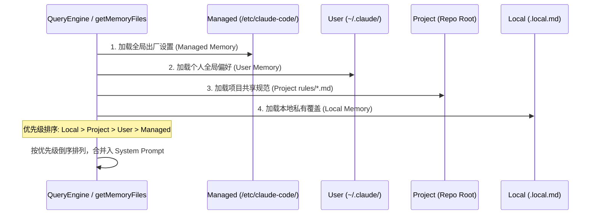

# 第四章：环境感知与记忆系统 (The Eyes: Sensing & Memory)

本章解析 `claude-code` (CCR) 如何构建其多层级的“上下文意识”，以及它如何通过级联记忆文件实现对不同项目、环境和用户偏好的动态适配。

---

## 4.1 全量感知机制清单 (Workspace Sensing Inventory)

CCR 不仅仅读取对话历史，它通过以下机制实时“感知”工作区状态：

| 感知维度 | 核心机制 | 物理实现 / 逻辑 | 作用 |
| :--- | :--- | :--- | :--- |
| **物理拓扑** | `Git Root` | `findCanonicalGitRoot` / 自下而上搜寻 `.git` 目录。 | 确定项目边界与相对路径基准。 |
| **工作流状态** | `Git Status` | `git status --porcelain` 解析。 | 让 Agent 了解哪些文件已修改、哪些是新增文件。 |
| **指令感知** | `Tree Traversal` | 遍历从 CWD 到 Root 路径下的所有 `CLAUDE.md`。 | 搜集项目特有的编码规范与项目目标。 |
| **环境上下文** | `Env/Platform` | `process.env`, `os.platform()`, `Shell` 类型。 | 适配不同的终端指令（如 `ls` vs `dir`）及权限级别。 |
| **持久化记忆** | `AutoMem` | `MEMORY.md` 自动维护。 | 跨会话的任务进度跟踪与知识沉淀。 |

---

## 4.2 四级级联记忆加载机制

CCR 的指令集不是扁平的，而是遵循“优先级叠加”的四级架构。

### 4.2.1 加载与合并时序图



### 4.2.2 优先级原则 (The Proximity Principle)
- **越近越强**：目录遍历时，距离当前工作目录（CWD）越近的配置文件，其内容在渲染时越靠后（LLM 对靠近 Prompt 末尾的内容关注度更高）。
- **去噪处理**：系统会自动剔除记忆文件中的 HTML 注释 (`<!-- -->`)。这意味着开发者可以在 `CLAUDE.md` 中留下“开发者备注”，这些备注不会被发送给 LLM，从而节省 Token。

---

## 4.3 @include 指令与规则匹配逻辑

为了实现指令的模块化，CCR 引入了 `@include` 与 Frontmatter 过滤机制。

### 4.3.1 递归解析逻辑 (`processMemoryFile`)
- **深度限制**：为防止循环引用和过度膨胀，解析深度上限为 **5 层**。
- **解析器**：使用 `marked` Lexer 在文本块中精准提取 `@path` 片段，支持绝对路径、相对路径和家目录 (`~/`)。
- **安全沙箱**：仅允许加载文本类扩展名（`.md`, `.txt`, `.json`, `.ts` 等），自动忽略图片或二进制文件。

### 4.3.2 按需注入：Frontmatter Paths 过滤
规则文件（如 `.claude/rules/*.md`）可以通过 Frontmatter 声明作用范围：

```markdown
---
paths:
  - "src/services/**"
  - "!src/tests/**"
---
# Service 编码规范...
```

**匹配流程**：
1. `processMdRules` 读取规则内容。
2. 调用 `picomatch` 对比当前操作的文件路径。
3. **按需注入**：只有当 Agent 即将操作匹配路径下的文件时，该规则才会被合并进 LLM 的上下文。

---

## 4.4 给 Agent 开发者的 3 项核心借鉴 (Key Takeaways)

> [!TIP]
> ### 1. 级联配置的灵活性 (Cascading Configuration)
> **思想**：不要试图在代码中写死 Prompt。
> **技巧**：模仿 CCR 的四级加载。允许仓库维护者定义共享规范（Project），同时允许开发者通过 `.local.md` 定义不被 Git 追踪的个人调试偏好。

> [!TIP]
> ### 2. 隐身备注 (Developer-only Comments)
> **思想**：开发者文档与 Agent 指令的统一。
> **技巧**：在框架层递归剔除 HTML 注释。这使得 `CLAUDE.md` 既可以作为人类可读的项目文档，也可以作为 Agent 的精简指令集。

> [!TIP]
> ### 3. 动态上下文注入 (Just-in-time Context)
> **思想**：避免 Context Window 爆炸。
> **技巧**：利用 Frontmatter 路径过滤。只有当任务涉及特定目录（如 `src/api`）时，才加载对应的领域规则，这是构建支持超大规模代码库 Agent 的核心优化策略。
