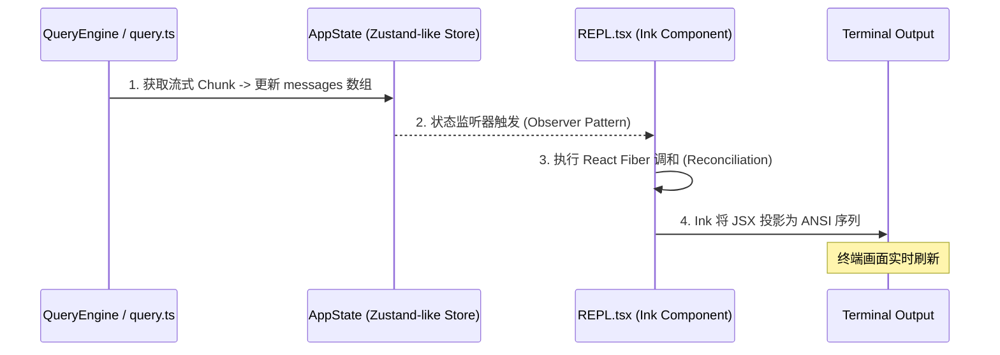
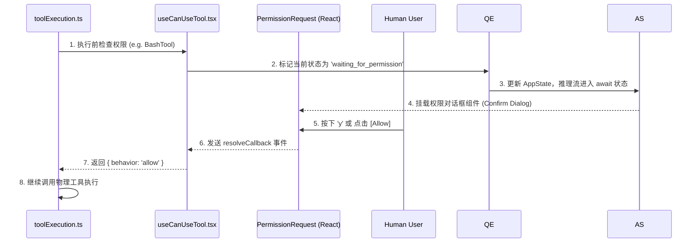

# 第五章：终端响应式 UI (The Face: Ink & TUI)

本章探讨 `claude-code` (CCR) 如何在字符终端中实现高性能、全响应式的交互体验。CCR 并不是简单的文本输出，而是一个基于 React 的复杂 Web 应用在终端的映射。

---

## 5.1 TUI 架构概览 (Component Inventory)

CCR 的界面由 [Ink](https://github.com/vadimdemedes/ink) 驱动，这使得它能利用 React 的组件化模型来管理终端 UI。

| 组件名称 | 核心职责 | 物理路径 |
| :--- | :--- | :--- |
| **REPL Container** | 顶格调度器，管理输入模式切换与全局快捷键逻辑。 | `src/screens/REPL.tsx` |
| **PromptInput** | 增强型输入，支持斜杠命令、!命令补全及历史记录。 | `src/components/PromptInput/` |
| **VirtualMessageList** | **核心性能组件**：基于视口裁剪的虚拟列表，处理万级消息不卡顿。 | `src/components/VirtualMessageList.tsx` |
| **PermissionRequest** | **HITL 门户**：用于阻断推理流并渲染交互式确认按钮/Diff。 | `src/components/permissions/` |
| **Spinner / ProgressBar**| 动画反馈：提供 Agent “生命体征”以及耗时任务的进度反馈。 | `src/components/Spinner.tsx` |

---

## 5.2 异步状态驱动架构 (State Driven)

CCR 实现了推理逻辑 (QueryEngine) 与 渲染逻辑 (Ink) 的彻底解耦。

### 5.2.1 状态同步时序图

### 5.2.2 逻辑桥接 (`useReplBridge`)
`QueryEngine` 通过 `useReplBridge` 钩子向 UI 暴露其内部状态。UI 只负责通过选择器（Selectors）消费这些状态，而无需关心复杂的推理逻辑。

---

## 5.3 HITL (人机协作) 拦截流

CCR 最具工业价值的设计在于如何“优雅”地在单线程终端中实现阻塞式权限交互。

### 5.3.1 权限拦截时序图

---

## 5.4 性能黑科技

### 5.4.1 窗口裁剪：Virtual Scrolling
对于长达数月的对话历史，通过 `VirtualMessageList` 实现：
- **只渲染可见区**：基于终端高度 (`useTerminalSize`) 动态计算需要渲染的消息切片。
- **内存回收**：不活跃的消息块以抽象 JSON 形式存在于 `AppState`，只有进入视口时才转化为渲染开销。

### 5.4.2 局部非破坏性渲染
- **AnimatedTerminalTitle**：为了不引起全局重绘，CCR 避开了在主 REPL 渲染动画，而是利用控制序列 (`\x1b]2;...\x07`) 直接修改终端标签页标题，实现极低开销的状态感知。

---

## 5.5 给 Agent 开发者的 3 项核心借鉴 (Key Takeaways)

> [!TIP]
> ### 1. UI 与推理的进程级/逻辑级解耦
> **思想**：UI 永远不应该直接拥有推理逻辑。
> **技巧**：将推理循环 (Query Loop) 限制为状态的生产者。UI 通过全局 Store 观察状态演变。这种模式便于在测试中 Mock 掉 UI 从而进行纯逻辑测试。

> [!TIP]
> ### 2. 交互式确认的异步化处理 (Async HITL)
> **思想**：权限门控不应打断系统的内存完整性。
> **技巧**：在工具执行器中使用 `await` 封装 UI 回调。框架层自动处理“等待用户”期间的 Spinner 状态，确保在非交互环境（如 CI）能自动回退到配置规则。

> [!TIP]
> ### 3. 性能第一：避免全局重绘 (Optimization first)
> **思想**：Ink 的渲染代价比原生控制台高。
> **技巧**：隔离频繁变动的组件（如进度条、Spiner）。利用局部 `State` 最小化 React 调度的颗粒度，对于极端场景（如超大文件差异对比），通过 `memo` 拦截不必要的渲染。
