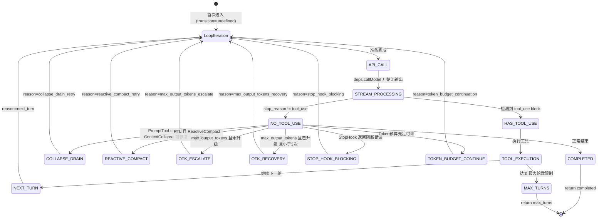

# DeepCC-04: Agentic Loop 深度逆向工程

> 逆向目标: `src/query.ts` (1730行) + `src/QueryEngine.ts` (1296行)
> 这两个文件构成了 Claude-Code 的 Agent 心跳核心

---

## 1. 总体架构：两层 Async Generator 编排

Claude-Code 的 Agent 编排采用 **两层 async generator** 架构，而非传统的 State Machine / DAG / Graph 模式：

```
┌─────────────────────────────────────────────────┐
│  QueryEngine.submitMessage() [outer generator]  │
│  职责: 会话级生命周期管理                         │
│  • System Prompt 构建                           │
│  • 用户输入预处理 (processUserInput)              │
│  • 消息持久化 (recordTranscript)                  │
│  • SDK 消息映射 (normalize → SDKMessage)          │
│  • Usage/Cost 统计累计                          │
│  • 结果判定 (isResultSuccessful)                 │
└──────────┬──────────────────────────────────────┘
           │ for await (const message of query({...}))
           ▼
┌─────────────────────────────────────────────────┐
│  query() → queryLoop()  [inner generator]       │
│  职责: 单轮 Agentic Loop 执行                    │
│  • while(true) 无限循环                         │
│  • 上下文压缩 pipeline                          │
│  • LLM API 流式调用 (deps.callModel)             │
│  • 流式 Tool 执行 (StreamingToolExecutor)        │
│  • 错误恢复 (Fallback/Truncation/Compact)        │
│  • Stop Hook 检查                               │
│  • Turn 计数 & Max Turns 限制                    │
└─────────────────────────────────────────────────┘
```

**设计意义**：
- 外层 Generator 隐藏了 SDK/REPL 的接口差异，统一对话生命周期
- 内层 Generator 则纯粹聚焦于 LLM → Tool → Continue 的 Agentic 循环
- Generator 的 `yield` 语义天然适配流式输出 — 每个 yield 点就是一次 UI 更新/SDK 事件推送

---

## 2. queryLoop() 核心状态机

### 2.1 State 结构 (可变跨迭代状态)

```typescript
type State = {
  messages: Message[]                    // 当前消息历史
  toolUseContext: ToolUseContext          // Tool 执行上下文 (工具列表, 权限, 信号)
  autoCompactTracking: AutoCompactTrackingState | undefined  // 压缩追踪
  maxOutputTokensRecoveryCount: number   // max_output_tokens 恢复计数 (上限3次)
  hasAttemptedReactiveCompact: boolean   // 是否已尝试过反应式压缩
  maxOutputTokensOverride: number | undefined // OTK 升级后的 max_tokens
  pendingToolUseSummary: Promise<...>    // 上一轮的 Tool 摘要 (与 API 调用并行)
  stopHookActive: boolean | undefined    // Stop Hook 是否正在活跃
  turnCount: number                      // 当前 Turn 编号
  transition: Continue | undefined       // 上一次循环的继续原因
}
```

### 2.2 状态转换图 (9 种 Named Transitions)



### 2.3 转换条件详解

| 转换 | 触发条件 | 行为 |
|---|---|---|
| `next_turn` | tool_use 存在 + 未 abort + 未 maxTurns | messages += assistant + toolResults, turnCount++ |
| `collapse_drain_retry` | PromptTooLong + ContextCollapse 有已暂存的折叠 | 提交所有暂存折叠，重新投递 API |
| `reactive_compact_retry` | PTL/MediaError + 反应式压缩成功 | 用压缩后 messages 重新投递 |
| `max_output_tokens_escalate` | OTK 触发 + 未使用 override + 无用户自定义 | 将 maxOutputTokens 升级到 64K (ESCALATED_MAX_TOKENS) |
| `max_output_tokens_recovery` | OTK 触发 + recoveryCount < 3 | 注入 meta 消息 "Resume directly — no apology" |
| `stop_hook_blocking` | StopHook 返回 blockingErrors | 注入阻断错误消息，标记 stopHookActive=true |
| `token_budget_continuation` | 500K+ Token Budget 未耗尽 + 未触及 diminishing returns | 注入 nudge 消息继续执行 |

---

## 3. 单次循环迭代的完整数据流

```
每次 while(true) 迭代执行以下 Pipeline:

Phase 1: 上下文预处理 (Context Preparation)
  messages
    -> getMessagesAfterCompactBoundary()    // 截取压缩边界后的消息
    -> applyToolResultBudget()              // 裁剪过大的 tool_result
    -> snipCompactIfNeeded() [HISTORY_SNIP] // 历史修剪 (轻量)
    -> microcompact()                       // 微压缩 (删除旧 tool_result)
    -> applyCollapsesIfNeeded() [CONTEXT_COLLAPSE] // 上下文折叠
    -> autocompact()                        // 自动压缩 (LLM 驱动摘要)
    = messagesForQuery (已压缩/修剪)

Phase 2: LLM API 调用 (Model Invocation)
  messagesForQuery
    -> prependUserContext()                 // 注入 user context
    -> fullSystemPrompt = systemPrompt + systemContext
    -> deps.callModel({                     // 流式 API 调用
         messages, systemPrompt, tools,
         thinkingConfig, signal, options: {
           model, fallbackModel,
           toolChoice, effortValue,
           taskBudget, advisorModel,
           maxOutputTokensOverride, ...
         }
       })
    -> for await (const message of stream)
        type='assistant' -> assistantMessages.push()
                         -> 检测 tool_use blocks
                         -> StreamingToolExecutor.addTool() (if streaming)
                         -> 判断是否 withhold (PTL/OTK/Media error)
                         -> yield message (if not withheld)
        type='stream_event' -> yield (progress indicators)

Phase 3: Tool 执行 (Tool Execution)
  toolUseBlocks (从 assistantMessages 中收集)
    [Streaming Mode] StreamingToolExecutor.getRemainingResults()
      - 工具在流式接收过程中已开始执行
      - 这里收集剩余结果
    [Sequential Mode] runTools(toolUseBlocks, ...)
      - 按顺序或并行执行所有 Tool
    每个 result -> yield message -> toolResults.push()

Phase 4: 附件注入 (Attachment Injection)
    -> getAttachmentMessages()              // 文件变更检测 -> diff 注入
    -> pendingMemoryPrefetch.consume()      // 相关记忆注入
    -> collectSkillDiscoveryPrefetch()      // 技能发现结果注入
    -> queuedCommands -> drain              // 队列命令消费

Phase 5: 继续/终止判断 (Continue/Stop Decision)
    needsFollowUp?
      false -> Error Recovery -> Stop Hook -> Token Budget -> return/continue
      true  -> maxTurns check -> state = next -> continue
```

---

## 4. 六级上下文压缩 Pipeline

> **关键洞察**: Claude-Code 的上下文管理不是单一策略，而是一个 **六级瀑布式 Pipeline**，每级解决不同规模的上下文问题。

| 级别  | 名称                 | 位置          | 驱动方式                     | 说明                                        |
| --- | ------------------ | ----------- | ------------------------ | ----------------------------------------- |
| L1  | Tool Result Budget | 行 369-394   | 确定性/字节阈值                 | 裁剪单个 tool_result 的大小，持久化替换记录              |
| L2  | Snip Compact       | 行 401-410   | 确定性/Token 估算             | 删除历史中的旧消息段，feature-gated                  |
| L3  | Micro-Compact      | 行 413-426   | 确定性/tool_use_id          | 删除旧的 tool_result 内容，支持 API Cache Deletion |
| L4  | Context Collapse   | 行 440-447   | 确定性/read-time projection | 将多轮 tool 交互折叠为摘要，不修改原始消息                  |
| L5  | Auto-Compact       | 行 453-543   | LLM 驱动                   | 全量上下文压缩，输出摘要 + 附件 + hookResults           |
| L6  | Reactive Compact   | 行 1119-1166 | LLM 驱动/仅错误触发             | PTL/MediaError 后的最后手段，一次性尝试               |

**设计意义**: 前四级是确定性、低成本操作；后两级涉及 LLM 调用。瀑布式设计确保低成本手段优先，避免不必要的 LLM 开销。

---

## 5. 流式 Tool 执行架构

### Streaming Mode (默认路径)

```
API 流式输出中:
  for await (message of stream)
    if tool_use block detected:
      executor.addTool(block, msg) -> 立即开始执行
    for (result of getCompletedResults())
      yield result   <- 已完成的工具结果

流结束后:
  for await (remaining of executor.getRemainingResults())
    yield remaining  <- 收集剩余

关键优势:
  * Tool 执行与 LLM 流输出 并行
  * 减少总轮次延迟 (尤其多 Tool 批次)
  * Abort 信号同步传播
```

### Sequential Mode (退化路径)

```
流结束后:
  runTools(toolUseBlocks, ...)
    -> 按顺序或内部并行执行
    -> yield results

触发条件: 当 streaming tool execution feature gate 关闭时
```

---

## 6. 错误恢复策略体系

### 6.1 模型 Fallback (行 893-951)

```
FallbackTriggeredError 捕获
  1. Tombstone 所有 orphaned assistant messages
  2. 清空 assistantMessages, toolResults, toolUseBlocks
  3. Discard + 重建 StreamingToolExecutor
  4. 切换 currentModel = fallbackModel
  5. Strip thinking signatures (Ant-only)
  6. yield createSystemMessage("Switched to ...")
  7. continue (重试 API 调用)
```

### 6.2 PromptTooLong 恢复链 (行 1062-1183)

```
PTL 错误被 withheld (不立即 yield 给用户)

  Stage 1: Context Collapse Drain
    - 提交所有暂存的 context collapses
    - 如果释放了空间 -> collapse_drain_retry

  Stage 2: Reactive Compact  
    - LLM 驱动的全量反应式压缩
    - 如果成功 -> reactive_compact_retry

  Stage 3: Surface Error
    - 两级恢复都失败 -> yield 原始错误给用户
    - executeStopFailureHooks()
    - return { reason: 'prompt_too_long' }
```

### 6.3 Max Output Tokens 恢复 (行 1188-1256)

```
max_output_tokens 被 withheld

  Stage 1: OTK Escalation (一次性)
    - 条件: capEnabled + 未自定义 override
    - maxOutputTokensOverride = 64K
    - -> max_output_tokens_escalate

  Stage 2: Multi-Turn Recovery (最多3次)
    - 注入 meta 消息: "Resume directly — no apology,
      no recap. Pick up mid-thought."
    - maxOutputTokensRecoveryCount++
    - -> max_output_tokens_recovery

  Stage 3: Surface Error
    - 恢复耗尽 -> yield 原始错误给用户
```

---

## 7. QueryEngine 层的关键职责

### 7.1 submitMessage() 生命周期

```
submitMessage(prompt, options)
  1. processUserInput()         // 用户输入预处理
     - 斜杠命令解析
     - 附件提取
     - Tool 白名单构建

  2. mutableMessages.push()     // 追加用户消息

  3. recordTranscript()         // 持久化 (kill 安全)

  4. fetchSystemPromptParts()   // System Prompt 组装
     - 默认 System Prompt
     - User Context (环境/Git/CWD)
     - System Context
     - Memory Mechanics Prompt
     - Custom + Append System Prompt

  5. query({...})               // 进入 Agentic Loop
     for await (message)
       assistant -> mutableMessages.push + recordTranscript + yield SDKMessage
       user      -> mutableMessages.push + yield SDKMessage
       stream_event -> Usage 累计 + yield SDKStreamEvent
       compact_boundary -> yield SDKCompactBoundary
       attachment -> yield SDKAttachment
       tombstone  -> skip (control signal)

  6. isResultSuccessful()       // 结果判定
     - assistant last content = text/thinking -> 成功
     - user content 全部是 tool_result -> 成功
     - 否则 -> error_during_execution

  7. yield { type: 'result', ... }  // 最终结果
```

### 7.2 SDK 与内部消息类型映射

| 内部类型 | SDK 输出类型 | 说明 |
|---|---|---|
| `assistant` (Message) | `SDKMessage[type='assistant']` | 通过 `normalizeMessage()` 转换 |
| `user` (Message) | `SDKMessage[type='user']` | 包含 tool_result |
| `stream_event` | `SDKMessage[type='content_block_*']` | 流式 delta |
| `system.compact_boundary` | `SDKCompactBoundaryMessage` | 压缩边界标记 |
| `attachment` | `SDKMessage[type='tool_use/result']` | 文件变更等附件 |
| `tombstone` | (不输出) | 内部控制信号，删除 orphaned 消息 |
| `progress` | `SDKMessage[type='assistant']` | Agent 进度中间态 |

---

## 8. 记忆注入 Pipeline

### 持久化记忆 (每次会话开始)

```
loadMemoryPrompt()
  -> 扫描 CLAUDE.md 文件树
  -> 注入到 SystemPrompt
```

### 相关记忆预取 (每个用户 Turn)

```
startRelevantMemoryPrefetch()
  -> 异步 LLM 调用 (与 API 调用并行)
  -> 在 Tool 执行后尝试消费 (settledAt check)
  -> filterDuplicateMemoryAttachments()
  -> yield as AttachmentMessage
  -> 如果未完成, 下一次迭代重试
  -> using 语义: generator 退出时 dispose
```

### 技能发现预取 (每次迭代)

```
startSkillDiscoveryPrefetch()
  -> 异步查找写操作相关技能
  -> 在附件注入阶段收集 (collectSkillDiscovery)
  -> yield as AttachmentMessage
```

---

## 9. 核心设计模式归纳

### 9.1 Async Generator 作为 Agent 编排原语

**传统方案**: LangGraph (StateGraph + Edges) / AutoGen (GroupChat + Speaker Selection)

**Claude-Code 方案**: `async function*` + `while(true)` + `State` record + named transitions

**优势**:
- 零框架依赖 — 利用语言原生特性
- 自然流式 — 每个 `yield` 就是一个流式事件
- 可组合 — `yield*` 实现 generator 链式委托
- 可测试 — `QueryDeps` 接口注入隔离外部副作用

### 9.2 Withheld Message 模式

错误消息不立即 yield，而是暂存到 `assistantMessages` 中，在循环结尾统一进行恢复判断。这避免了 SDK 消费方过早终止会话。

### 9.3 State = Record + Continue = Discriminated Union

状态不是 Class 实例，而是一个纯 Record：

```typescript
const next: State = { ...oldState, transition: { reason: 'xxx' }, ... }
state = next
continue  // 重新进入 while(true) 循环头部
```

这使得每个 continue 点的状态变更是 **原子的、可审计的**。

### 9.4 Parallel Prefetch (Fire-and-Forget + Deferred Consume)

Memory prefetch、Skill discovery 均在 Turn 入口异步启动，在 Tool 执行后的附件注入阶段消费。如果未完成，下一次迭代重试。这最大化了 prefetch 与 API 调用/Tool 执行的并行度。

---

## 10. 对 KyberKit 的架构启示

| Claude-Code 模式 | KyberKit 可参考方向 |
|---|---|
| Async Generator Agent Loop | 用 `AsyncIterableIterator` 作为 Agent Runtime 的核心编排原语 |
| 6 级压缩 Pipeline | 采用 Strategy Pattern 实现可插拔的上下文管理策略 |
| State Record + Named Transitions | 用 Discriminated Union 实现确定性状态转换 |
| Withheld Message 模式 | Error Recovery Interceptor — 在 yield 前设置拦截窗口 |
| QueryDeps 依赖注入 | 将 LLM 调用、压缩、Tool 执行抽象为 DI 接口 |
| Streaming Tool Execution | 流式工具执行与 LLM 输出并行可显著降低延迟 |
| Parallel Prefetch | 利用 Turn 级别的并行窗口进行 Fire-and-Forget 预取 |

> [!IMPORTANT]
> **关键区别**: Claude-Code 的 `query.ts` 已演化为约 1730 行的超级函数，承载了大量跨领域关注点 (压缩、恢复、预取、分析)。KyberKit 应在借鉴其 async generator 编排模式的同时，通过 **Middleware / Pipeline 抽象** 将各关注点解耦为独立模块。
