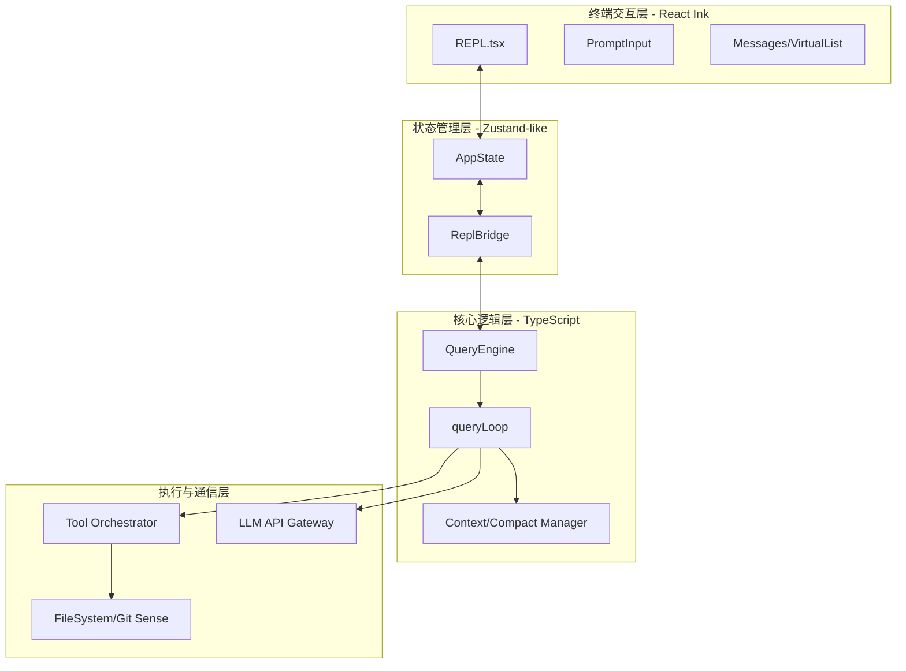

# DeepCC: Claude-Code (CCR) 架构深度手册

这是一份为 Agent 开发者准备的工业级架构指南。通过对 `claude-code` 源码的解构，我们揭示了目前最先进的 CLI Agent 是如何平衡推理的概率性与执行的确定性的。

---

## 核心架构拓扑 (System Topology)

---

## 手册目录 (Table of Contents)

1. **[第一章：全局架构与设计哲学](./01-overall-architecture.md)**
   - 模块依赖拓扑、核心处理管道、ReAct 循环的原子拆解。
2. **[第二章：推理引擎与上下文治理](./02-query-engine-and-reasoning.md)**
   - QueryEngine 状态机、Prompt 缓存感知设计、三层级压缩算法。
3. **[第三章：工具与能力系统](./03-tool-and-capability-system.md)**
   - 工具契约、ToolSearch 延迟加载、BashTool 语义化执行。
4. **[第四章：环境感知与记忆系统](./04-context-and-workspace-sensing.md)**
   - 多级记忆层级 (CLAUDE.md)、Workspace 感知矩阵、规则路由。
5. **[第五章：终端响应式 UI](./05-terminal-reactive-ui.md)**
   - 基于 Ink 的 TUI 架构、HITL 权限门控、流式交互 UX。

---

## 核心架构哲学：开发者必读的 3 项借鉴

> [!IMPORTANT]
> ### 1. 动静分离的缓存感知设计 (Cache-Friendly Prompting)
> **核心**：在高频率、长上下文的交互中，Token 成本与延迟是最大的敌人。
> **启示**：不要把环境数据（如文件列表）和系统提示词混在一起。由于 LLM 会缓存前导内容，将静态指令放在前面，动态上下文放在后面，可以最大化 Prompt Cache 命中率。

> [!IMPORTANT]
> ### 2. “环境作为第一公民”的确定性基座 (Context-First Determinism)
> **核心**：LLM 无法直接感知代码库，必须通过工具和级联配置作为“触角”。
> **启示**：建立自下而上的配置搜寻机制（如 `CLAUDE.md`）。让 Agent 每次执行前先“观察”环境，通过物理文件层层过滤规则，从而显著降低幻觉并提高任务完成度。

> [!IMPORTANT]
> ### 3. 阻塞式的 HITL 安全闭环 (Synchronous Permission Loop)
> **核心**：平衡自动化效率与操作安全性。
> **启示**：在异步 UI 中实现同步的权限门控。通过 Promise 机制阻塞推理流，直到用户在终端交互中明确批准“高危”操作（如写文件、执行 Bash），这是构建生产级 Agent 的最后一道防线。

---
*Generated by Antigravity AI @ 2026-04-05*
