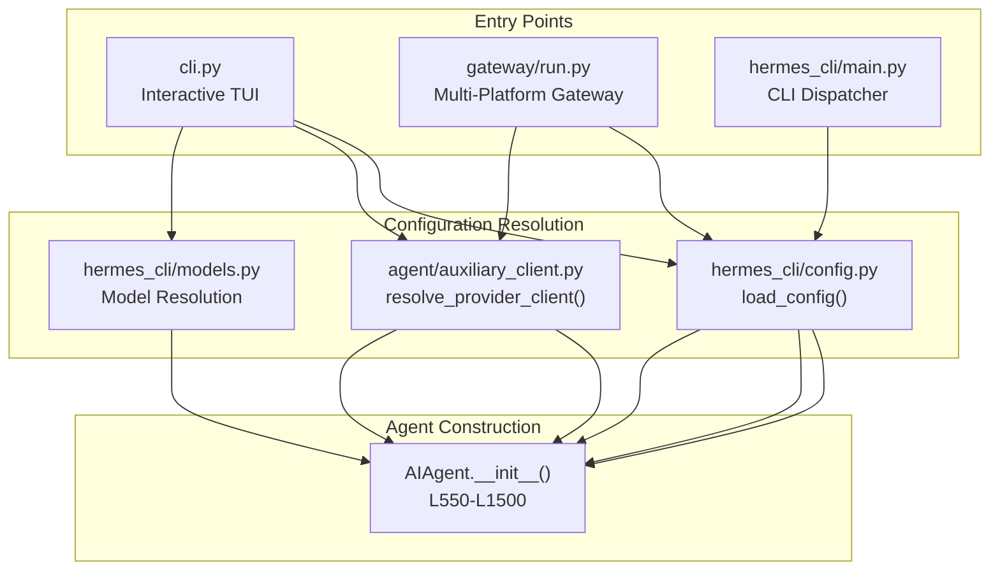
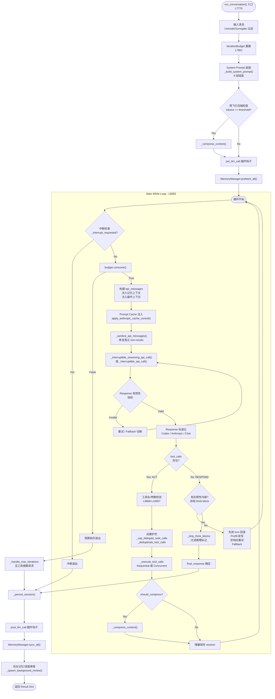
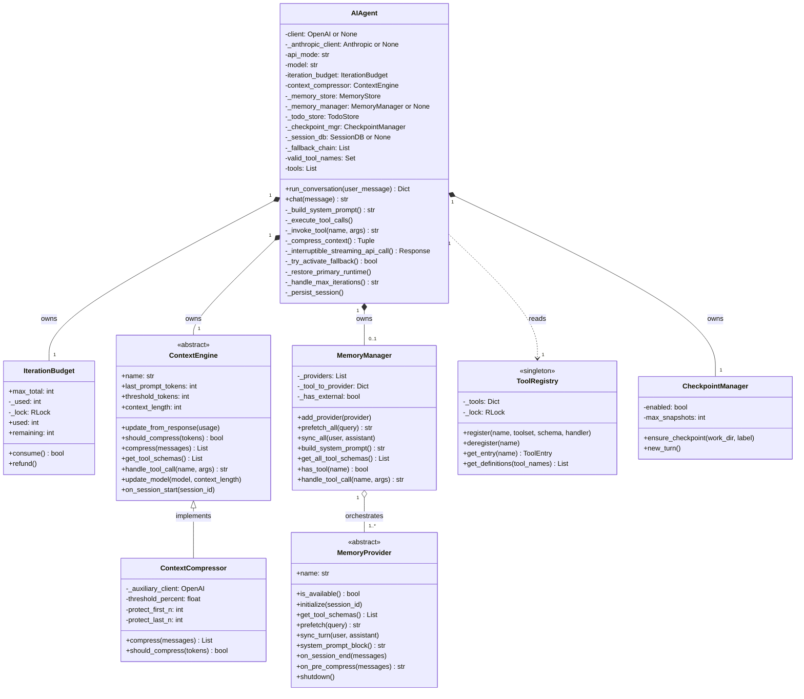
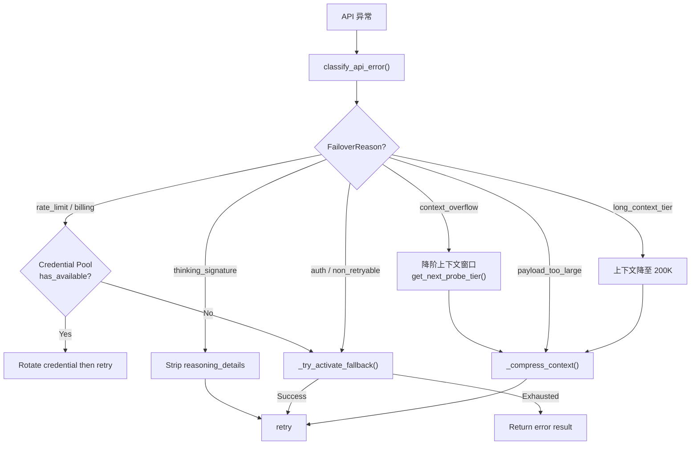

# Hermes Agent — 运行时架构深度分析

> **分析对象**: `run_agent.py` (`AIAgent` class, 10,897 行) + `agent/` 子包
> **分析版本**: 基于 2026-04-23 快照
> **前置依赖**: [codebase-highmap.md](./codebase-highmap.md) (Phase 1 高维地图)

---

## 1. 入口追踪：初始化依赖注入

### 1.1 入口调用链

从 3 个主要入口文件到 `AIAgent` 的实例化路径：



### 1.2 `AIAgent.__init__()` 依赖注入全景

`AIAgent.__init__()` 横跨 L550–L1500 (~950 行)，按初始化顺序注入以下核心依赖：

| 序号 | 依赖组件 | 类型 | 注入方式 | 源码位置 |
|:---:|:---|:---|:---|:---|
| 1 | **LLM Client** | `openai.OpenAI` / `anthropic.Anthropic` | 条件构造 | L876–L991 |
| 2 | **API Mode Router** | `str` enum (`chat_completions` / `codex_responses` / `anthropic_messages`) | 自动检测 | L679–L695 |
| 3 | **Tool Definitions** | `List[dict]` (OpenAI Function Calling Schema) | `get_tool_definitions()` | L1019–L1039 |
| 4 | **Fallback Chain** | `List[Dict]` (备用 Provider 列表) | 配置注入 | L997–L1016 |
| 5 | **IterationBudget** | `IterationBudget` (线程安全计数器) | 参数传入或自动创建 | L653 |
| 6 | **MemoryStore** (Built-in) | `MemoryStore` | 配置驱动懒加载 | L1148–L1155 |
| 7 | **MemoryManager** (Plugin) | `MemoryManager` + `MemoryProvider` | 插件发现系统 | L1161–L1224 |
| 8 | **ContextEngine / ContextCompressor** | `ContextEngine` ABC 或 `ContextCompressor` 实现 | 配置驱动策略选择 | L1302–L1375 |
| 9 | **CheckpointManager** | `CheckpointManager` | 直接构造 | L1087–L1090 |
| 10 | **SessionDB** | SQLite session store (Optional) | 外部传入 | L1093–L1119 |
| 11 | **TodoStore** | `TodoStore` | 直接构造 | L1122–L1123 |
| 12 | **Callback Matrix** | 12 个 `callable` 参数 | 平台层注入 | L578–L588 |

#### LLM Client 初始化分支逻辑：

```
if api_mode == "anthropic_messages":
    → build_anthropic_client(key, base_url)    # anthropic SDK
    → self.client = None                       # 无 OpenAI client
else:
    if (api_key AND base_url):
        → OpenAI(api_key, base_url, headers)   # 显式凭证
    else:
        → resolve_provider_client("auto")       # 中心化 Provider 路由
        → 失败时 fallback 到 OPENROUTER_API_KEY
```

#### ContextEngine 选择策略 (Strategy Pattern)：

```
config.yaml → context.engine = ?
    ├── "compressor" (默认) → ContextCompressor(model, threshold, ...)
    ├── "<name>"           → plugins/context_engine/<name>/ 加载
    └── 加载失败           → 降级回 ContextCompressor + WARNING
```

---

## 2. 核心执行循环

### 2.1 循环架构判定

> **结论: ReAct-style While 循环，非 Graph/DAG 状态机。**

Hermes Agent 采用经典的 **ReAct (Reasoning + Acting)** 架构，核心是一个 `while` 循环 (L8092)，而非 LangGraph 等基于图的状态机。不存在节点、边或可配置的流转拓扑。

```python
# L8092 — 主循环条件
while (api_call_count < self.max_iterations
       and self.iteration_budget.remaining > 0) or self._budget_grace_call:
```

### 2.2 单轮执行流程拆解 (Think → Act → Observe)



### 2.3 循环终止条件穷举

| 退出原因 | 触发条件 | 对应 `_turn_exit_reason` |
|:---|:---|:---|
| 正常文本响应 | `not tool_calls` + 有实质内容 | `text_response(finish_reason=stop)` |
| 用户中断 | `_interrupt_requested == True` | `interrupted_by_user` |
| 预算耗尽 | `budget.remaining <= 0` | `budget_exhausted` |
| 迭代上限 | `api_call_count >= max_iterations` | `max_iterations_reached` |
| 空响应耗尽 | 重试 3 次 + Fallback 失败 | `empty_response_exhausted` |
| 部分流恢复 | 连接中断但已流式输出部分内容 | `partial_stream_recovery` |
| 先前 turn 回退 | 空 follow-up + 先前 turn 已有 content | `fallback_prior_turn_content` |
| API 重试耗尽 | `retry_count >= max_retries` (3 次) | `all_retries_exhausted_no_response` |

---

## 3. 关键抽象接口签名提取

### 3.1 `ContextEngine` (ABC) — 上下文管理策略接口

> 文件: `agent/context_engine.py` (185 行)

```python
class ContextEngine(ABC):
    # -- Identity
    @property
    @abstractmethod
    def name(self) -> str: ...

    # -- Token State (run_agent.py 直接读取)
    last_prompt_tokens: int = 0
    last_completion_tokens: int = 0
    threshold_tokens: int = 0
    context_length: int = 0
    compression_count: int = 0
    threshold_percent: float = 0.75
    protect_first_n: int = 3
    protect_last_n: int = 6

    # -- Core (必须实现)
    @abstractmethod
    def update_from_response(self, usage: Dict[str, Any]) -> None: ...
    @abstractmethod
    def should_compress(self, prompt_tokens: int = None) -> bool: ...
    @abstractmethod
    def compress(self, messages: List[Dict], current_tokens: int = None) -> List[Dict]: ...

    # -- Optional Lifecycle
    def on_session_start(self, session_id: str, **kwargs) -> None: ...
    def on_session_end(self, session_id: str, messages: List[Dict]) -> None: ...
    def on_session_reset(self) -> None: ...

    # -- Optional Tools
    def get_tool_schemas(self) -> List[Dict]: ...
    def handle_tool_call(self, name: str, args: Dict, **kwargs) -> str: ...

    # -- Optional Model Switch
    def update_model(self, model: str, context_length: int, ...) -> None: ...
```

### 3.2 `MemoryProvider` (ABC) — 记忆后端插件接口

> 文件: `agent/memory_provider.py` (232 行)

```python
class MemoryProvider(ABC):
    # -- Identity
    @property
    @abstractmethod
    def name(self) -> str: ...

    # -- Core Lifecycle (必须实现)
    @abstractmethod
    def is_available(self) -> bool: ...
    @abstractmethod
    def initialize(self, session_id: str, **kwargs) -> None: ...
    @abstractmethod
    def get_tool_schemas(self) -> List[Dict[str, Any]]: ...

    # -- Core Operations (有默认空实现)
    def system_prompt_block(self) -> str: ...
    def prefetch(self, query: str, *, session_id: str = "") -> str: ...
    def queue_prefetch(self, query: str, *, session_id: str = "") -> None: ...
    def sync_turn(self, user: str, assistant: str, *, session_id: str = "") -> None: ...
    def handle_tool_call(self, tool_name: str, args: Dict) -> str: ...
    def shutdown(self) -> None: ...

    # -- Optional Hooks (10 个生命周期钩子)
    def on_turn_start(self, turn_number: int, message: str, **kwargs) -> None: ...
    def on_session_end(self, messages: List[Dict]) -> None: ...
    def on_pre_compress(self, messages: List[Dict]) -> str: ...
    def on_memory_write(self, action: str, target: str, content: str) -> None: ...
    def on_delegation(self, task: str, result: str, *, child_session_id: str = "") -> None: ...
```

### 3.3 `MemoryManager` — 记忆编排器 (Mediator)

> 文件: `agent/memory_manager.py` (362 行)

```python
class MemoryManager:
    """编排 builtin + 至多 1 个 external MemoryProvider"""

    def add_provider(self, provider: MemoryProvider) -> None: ...
    def initialize_all(self, **kwargs) -> None: ...
    def build_system_prompt(self) -> str: ...
    def prefetch_all(self, query: str) -> str: ...
    def queue_prefetch_all(self, query: str) -> None: ...
    def sync_all(self, user_content: str, assistant_content: str) -> None: ...
    def get_all_tool_schemas(self) -> List[Dict]: ...
    def has_tool(self, tool_name: str) -> bool: ...
    def handle_tool_call(self, tool_name: str, args: Dict) -> str: ...
    def on_memory_write(self, action: str, target: str, content: str) -> None: ...
    def shutdown_all(self) -> None: ...
```

### 3.4 `ToolRegistry` — 工具注册中心 (Singleton)

> 文件: `tools/registry.py` (403 行)

```python
class ToolRegistry:
    """线程安全的全局工具注册表"""

    def register(self, name: str, toolset: str, schema: dict,
                 handler: Callable, check_fn: Callable = None,
                 is_async: bool = False, ...) -> None: ...
    def deregister(self, name: str) -> None: ...
    def get_entry(self, name: str) -> Optional[ToolEntry]: ...
    def get_definitions(self, tool_names: Set[str], quiet: bool = False) -> List[dict]: ...
    def get_registered_toolset_names(self) -> List[str]: ...
    def get_tool_names_for_toolset(self, toolset: str) -> List[str]: ...
```

### 3.5 `IterationBudget` — 迭代预算控制器

> 文件: `run_agent.py` L170–L211

```python
class IterationBudget:
    """线程安全的迭代计数器, 每个 Agent 实例独立"""

    def __init__(self, max_total: int): ...
    def consume(self) -> bool: ...   # 消费 1 次, 预算不足返回 False
    def refund(self) -> None: ...    # 退还 1 次 (execute_code 不计入预算)
    @property
    def used(self) -> int: ...
    @property
    def remaining(self) -> int: ...
```

---

## 4. Mermaid 架构图

### 4.1 核心组件依赖关系 (Class Diagram)



### 4.2 单轮 Think-Act-Observe 执行序列 (Sequence Diagram)

```mermaid
sequenceDiagram
    participant User
    participant CLI as CLI / Gateway
    participant Agent as AIAgent
    participant Budget as IterationBudget
    participant Prompt as _build_system_prompt
    participant Memory as MemoryManager
    participant LLM as LLM API
    participant Tools as _execute_tool_calls
    participant Registry as handle_function_call
    participant Compressor as ContextEngine

    User->>CLI: 发送消息
    CLI->>Agent: run_conversation(user_message, history)

    Note over Agent: Phase 0: 初始化
    Agent->>Budget: new IterationBudget(max_iterations)
    Agent->>Prompt: _build_system_prompt()
    Prompt-->>Agent: system_prompt (9 层组装)
    Agent->>Memory: prefetch_all(user_message)
    Memory-->>Agent: recall_context

    rect rgb(40, 40, 80)
        Note over Agent,Compressor: Main While Loop

        loop 迭代 while budget.remaining > 0
            Agent->>Budget: consume()
            Budget-->>Agent: True / False

            Note over Agent: Phase 1 THINK
            Agent->>Agent: 构建 api_messages 注入 memory + plugin context
            Agent->>Agent: apply_anthropic_cache_control
            Agent->>Agent: _sanitize_api_messages
            Agent->>LLM: _interruptible_streaming_api_call(api_kwargs)
            LLM-->>Agent: Response (stream aggregated)

            Agent->>Compressor: update_from_response(usage)

            alt Response 包含 tool_calls
                Note over Agent: Phase 2 ACT
                Agent->>Agent: 校验 tool names + JSON args
                Agent->>Agent: _cap_delegate_task_calls
                Agent->>Agent: _deduplicate_tool_calls
                Agent->>Tools: _execute_tool_calls(assistant_message, messages)

                alt 可并行 all tools in PARALLEL_SAFE_TOOLS
                    Tools->>Registry: ThreadPool _invoke_tool x N
                else 顺序执行
                    loop 逐个 tool_call
                        Tools->>Registry: handle_function_call(name, args)
                        Registry-->>Tools: tool_result string
                    end
                end

                Note over Agent: Phase 3 OBSERVE
                Tools-->>Agent: messages += tool results

                Agent->>Compressor: should_compress(real_tokens)
                opt tokens >= threshold
                    Agent->>Compressor: compress(messages)
                    Compressor-->>Agent: compressed_messages
                end

                Note over Agent: continue loop 下一轮 THINK

            else Response 纯文本 无 tool_calls
                Agent->>Agent: _strip_think_blocks(content)
                Agent-->>Agent: final_response = content
                Note over Agent: break loop
            end
        end
    end

    Note over Agent: Post-Loop 收尾
    Agent->>Agent: _persist_session(messages, history)
    Agent->>Memory: sync_all(user_msg, final_response)
    Agent->>Memory: queue_prefetch_all(user_msg)
    Agent->>Agent: _spawn_background_review()
    Agent-->>CLI: Result Dict
    CLI-->>User: 渲染最终响应
```



---

## 5. 工具分发策略分析

### 5.1 Sequential vs Concurrent 判定

`_execute_tool_calls()` (L6868) 是工具分发的路由器，根据批次特征选择执行策略：

```python
def _execute_tool_calls(self, assistant_message, messages, effective_task_id, ...):
    if not _should_parallelize_tool_batch(tool_calls):
        return self._execute_tool_calls_sequential(...)   # L7209
    return self._execute_tool_calls_concurrent(...)        # L7003
```

#### 并行判定规则 (`_should_parallelize_tool_batch`):

| 条件 | 结果 |
|:---|:---|
| 批次仅 1 个 tool | Sequential |
| 包含 `clarify` | Sequential (交互式工具) |
| 所有 tools ∈ `_PARALLEL_SAFE_TOOLS` | **Concurrent** |
| 路径域工具 (`read_file`, `write_file`, `patch`) 的目标路径无交集 | **Concurrent** |
| 其他情况 | Sequential |

#### `_PARALLEL_SAFE_TOOLS` 白名单 (L219–L231):

```python
_PARALLEL_SAFE_TOOLS = frozenset({
    "ha_get_state", "ha_list_entities", "ha_list_services",
    "read_file", "search_files", "session_search",
    "skill_view", "skills_list", "vision_analyze",
    "web_extract", "web_search",
})
```

### 5.2 工具分发优先级链

在循环体内部，工具调用的实际分发遵循以下优先级链：

```
_invoke_tool(function_name, args) →
  1. 插件策略拦截 (get_pre_tool_call_block_message) → blocked? return error
  2. Agent 内置工具 (硬编码分支):
     ├── "todo"            → tools/todo_tool.py
     ├── "session_search"  → tools/session_search_tool.py
     ├── "memory"          → tools/memory_tool.py  + MemoryManager 桥接
     ├── "clarify"         → tools/clarify_tool.py
     └── "delegate_task"   → tools/delegate_tool.py
  3. ContextEngine 工具 (context_engine_tool_names):
     └── context_compressor.handle_tool_call(name, args)
  4. MemoryManager 工具 (memory_manager.has_tool()):
     └── memory_manager.handle_tool_call(name, args)
  5. ToolRegistry 通用分发 (fallback):
     └── handle_function_call(name, args, task_id, ...)
```

---

## 6. 防御性工程设计模式

### 6.1 错误分类与恢复策略

Agent 循环内置了一个结构化的异常分类器 (`classify_api_error`, L9012) 和多级恢复链：



### 6.2 已识别设计模式汇总

| 设计模式 | 应用位置 | 说明 |
|:---|:---|:---|
| **ReAct Loop** | `run_conversation()` while 循环 | Think (LLM) → Act (Tool) → Observe (Result) |
| **Strategy** | ContextEngine / ContextCompressor | 可插拔的上下文管理算法 |
| **Abstract Factory** | `resolve_provider_client()` | LLM Client 多态创建 |
| **Mediator** | MemoryManager | 编排 builtin + external Provider |
| **Self-Registration** | ToolRegistry.register() | 工具文件 import 时自注册 |
| **Singleton** | ToolRegistry 全局实例 | 单一工具注册表 |
| **Chain of Responsibility** | 错误恢复链 | Credential Rotation → Compression → Fallback → Abort |
| **Observer** | 12 个 Callback 参数 | 平台层解耦 (CLI TUI / Gateway Webhook) |
| **Template Method** | MemoryProvider lifecycle hooks | 10+ 个 hook 具有默认空实现 |
| **Decorator** | `_SafeWriter` wrapping stdio | 透明防护写入异常 |

---

## 7. 关键结论

### 7.1 架构特征

1. **Monolithic Agent Class**: `AIAgent` 是一个 ~10,900 行的上帝类，集中了初始化、循环控制、工具分发、错误恢复、会话持久化等全部职责。
2. **ReAct 而非 Graph**: 使用经典 while 循环而非可配置的 DAG/状态机，简化了控制流但限制了流程灵活性。
3. **Plugin-Friendly Boundaries**: 虽然 Agent 自身是单体，但 ContextEngine 和 MemoryProvider 两个扩展点具有良好的抽象边界。
4. **Defensive to the Extreme**: 循环内部有 20+ 种错误恢复路径，包括 credential 轮换、上下文压缩、fallback provider 切换、thinking block 签名修复等。

### 7.2 重构建议 (供 KyberKit 参考)

| 问题 | 建议 |
|:---|:---|
| `AIAgent.__init__()` 950 行 | 拆分为 Builder/Factory + Config DTO |
| `run_conversation()` ~2,900 行 | 拆分为 `TurnExecutor` + `ErrorRecoveryChain` + `ResponseHandler` |
| 工具分发硬编码 if/elif 链 | 统一走 ToolRegistry 分发，内置工具也注册 |
| 12 个 callback 参数 | 抽象为 `EventBus` 或 `AgentEventListener` 接口 |
| IterationBudget 每轮重建 | 全会话共享，提供 `reset()` 方法 |
