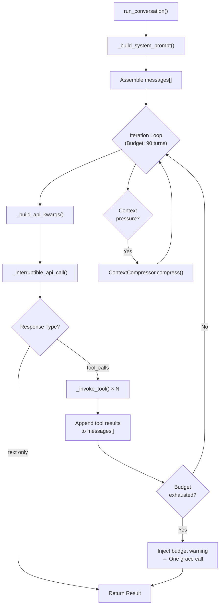
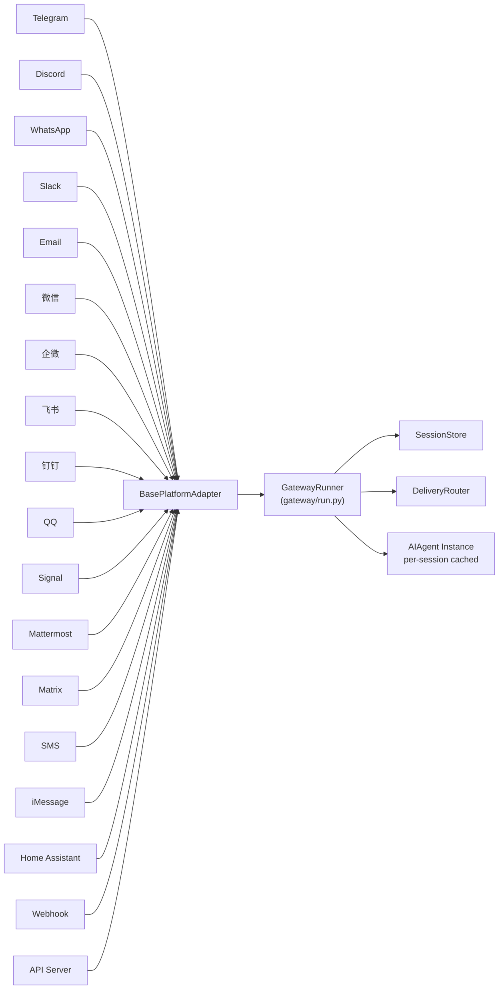
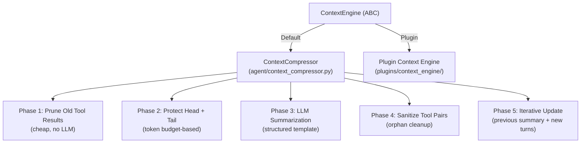
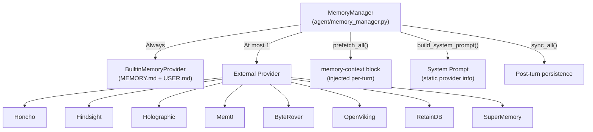
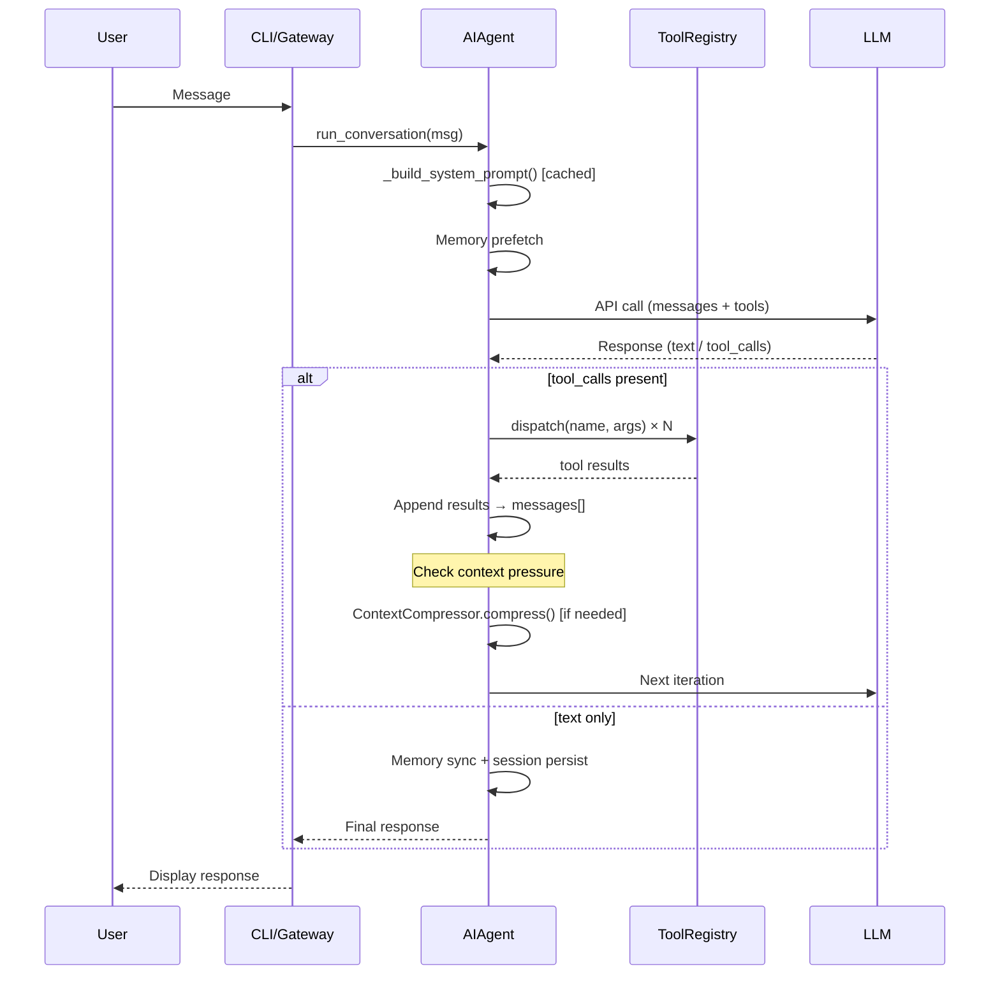

# Hermes Agent 代码库高维地图 v2.0 (Codebase High-Dimension Map)

## 0. 项目概览

Hermes Agent 是由 Nous Research 开发的工业级、高度模块化的 AI Agent 框架。核心代码量约 **55,000+ 行 Python**（仅计算根目录五大主文件），完整代码库含 70+ 个工具模块、8 个记忆插件、17+ 个消息平台适配器、90+ 个 Skill 指令集。

**设计哲学**：
- **Monolithic Agent Class**：整个系统围绕 `AIAgent` 一个 ~10,900 行的巨类运转（`run_agent.py`），集中了 LLM 调用、工具分发、上下文压缩、记忆管理、子代理委派等全部编排逻辑。
- **Skill-Driven Extensibility**：通过文件系统扫描（`skills/` 目录）动态加载 SKILL.md 指令集，0 代码扩展 Agent 能力。
- **Plugin Architecture**：记忆后端（Memory Provider）和上下文引擎（Context Engine）均通过抽象基类 + 插件目录实现可替换。
- **Multi-Platform Gateway**：网关层提供 17+ 社交平台的统一接入，每个平台适配器遵循 `BasePlatformAdapter` 接口。

---

## 1. 核心目录树 (Top-Level Architecture)

```text
hermes-agent/                        # 代码库根目录
│
├── run_agent.py              (10,897 lines)  # ★★★ AIAgent 类：系统全部编排逻辑
├── cli.py                    (10,037 lines)  # ★★ 交互式 CLI 入口 (TUI REPL)
├── model_tools.py               (601 lines)  # ★  工具发现 + 分发网关
├── toolsets.py                  (662 lines)  # ★  工具集定义与解析
├── hermes_state.py                           #    SessionDB (SQLite) + 持久化配置
├── hermes_constants.py                       #    全局常量 + 路径工厂
├── hermes_logging.py                         #    日志基础设施
├── hermes_time.py                            #    时区感知时间工具
├── utils.py                                  #    原子 JSON/YAML 写入等公共工具
├── trajectory_compressor.py                  #    轨迹（Trajectory）后处理工具
├── batch_runner.py                           #    批量推理运行器
├── mini_swe_runner.py                        #    SWE 专项任务运行器
├── mcp_serve.py                              #    MCP (Model Context Protocol) 服务端
├── rl_cli.py                                 #    RL 训练 CLI
│
├── agent/                    (28 files)      # ★★★ 核心子模块包
│   ├── prompt_builder.py                     #   系统提示词组装工厂
│   ├── context_compressor.py                 #   上下文压缩引擎（默认实现）
│   ├── context_engine.py                     #   上下文引擎抽象基类 (ABC)
│   ├── memory_manager.py                     #   记忆编排器（MemoryManager）
│   ├── memory_provider.py                    #   记忆提供者抽象基类 (ABC)
│   ├── smart_model_routing.py                #   智能模型路由（廉价/强大模型切换）
│   ├── anthropic_adapter.py                  #   Anthropic Messages API 适配器
│   ├── prompt_caching.py                     #   Anthropic Prompt Caching 控制
│   ├── model_metadata.py                     #   模型上下文长度 + Token 估算
│   ├── trajectory.py                         #   轨迹记录与保存
│   ├── subdirectory_hints.py                 #   目录结构感知 (Repo Context)
│   ├── error_classifier.py                   #   API 错误分类 + Failover 决策
│   ├── retry_utils.py                        #   带 Jitter 的指数退避
│   ├── usage_pricing.py                      #   Token 成本估算
│   ├── display.py                            #   CLI 显示工具（Spinner, 工具预览）
│   ├── credential_pool.py                    #   API Key 池（多 Key 轮换）
│   ├── auxiliary_client.py                   #   辅助 LLM 调用（压缩、视觉等）
│   ├── skill_commands.py                     #   Skill 斜杠命令处理
│   ├── skill_utils.py                        #   Skill 文件解析工具
│   ├── insights.py                           #   对话洞察生成
│   ├── redact.py                             #   敏感信息脱敏
│   ├── rate_limit_tracker.py                 #   速率限制追踪
│   ├── title_generator.py                    #   会话标题生成
│   ├── context_references.py                 #   上下文引用管理
│   ├── copilot_acp_client.py                 #   Copilot ACP 客户端
│   └── manual_compression_feedback.py        #   手动压缩反馈
│
├── tools/                    (70+ files)     # ★★ 原子工具实现
│   ├── registry.py                           #   ★ 工具注册表 (ToolRegistry 单例)
│   ├── terminal_tool.py                      #   终端执行 (Docker/SSH/Local/Modal)
│   ├── file_tools.py                         #   文件 CRUD + 模糊匹配 Patch
│   ├── browser_tool.py                       #   浏览器自动化 (Playwright/CDP)
│   ├── web_tools.py                          #   Web 搜索 + 内容提取
│   ├── delegate_tool.py                      #   子代理委派
│   ├── code_execution_tool.py                #   Python 沙箱执行
│   ├── memory_tool.py                        #   内置记忆工具 (MEMORY.md/USER.md)
│   ├── session_search_tool.py                #   Session 历史搜索
│   ├── mcp_tool.py                           #   MCP 服务器集成
│   ├── skill_manager_tool.py                 #   Skill CRUD 管理
│   ├── skills_tool.py                        #   Skill 查看 + Guard
│   ├── vision_tools.py                       #   视觉分析
│   ├── image_generation_tool.py              #   图像生成
│   ├── clarify_tool.py                       #   交互式澄清
│   ├── todo_tool.py                          #   任务管理
│   ├── tts_tool.py                           #   文本转语音
│   ├── homeassistant_tool.py                 #   Home Assistant 集成
│   ├── approval.py                           #   危险命令审批
│   ├── path_security.py                      #   路径安全校验
│   ├── tirith_security.py                    #   Tirith 安全扫描
│   ├── budget_config.py                      #   Token 预算配置
│   ├── environments/                         #   执行环境后端
│   │   ├── base.py                           #     环境抽象基类
│   │   ├── local.py                          #     本地执行
│   │   ├── docker.py                         #     Docker 容器
│   │   ├── ssh.py                            #     SSH 远程
│   │   ├── modal.py / managed_modal.py       #     Modal 云
│   │   ├── daytona.py                        #     Daytona 云
│   │   └── singularity.py                    #     Singularity 容器
│   └── browser_providers/                    #   浏览器后端
│       ├── base.py                           #     浏览器抽象基类
│       ├── browser_use.py                    #     browser_use 库集成
│       ├── browserbase.py                    #     BrowserBase 云
│       └── firecrawl.py                      #     Firecrawl 云
│
├── gateway/                  (25+ files)     # ★★ 多平台消息网关
│   ├── run.py                (9,552 lines)   #   ★ GatewayRunner 主控制器
│   ├── config.py                             #   网关配置模型
│   ├── session.py                            #   SessionStore + SessionContext
│   ├── session_context.py                    #   会话级上下文传递
│   ├── delivery.py                           #   DeliveryRouter (消息交付路由)
│   ├── hooks.py                              #   HookRegistry (事件钩子系统)
│   ├── stream_consumer.py                    #   流式响应消费者
│   ├── pairing.py                            #   PairingStore (DM 配对认证)
│   ├── mirror.py                             #   跨平台消息镜像
│   ├── restart.py                            #   零停机重启（Drain 策略）
│   ├── sticker_cache.py                      #   Sticker 缓存
│   ├── platforms/             (17 adapters)  #   ★ 平台适配器目录
│   │   ├── base.py                           #     BasePlatformAdapter 抽象基类
│   │   ├── telegram.py / telegram_network.py #     Telegram
│   │   ├── discord.py                        #     Discord
│   │   ├── whatsapp.py                       #     WhatsApp
│   │   ├── slack.py                          #     Slack
│   │   ├── signal.py                         #     Signal
│   │   ├── matrix.py                         #     Matrix
│   │   ├── email.py                          #     Email (IMAP/SMTP)
│   │   ├── weixin.py / wecom.py / wecom_callback.py  # 微信/企微
│   │   ├── feishu.py / dingtalk.py           #     飞书/钉钉
│   │   ├── qqbot.py                          #     QQ
│   │   ├── mattermost.py                     #     Mattermost
│   │   ├── sms.py                            #     SMS (Twilio)
│   │   ├── bluebubbles.py                    #     iMessage (BlueBubbles)
│   │   ├── homeassistant.py                  #     Home Assistant
│   │   ├── webhook.py                        #     Webhook
│   │   └── api_server.py                     #     OpenAI-Compatible REST API
│   └── builtin_hooks/                        #   内置钩子
│       └── boot_md.py                        #     启动 Markdown 注入
│
├── plugins/                                  # ★ 插件系统
│   ├── context_engine/                       #   上下文引擎插件目录
│   └── memory/                (8 backends)   #   记忆后端插件
│       ├── __init__.py                       #     插件发现 + 注册逻辑
│       ├── honcho/                           #     Honcho (Plastic Labs)
│       ├── hindsight/                        #     Hindsight
│       ├── holographic/                      #     Holographic Memory
│       ├── mem0/                             #     Mem0
│       ├── byterover/                        #     ByteRover
│       ├── openviking/                       #     OpenViking
│       ├── retaindb/                         #     RetainDB
│       └── supermemory/                      #     SuperMemory
│
├── skills/                   (90+ skills)    # ★ Skill 指令集库
│   ├── apple/                                #   Apple 生态 (iMessage, Notes, Reminders)
│   ├── autonomous-ai-agents/                 #   Agent 编排 (Claude Code, Codex)
│   ├── creative/                             #   创意工具 (P5.js, Manim, ASCII Art)
│   ├── data-science/                         #   数据科学 (Jupyter Live Kernel)
│   ├── github/                               #   GitHub 工作流 (PR, Code Review)
│   ├── mlops/                                #   MLOps (HuggingFace, Qdrant, FAISS)
│   ├── productivity/                         #   生产力 (Notion, Linear, Google)
│   ├── research/                             #   研究 (ArXiv, Polymarket)
│   ├── software-development/                 #   软件开发 (TDD, SDD, Debugging)
│   └── ...                                   #   更多类别
│
├── hermes_cli/               (48 files)      #   CLI 子模块包
│   ├── main.py                               #     CLI 主入口 (fire.Fire)
│   ├── plugins.py                            #     插件发现 + 钩子系统
│   ├── runtime_provider.py                   #     Provider 自动检测
│   ├── model_normalize.py                    #     模型名称标准化
│   ├── config.py                             #     配置校验 + ${ENV} 展开
│   ├── banner.py                             #     ASCII Banner 渲染
│   ├── commands.py                           #     斜杠命令完成器
│   ├── skin_engine.py                        #     主题皮肤引擎
│   ├── profiles.py                           #     多 Profile 管理
│   └── ...                                   #     更多子模块
│
├── acp_adapter/                              #   Agentic Control Protocol 适配层
├── acp_registry/                             #   ACP 注册中心
├── optional-skills/                          #   可选 Skill 仓库 (长尾生态)
├── web/                                      #   Web Dashboard (React/Vite)
├── cron/                                     #   Cron 调度系统
└── environments/                             #   基准测试环境
```

---

## 2. 四大核心模块深度分析

### A. Agent 核心编排逻辑 (Core Orchestration Engine)

**核心设计**：Hermes 采用 **Monolithic Agent + 同步阻塞式 Tool-Calling Loop** 架构。`AIAgent` 类是唯一的编排实体，集中了状态管理、LLM 调用、工具执行、上下文管理的全部逻辑。

#### 控制流概览



#### 关键文件路径

| 职责 | 路径 | 关键 API |
|:---|:---|:---|
| **Agent 主体** | `run_agent.py` | `AIAgent.__init__()` (L550), `run_conversation()` (L7770), `_build_system_prompt()` (L3121), `_build_api_kwargs()` (L6090), `_invoke_tool()` (L6891) |
| **工具注册表** | `tools/registry.py` | `ToolRegistry.register()`, `dispatch()`, `get_definitions()` |
| **工具发现与分发** | `model_tools.py` | `_discover_tools()`, `get_tool_definitions()`, `handle_function_call()` |
| **工具集配置** | `toolsets.py` | `resolve_toolset()`, `TOOLSETS` dict, `_HERMES_CORE_TOOLS` list |
| **轨迹管理** | `agent/trajectory.py` | `save_trajectory()`, `convert_scratchpad_to_think()` |

#### 工具注册机制 (Self-Registration Pattern)

```python
# 每个 tools/*.py 在模块加载时自注册：
from tools.registry import registry
registry.register(
    name="terminal",
    toolset="terminal",
    schema={...},
    handler=handle_terminal,
    check_fn=lambda: True,
    emoji="💻",
)

# model_tools._discover_tools() 导入所有工具模块，触发注册
# registry.dispatch(name, args) 执行工具
```

#### 并行工具执行策略

- `_PARALLEL_SAFE_TOOLS`：定义可安全并行的只读工具（`read_file`, `web_search`, `web_extract` 等）
- `_PATH_SCOPED_TOOLS`：基于路径作用域判定是否可并行（`read_file`, `write_file`, `patch`）
- `_NEVER_PARALLEL_TOOLS`：永远串行的交互式工具（`clarify`）
- `_MAX_TOOL_WORKERS = 8`：最大并行线程数
- `_is_destructive_command()`：启发式检测破坏性终端命令

#### 迭代预算控制 (IterationBudget)

- 线程安全的计数器 `IterationBudget(max_total=90)`
- `execute_code` 产生的迭代通过 `refund()` 退还
- 预算耗尽时注入一次 budget warning，允许一次 grace call
- 子代理获得独立预算（默认 `delegation.max_iterations=45`）

---

### B. 提示词模板与元指令系统 (Prompt Engineering Layer)

**核心设计**：Hermes 采用 **多层动态拼接策略**，没有单一的 Prompt 模板文件。System Prompt 由 `_build_system_prompt()` 按层组装，每层可独立开关。

#### System Prompt 装配层级

```text
Layer 1: Agent Identity
  └─ SOUL.md (用户自定义) → 回退到 DEFAULT_AGENT_IDENTITY

Layer 2: Tool-Aware Behavioral Guidance
  ├─ MEMORY_GUIDANCE       (if "memory" tool enabled)
  ├─ SESSION_SEARCH_GUIDANCE (if "session_search" enabled)
  ├─ SKILLS_GUIDANCE       (if skill_manage enabled)
  └─ TOOL_USE_ENFORCEMENT_GUIDANCE (model-specific)
      ├─ GOOGLE_MODEL_OPERATIONAL_GUIDANCE (gemini/gemma)
      └─ OPENAI_MODEL_EXECUTION_GUIDANCE  (gpt/codex)

Layer 3: User/Gateway System Message
  └─ system_message parameter (if provided)

Layer 4: Persistent Memory Snapshot
  ├─ MEMORY.md (Agent 的笔记)
  └─ USER.md (用户画像)

Layer 5: External Memory Provider Block
  └─ MemoryManager.build_system_prompt()

Layer 6: Skills Index (动态)
  └─ build_skills_system_prompt() — 扫描 skills/ 目录构建分类索引

Layer 7: Context Files (项目级)
  ├─ AGENTS.md / .cursorrules / .hermes.md / HERMES.md
  └─ 安全扫描 (_scan_context_content) 拦截 prompt injection

Layer 8: Runtime Metadata
  ├─ 日期时间、Session ID、Model、Provider
  └─ Environment Hints (WSL, Termux)

Layer 9: Platform Formatting Hint
  └─ PLATFORM_HINTS["telegram" | "discord" | "cli" | ...]
```

#### 关键文件路径

| 职责 | 路径 |
|:---|:---|
| **Prompt 组装工厂** | `agent/prompt_builder.py` |
| **身份 + 行为常量** | 同上 `DEFAULT_AGENT_IDENTITY`, `TOOL_USE_ENFORCEMENT_GUIDANCE`, `PLATFORM_HINTS` |
| **Skills 索引构建** | 同上 `build_skills_system_prompt()` — 带两层缓存（进程内 LRU + 磁盘 Snapshot） |
| **SOUL.md 加载** | 同上 `load_soul_md()` |
| **Context File 安全扫描** | 同上 `_scan_context_content()` — 检测 prompt injection pattern |
| **Prompt Caching** | `agent/prompt_caching.py` — Anthropic cache_control breakpoint 注入 |
| **Skill 指令集** | `skills/` 目录下每个子目录的 `SKILL.md` |
| **Skill 解析工具** | `agent/skill_utils.py` — frontmatter 解析、平台过滤、条件激活 |

#### Skill 加载机制

```text
skills/
  github/
    github-pr-workflow/
      SKILL.md          ← frontmatter(name, platforms, requires_tools, fallback_for)
                        ← body = 指令集（被 skill_view 工具加载到对话中）
    DESCRIPTION.md      ← 分类级描述
```

- Skills 的 **Frontmatter 条件系统**：`requires_tools`, `requires_toolsets`, `fallback_for_tools`, `fallback_for_toolsets`
- 仅在符合条件的 Skill 出现在 System Prompt 索引中
- Skill 内容**不直接注入 System Prompt**，而是作为索引条目出现，由模型通过 `skill_view()` 工具按需加载

---

### C. LLM 接口封装与网关 (Provider & Gateway Layer)

#### Provider 适配策略

Hermes 支持三种 API 模式，在 `AIAgent.__init__()` 中自动检测：

| api_mode | 适用场景 | 关键实现 |
|:---|:---|:---|
| `chat_completions` | OpenAI / OpenRouter / 开源模型 | 标准 OpenAI SDK |
| `codex_responses` | GPT-5.x / OpenAI Codex | Responses API |
| `anthropic_messages` | Claude (原生 / 第三方兼容) | `agent/anthropic_adapter.py` |

#### 智能路由与 Failover

| 职责 | 路径 | 说明 |
|:---|:---|:---|
| **智能模型路由** | `agent/smart_model_routing.py` | 根据消息复杂度切换 cheap/powerful 模型 |
| **错误分类 + Failover** | `agent/error_classifier.py` | `classify_api_error()` → `FailoverReason` |
| **指数退避重试** | `agent/retry_utils.py` | `jittered_backoff()` |
| **Credential Pool** | `agent/credential_pool.py` | 多 API Key 轮换 |
| **Provider 自动检测** | `hermes_cli/runtime_provider.py` | `resolve_runtime_provider()` |
| **模型元数据缓存** | `agent/model_metadata.py` | 上下文长度探测 + token 估算 |

#### Gateway 架构



| 职责 | 路径 |
|:---|:---|
| **Gateway 主控制器** | `gateway/run.py` — `GatewayRunner` 类 |
| **平台适配器基类** | `gateway/platforms/base.py` — `BasePlatformAdapter`, `MessageEvent`, `MessageType` |
| **会话管理** | `gateway/session.py` — `SessionStore`, `SessionContext` |
| **消息交付路由** | `gateway/delivery.py` — `DeliveryRouter` |
| **配置模型** | `gateway/config.py` — `GatewayConfig`, `Platform` enum |
| **钩子系统** | `gateway/hooks.py` — `HookRegistry` |
| **DM 配对认证** | `gateway/pairing.py` — `PairingStore` |
| **零停机重启** | `gateway/restart.py` — Drain 策略 |

---

### D. 记忆与上下文管理 (Memory & Context Management)

#### 上下文管理架构



| 职责 | 路径 | 说明 |
|:---|:---|:---|
| **上下文引擎接口** | `agent/context_engine.py` | `ContextEngine` ABC — `should_compress()`, `compress()` |
| **默认压缩引擎** | `agent/context_compressor.py` | 5 阶段压缩算法，迭代摘要，结构化模板 |
| **压缩触发条件** | 同上 `threshold_percent=0.50`，`threshold_tokens = max(context_length * 0.50, MINIMUM)` |

#### 记忆系统架构



| 职责 | 路径 | 说明 |
|:---|:---|:---|
| **记忆编排器** | `agent/memory_manager.py` | `MemoryManager` — 内置 + 至多 1 个外部 Provider |
| **Provider 接口** | `agent/memory_provider.py` | `MemoryProvider` ABC — lifecycle hooks |
| **内置记忆工具** | `tools/memory_tool.py` | MEMORY.md / USER.md 文件读写 |
| **记忆插件目录** | `plugins/memory/` | 8 个可替换后端 |
| **Session 搜索** | `tools/session_search_tool.py` | 跨会话历史检索 |
| **Session 持久化** | `hermes_state.py` | SQLite SessionDB |
| **Context Fencing** | `build_memory_context_block()` | `<memory-context>` XML 标签 + system note 防止模型误解为用户输入 |

#### MemoryProvider 生命周期

```text
initialize(session_id)          → 建立连接
system_prompt_block()           → 静态提供者信息 → System Prompt
prefetch(query) / queue_prefetch()  → 背景召回 → <memory-context> block
sync_turn(user, assistant)      → 异步写入
on_turn_start(turn, message)    → 每轮 tick
on_pre_compress(messages)       → 压缩前提取
on_session_end(messages)        → 会话结束提取
on_memory_write(action, target, content)  → 镜像内置写入
on_delegation(task, result)     → 子代理完成通知
shutdown()                      → 清理退出
```

---

## 3. 启动入口定位 (Entry Points)

| 场景 | 入口路径 | 启动方式 | 说明 |
|:---|:---|:---|:---|
| **交互式终端** | `cli.py` | `python cli.py` 或 `hermes` | TUI REPL（prompt_toolkit），ASCII Banner，斜杠命令，Rich 渲染 |
| **CLI 主入口** | `hermes_cli/main.py` | `hermes <subcommand>` | fire.Fire 分发子命令（model, gateway, doctor, etc.） |
| **后台消息网关** | `gateway/run.py` | `hermes gateway` 或 `python -m gateway.run` | GatewayRunner 启动所有配置的平台适配器 |
| **ACP 服务** | `acp_adapter/` | ACP 协议启动 | 编辑器集成（VS Code, Zed, JetBrains） |
| **自动化 SWE** | `mini_swe_runner.py` | `python mini_swe_runner.py` | GitHub Issue 修复专用 Runner |
| **批量推理** | `batch_runner.py` | `python batch_runner.py` | 并发批量任务处理 |
| **MCP 服务端** | `mcp_serve.py` | MCP 协议 | Model Context Protocol 服务端 |
| **编程式调用** | `from run_agent import AIAgent` | Python API | 直接实例化 `AIAgent` 并调用 `run_conversation()` |

---

## 4. 架构特征总结 (Architectural Inferences)

### 4.1 关键设计模式

| 模式 | 实现位置 | 说明 |
|:---|:---|:---|
| **Self-Registration** | `tools/registry.py` + 每个 tool 模块 | 工具在模块导入时自注册，无需中心配置文件 |
| **Strategy / Plugin** | `ContextEngine` ABC + `MemoryProvider` ABC | 上下文引擎和记忆后端通过 ABC + 目录扫描实现可替换 |
| **Template Method** | `AIAgent._build_system_prompt()` | 多层 Prompt 组装，每层可独立开启/关闭 |
| **Mediator** | `MemoryManager` | 统一编排内置 + 外部记忆 Provider |
| **Adapter** | `gateway/platforms/*.py` | 17 个平台适配器统一到 `BasePlatformAdapter` 接口 |
| **Observer / Hook** | `gateway/hooks.py` + `hermes_cli/plugins.py` | 事件驱动的钩子系统 (pre/post tool call, session start/end) |

### 4.2 工程特征

1. **巨类（God Class）问题**：`AIAgent` 类 10,897 行，包含 50+ 个方法，职责过度集中。`_build_system_prompt()` → `_build_api_kwargs()` → `_invoke_tool()` → `run_conversation()` 均在同一类中，内聚性差。
2. **确定性上下文管理**：极重视 Context 利用率 — 多级压缩逻辑（工具结果剪枝 → LLM 摘要 → 迭代更新）、`SubdirectoryHintTracker` 增强目录感知、Prompt Caching 减少 75% 成本。
3. **Multi-Tenant Ready**：SessionStore + session_key 隔离、Credential Pool 多租户 API Key 轮换、Gateway 的 agent cache 和 per-session model override。
4. **防御性编程**：`_SafeWriter` 包装 stdio、代理异常隔离（子代理 failure 不阻塞父代理）、`url_safety.py` / `path_security.py` / `tirith_security.py` 三层安全防护。
5. **Prompt Injection 防御**：`_scan_context_content()` 对 AGENTS.md / .cursorrules 执行威胁扫描，检测隐形 Unicode 字符和已知注入模式。

### 4.3 数据流概览



---

## 5. 高价值逆向工程目标 (Priority Reading List)

> 按阅读优先级排序，适用于想要深度理解 Hermes 架构的工程师。

| 优先级 | 文件 | 重点关注 | 预计阅读时间 |
|:---|:---|:---|:---|
| P0 | `run_agent.py` L3121-3286 | System Prompt 组装逻辑 | 30 min |
| P0 | `run_agent.py` L7770-8200 | `run_conversation()` 主循环 | 60 min |
| P0 | `tools/registry.py` | 工具注册表全貌 | 20 min |
| P1 | `agent/context_compressor.py` | 5 阶段上下文压缩算法 | 40 min |
| P1 | `agent/memory_manager.py` | 记忆编排设计 | 20 min |
| P1 | `agent/memory_provider.py` | Provider 生命周期契约 | 15 min |
| P1 | `agent/prompt_builder.py` | Prompt 模板 + Skill 索引构建 | 40 min |
| P2 | `model_tools.py` | 工具发现 + 分发 + async bridging | 20 min |
| P2 | `gateway/run.py` L512-650 | GatewayRunner 初始化与架构 | 30 min |
| P2 | `agent/context_engine.py` | 上下文引擎扩展点 | 10 min |
| P3 | `toolsets.py` | 工具集递归解析 | 15 min |
| P3 | `tools/delegate_tool.py` | 子代理委派实现 | 20 min |
| P3 | `plugins/memory/__init__.py` | 插件发现与注册 | 15 min |
