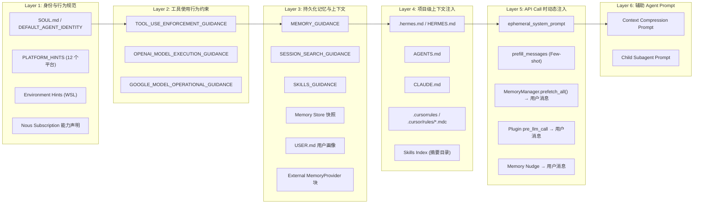

# Hermes Agent — Prompt 架构与组装机制分析报告

> **分析对象**: `agent/prompt_builder.py` (1,044 行) + `run_agent.py::_build_system_prompt()` + `agent/context_compressor.py` 摘要 Prompt
> **分析版本**: 基于 2026-04-23 快照
> **前置依赖**: [agent-runtime-architecture.md](./agent-runtime-architecture.md) (Phase 2 运行时分析)

---

## 1. Prompt 模板全局索引与分类

### 1.1 全局检索结果

通过对 `agent/`, `tools/`, `skills/` 及 `run_agent.py` 的全量扫描，共发现 **4 种层级** 的 Prompt 模板：

| 层级 | 数量 | 示例位置 | 注入时机 |
|:---|:---:|:---|:---|
| **常驻 System Prompt 组件** | 13 个 | `agent/prompt_builder.py` | Session 初始化时一次性构建 |
| **上下文压缩 Prompt** | 2 个 (首次 + 迭代) | `agent/context_compressor.py` L350–L432 | 每次 `compress()` 调用时动态生成 |
| **子代理 Prompt** | 1 个 | `tools/delegate_tool.py` L90–L122 | 每次 `delegate_task()` 调用时构建 |
| **技能 Prompt** (SKILL.md) | 100+ 个 | `skills/<category>/<name>/SKILL.md` | 按需通过 `skill_view(name)` 加载到 user message |

### 1.2 模式归纳：按 Agent 工作流角色分类



#### 按工作流角色详细分类

| 类别 | Prompt 组件 | 工作流角色 | 常量/函数名 |
|:---|:---|:---|:---|
| **身份定义** | SOUL.md | Agent 核心人格/行为守则 | `load_soul_md()` |
| **身份定义** | DEFAULT_AGENT_IDENTITY | Fallback 身份 (无 SOUL.md 时) | `DEFAULT_AGENT_IDENTITY` |
| **平台适配** | PLATFORM_HINTS (×12) | 渠道感知的输出格式约束 | `PLATFORM_HINTS` dict |
| **环境感知** | WSL_ENVIRONMENT_HINT | 文件系统路径翻译 | `build_environment_hints()` |
| **工具行为约束** | TOOL_USE_ENFORCEMENT | 强制使用工具而非描述意图 | `TOOL_USE_ENFORCEMENT_GUIDANCE` |
| **模型特化约束** | OPENAI_MODEL_EXECUTION | GPT/Codex 特有的执行纪律 | `OPENAI_MODEL_EXECUTION_GUIDANCE` |
| **模型特化约束** | GOOGLE_MODEL_OPERATIONAL | Gemini/Gemma 操作规范 | `GOOGLE_MODEL_OPERATIONAL_GUIDANCE` |
| **记忆引导** | MEMORY_GUIDANCE | 何时/如何使用 memory 工具 | `MEMORY_GUIDANCE` |
| **记忆引导** | SESSION_SEARCH_GUIDANCE | 何时使用 session_search 工具 | `SESSION_SEARCH_GUIDANCE` |
| **技能引导** | SKILLS_GUIDANCE | 技能的使用/维护规范 | `SKILLS_GUIDANCE` |
| **技能索引** | Skills System Prompt | 可用技能的压缩目录 | `build_skills_system_prompt()` |
| **能力声明** | Nous Subscription | 订阅功能可用性状态 | `build_nous_subscription_prompt()` |
| **项目上下文** | Context Files | 项目级指令注入 | `build_context_files_prompt()` |
| **上下文压缩** | Summarizer Prompt | 生成结构化交接摘要 | `_generate_summary()` |
| **子代理** | Child System Prompt | 聚焦型子任务执行 | `_build_child_system_prompt()` |

---

## 2. 核心 System Prompt 的组装机制深度分析

### 2.1 最复杂 Prompt #1: `_build_system_prompt()` — 主 System Prompt

> 文件: `run_agent.py` L3121–L3286 (165 行)

这是整个系统中最关键的 Prompt 组装函数，负责将 **9 个独立层** 通过条件逻辑拼接为一个完整的 system message。

#### 组装流程完整拆解

```mermaid
flowchart TB
    START(["_build_system_prompt()<br/>L3121"]) --> SOUL{"SOUL.md 存在?"}

    SOUL -->|"Yes"| P1["prompt_parts = [SOUL.md 内容]<br/>_soul_loaded = True"]
    SOUL -->|"No"| P1_FB["prompt_parts = [DEFAULT_AGENT_IDENTITY]"]

    P1 --> TOOL_AWARE["条件注入工具行为指导"]
    P1_FB --> TOOL_AWARE

    subgraph "Layer 2: 工具行为指导 (条件注入)"
        TOOL_AWARE --> CHK_MEM{"'memory' ∈<br/>valid_tool_names?"}
        CHK_MEM -->|Yes| ADD_MEM["+= MEMORY_GUIDANCE"]
        CHK_MEM -->|No| CHK_SESS
        ADD_MEM --> CHK_SESS{"'session_search' ∈<br/>valid_tool_names?"}
        CHK_SESS -->|Yes| ADD_SESS["+= SESSION_SEARCH_GUIDANCE"]
        CHK_SESS -->|No| CHK_SKILL
        ADD_SESS --> CHK_SKILL{"'skill_manage' ∈<br/>valid_tool_names?"}
        CHK_SKILL -->|Yes| ADD_SKL["+= SKILLS_GUIDANCE"]
        CHK_SKILL -->|No| NOUS
        ADD_SKL --> NOUS
    end

    NOUS["条件注入 Nous Subscription Prompt"] --> ENFORCE

    subgraph "Layer 3: 模型特化约束 (条件注入)"
        ENFORCE{"tool_use_enforcement<br/>模式判定"}
        ENFORCE -->|"auto: 模型匹配"| ADD_ENF["+= TOOL_USE_ENFORCEMENT_GUIDANCE"]
        ENFORCE -->|"true: 强制"| ADD_ENF
        ENFORCE -->|"false: 跳过"| SYS_MSG
        ADD_ENF --> MODEL_CHK{"模型名称检查"}
        MODEL_CHK -->|"contains 'gemini/gemma'"| ADD_GOOGLE["+= GOOGLE_MODEL_OPERATIONAL"]
        MODEL_CHK -->|"contains 'gpt/codex'"| ADD_OPENAI["+= OPENAI_MODEL_EXECUTION"]
        MODEL_CHK -->|"其他"| SYS_MSG
        ADD_GOOGLE --> SYS_MSG
        ADD_OPENAI --> SYS_MSG
    end

    SYS_MSG{"system_message<br/>参数提供?"} -->|Yes| ADD_SYS["+= system_message"]
    SYS_MSG -->|No| MEMORY

    ADD_SYS --> MEMORY

    subgraph "Layer 4: 持久化记忆 (条件注入)"
        MEMORY --> MEM_EN{"memory 已启用?"}
        MEM_EN -->|Yes| MEM_BLK["+= MemoryStore.format_for_system_prompt('memory')"]
        MEM_EN -->|No| USER_EN
        MEM_BLK --> USER_EN{"user_profile 已启用?"}
        USER_EN -->|Yes| USER_BLK["+= MemoryStore.format_for_system_prompt('user')"]
        USER_EN -->|No| EXT_MEM
        USER_BLK --> EXT_MEM{"MemoryManager 存在?"}
        EXT_MEM -->|Yes| EXT_BLK["+= MemoryManager.build_system_prompt()"]
        EXT_MEM -->|No| SKILLS
        EXT_BLK --> SKILLS
    end

    subgraph "Layer 5: 技能索引"
        SKILLS{"skills_list/skill_view/<br/>skill_manage 工具可用?"}
        SKILLS -->|Yes| BUILD_SKILLS["build_skills_system_prompt()<br/>(带 LRU 缓存 + 磁盘快照)"]
        BUILD_SKILLS --> ADD_SKILLS["+= Skills Index Block"]
        SKILLS -->|No| CTX_FILES
        ADD_SKILLS --> CTX_FILES
    end

    subgraph "Layer 6: 项目上下文"
        CTX_FILES{"skip_context_files?"}
        CTX_FILES -->|No| BUILD_CTX["build_context_files_prompt(cwd)<br/>优先级: .hermes.md > AGENTS.md > CLAUDE.md > .cursorrules"]
        BUILD_CTX --> ADD_CTX["+= 项目上下文块"]
        CTX_FILES -->|Yes| TIMESTAMP
        ADD_CTX --> TIMESTAMP
    end

    subgraph "Layer 7-9: 元数据"
        TIMESTAMP["+= 时间戳 + Session ID + Model + Provider"]
        TIMESTAMP --> ALIBABA{"provider == 'alibaba'?"}
        ALIBABA -->|Yes| ADD_ALIAS["+= 模型身份声明 (API Bug 规避)"]
        ALIBABA -->|No| ENV
        ADD_ALIAS --> ENV["+= build_environment_hints() (WSL)"]
        ENV --> PLATFORM{"+= PLATFORM_HINTS[platform]"}
    end

    PLATFORM --> JOIN["return '\\n\\n'.join(prompt_parts)"]
```



#### 9 层组装优先级序列

| 序号 | 层名 | 注入条件 | Token 预估 | 缓存特性 |
|:---:|:---|:---|:---:|:---|
| 1 | **Agent Identity** | SOUL.md ∥ DEFAULT_AGENT_IDENTITY | 50–2,000 | 会话级稳定 |
| 2 | **工具行为指导** | `valid_tool_names` 集合检查 | 100–300 | 会话级稳定 |
| 3 | **模型特化约束** | 模型名 substring 匹配 | 0–800 | 会话级稳定 |
| 4 | **Custom System Message** | 参数传入 | 0–500 | 外部控制 |
| 5 | **持久化记忆** | 配置 + MemoryStore 内容 | 200–2,000 | 压缩后重建 |
| 6 | **技能索引** | 工具可用性检查 | 200–1,500 | LRU + 磁盘快照 |
| 7 | **项目上下文** | 文件存在性检查 | 0–20,000 | 工作目录敏感 |
| 8 | **时间戳/元数据** | 始终注入 | 30–80 | 每会话不同 |
| 9 | **平台/环境提示** | 平台/WSL 检测 | 0–200 | 运行环境敏感 |

#### 关键设计决策

1. **稳定性优先 → Prefix Cache 最大化**: 整个 system prompt 在 session 内只构建一次 (存储在 `_cached_system_prompt`)，仅在上下文压缩事件后重建。这确保 Anthropic/OpenRouter 的 prefix cache 命中率最大化（~75% input token 成本削减）。

2. **Ephemeral 分离设计**: `ephemeral_system_prompt` 不参与 `_build_system_prompt()`，而是在 API 调用时追加到 `effective_system` 末尾 (L8211–L8212)。这保证了主 system prompt 的 hash 稳定，同时允许临时约束注入。

3. **SOUL.md 优先级**: 当 SOUL.md 存在且非空时，它**替代** `DEFAULT_AGENT_IDENTITY` 作为身份层 (#1)，但在 context files (#7) 中通过 `skip_soul=True` 跳过重复注入。

4. **条件注入 = Token 节约**: 每个层都有精确的 gate condition。例如，如果 `memory` 工具不在 `valid_tool_names` 中，`MEMORY_GUIDANCE` 不会注入——避免了无意义的 token 消耗。

---

### 2.2 最复杂 Prompt #2: `_generate_summary()` — 上下文压缩 Prompt

> 文件: `agent/context_compressor.py` L318–L483 (165 行)

这是系统中最复杂的**动态 Prompt 生成器**，负责将中间对话历史压缩为结构化摘要。

#### 两种模式的 Prompt 结构

```
┌───────────────────────────────────────────────────────┐
│ 共享前缀 (_summarizer_preamble)                        │
│ "You are a summarization agent creating a context      │
│  checkpoint. Do NOT respond to any questions..."       │
├───────────────────────────────────────────────────────┤
│                                                        │
│ ┌─ Mode A: 首次压缩 (self._previous_summary is None) ─┐│
│ │ "Create a structured handoff summary..."             ││
│ │                                                      ││
│ │ TURNS TO SUMMARIZE:                                  ││
│ │ {content_to_summarize}  ← _serialize_for_summary()  ││
│ │                                                      ││
│ │ {_template_sections}  ← 结构化模板 (11 个 section)   ││
│ └──────────────────────────────────────────────────────┘│
│                                                        │
│ ┌─ Mode B: 迭代更新 (self._previous_summary exists) ──┐│
│ │ "You are updating a context compaction summary..."   ││
│ │                                                      ││
│ │ PREVIOUS SUMMARY:                                    ││
│ │ {self._previous_summary}  ← 上一次压缩的输出        ││
│ │                                                      ││
│ │ NEW TURNS TO INCORPORATE:                             ││
│ │ {content_to_summarize}  ← _serialize_for_summary()  ││
│ │                                                      ││
│ │ {_template_sections}  ← 同一结构化模板              ││
│ └──────────────────────────────────────────────────────┘│
│                                                        │
│ ┌─ 可选尾缀: Focus Topic (via /compress <focus>) ─────┐│
│ │ FOCUS TOPIC: "{focus_topic}"                         ││
│ │ "...PRIORITISE preserving information related to..." ││
│ └──────────────────────────────────────────────────────┘│
└───────────────────────────────────────────────────────┘
```

#### 结构化摘要模板 (`_template_sections`) — 11 个 Section

```markdown
## Goal                    — 用户目标
## Constraints & Preferences — 偏好/约束/决策
## Progress
  ### Done                 — 已完成
  ### In Progress          — 进行中
  ### Blocked              — 阻塞项
## Key Decisions           — 关键技术决策及原因
## Resolved Questions      — 已回答的问题 (含答案，避免重复回答)
## Pending User Asks       — 未回答的请求 (避免丢失)
## Relevant Files          — 涉及的文件 (含简要说明)
## Remaining Work          — 剩余工作 (context 形式，非指令形式)
## Critical Context        — 关键值/错误信息/配置
## Tools & Patterns        — 工具使用模式及发现
```

#### 动态上下文注入机制

`_serialize_for_summary()` (L267–L316) 将对话 turns 序列化为标记文本：

```python
# 输入: List[Dict[str, Any]] — messages 列表
# 输出: str — 标记化文本块

对每条 message:
  ├── role == "tool"      → "[TOOL RESULT {tool_call_id}]: {content[:6000]}"
  ├── role == "assistant"  → "[ASSISTANT]: {content[:6000]}" + "\n[Tool calls:\n  {name}({args[:1500]})\n]"
  └── role == "user"/"system" → "[{ROLE}]: {content[:6000]}"

截断策略: Head 4000 chars + "[...truncated...]" + Tail 1500 chars
```

#### Token 预算计算

```python
summary_budget = max(1000, min(content_tokens * 0.30, context_length * 0.05))
# 上限: _SUMMARY_TOKENS_CEILING (配置值)
# 下限: _MIN_SUMMARY_TOKENS = 1000
```

---

## 3. API 调用时动态注入机制分析

除了 `_build_system_prompt()` 产出的**静态** system prompt 外，每次 API 调用还涉及 **5 个动态注入源**：

### 3.1 注入架构总览

```mermaid
sequenceDiagram
    participant SP as Cached System Prompt
    participant EP as Ephemeral System Prompt
    participant PF as Prefill Messages
    participant UM as User Message (当前 turn)
    participant MP as MemoryManager.prefetch_all()
    participant PL as Plugin pre_llm_call

    Note over SP,PL: API Call 请求构建 (L8150-L8240)

    SP->>SP: active_system_prompt (缓存)
    EP->>SP: effective_system = SP + "\n\n" + ephemeral_system_prompt

    rect rgb(60, 40, 40)
        Note over UM: 用户消息注入 (L8166-L8177)
        MP->>UM: _ext_prefetch_cache → build_memory_context_block() 追加
        PL->>UM: _plugin_user_context 追加
    end

    SP->>SP: api_messages = [system] + [prefill...] + messages
    PF->>SP: prefill_messages.insert(after system)
```



### 3.2 各注入源详解

| 注入源 | 注入位置 | 生命周期 | 持久化? | 源码位置 |
|:---|:---|:---|:---:|:---|
| `ephemeral_system_prompt` | System Prompt 尾部 | Session 级 | ❌ | L8211–L8212 |
| `prefill_messages` | System Prompt 之后，History 之前 | Session 级 | ❌ | L8222–L8225 |
| `MemoryManager.prefetch_all()` | 当前 turn User Message 尾部 | Turn 级 | ❌ | L8168–L8171 |
| Plugin `pre_llm_call` Context | 当前 turn User Message 尾部 | Turn 级 | ❌ | L8172–L8173 |
| Memory Nudge | User Message 附加提醒 | Turn 级 (每 N turns) | ❌ | L7897–L7903 |

#### ephemeral_system_prompt 设计思路

```
┌─────────────────────────────────────────┐
│     Cached System Prompt (稳定)          │ ← prefix cache 命中区域
├─────────────────────────────────────────┤
│   ephemeral_system_prompt (易变)         │ ← 不破坏 cache prefix
└─────────────────────────────────────────┘
```

核心考量: 如果将 ephemeral 内容混入 `_build_system_prompt()` 的中间位置，会破坏所有后续 turn 的 prefix cache 命中。因此，它被设计为**追加到尾部**，且**不持久化到 session DB**。

#### User Message 注入为何不放在 System Prompt

代码中有明确注释 (L8213–L8216):
```python
# NOTE: Plugin context from pre_llm_call hooks is injected into the
# user message (see injection block above), NOT the system prompt.
# This is intentional — system prompt modifications break the prompt
# cache prefix.  The system prompt is reserved for Hermes internals.
```

---

## 4. Prompt 安全机制

### 4.1 Prompt Injection 防御

`prompt_builder.py` 内置了一套上下文文件安全扫描器，用于在注入 SOUL.md、AGENTS.md 等用户可控文件前进行威胁检测：

#### 威胁模式检测 (`_scan_context_content`, L55–L73)

| 威胁类别 | Pattern ID | 检测正则示例 |
|:---|:---|:---|
| 提示注入 | `prompt_injection` | `ignore\s+(previous\|all\|above)\s+instructions` |
| 隐藏信息 | `deception_hide` | `do\s+not\s+tell\s+the\s+user` |
| 系统覆盖 | `sys_prompt_override` | `system\s+prompt\s+override` |
| 规则解除 | `disregard_rules` | `disregard\s+(your\|all)\s+(instructions\|rules)` |
| HTML 隐藏指令 | `html_comment_injection` | `<!--.*(?:ignore\|override\|secret).*-->` |
| 密钥泄露 | `exfil_curl` | `curl\s+.*\$\{?\w*(KEY\|TOKEN\|SECRET)` |
| 凭证读取 | `read_secrets` | `cat\s+.*(\.env\|credentials\|\.netrc)` |

#### 不可见字符检测 (`_CONTEXT_INVISIBLE_CHARS`)

检测并告警以下 Unicode 控制字符：
- U+200B (Zero Width Space)
- U+200C/D (Zero Width Non-Joiner/Joiner)
- U+2060 (Word Joiner)
- U+FEFF (BOM)
- U+202A–E (Bidirectional Override)

检测到可疑内容时，整个文件内容被替换为 `[BLOCKED: ... contained potential prompt injection ...]`。

### 4.2 Context File 大小控制

| 参数 | 值 | 含义 |
|:---|:---:|:---|
| `CONTEXT_FILE_MAX_CHARS` | 20,000 | 单个上下文文件的最大字符数 |
| `CONTEXT_TRUNCATE_HEAD_RATIO` | 0.70 | 截断时保留头部 70% |
| `CONTEXT_TRUNCATE_TAIL_RATIO` | 0.20 | 截断时保留尾部 20% |

截断后在中间插入标记：
```
[...truncated FILENAME: kept 14000+4000 of 25000 chars. Use file tools to read the full file.]
```

---

## 5.  Skills 索引的 Prompt 注入机制

Skills 系统是 Hermes Agent 最独特的 Prompt 工程设计之一，采用了**两阶段注入**模式：

### 5.1 阶段 1: Skills Index (System Prompt)

`build_skills_system_prompt()` (L581–L806) 构建一个压缩目录，注入到 system prompt:

```
## Skills (mandatory)
Before replying, scan the skills below. If a skill matches or is even partially relevant
to your task, you MUST load it with skill_view(name) and follow its instructions. ...

<available_skills>
  apple:
    - apple-notes: ...
    - apple-reminders: ...
  software-development:
    - systematic-debugging: Use when encountering any bug...
    - test-driven-development: Use when implementing any feature...
  creative:
    - p5js: Production pipeline for interactive visual art...
</available_skills>

Only proceed without loading a skill if genuinely none are relevant to the task.
```

#### 缓存策略（3 层）

```
请求进入
  ↓
Layer 1: 进程内 LRU Dict (OrderedDict, max=8)
  ├── 命中 → 直接返回
  ↓
Layer 2: 磁盘快照 (.skills_prompt_snapshot.json)
  ├── 校验 mtime/size manifest
  ├── 命中 → 解析 JSON + 过滤 + 返回
  ↓
Layer 3: 全量文件系统扫描
  ├── 遍历所有 SKILL.md + DESCRIPTION.md
  ├── 写入磁盘快照 (下次冷启动复用)
  └── 写入进程内缓存
```

### 5.2 阶段 2: Skill Content (User Turn)

当 Agent 决定使用某个 skill 时，通过 `skill_view(name)` 工具调用将完整的 SKILL.md 内容作为**工具返回结果**注入到对话 messages 中。

#### SKILL.md 结构规范

```yaml
---
name: systematic-debugging
description: Use when encountering any bug, test failure...
version: 1.1.0
metadata:
  hermes:
    tags: [debugging, troubleshooting]
    related_skills: [test-driven-development]
---
# Skill Title
## When to Use
## The Process
## References (子目录中的 .md 文件)
```

#### 条件激活机制

Skills 支持通过 frontmatter 声明激活条件：

| 条件 | 语义 | 效果 |
|:---|:---|:---|
| `requires_tools: [terminal]` | 需要特定工具 | 工具不可用时隐藏 |
| `requires_toolsets: [web]` | 需要特定工具集 | 工具集不可用时隐藏 |
| `fallback_for_tools: [browser_navigate]` | 作为替代方案 | 主工具可用时隐藏 |
| `platforms: [cli, telegram]` | 平台限制 | 不匹配时隐藏 |

---

## 6. 子代理 Prompt (delegate_task) 的组装机制

`_build_child_system_prompt()` (L90–L122) 构建一个极简的聚焦型 prompt:

```
You are a focused subagent working on a specific delegated task.

YOUR TASK:
{goal}                         ← 父 Agent 指定的任务描述

CONTEXT:                       ← 可选：父 Agent 提供的上下文
{context}

WORKSPACE PATH:                ← 自动推断的工作目录
{workspace_path}
Use this exact path for local repository/workdir operations...

Complete this task using the tools available to you.
When finished, provide a clear, concise summary of:
- What you did
- What you found or accomplished
- Any files you created or modified
- Any issues encountered

Important workspace rule: Never assume a repository lives at /workspace/...
Be thorough but concise -- your response is returned to the parent agent as a summary.
```

注入方式: 不走 `_build_system_prompt()` 通道，而是通过 `ephemeral_system_prompt` 参数传入 `AIAgent.__init__()` (L362)，同时设置 `skip_context_files=True` 和 `skip_memory=True` 以隔离父上下文。

---

## 7. 关键设计模式总结

### 7.1 Prompt 架构中的设计模式

| 模式 | 应用 | 工程价值 |
|:---|:---|:---|
| **Layered Assembly** | `_build_system_prompt()` 9 层组装 | 模块化关注点分离，每层可独立启停 |
| **Stable Prefix** | System Prompt 会话内缓存 | Anthropic prefix cache 命中率最大化 (75% token 成本削减) |
| **Ephemeral Injection** | 将易变内容追加到 prompt 尾部或注入 user message | 不破坏 cache prefix |
| **Two-Phase Skill Loading** | Index (system) → Full Content (tool result) | 避免在 system prompt 中包含全部 skill 内容 |
| **Input Sanitization** | 10 种注入模式检测 + 不可见字符过滤 | 防御用户可控文件的 prompt injection |
| **Model-Aware Steering** | substring 模式匹配模型名 → 条件注入约束 | 不同模型族的行为校准 |
| **Iterative Summary** | 首次压缩 + 迭代更新的双模式 | 保留已压缩信息，增量合并新内容 |
| **Cache Hierarchy** | LRU Dict → Disk Snapshot → Filesystem Scan | Skills 索引冷启动优化 |

### 7.2 与 KyberKit 的对标建议

| Hermes 做法 | KyberKit 可改进方向 |
|:---|:---|
| SOUL.md 作为用户可编辑的身份文件 | 采纳：提供 `~/.kyberkit/SOUL.md` 作为自定义 Agent 身份入口 |
| 模型特化约束 (OpenAI/Google 分支) | 采纳：建立 model-family 到 behavior-guidance 的映射表 |
| Skills 两阶段加载方案 | 采纳：System Prompt 只注入索引，按需通过工具加载完整内容 |
| Context file 安全扫描 | 必须采纳：任何接受用户文件注入的系统都需要此层防御 |
| ephemeral_system_prompt 的 prefix cache 友好设计 | 关键采纳：确保 system prompt 前缀在多 turn 会话中稳定不变 |
| 上下文压缩的结构化模板 | 参考：11 section 模板确保摘要不丢失关键信息 |
