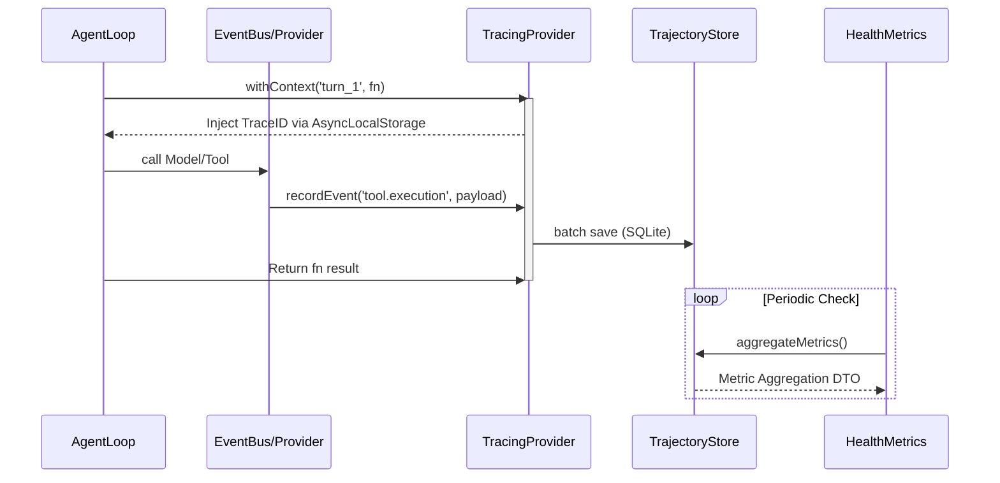

# KyberKit Phase 2: Observability Layer Spec

**Document**: `phase2-observability-spec.md`
**Role**: `@arch` (Architect)
**Dependency**: `arch/design.md` (v1.2, section 6)
**Status**: 🟢 Approved

---

## 1. 架构目标与上下文 (Context & Objectives)

在 Phase 1 (可靠性层) 落地的基础上，Phase 2 (可观测性层) 的目标是实现**极致轻量级、完全本地方向、零外部依赖**的系统运行态追踪能力深度。参考 `claude-code` 架构的克制基因，本规范放弃重度 `OpenTelemetry` 依赖，转而使用原生 `AsyncLocalStorage` 加持的层级追踪和内置 SQLite 持久化能力。

三大核心模块（O1-O3）：
- **[O1] 轻量级全链路追踪 (Lightweight Tracing)**：记录工具调用、模型耗时、拦截流转。
- **[O2] 轨迹持久化存储 (Trajectory Storage)**：支持微调数据捞取和问题调试的历史存根。
- **[O3] 健康度监控指标 (Health Dashboard)**：确定性计算系统健康运行指标及 Token 消耗预算预兆。

---

## 2. UML 流转与边界 (System Boundaries & Workflow)

### 2.1 序列流转图 (Sequence Diagram)



### 2.2 模块边界 (Boundaries)
- **输入**: AgentLoop 与各个底层 Kernel 原语发出的 `EventBus` 消息或直接拦截钩子。
- **输出**: SQLite 持久层内的轨迹（Trajectories）表与时序仪表盘聚合对象。
- **性能约束**: `recordEvent` 必须是基于内存缓冲的极其轻量操作（异步批量刷盘），单个 Span 延迟开销必须 < 1ms。

---

## 3. DTO 与 Schema 定义 (Data Transfer Objects)

```typescript
// 1. 轨迹追踪标志
export type TrajectoryEventKind = 
  | 'agent.turn_start'
  | 'agent.turn_end'
  | 'model.request'
  | 'model.response'
  | 'tool.call'
  | 'tool.result'
  | 'memory.prune'
  | 'exception.tripped';

// 2. 轨迹事件 Payload
export interface TrajectoryEvent {
  id: string;              // UUID
  traceId: string;         // Root Trace ID (Context)
  spanId: string;          // Current Span ID
  parentSpanId?: string;   // Nested execution structure
  kind: TrajectoryEventKind;
  timestamp: number;
  durationMs?: number;     // End event execution time
  payload: Record<string, any>; // Arbitrary telemetry (e.g. prompt size, error stack)
}

// 3. 聚合度量 DTO
export interface HealthMetricsSnapshot {
  windowStart: number;
  windowEnd: number;
  activeAgents: number;
  totalTokensConsumed: number;
  avgToolDurationMs: number;
  errorRate: number;      // Errors / Total Spans
  circuitBreakerTrips: number;
}
```

---

## 4. 抽象接口签名 (Abstract Interface Signatures)

```typescript
import { AsyncLocalStorage } from 'async_hooks';

/**
 * [O1] TracingProvider: Context & Event Tracking
 * Use Node's AsyncLocalStorage to automagically pass TraceID
 * without polluting application code signatures.
 */
export interface TraceContext {
  traceId: string;
  spanId: string;
}

export abstract class TracingProvider {
  protected storage = new AsyncLocalStorage<TraceContext>();

  /** 产生新 Context 边界闭包的执行上下文 */
  abstract withContext<T>(spanName: string, fn: () => Promise<T>): Promise<T>;

  /** 在当前 Context 下触发事件流记录 */
  abstract recordEvent(kind: TrajectoryEventKind, payload: Record<string, any>): void;

  /** 主动测量包装函数 */
  abstract measure<T>(kind: TrajectoryEventKind, fn: () => Promise<T>, payloadFn?: () => Record<string, any>): Promise<T>;
}

/**
 * [O2] TrajectoryStore: High-throughput Persistency
 */
export interface TrajectoryStore {
  /** 批量刷入避免频繁写盘 */
  saveBatch(events: TrajectoryEvent[]): Promise<void>;
  
  /** 根据 Trace 抽取全链路对象 (可用于 RLHF 数据准备) */
  getTrace(traceId: string): Promise<TrajectoryEvent[]>;

  /** 数据截断清理 */
  prune(retentionMs: number): Promise<number>;
}

/**
 * [O3] HealthDashboard: Deterministic Metric Aggregators
 */
export interface HealthDashboard {
  /** 实时计算时间窗窗口内运行健康度 */
  computeSnapshot(timeWindowMs: number): Promise<HealthMetricsSnapshot>;
  
  /** (Optional) 代码库扫描抽象 */
  scanCodebaseConstraints?(rootDir: string): Promise<Record<string, number>>;
}
```

---

## 5. 异常分类与约束 (Exception Classes)

```typescript
import { KyberError, ErrorCategory } from './errors'; // 依赖 Phase 0/1 定义

export class ObservabilityError extends KyberError {
  readonly code = 'OBSERVABILITY_FAULT';
  readonly category: ErrorCategory = 'internal';
}

export class StorageQuotaExceededError extends ObservabilityError {
  constructor(public storageSize: number, public boundary: number) {
    super(`Trajectory storage exceeded quota: ${storageSize} > ${boundary}`);
  }
}
```

---

## 6. 算法/业务实现逻辑伪代码 (Implementation Pseudocode)

**TracingProvider Context Propagation (AsyncLocalStorage 模式)**:

```typescript
class DefaultTracingProvider extends TracingProvider {
  private buffer: TrajectoryEvent[] = [];

  async withContext<T>(spanName: string, fn: () => Promise<T>): Promise<T> {
    const parent = this.storage.getStore();
    const traceId = parent?.traceId ?? generateUUID();
    const spanId = generateUUID();
    
    return this.storage.run({ traceId, spanId }, async () => {
      const startTime = Date.now();
      try {
        const result = await fn();
        this.buffer.push({
            id: generateUUID(), traceId, spanId, parentSpanId: parent?.spanId,
            kind: 'agent.turn_end', timestamp: Date.now(), durationMs: Date.now() - startTime,
            payload: { status: 'success', spanName }
        });
        return result;
      } catch (error) {
        this.buffer.push({ /* payload status: error */});
        throw error;
      }
    });
  }

  recordEvent(kind: TrajectoryEventKind, payload: Record<string, any>) {
     // 取出当前隐式上下文
     const ctx = this.storage.getStore();
     if (!ctx) return; // Ignore outer context noise
     
     this.buffer.push({
        id: generateUUID(),
        traceId: ctx.traceId,
        spanId: ctx.spanId,
        kind,
        timestamp: Date.now(),
        payload
     });
     
     // triggers batch async persist if buffer size > M
     if (this.buffer.length > THRESHOLD) {
         this.trajectoryStore.saveBatch(this.buffer);
         this.buffer = [];
     }
  }
}
```

---

## 7. Next Steps & Acceptance Rules

1. 本文档交由 User（Product Owner）审查。
2. 明确关注 `AsyncLocalStorage` 作为上下文依赖隔离方案的合理性（消除应用层回调污染）。
3. 审查在内存中批量 Batch 落盘的延迟写机制。
4. **阻断点控制**：只有在接受本 Spec 的 `Approve` 之后，`/qa` 和 `/coder` 方可执行基于 `vitest` 的驱动测试编写。
