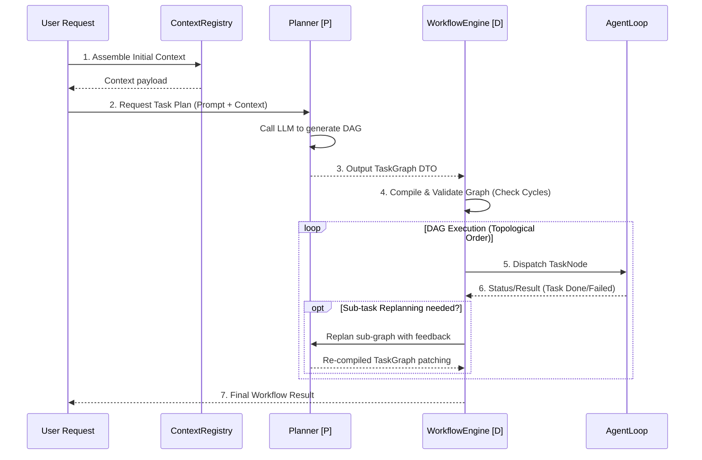

# KyberKit Phase 3: Intelligence Layer Spec

**Document**: `phase3-intelligence-spec.md` 
**Role**: `@arch` (Architect)
**Dependency**: `arch/design.md` (v1.2, section 7)
**Status**: 🟢 Approved

---

## 1. 架构目标与上下文 (Context & Objectives)

在建立并完善了 Phase 0 Kernel、Phase 1 Reliability、Phase 2 Observability 的基础设施后，系统具备了执行单个 Agent 循环和崩溃恢复的基础能力。
**Phase 3 (Intelligence)** 的核心目标是将简单的“单线性思考代理”进化为**能规划复杂任务、管理巨量上下文的执行中枢**。

核心准则：**切分确定性与概率性 (Split Deterministic vs Probabilistic)**。
- 只有与大模型相关的规划（Planner）和压缩过程允许具备概率性 (`[P]`)。
- 执行引擎 (Workflow Engine) 和 预算裁剪调度 (Context Budget) 必须是严苛的纯代码逻辑 (`[D]`)。如果模型输出的 DAG（有向无环图）出现逻辑环或引用错误，必须在编译阶段被确定性拦截，拒绝执行。

---

## 2. UML 流转与边界 (System Boundaries & Workflow)

### 2.1 规划与执行流水线 (Sequence Diagram)



---

## 3. DTO 与 Schema 定义 (Data Transfer Objects)

```typescript
// 1. Context相关
export interface ContextEntry {
  id: string;
  source: 'static' | 'dynamic';
  content: string;
  tokenCount: number;
  priority: number; // 0 是最高优先级 (如 core instructions)
}

// 2. DAG 执行引擎相关
export interface TaskNode {
  id: string;
  type: 'atomic' | 'composite';
  description: string;
  requiredPermissions: string[]; // PermissionTags
  estimatedTokens?: number;
  timeoutMs?: number;
  acceptanceCriteria?: string[];
  retryK?: number; // 隐式依赖 Phase 1 ExceptionHandler
}

export interface TaskEdge {
  from: string;
  to: string;
  type: 'sequential' | 'parallel';
}

export interface TaskGraph {
  id: string;
  description: string;
  nodes: TaskNode[];
  edges: TaskEdge[];
}

export interface WorkflowStatus {
  workflowId: string;
  nodeStatus: Record<string, 'pending' | 'running' | 'completed' | 'failed' | 'skipped'>;
  overallProgress: number; // 0.0 - 1.0
}
```

---

## 4. 抽象接口签名 (Abstract Interface Signatures)

```typescript
/**
 * [O1] ContextBudget (确定性管家)
 */
export interface ContextBudget {
  setLimit(maxTokens: number): void;
  // 按照 Priority 打包尽可能多的上下文，若超出限制，则低优先级的被裁剪抛弃
  assemble(entries: ContextEntry[]): {
    assembled: ContextEntry[];
    dropped: ContextEntry[];
    totalTokens: number;
  };
}

/**
 * [O2] Planner (概率性抽象)
 */
export interface Planner {
  /** 基于自然语言与环境状态，让 LLM 编排出一个 TaskGraph */
  plan(request: string, context: ContextEntry[]): Promise<TaskGraph>;
  
  /** 任务失败时，根据反馈局部重新规划 */
  replan(currentGrid: TaskGraph, failedNodeId: string, feedback: string): Promise<TaskGraph>;
}

/**
 * [O3] WorkflowEngine (纯确定性执行器)
 */
export interface WorkflowEngine {
  /** 提交包含多个独立任务的有向无环图进行执行 */
  execute(graph: TaskGraph, initialContext: any): Promise<void>;
  
  /** 获取执行状态 */
  getStatus(workflowId: string): WorkflowStatus;
}
```

---

## 5. 异常分类与约束 (Exception Classes)

```typescript
import { KyberError, ErrorCategory } from './errors';

export class IntelligenceError extends KyberError {
  readonly category: ErrorCategory = 'internal';
}

// [D] 确定性编译失败，例如产生了循环依赖 A->B->A
export class WorkflowCompilationError extends IntelligenceError {
  readonly code = 'DAG_COMPILE_FAULT';
  constructor(public message: string) { super(message); }
}

// [P] LLM 输出无法被解析成有效的 TaskGraph
export class PlanningError extends IntelligenceError {
  readonly code = 'PLANNER_PARSING_FAULT';
  constructor(public rawLLMOutput: string) { super('Failed to parse planner output'); }
}

// [D] 上下文连最高优先级的内容都装不下
export class ContextBudgetExceededError extends IntelligenceError {
  readonly code = 'CONTEXT_OVERFLOW_FAULT';
  constructor(public required: number, public budget: number) {
    super(`Core context requires ${required} tokens but budget is ${budget}`);
  }
}
```

---

## 6. 算法/业务实现逻辑伪代码 (Implementation Pseudocode)

**纯确定性模块实现指示 (WorkflowEngine Compilation Phase)**:

```typescript
class DefaultWorkflowEngine implements WorkflowEngine {
  async execute(graph: TaskGraph, context: any): Promise<void> {
    // 1. Compile Phase [D]
    this.detectCycles(graph); // Throws WorkflowCompilationError if cycle exists
    
    // 2. Topology Sort [D]
    const executionOrderLayers = this.topologicalSort(graph);

    // 3. Execution Phase [D]
    for (const layer of executionOrderLayers) {
      // Execute all nodes in the same layer in parallel
      const promises = layer.map(node => this.runNode(node, context));
      
      const results = await Promise.allSettled(promises);
      
      const failures = results.filter(r => r.status === 'rejected');
      if (failures.length > 0) {
        // [P] Invoke replanner if strict policy allows, else throw
        throw new IntelligenceError('Layer execution failed: ' + failures[0].reason);
      }
    }
  }

  private detectCycles(graph: TaskGraph): void {
      // DFS color mapping: 0=unvisited, 1=visiting, 2=visited
  }
}
```

---

## 7. Next Steps & Acceptance Rules

1. 本文档交由 User（Product Owner）审查。
2. 特别关注对于 **Workflow Engine (纯执行引擎) 不允许调用 LLM** 的硬件级强制分离。
3. **阻断点控制**：只有在接受本 Spec 的 `Approve` 之后，`/qa` 和 `/coder` 方可执行基于 `vitest` 的驱动测试编写。
