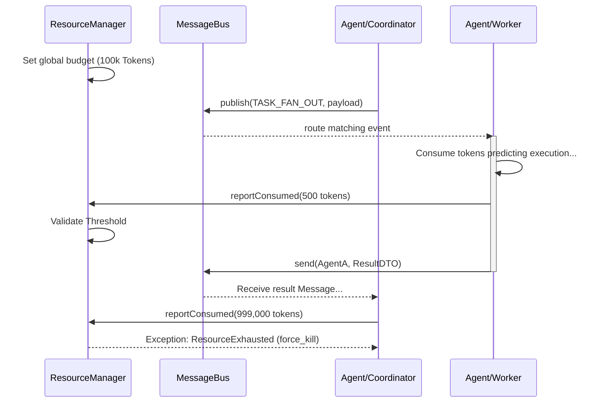

# KyberKit Phase 4: Scale Layer Spec

**Document**: `phase4-scale-spec.md`
**Role**: `@arch` (Architect)
**Dependency**: `arch/design.md` (v1.2, section 8)
**Status**: 🟡 Pending Approval

---

## 1. 架构目标与上下文 (Context & Objectives)

在 Phase 3 的 Intelligence 层解决了“任务规划向下拆解与重排”之后，体系的瓶颈不再是认知，而是**横向并发效率和多实例资源约束**。
**Phase 4 (Scale)** 的终极目标是将 KyberKit 扩张为一个**完全并行的多 Agent 调度场级底座**。在这一层，确定性（Determinism）依然是铁律：跨越 Agent 的通信和总体 Token 燃烧上限不允许任何模型的自由发挥。

核心模块：
- **[D] `MessageBus` (消息总线)**: 支撑异构 Agent 之间 Pub/Sub 与 P2P 点对点对话的基础设施，解耦 Agent 实体绑定。
- **[D] `ResourceManager` (资源守护者)**: 全局硬性阻断器，接管多通道、多 Agent 并发引发的资源账款（Tokens, Time, USDCost）超支，实现确定性的 `graceful_stop` 和 `force_kill`。

---

## 2. UML 流转与边界 (System Boundaries & Workflow)

### 2.1 规模化调度拓扑流转 (Sequence Diagram)



---

## 3. DTO 与 Schema 定义 (Data Transfer Objects)

```typescript
// 1. 通信总线实体 (Event/Message)
export interface AgentEvent {
  type: string;             // e.g., 'task.completed', 'file.modified'
  sourceId: string;
  timestamp: number;
  payload: Record<string, any>;
}

export interface AgentMessage {
  id: string;
  from: string;
  to: string;
  content: string;          // 传输内容序列化 (JSON/Text)
  replyToId?: string;       // 溯源线程ID
}

// 2. 预算实体
export interface BudgetConfig {
  maxTokens: number;
  maxTimeMs: number;
  alertThresholdPercent: number; // e.g. 0.8 (80%)
  onExceeded: 'alert' | 'pause' | 'force_kill';
}

export interface BudgetStatus {
  tokensUsed: number;
  timeElapsedMs: number;
  isAlerting: boolean;
  isExceeded: boolean;
}
```

---

## 4. 抽象接口签名 (Abstract Interface Signatures)

```typescript
/**
 * [D] MessageBus - 轻量级解耦通信协议
 */
export interface Subscription {
  unsubscribe(): void;
}

export interface MessageBus {
  // Broadcaster (Pub/Sub)
  publish(event: AgentEvent): void;
  subscribe(eventType: string, handler: (event: AgentEvent) => void | Promise<void>): Subscription;
  
  // Point-to-Point Messaging (Mailbox Queue)
  send(toAgentId: string, message: AgentMessage): Promise<void>;
  receive(agentId: string): AsyncIterable<AgentMessage>; // 基于 AsyncGenerator 的流式信箱消费
}

/**
 * [D] ResourceManager - 系统最高优先级的熔断拦截器
 */
export interface ResourceManager {
  configure(config: BudgetConfig): void;
  
  // 报告消费并判断是否触发阻断（抛出 ResourceExhaustedError）
  reportTokenConsumption(tokens: number): void;
  
  // 轮询流逝时间并获取状态
  tick(): BudgetStatus;
  
  // 强制复位
  reset(): void;
}
```

---

## 5. 异常分类与约束 (Exception Classes)

```typescript
import { KyberError, ErrorCategory } from './errors'; // 依赖 Phase 0/1 定义

export class ScaleError extends KyberError {
  readonly category: ErrorCategory = 'system';
}

// [D] ResourceManager 抛出的致命硬断锁
export class ResourceExhaustedError extends ScaleError {
  readonly code = 'RESOURCE_EXHAUSTED_FAULT';
  constructor(public resourceType: 'tokens' | 'time', public used: number, public max: number) {
    super(`Execution trapped: ${resourceType} budget exhausted (${used} / ${max})`);
  }
}

// [D] 总线路由不到该 Agent 信箱时发出
export class UnknownAgentMailboxError extends ScaleError {
  readonly code = 'UNKNOWN_MAILBOX_FAULT';
  constructor(public agentId: string) { super(`No receiver subscribed for Agent ID: ${agentId}`); }
}
```

---

## 6. 算法/业务实现逻辑伪代码 (Implementation Pseudocode)

**纯确定性的 ResourceManager 熔断实现**:

```typescript
class DefaultResourceManager implements ResourceManager {
  private status: BudgetStatus;
  private config: BudgetConfig;
  private startTime: number = 0;

  constructor(config: BudgetConfig) {
    this.config = config;
    this.status = { tokensUsed: 0, timeElapsedMs: 0, isAlerting: false, isExceeded: false };
    this.startTime = Date.now();
  }

  reportTokenConsumption(tokens: number): void {
    this.status.tokensUsed += tokens;
    this.validateConstraints('tokens'); // Will throw ResourceExhaustedError if configured to force_kill
  }

  tick(): BudgetStatus {
    this.status.timeElapsedMs = Date.now() - this.startTime;
    this.validateConstraints('time');
    return this.status;
  }

  private validateConstraints(triggerType: 'tokens'|'time') {
      const isTimeOut = this.status.timeElapsedMs > this.config.maxTimeMs;
      const isTokenOut = this.status.tokensUsed > this.config.maxTokens;
      
      if (isTimeOut || isTokenOut) {
         this.status.isExceeded = true;
         if (this.config.onExceeded === 'force_kill') {
            throw new ResourceExhaustedError(
               isTimeOut ? 'time' : 'tokens',
               isTimeOut ? this.status.timeElapsedMs : this.status.tokensUsed,
               isTimeOut ? this.config.maxTimeMs : this.config.maxTokens
            );
         }
      }
      // logic for alerting
  }
}
```

---

## 7. Next Steps & Acceptance Rules

1. 本文档交由 User（Product Owner）审查。
2. 确认 `MessageBus` 的实现采用内存（Memory Queue）策略即可，无需外置中间件（如 Kafka / RabbitMQ）污染外部依赖原则。
3. **阻断点控制**：只有在接受本 Spec 的 `Approve` 之后，`/qa` 可执行测试驱动开发。
