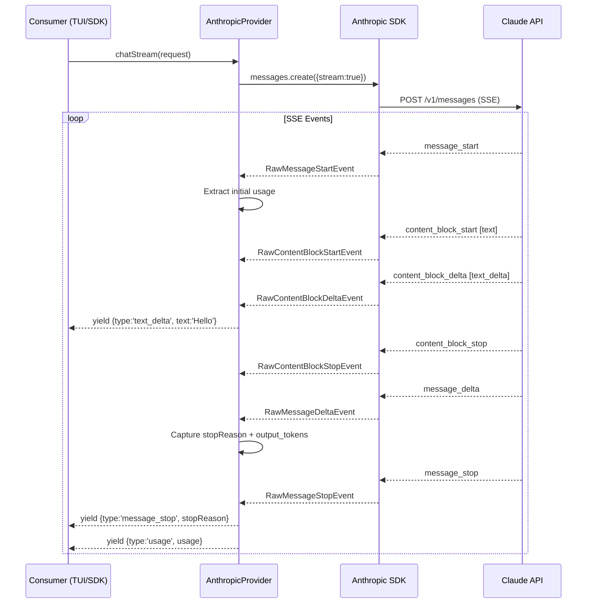

# Sprint 1: Streaming Infrastructure — Detailed Design Spec

> **Version**: 2.0-sprint1-draft
> **Scope**: Step 1 (LLM Gateway Streaming) + Step 2 (Agent Loop Rewrite) + Step 3 (Runtime Adaptation)
> **Base Branch**: `bot-v0.1`

---

## 1. Overview

### 1.1 Problem Statement

KyberKit v1.x Agent Loop uses batch `model.chat()` — the user must wait for the **entire** LLM response before seeing any output. Tool calls execute serially after the full response is received. There is no middleware extensibility point for injecting cross-cutting concerns (token tracking, memory triggers, compression guards).

### 1.2 Goal

Transform KyberKit's core execution model from **batch request/response** to **streaming async generator with middleware pipeline**, enabling:

1. Real-time streaming output to consumers (TUI, SDK)
2. Pluggable middleware for Sprint 2-5 features (memory extraction, compression, hooks)
3. Foundation for parallel tool execution (Sprint 5)

### 1.3 Design Principles

- **Generator-as-orchestration-primitive**: Following DeepCC's pattern, use `async function*` + `yield` as the core agent loop mechanism instead of state machines or graph frameworks
- **Manual stream accumulation**: Avoid SDK's `MessageStream` high-level API to prevent O(n^2) JSON re-parsing; accumulate content blocks as raw strings
- **Middleware chain-of-responsibility**: Each middleware can observe, transform, or filter events
- **Backward compatibility**: Existing `runAgentLoop()` preserved as thin wrapper

---

## 2. Type System Changes

### 2.1 Fix: `ChatResponse.stopReason` (Bug)

Current `ChatResponse` in `src/types/model.ts` is missing `stopReason`. The field is used in `AgentLoop.ts:114` but not declared in the type.

```typescript
// BEFORE (broken)
export interface ChatResponse {
  role: 'assistant';
  content: Array<MessageContent>;
  usage: UsageInfo;
}

// AFTER (fixed)
export interface ChatResponse {
  role: 'assistant';
  content: Array<MessageContent>;
  stopReason: StopReason;
  usage: UsageInfo;
}
```

### 2.2 New: `AgentEvent` Union Type

> File: `src/types/agent-events.ts` (new)

`AgentEvent` is the **yield type** of the `agentLoop()` async generator. It represents every observable event in the agent execution lifecycle.

```typescript
import { StopReason, UsageInfo, MessageContent } from './model.js';

/**
 * AgentEvent — the stream of events yielded by agentLoop().
 * Consumers (TUI, SDK, tests) iterate over these to observe agent behavior.
 */
export type AgentEvent =
  | TextDeltaEvent
  | ThinkingDeltaEvent
  | ToolUseStartEvent
  | ToolUseInputEvent
  | ToolUseCompleteEvent
  | ToolResultEvent
  | UsageEvent
  | TurnCompleteEvent
  | StatusEvent
  | ErrorEvent;

/** Incremental text output from LLM */
export interface TextDeltaEvent {
  readonly type: 'text_delta';
  readonly text: string;
}

/** Incremental thinking/reasoning output from LLM */
export interface ThinkingDeltaEvent {
  readonly type: 'thinking_delta';
  readonly text: string;
}

/** LLM has started a tool_use block */
export interface ToolUseStartEvent {
  readonly type: 'tool_use_start';
  readonly toolUseId: string;
  readonly toolName: string;
}

/** Incremental tool input JSON fragment */
export interface ToolUseInputEvent {
  readonly type: 'tool_use_input';
  readonly toolUseId: string;
  readonly fragment: string;
}

/** Tool use block fully received (input JSON parsed) */
export interface ToolUseCompleteEvent {
  readonly type: 'tool_use_complete';
  readonly toolUseId: string;
  readonly toolName: string;
  readonly input: unknown;
}

/** Tool execution result */
export interface ToolResultEvent {
  readonly type: 'tool_result';
  readonly toolUseId: string;
  readonly toolName: string;
  readonly result: string;
  readonly isError: boolean;
}

/** Token usage update (emitted at stream end) */
export interface UsageEvent {
  readonly type: 'usage';
  readonly usage: UsageInfo;
  readonly cumulative: CumulativeUsage;
}

/** One LLM turn completed (after all tools executed) */
export interface TurnCompleteEvent {
  readonly type: 'turn_complete';
  readonly turnNumber: number;
  readonly stopReason: StopReason;
  /** The accumulated assistant message content blocks */
  readonly content: Array<MessageContent>;
}

/** Agent lifecycle status change */
export interface StatusEvent {
  readonly type: 'status';
  readonly status: string;
  readonly message?: string;
}

/** Error during agent execution */
export interface ErrorEvent {
  readonly type: 'error';
  readonly error: Error;
  readonly recoverable: boolean;
}

/** Cumulative usage across the entire session */
export interface CumulativeUsage {
  totalInputTokens: number;
  totalOutputTokens: number;
  totalCacheCreationTokens: number;
  totalCacheReadTokens: number;
  turnCount: number;
}
```

### 2.3 New: `MiddlewareContext`

> Included in `src/agent/StreamMiddleware.ts`

```typescript
import { DefaultAgentInstance } from './AgentInstance.js';
import { CumulativeUsage } from '../types/agent-events.js';

/**
 * Shared mutable context accessible to all middlewares within a turn.
 */
export interface MiddlewareContext {
  /** Current agent instance */
  readonly agent: DefaultAgentInstance;
  /** Current turn number */
  turnNumber: number;
  /** Cumulative session usage */
  cumulative: CumulativeUsage;
  /** Accumulated content blocks for current turn */
  accumulatedContent: Array<import('../types/model.js').MessageContent>;
  /** Accumulated tool_use blocks pending execution */
  pendingToolUses: Array<{
    id: string;
    name: string;
    input: unknown;
  }>;
  /** Current stop reason (set on message_stop) */
  stopReason: import('../types/model.js').StopReason | null;
}
```

---

## 3. Step 1: LLM Gateway Streaming

### 3.1 Anthropic SDK Streaming API

The Anthropic SDK provides two streaming interfaces:

1. **`client.messages.create({ stream: true })`** → Returns `Stream<RawMessageStreamEvent>` (low-level)
2. **`client.messages.stream()`** → Returns `MessageStream` (high-level, auto-accumulation)

**We use option 1** (raw stream) for the following reasons:
- `MessageStream` re-parses the full accumulated JSON on every `input_json_delta`, causing O(n^2) behavior
- Raw stream gives full control over accumulation and event mapping
- DeepCC uses this exact pattern (see DeepCC Ch07 Section 4)

### 3.2 SDK Event → KyberKit StreamEvent Mapping

```
SDK RawMessageStreamEvent         →  KyberKit StreamEvent
─────────────────────────────────────────────────────────────
message_start                     →  (internal: extract initial usage)
content_block_start [text]        →  (internal: init text accumulator)
content_block_start [tool_use]    →  yield { type: 'tool_use_start' }
content_block_start [thinking]    →  (internal: init thinking accumulator)
content_block_delta [text_delta]  →  yield { type: 'text_delta' }
content_block_delta [input_json]  →  yield { type: 'tool_use_input' }
content_block_delta [thinking]    →  yield { type: 'thinking_delta' }
content_block_stop                →  yield { type: 'tool_use_stop' } (if tool_use block)
message_delta                     →  (internal: capture stopReason + final usage)
message_stop                      →  yield { type: 'message_stop' }
                                  →  yield { type: 'usage' }
```

### 3.3 `AnthropicProvider.chatStream()` Implementation

```typescript
async *chatStream(request: ChatRequest): AsyncIterable<StreamEvent> {
  const stream = await this.client.messages.create({
    model: request.model,
    max_tokens: request.maxTokens ?? 4096,
    system: request.systemPrompt,
    messages: this.mapMessages(request.messages),
    tools: this.mapTools(request.tools),
    temperature: request.temperature,
    stream: true,
  });

  // Content block accumulation state
  const contentBlocks: Map<number, { type: string; data: string }> = new Map();
  let stopReason: StopReason = 'end_turn';
  let usage: UsageInfo = { inputTokens: 0, outputTokens: 0 };

  for await (const event of stream) {
    switch (event.type) {
      case 'message_start':
        // Extract initial usage (input_tokens, cache_*)
        usage.inputTokens = event.message.usage.input_tokens;
        usage.cacheCreationTokens = event.message.usage.cache_creation_input_tokens ?? undefined;
        usage.cacheReadTokens = event.message.usage.cache_read_input_tokens ?? undefined;
        break;

      case 'content_block_start':
        contentBlocks.set(event.index, { type: event.content_block.type, data: '' });
        if (event.content_block.type === 'tool_use') {
          yield {
            type: 'tool_use_start',
            id: event.content_block.id,
            name: event.content_block.name,
          };
        }
        break;

      case 'content_block_delta':
        const block = contentBlocks.get(event.index);
        if (!block) break;
        if (event.delta.type === 'text_delta') {
          block.data += event.delta.text;
          yield { type: 'text_delta', text: event.delta.text };
        } else if (event.delta.type === 'input_json_delta') {
          block.data += event.delta.partial_json;
          yield {
            type: 'tool_use_input',
            id: /* resolved from content_block_start */,
            inputFragment: event.delta.partial_json,
          };
        } else if (event.delta.type === 'thinking_delta') {
          block.data += event.delta.thinking;
          yield { type: 'thinking_delta', text: event.delta.thinking };
        }
        break;

      case 'content_block_stop':
        // tool_use blocks: emit stop with parsed input
        // (actual full content block data available for accumulation)
        break;

      case 'message_delta':
        stopReason = this.mapStopReason(event.delta.stop_reason);
        usage.outputTokens = event.usage.output_tokens;
        break;

      case 'message_stop':
        yield { type: 'message_stop', stopReason };
        yield { type: 'usage', usage };
        break;
    }
  }
}
```

### 3.4 Sequence Diagram: Streaming Flow



---

## 4. Step 2: Streaming Agent Loop

### 4.1 Middleware Pipeline Architecture

```
                    ┌─────────────────────────────┐
                    │  MiddlewarePipeline          │
                    │                             │
  StreamEvent ──→   │  ┌─ TokenCounter ──┐        │  ──→ AgentEvent (to consumer)
  (from LLM)       │  │  count tokens   │        │
                    │  └────────┬────────┘        │
                    │           ↓                 │
                    │  ┌─ ContentAccumulator ─┐   │
                    │  │  accumulate blocks   │   │
                    │  │  track pending tools │   │
                    │  └────────┬─────────────┘   │
                    │           ↓                 │
                    │  ┌─ ToolDispatcher ─────┐   │
                    │  │  (post-turn only)    │   │
                    │  │  execute tool calls  │   │
                    │  │  yield tool_result   │   │
                    │  └──────────────────────┘   │
                    └─────────────────────────────┘
```

### 4.2 `StreamMiddleware` Interface

> File: `src/agent/StreamMiddleware.ts`

```typescript
import { AgentEvent } from '../types/agent-events.js';

/**
 * StreamMiddleware processes agent events in a pipeline.
 * 
 * Each middleware can:
 * - Pass the event through (call next())
 * - Transform the event (modify and call next())
 * - Filter the event (don't call next())
 * - Produce additional events (return an array)
 */
export interface StreamMiddleware {
  readonly name: string;
  
  /**
   * Process an agent event.
   * @param event - The incoming event
   * @param context - Shared mutable context for this turn
   * @returns Processed event(s), null to filter, or the original event
   */
  process(
    event: AgentEvent,
    context: MiddlewareContext,
  ): AgentEvent | AgentEvent[] | null;
}

/**
 * MiddlewarePipeline chains middlewares and processes events through them.
 */
export class MiddlewarePipeline {
  private readonly middlewares: StreamMiddleware[] = [];

  use(middleware: StreamMiddleware): this {
    this.middlewares.push(middleware);
    return this;
  }

  /**
   * Process an event through all middlewares in order.
   * Returns the final event(s) to yield to the consumer.
   */
  process(event: AgentEvent, context: MiddlewareContext): AgentEvent[] {
    let events: AgentEvent[] = [event];
    
    for (const mw of this.middlewares) {
      const nextEvents: AgentEvent[] = [];
      for (const e of events) {
        const result = mw.process(e, context);
        if (result === null) continue;
        if (Array.isArray(result)) {
          nextEvents.push(...result);
        } else {
          nextEvents.push(result);
        }
      }
      events = nextEvents;
    }
    
    return events;
  }
}
```

**Design Note**: The pipeline uses a synchronous `process()` method (not async) because:
1. Token counting and content accumulation are CPU-bound, not I/O
2. Tool dispatch happens as a separate phase (not inside the middleware chain)
3. Simplifies the mental model and avoids generator-in-generator complexity

### 4.3 TokenCounterMiddleware

> File: `src/agent/middleware/TokenCounterMiddleware.ts`

Tracks cumulative token usage across the session.

```typescript
export class TokenCounterMiddleware implements StreamMiddleware {
  readonly name = 'token-counter';

  process(event: AgentEvent, context: MiddlewareContext): AgentEvent {
    if (event.type === 'usage') {
      context.cumulative.totalInputTokens += event.usage.inputTokens;
      context.cumulative.totalOutputTokens += event.usage.outputTokens;
      context.cumulative.totalCacheCreationTokens += event.usage.cacheCreationTokens ?? 0;
      context.cumulative.totalCacheReadTokens += event.usage.cacheReadTokens ?? 0;
      
      // Enrich the event with cumulative data
      return {
        ...event,
        cumulative: { ...context.cumulative },
      };
    }
    return event;
  }
}
```

### 4.4 ContentAccumulatorMiddleware

> File: `src/agent/middleware/ContentAccumulatorMiddleware.ts`

Accumulates streaming deltas into complete content blocks for message history.

```typescript
export class ContentAccumulatorMiddleware implements StreamMiddleware {
  readonly name = 'content-accumulator';

  // Per-turn accumulation state (reset on turn_complete)
  private textBuffer = '';
  private thinkingBuffer = '';
  private toolUseBuffers = new Map<string, { name: string; input: string }>();

  process(event: AgentEvent, context: MiddlewareContext): AgentEvent | AgentEvent[] {
    switch (event.type) {
      case 'text_delta':
        this.textBuffer += event.text;
        return event; // pass through for real-time display

      case 'thinking_delta':
        this.thinkingBuffer += event.text;
        return event;

      case 'tool_use_start':
        this.toolUseBuffers.set(event.toolUseId, { name: event.toolName, input: '' });
        return event;

      case 'tool_use_input':
        const buf = this.toolUseBuffers.get(event.toolUseId);
        if (buf) buf.input += event.fragment;
        return event;

      case 'tool_use_complete':
        // Tool use block fully received — add to pending
        context.pendingToolUses.push({
          id: event.toolUseId,
          name: event.toolName,
          input: event.input,
        });
        return event;

      case 'turn_complete':
        // Build accumulated MessageContent[] for message history
        const content: MessageContent[] = [];
        if (this.thinkingBuffer) {
          content.push({ type: 'text', text: `<thinking>${this.thinkingBuffer}</thinking>` });
        }
        if (this.textBuffer) {
          content.push({ type: 'text', text: this.textBuffer });
        }
        for (const [id, tool] of this.toolUseBuffers) {
          content.push({
            type: 'tool_use',
            id,
            name: tool.name,
            input: JSON.parse(tool.input || '{}'),
          });
        }
        context.accumulatedContent = content;
        
        // Reset for next turn
        this.reset();
        return event;

      default:
        return event;
    }
  }

  reset(): void {
    this.textBuffer = '';
    this.thinkingBuffer = '';
    this.toolUseBuffers.clear();
  }
}
```

### 4.5 ToolDispatcherMiddleware

> File: `src/agent/middleware/ToolDispatcherMiddleware.ts`

This middleware is **NOT** called during the stream event processing. Instead, it provides a separate `dispatchTools()` method called by the Agent Loop after the stream completes.

```typescript
export class ToolDispatcherMiddleware {
  constructor(
    private readonly tools: ToolIntegrationFacade,
    private readonly sandbox: PermissionSandbox,
  ) {}

  /**
   * Execute all pending tool uses and yield results.
   * Called by the Agent Loop after a turn with stopReason='tool_use'.
   */
  async *dispatchTools(
    pendingToolUses: Array<{ id: string; name: string; input: unknown }>,
    agentContext: ToolUseContext,
  ): AsyncGenerator<ToolResultEvent> {
    for (const toolUse of pendingToolUses) {
      const tool = this.tools.findTool(toolUse.name);
      if (!tool) {
        yield {
          type: 'tool_result',
          toolUseId: toolUse.id,
          toolName: toolUse.name,
          result: `Unknown tool: ${toolUse.name}`,
          isError: true,
        };
        continue;
      }

      try {
        // Permission check
        const permCheck = await tool.checkPermissions(toolUse.input, agentContext);
        if (permCheck.behavior === 'deny') {
          yield {
            type: 'tool_result',
            toolUseId: toolUse.id,
            toolName: toolUse.name,
            result: `Permission denied for tool: ${toolUse.name}`,
            isError: true,
          };
          continue;
        }

        // Input validation
        if (tool.validateInput) {
          const valid = await tool.validateInput(toolUse.input, agentContext);
          if (!valid.result) {
            yield {
              type: 'tool_result',
              toolUseId: toolUse.id,
              toolName: toolUse.name,
              result: `Validation failed: ${valid.errors?.map(e => e.message).join('; ')}`,
              isError: true,
            };
            continue;
          }
        }

        // Execute
        const result = await tool.call(toolUse.input, agentContext);
        yield {
          type: 'tool_result',
          toolUseId: toolUse.id,
          toolName: toolUse.name,
          result: result.output as string ?? 'Success',
          isError: !result.success,
        };
      } catch (e: any) {
        yield {
          type: 'tool_result',
          toolUseId: toolUse.id,
          toolName: toolUse.name,
          result: `Error executing tool: ${e.message}`,
          isError: true,
        };
      }
    }
  }
}
```

### 4.6 `agentLoop()` Async Generator

> File: `src/agent/AgentLoop.ts`

```typescript
/**
 * Core Agent Loop — async generator that yields AgentEvents.
 * 
 * Architecture:
 *   while (not terminal):
 *     1. [Checkpoint] Save state
 *     2. [Sense] Collect memory context
 *     3. [Think] Stream LLM response through middleware pipeline
 *     4. [Act] If tool_use → dispatch tools, add results to messages
 *     5. [Verify] If end_turn → run verification pipeline
 *     6. yield TurnCompleteEvent
 */
export async function* agentLoop(
  deps: AgentLoopDeps,
): AsyncGenerator<AgentEvent, void, void> {
  const { agent, model, tools, sandbox, pipeline, reliability } = deps;
  const toolDispatcher = new ToolDispatcherMiddleware(tools, sandbox);
  
  const context: MiddlewareContext = {
    agent,
    turnNumber: 0,
    cumulative: {
      totalInputTokens: 0,
      totalOutputTokens: 0,
      totalCacheCreationTokens: 0,
      totalCacheReadTokens: 0,
      turnCount: 0,
    },
    accumulatedContent: [],
    pendingToolUses: [],
    stopReason: null,
  };

  while (!isTerminal(agent.status) && agent.status === 'running') {
    context.turnNumber++;
    context.accumulatedContent = [];
    context.pendingToolUses = [];
    context.stopReason = null;

    // 1. Checkpoint
    await reliability.checkpoint.save(agent as any, (reliability.memory as any).l2);

    // 2. Sense: memory context
    const memoryContext = reliability.memory.getContext();

    try {
      // 3. Think: Stream LLM response
      const stream = model.chatStream({
        model: agent.definition.model,
        systemPrompt: `${agent.definition.systemPrompt ?? ''}\n\n${memoryContext}`,
        messages: agent.messages as any,
        tools: tools.listAll(),
      });

      for await (const streamEvent of stream) {
        // Map StreamEvent → AgentEvent
        const agentEvent = mapStreamEventToAgentEvent(streamEvent);
        if (!agentEvent) continue;

        // Handle tool_use_stop → parse input and emit tool_use_complete
        // (special handling for aggregated tool blocks)

        // Process through middleware pipeline
        const processedEvents = pipeline.process(agentEvent, context);
        for (const pe of processedEvents) {
          yield pe;
        }
      }

      // Record success
      reliability.exceptionHandler.recordSuccess('model');

      // 4. Build and record assistant message
      // (content accumulated by ContentAccumulatorMiddleware)
      if (context.accumulatedContent.length > 0) {
        agent.addMessage('assistant', context.accumulatedContent);
      }

      // 5. Act: If tool_use, dispatch tools
      if (context.stopReason === 'tool_use' && context.pendingToolUses.length > 0) {
        reliability.memory.recordToolCall();
        
        const toolResults: MessageContent[] = [];
        for await (const result of toolDispatcher.dispatchTools(
          context.pendingToolUses,
          agent.context,
        )) {
          yield result;
          toolResults.push({
            type: 'tool_result',
            tool_use_id: result.toolUseId,
            content: result.result,
            is_error: result.isError,
          });
        }
        
        if (toolResults.length > 0) {
          agent.addMessage('user', toolResults);
        }
      }

      // 6. Verify: If end_turn, run verification
      if (context.stopReason === 'end_turn') {
        agent.transition('task_done');
        
        const verifResult = await reliability.verification.execute({ agent, tools });
        if (verifResult.passed) {
          agent.transition('verified');
        } else {
          agent.addMessage('user', 
            `Verification failed:\n${verifResult.summary}\nPlease fix the issues and try again.`
          );
          agent.transition('running');
        }
      }

      // Yield turn complete
      yield {
        type: 'turn_complete',
        turnNumber: context.turnNumber,
        stopReason: context.stopReason ?? 'end_turn',
        content: context.accumulatedContent,
      };

      context.cumulative.turnCount++;

    } catch (error: any) {
      // Error handling with circuit breaker
      if (error instanceof ModelError) {
        reliability.exceptionHandler.recordFailure('model');
      }

      yield {
        type: 'error',
        error,
        recoverable: !(error instanceof ModelError),
      };

      const action = await reliability.exceptionHandler.handle(error);
      if (action.strategy.type === 'abort') {
        agent.transition('error');
        yield { type: 'status', status: 'failed', message: error.message };
        break;
      }
    }
  }
}
```

### 4.7 `AgentLoopDeps` Interface

```typescript
export interface AgentLoopDeps {
  agent: DefaultAgentInstance;
  model: ModelProvider;
  tools: ToolIntegrationFacade;
  sandbox: PermissionSandbox;
  pipeline: MiddlewarePipeline;
  reliability: ReliabilityLayer;
}
```

### 4.8 Backward-Compatible `runAgentLoop()` Wrapper

```typescript
/**
 * Legacy wrapper — consumes the generator and discards events.
 * Preserves the existing API for callers that don't need streaming.
 */
export async function runAgentLoop(
  agent: DefaultAgentInstance,
  model: ModelProvider,
  tools: ToolIntegrationFacade,
  sandbox: PermissionSandbox,
  reliability: ReliabilityLayer,
): Promise<void> {
  const pipeline = new MiddlewarePipeline()
    .use(new TokenCounterMiddleware())
    .use(new ContentAccumulatorMiddleware());

  for await (const _event of agentLoop({
    agent, model, tools, sandbox, pipeline, reliability,
  })) {
    // Events discarded — legacy callers don't consume them
  }
}
```

### 4.9 Sequence Diagram: Agent Loop Turn

```mermaid
sequenceDiagram
    participant Consumer
    participant Loop as agentLoop()
    participant Pipeline as MiddlewarePipeline
    participant Model as AnthropicProvider
    participant Tools as ToolDispatcher
    participant Agent as AgentInstance

    Consumer->>Loop: for await (event of agentLoop(deps))
    
    rect rgb(240, 248, 255)
        Note over Loop: Turn N
        
        Loop->>Model: chatStream(request)
        
        loop StreamEvent
            Model-->>Loop: text_delta / tool_use_* / usage
            Loop->>Pipeline: process(agentEvent, context)
            Pipeline-->>Consumer: yield processed event
        end
        
        Loop->>Agent: addMessage('assistant', accumulated)
        
        alt stopReason == 'tool_use'
            Loop->>Tools: dispatchTools(pendingToolUses)
            loop Each Tool
                Tools-->>Consumer: yield ToolResultEvent
            end
            Loop->>Agent: addMessage('user', toolResults)
        else stopReason == 'end_turn'
            Loop->>Agent: transition('task_done')
            Loop->>Loop: run verification
            alt passed
                Loop->>Agent: transition('verified')
            else failed
                Loop->>Agent: addMessage('user', feedback)
                Loop->>Agent: transition('running')
            end
        end
        
        Loop-->>Consumer: yield TurnCompleteEvent
    end
```

### 4.10 `KyberEvents` Additions

> File: `src/types/events.ts` — add to existing `KyberEvents` type

```typescript
// --- Sprint 1: Streaming Events ---

// Stream lifecycle
'stream.started': { agentId: string; turnNumber: number };
'stream.completed': { agentId: string; turnNumber: number; stopReason: StopReason };
'stream.error': { agentId: string; turnNumber: number; error: Error };

// Middleware
'middleware.registered': { name: string };
'middleware.error': { name: string; error: Error };
```

---

## 5. Step 3: KyberRuntime Adaptation

### 5.1 Changes to `KyberRuntime`

```typescript
// New import
import { MiddlewarePipeline } from '../agent/StreamMiddleware.js';
import { TokenCounterMiddleware } from '../agent/middleware/TokenCounterMiddleware.js';
import { ContentAccumulatorMiddleware } from '../agent/middleware/ContentAccumulatorMiddleware.js';
import { agentLoop, AgentLoopDeps } from '../agent/AgentLoop.js';

export class KyberRuntime {
  // ... existing fields ...

  /**
   * Creates the default middleware pipeline for streaming agent loop.
   */
  createMiddlewarePipeline(): MiddlewarePipeline {
    return new MiddlewarePipeline()
      .use(new TokenCounterMiddleware())
      .use(new ContentAccumulatorMiddleware());
  }

  /**
   * Creates a complete AgentLoopDeps bundle for running an agent.
   */
  createAgentLoopDeps(
    agent: DefaultAgentInstance,
    reliability: ReliabilityLayer,
    pipeline?: MiddlewarePipeline,
  ): AgentLoopDeps {
    return {
      agent,
      model: this.model,
      tools: this.tools,
      sandbox: this.sandbox,
      pipeline: pipeline ?? this.createMiddlewarePipeline(),
      reliability,
    };
  }
}
```

---

## 6. Error Handling Strategy

### 6.1 Stream-Level Errors

| Error Type | Source | Handling |
|---|---|---|
| Network timeout | SDK stream interrupted | Catch in `agentLoop`, yield `ErrorEvent`, feed to `ExceptionHandler` |
| 429 Rate Limit | API response | `withRetry` handles transparently (retry with backoff) |
| 529 Overload | API response | `withRetry` handles (3 retries, then abort) |
| 5xx Server Error | API response | `withRetry` handles |
| Invalid JSON in tool input | `content_block_stop` parse | Yield error, continue loop |
| Middleware exception | Any middleware | Catch, yield `ErrorEvent`, skip middleware |

### 6.2 Circuit Breaker Integration

The existing `ExceptionHandler` circuit breaker is preserved:
- On `model.chatStream()` success → `recordSuccess('model')`
- On `ModelError` → `recordFailure('model')`
- If breaker tripped → `agentLoop` yields `ErrorEvent` and breaks

### 6.3 Abort/Kill Signal

- `agent.status` is checked at the top of each iteration (`while (!isTerminal(...))`)
- External `agent.transition('kill')` sets status to `killed`, loop exits on next check
- Stream cancellation: if the consumer stops iterating (`break` or `.return()`), the generator's `finally` block can clean up

---

## 7. File Change Summary

| File | Action | Description |
|---|---|---|
| `src/types/model.ts` | MODIFY | Fix `ChatResponse.stopReason`, no other changes |
| `src/types/agent-events.ts` | NEW | `AgentEvent` union type + `CumulativeUsage` |
| `src/types/events.ts` | MODIFY | Add streaming KyberEvents |
| `src/model/AnthropicProvider.ts` | MODIFY | Implement `chatStream()` |
| `src/agent/StreamMiddleware.ts` | NEW | `StreamMiddleware` interface + `MiddlewarePipeline` + `MiddlewareContext` |
| `src/agent/middleware/TokenCounterMiddleware.ts` | NEW | Token counting middleware |
| `src/agent/middleware/ContentAccumulatorMiddleware.ts` | NEW | Content accumulation middleware |
| `src/agent/middleware/ToolDispatcherMiddleware.ts` | NEW | Tool dispatch (not a pipeline middleware) |
| `src/agent/AgentLoop.ts` | REWRITE | `agentLoop()` generator + `runAgentLoop()` compat wrapper |
| `src/runtime/KyberRuntime.ts` | MODIFY | Add `createMiddlewarePipeline()` + `createAgentLoopDeps()` |

**Existing modules preserved unchanged**: `AgentStateMachine.ts`, `AgentInstance.ts`, `ToolIntegrationFacade.ts`, `ShellExecutor.ts`, `MCPToolRegistry.ts`, `SkillRegistry.ts`, `MemoryStore.ts`, `SessionMemory.ts`, `LongTermMemory.ts`, `EventBus.ts`, `ExceptionHandler.ts`, `RetryStrategy.ts`, `VerificationPipeline.ts`, `CheckpointManager.ts`, `PermissionSandbox.ts`.

---

## 8. Test Strategy

### 8.1 Unit Tests

**AnthropicProvider.chatStream()** (`src/model/AnthropicProvider.test.ts`):
- Mock `client.messages.create({ stream: true })` to return an async iterable of `RawMessageStreamEvent`
- Test: text-only response produces correct `text_delta` + `message_stop` + `usage` events
- Test: tool_use response produces correct `tool_use_start` + `tool_use_input` + `tool_use_stop` events
- Test: thinking response produces `thinking_delta` events
- Test: usage numbers are correctly extracted from `message_start` and `message_delta`

**MiddlewarePipeline** (`src/agent/StreamMiddleware.test.ts`):
- Test: empty pipeline passes events through
- Test: single middleware can transform events
- Test: single middleware can filter events (return null)
- Test: single middleware can produce multiple events
- Test: multiple middlewares chain correctly

**TokenCounterMiddleware**:
- Test: usage events update `context.cumulative` correctly

**ContentAccumulatorMiddleware**:
- Test: text_delta events accumulate into `context.accumulatedContent`
- Test: tool_use events accumulate and populate `context.pendingToolUses`
- Test: reset() clears buffers between turns

**ToolDispatcherMiddleware**:
- Test: known tool executes and yields `ToolResultEvent`
- Test: unknown tool yields error result
- Test: permission denied yields error result
- Test: tool execution error yields error result

### 8.2 Integration Tests

**agentLoop()** (`src/agent/AgentLoop.test.ts`):
- Test: simple text response → agent completes with `turn_complete` event
- Test: tool_use response → tool executes → second turn → agent completes
- Test: error response → `ErrorEvent` yielded → circuit breaker engaged
- Test: backward-compatible `runAgentLoop()` still works with existing test patterns

### 8.3 Existing Test Migration

Current `AgentLoop.test.ts` tests use:
- `mockModel.chat` — replace with `mockModel.chatStream` returning async iterables
- Direct assertion on `agent.status` and `agent.messages` — still valid
- `runAgentLoop()` signature — preserved as compat wrapper

---

## 9. Migration Notes

### 9.1 For Existing Code

The `runAgentLoop()` function signature is **preserved** — existing callers continue to work without changes. The function now internally creates a `MiddlewarePipeline` and consumes the `agentLoop()` generator.

### 9.2 For Future Sprints

Sprint 2+ will add new middlewares to the pipeline:
- `MemoryTriggerMiddleware` (Sprint 4, Step 9) — triggers memory extraction
- `CompactionGuardMiddleware` (Sprint 4, Step 8) — checks context compression threshold

These plug into the existing pipeline via `pipeline.use()` without modifying the Agent Loop.

### 9.3 Dependencies

No new npm dependencies required. All changes use:
- `@anthropic-ai/sdk` (existing) — streaming types
- Native `AsyncGenerator` / `AsyncIterable` — no framework
