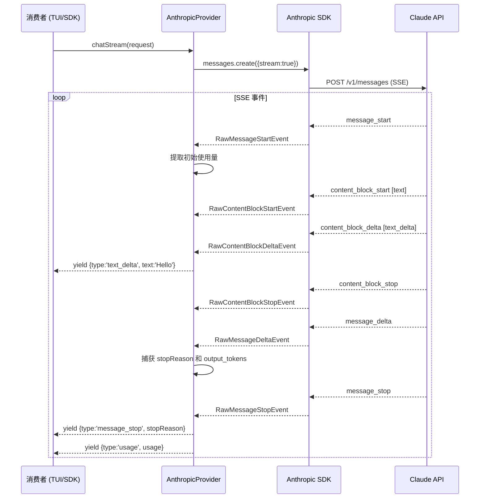

# Sprint 1：流式基础架构 — 详细设计规范 (Detailed Design Spec)

> **版本**: 2.0-sprint1-draft
> **范围**: 步骤 1 (LLM 网关流式传输) + 步骤 2 (智能体循环重构) + 步骤 3 (运行时适配)
> **基准分支**: `bot-v0.1`

---

## 1. 概述 (Overview)

### 1.1 问题陈述 (Problem Statement)

KyberKit v1.x 的智能体循环 (Agent Loop) 采用批处理 `model.chat()` 模式 —— 用户必须等待 **完整的** LLM 响应生成后才能看到任何输出。工具调用 (Tool calls) 在接收到完整响应后串行执行。系统缺乏中间件可扩展点，无法注入横切关注点（如 Token 追踪、内存触发器、压缩防护等）。

### 1.2 目标 (Goal)

将 KyberKit 的核心执行模型从 **批处理请求/响应 (batch request/response)** 转换为 **带有中间件流水线的异步生成器流 (streaming async generator with middleware pipeline)**，从而实现：

1. 向消费者（TUI、SDK）提供实时流式输出。
2. 为 Sprint 2-5 的特性（内存提取、压缩、钩子等）提供可插拔中间件支持。
3. 为并行工具执行（Sprint 5）奠定架构基础。

### 1.3 设计原则 (Design Principles)

- **生成器作为编排原语 (Generator-as-orchestration-primitive)**：参考 DeepCC 模式，使用 `async function*` + `yield` 作为核心智能体循环机制，取代状态机或图框架。
- **手动流式累加 (Manual stream accumulation)**：避开 SDK 的 `MessageStream` 高层 API，以防止 O(n^2) 的 JSON 重新解析开销；直接将内容块累加为原始字符串。
- **中间件责任链 (Middleware chain-of-responsibility)**：每个中间件都可以观察、转换或过滤事件。
- **向后兼容性 (Backward compatibility)**：保留现有的 `runAgentLoop()`，并将其作为薄封装层 (thin wrapper) 实现。

---

## 2. 类型系统变更 (Type System Changes)

### 2.1 修复：`ChatResponse.stopReason` (Bug)

`src/types/model.ts` 中当前的 `ChatResponse` 缺少 `stopReason` 字段。该字段在 `AgentLoop.ts:114` 中被引用，但未在类型定义中声明。

```typescript
// 修改前 (异常)
export interface ChatResponse {
  role: 'assistant';
  content: Array<MessageContent>;
  usage: UsageInfo;
}

// 修改后 (修复)
export interface ChatResponse {
  role: 'assistant';
  content: Array<MessageContent>;
  stopReason: StopReason;
  usage: UsageInfo;
}
```

### 2.2 新增：`AgentEvent` 联合类型

> 文件路径：`src/types/agent-events.ts` (新增)

`AgentEvent` 是 `agentLoop()` 异步生成器的 **产出类型 (yield type)**。它代表智能体执行生命周期中所有可观测的事件。

```typescript
import { StopReason, UsageInfo, MessageContent } from './model.js';

/**
 * AgentEvent — agentLoop() 产出的事件流。
 * 消费者（TUI、SDK、测试）通过迭代这些事件来观察智能体行为。
 */
export type AgentEvent =
  | TextDeltaEvent
  | ThinkingDeltaEvent
  | ToolUseStartEvent
  | ToolUseInputEvent
  | ToolUseCompleteEvent
  | ToolResultEvent
  | UsageEvent
  | TurnCompleteEvent
  | StatusEvent
  | ErrorEvent;

/** LLM 的增量文本输出 */
export interface TextDeltaEvent {
  readonly type: 'text_delta';
  readonly text: string;
}

/** LLM 的增量思考/推理输出 */
export interface ThinkingDeltaEvent {
  readonly type: 'thinking_delta';
  readonly text: string;
}

/** LLM 已启动 tool_use 块 */
export interface ToolUseStartEvent {
  readonly type: 'tool_use_start';
  readonly toolUseId: string;
  readonly toolName: string;
}

/** 增量工具输入 JSON 片段 */
export interface ToolUseInputEvent {
  readonly type: 'tool_use_input';
  readonly toolUseId: string;
  readonly fragment: string;
}

/** 工具使用块已完全接收（输入 JSON 已解析） */
export interface ToolUseCompleteEvent {
  readonly type: 'tool_use_complete';
  readonly toolUseId: string;
  readonly toolName: string;
  readonly input: unknown;
}

/** 工具执行结果 */
export interface ToolResultEvent {
  readonly type: 'tool_result';
  readonly toolUseId: string;
  readonly toolName: string;
  readonly result: string;
  readonly isError: boolean;
}

/** Token 使用量更新（在流结束时发送） */
export interface UsageEvent {
  readonly type: 'usage';
  readonly usage: UsageInfo;
  readonly cumulative: CumulativeUsage;
}

/** 一个 LLM 回合完成（在所有工具执行后） */
export interface TurnCompleteEvent {
  readonly type: 'turn_complete';
  readonly turnNumber: number;
  readonly stopReason: StopReason;
  /** 已累加的助手消息内容块 */
  readonly content: Array<MessageContent>;
}

/** 智能体生命周期状态变更 */
export interface StatusEvent {
  readonly type: 'status';
  readonly status: string;
  readonly message?: string;
}

/** 智能体执行期间的错误 */
export interface ErrorEvent {
  readonly type: 'error';
  readonly error: Error;
  readonly recoverable: boolean;
}

/** 整个会话的累计使用量 */
export interface CumulativeUsage {
  totalInputTokens: number;
  totalOutputTokens: number;
  totalCacheCreationTokens: number;
  totalCacheReadTokens: number;
  turnCount: number;
}
```

### 2.3 新增：`MiddlewareContext`

> 包含在 `src/agent/StreamMiddleware.ts` 中

```typescript
import { DefaultAgentInstance } from './AgentInstance.js';
import { CumulativeUsage } from '../types/agent-events.js';

/**
 * 共享的可变上下文，在回合内可供所有中间件访问。
 */
export interface MiddlewareContext {
  /** 当前智能体实例 */
  readonly agent: DefaultAgentInstance;
  /** 当前回合数 */
  turnNumber: number;
  /** 会话累计使用量 */
  cumulative: CumulativeUsage;
  /** 当前回合已累积的内容块 */
  accumulatedContent: Array<import('../types/model.js').MessageContent>;
  /** 等待执行的已累积 tool_use 块 */
  pendingToolUses: Array<{
    id: string;
    name: string;
    input: unknown;
  }>;
  /** 当前停止原因（在 message_stop 时设置） */
  stopReason: import('../types/model.js').StopReason | null;
}
```

---

## 3. 步骤 1: LLM 网关流式传输 (LLM Gateway Streaming)

### 3.1 Anthropic SDK 流式 API

Anthropic SDK 提供两种流式接口：

1. **`client.messages.create({ stream: true })`** → 返回 `Stream<RawMessageStreamEvent>` (低阶)
2. **`client.messages.stream()`** → 返回 `MessageStream` (高阶，自动累加)

**我们选择方案 1** (原始流)，原因如下：
- `MessageStream` 在每次接收到 `input_json_delta` 时都会重新解析完整的累加 JSON，导致 O(n^2) 性能衰减。
- 原始流提供了对累加过程和事件映射的完全控制。
- DeepCC 采用了相同的模式（见 DeepCC Ch07 第 4 节）。

### 3.2 SDK 事件与 KyberKit StreamEvent 映射

```
SDK RawMessageStreamEvent         →  KyberKit StreamEvent
─────────────────────────────────────────────────────────────
message_start                     →  (内部处理：提取初始使用量)
content_block_start [text]        →  (内部处理：初始化文本累加器)
content_block_start [tool_use]    →  yield { type: 'tool_use_start' }
content_block_start [thinking]    →  (内部处理：初始化思考累加器)
content_block_delta [text_delta]  →  yield { type: 'text_delta' }
content_block_delta [input_json]  →  yield { type: 'tool_use_input' }
content_block_delta [thinking]    →  yield { type: 'thinking_delta' }
content_block_stop                →  yield { type: 'tool_use_stop' } (仅限工具块)
message_delta                     →  (内部处理：捕获 stopReason 和最终使用量)
message_stop                      →  yield { type: 'message_stop' }
                                  →  yield { type: 'usage' }
```

### 3.3 `AnthropicProvider.chatStream()` 实现

```typescript
async *chatStream(request: ChatRequest): AsyncIterable<StreamEvent> {
  const stream = await this.client.messages.create({
    model: request.model,
    max_tokens: request.maxTokens ?? 4096,
    system: request.systemPrompt,
    messages: this.mapMessages(request.messages),
    tools: this.mapTools(request.tools),
    temperature: request.temperature,
    stream: true,
  });

  // 内容块累加状态
  const contentBlocks: Map<number, { type: string; data: string }> = new Map();
  let stopReason: StopReason = 'end_turn';
  let usage: UsageInfo = { inputTokens: 0, outputTokens: 0 };

  for await (const event of stream) {
    switch (event.type) {
      case 'message_start':
        // 提取初始使用量 (input_tokens, cache_*)
        usage.inputTokens = event.message.usage.input_tokens;
        usage.cacheCreationTokens = event.message.usage.cache_creation_input_tokens ?? undefined;
        usage.cacheReadTokens = event.message.usage.cache_read_input_tokens ?? undefined;
        break;

      case 'content_block_start':
        contentBlocks.set(event.index, { type: event.content_block.type, data: '' });
        if (event.content_block.type === 'tool_use') {
          yield {
            type: 'tool_use_start',
            id: event.content_block.id,
            name: event.content_block.name,
          };
        }
        break;

      case 'content_block_delta':
        const block = contentBlocks.get(event.index);
        if (!block) break;
        if (event.delta.type === 'text_delta') {
          block.data += event.delta.text;
          yield { type: 'text_delta', text: event.delta.text };
        } else if (event.delta.type === 'input_json_delta') {
          block.data += event.delta.partial_json;
          yield {
            type: 'tool_use_input',
            id: /* 从 content_block_start 解析 */,
            inputFragment: event.delta.partial_json,
          };
        } else if (event.delta.type === 'thinking_delta') {
          block.data += event.delta.thinking;
          yield { type: 'thinking_delta', text: event.delta.thinking };
        }
        break;

      case 'content_block_stop':
        // tool_use 块：产出带解析后输入的停止事件
        // (完整的块内容可用于累加)
        break;

      case 'message_delta':
        stopReason = this.mapStopReason(event.delta.stop_reason);
        usage.outputTokens = event.usage.output_tokens;
        break;

      case 'message_stop':
        yield { type: 'message_stop', stopReason };
        yield { type: 'usage', usage };
        break;
    }
  }
}
```

### 3.4 时序图：流式流程



---

## 4. 步骤 2: 流式智能体循环 (Streaming Agent Loop)

### 4.1 中间件流水线架构 (Middleware Pipeline Architecture)

```
                    ┌─────────────────────────────┐
                    │  MiddlewarePipeline          │
                    │                             │
  StreamEvent ──→   │  ┌─ TokenCounter ──┐        │  ──→ AgentEvent (发送至消费者)
  (来自 LLM)        │  │  计数 Token      │        │
                    │  └────────┬────────┘        │
                    │           ↓                 │
                    │  ┌─ ContentAccumulator ─┐   │
                    │  │  内容块累加           │   │
                    │  │  追踪待执行工具       │   │
                    │  └────────┬─────────────┘   │
                    │           ↓                 │
                    │  ┌─ ToolDispatcher ─────┐   │
                    │  │  (仅限于回合结束时)    │   │
                    │  │  执行工具调用         │   │
                    │  │  产出 tool_result    │   │
                    │  └──────────────────────┘   │
                    └─────────────────────────────┘
```

### 4.2 `StreamMiddleware` 接口

> 文件路径：`src/agent/StreamMiddleware.ts`

```typescript
import { AgentEvent } from '../types/agent-events.js';

/**
 * StreamMiddleware 在流水线中处理智能体事件。
 * 
 * 每个中间件可以：
 * - 直接传递事件 (调用 next())
 * - 转换事件 (修改后调用 next())
 * - 过滤事件 (不调用 next())
 * - 生成额外事件 (返回数组)
 */
export interface StreamMiddleware {
  readonly name: string;
  
  /**
   * 处理智能体事件。
   * @param event - 输入事件
   * @param context - 回合内的共享可变上下文
   * @returns 处理后的事件、null（用于过滤）或原始事件
   */
  process(
    event: AgentEvent,
    context: MiddlewareContext,
  ): AgentEvent | AgentEvent[] | null;
}

/**
 * MiddlewarePipeline 链接中间件并分步处理事件。
 */
export class MiddlewarePipeline {
  private readonly middlewares: StreamMiddleware[] = [];

  use(middleware: StreamMiddleware): this {
    this.middlewares.push(middleware);
    return this;
  }

  /**
   * 按顺序通过所有中间件处理事件。
   * 返回产出给消费者的最终事件列表。
   */
  process(event: AgentEvent, context: MiddlewareContext): AgentEvent[] {
    let events: AgentEvent[] = [event];
    
    for (const mw of this.middlewares) {
      const nextEvents: AgentEvent[] = [];
      for (const e of events) {
        const result = mw.process(e, context);
        if (result === null) continue;
        if (Array.isArray(result)) {
          nextEvents.push(...result);
        } else {
          nextEvents.push(result);
        }
      }
      events = nextEvents;
    }
    
    return events;
  }
}
```

**设计备注**：流水线使用同步 `process()` 方法（而非异步），原因如下：
1. Token 计数和内容累加是 CPU 密集型操作，而非 I/O 密集型。
2. 工具调度是在单独的阶段发生的（不在中间件链中）。
3. 简化思维模型，避免“生成器内含生成器”的复杂性。

### 4.3 TokenCounterMiddleware

> 文件路径：`src/agent/middleware/TokenCounterMiddleware.ts`

追踪整个会话的累计 Token 使用量。

```typescript
export class TokenCounterMiddleware implements StreamMiddleware {
  readonly name = 'token-counter';

  process(event: AgentEvent, context: MiddlewareContext): AgentEvent {
    if (event.type === 'usage') {
      context.cumulative.totalInputTokens += event.usage.inputTokens;
      context.cumulative.totalOutputTokens += event.usage.outputTokens;
      context.cumulative.totalCacheCreationTokens += event.usage.cacheCreationTokens ?? 0;
      context.cumulative.totalCacheReadTokens += event.usage.cacheReadTokens ?? 0;
      
      // 使用累计数据丰富事件
      return {
        ...event,
        cumulative: { ...context.cumulative },
      };
    }
    return event;
  }
}
```

### 4.4 ContentAccumulatorMiddleware

> 文件路径：`src/agent/middleware/ContentAccumulatorMiddleware.ts`

将流式增量 (deltas) 累加为完整的消息历史内容块。

```typescript
export class ContentAccumulatorMiddleware implements StreamMiddleware {
  readonly name = 'content-accumulator';

  // 每个回合的累加状态（在 turn_complete 时重置）
  private textBuffer = '';
  private thinkingBuffer = '';
  private toolUseBuffers = new Map<string, { name: string; input: string }>();

  process(event: AgentEvent, context: MiddlewareContext): AgentEvent | AgentEvent[] {
    switch (event.type) {
      case 'text_delta':
        this.textBuffer += event.text;
        return event; // 透传用于实时显示

      case 'thinking_delta':
        this.thinkingBuffer += event.text;
        return event;

      case 'tool_use_start':
        this.toolUseBuffers.set(event.toolUseId, { name: event.toolName, input: '' });
        return event;

      case 'tool_use_input':
        const buf = this.toolUseBuffers.get(event.toolUseId);
        if (buf) buf.input += event.fragment;
        return event;

      case 'tool_use_complete':
        // 工具使用块已完全接收 — 添加到待处理列表
        context.pendingToolUses.push({
          id: event.toolUseId,
          name: event.toolName,
          input: event.input,
        });
        return event;

      case 'turn_complete':
        // 为消息历史构建累积的 MessageContent[]
        const content: MessageContent[] = [];
        if (this.thinkingBuffer) {
          content.push({ type: 'text', text: `<thinking>${this.thinkingBuffer}</thinking>` });
        }
        if (this.textBuffer) {
          content.push({ type: 'text', text: this.textBuffer });
        }
        for (const [id, tool] of this.toolUseBuffers) {
          content.push({
            type: 'tool_use',
            id,
            name: tool.name,
            input: JSON.parse(tool.input || '{}'),
          });
        }
        context.accumulatedContent = content;
        
        // 为下一回合重置
        this.reset();
        return event;

      default:
        return event;
    }
  }

  reset(): void {
    this.textBuffer = '';
    this.thinkingBuffer = '';
    this.toolUseBuffers.clear();
  }
}
```

### 4.5 ToolDispatcherMiddleware

> 文件路径：`src/agent/middleware/ToolDispatcherMiddleware.ts`

该中间件 **不会** 在流式事件处理期间被调用。相反，它提供了一个独立的 `dispatchTools()` 方法，由智能体循环在流结束后调用。

```typescript
export class ToolDispatcherMiddleware {
  constructor(
    private readonly tools: ToolIntegrationFacade,
    private readonly sandbox: PermissionSandbox,
  ) {}

  /**
   * 执行所有待处理的工具使用并产出结果。
   * 在 stopReason='tool_use' 的回合后由智能体循环调用。
   */
  async *dispatchTools(
    pendingToolUses: Array<{ id: string; name: string; input: unknown }>,
    agentContext: ToolUseContext,
  ): AsyncGenerator<ToolResultEvent> {
    for (const toolUse of pendingToolUses) {
      const tool = this.tools.findTool(toolUse.name);
      if (!tool) {
        yield {
          type: 'tool_result',
          toolUseId: toolUse.id,
          toolName: toolUse.name,
          result: `Unknown tool: ${toolUse.name}`,
          isError: true,
        };
        continue;
      }

      try {
        // 权限校验
        const permCheck = await tool.checkPermissions(toolUse.input, agentContext);
        if (permCheck.behavior === 'deny') {
          yield {
            type: 'tool_result',
            toolUseId: toolUse.id,
            toolName: toolUse.name,
            result: `Permission denied for tool: ${toolUse.name}`,
            isError: true,
          };
          continue;
        }

        // 输入验证
        if (tool.validateInput) {
          const valid = await tool.validateInput(toolUse.input, agentContext);
          if (!valid.result) {
            yield {
              type: 'tool_result',
              toolUseId: toolUse.id,
              toolName: toolUse.name,
              result: `Validation failed: ${valid.errors?.map(e => e.message).join('; ')}`,
              isError: true,
            };
            continue;
          }
        }

        // 执行
        const result = await tool.call(toolUse.input, agentContext);
        yield {
          type: 'tool_result',
          toolUseId: toolUse.id,
          toolName: toolUse.name,
          result: result.output as string ?? 'Success',
          isError: !result.success,
        };
      } catch (e: any) {
        yield {
          type: 'tool_result',
          toolUseId: toolUse.id,
          toolName: toolUse.name,
          result: `Error executing tool: ${e.message}`,
          isError: true,
        };
      }
    }
  }
}
```

### 4.6 `agentLoop()` 异步生成器

> 文件路径：`src/agent/AgentLoop.ts`

```typescript
/**
 * 核心智能体循环 — 产出 AgentEvents 的异步生成器。
 * 
 * 架构流程：
 *   while (未终止):
 *     1. [检查点 Checkpoint] 保存状态
 *     2. [感知 Sense] 收集内存上下文
 *     3. [思考 Think] 通过中间件流水线处理流式 LLM 响应
 *     4. [行动 Act] 若遇到 tool_use → 调度工具执行，并将结果添加至消息历史
 *     5. [校验 Verify] 若遇到 end_turn → 运行校验流水线
 *     6. 产出 TurnCompleteEvent
 */
export async function* agentLoop(
  deps: AgentLoopDeps,
): AsyncGenerator<AgentEvent, void, void> {
  const { agent, model, tools, sandbox, pipeline, reliability } = deps;
  const toolDispatcher = new ToolDispatcherMiddleware(tools, sandbox);
  
  const context: MiddlewareContext = {
    agent,
    turnNumber: 0,
    cumulative: {
      totalInputTokens: 0,
      totalOutputTokens: 0,
      totalCacheCreationTokens: 0,
      totalCacheReadTokens: 0,
      turnCount: 0,
    },
    accumulatedContent: [],
    pendingToolUses: [],
    stopReason: null,
  };

  while (!isTerminal(agent.status) && agent.status === 'running') {
    context.turnNumber++;
    context.accumulatedContent = [];
    context.pendingToolUses = [];
    context.stopReason = null;

    // 1. 检查点 (Checkpoint)
    await reliability.checkpoint.save(agent as any, (reliability.memory as any).l2);

    // 2. 感知 (Sense)：内存上下文
    const memoryContext = reliability.memory.getContext();

    try {
      // 3. 思考 (Think)：流式 LLM 响应
      const stream = model.chatStream({
        model: agent.definition.model,
        systemPrompt: `${agent.definition.systemPrompt ?? ''}\n\n${memoryContext}`,
        messages: agent.messages as any,
        tools: tools.listAll(),
      });

      for await (const streamEvent of stream) {
        // 映射 StreamEvent → AgentEvent
        const agentEvent = mapStreamEventToAgentEvent(streamEvent);
        if (!agentEvent) continue;

        // 处理通过中间件流水线产生的事件
        const processedEvents = pipeline.process(agentEvent, context);
        for (const pe of processedEvents) {
          yield pe;
        }
      }

      // 记录模型调用成功
      reliability.exceptionHandler.recordSuccess('model');

      // 4. 构建并记录助手消息
      // (内容由 ContentAccumulatorMiddleware 累加)
      if (context.accumulatedContent.length > 0) {
        agent.addMessage('assistant', context.accumulatedContent);
      }

      // 5. 行动 (Act)：若是 tool_use，调度工具调用
      if (context.stopReason === 'tool_use' && context.pendingToolUses.length > 0) {
        reliability.memory.recordToolCall();
        
        const toolResults: MessageContent[] = [];
        for await (const result of toolDispatcher.dispatchTools(
          context.pendingToolUses,
          agent.context,
        )) {
          yield result;
          toolResults.push({
            type: 'tool_result',
            tool_use_id: result.toolUseId,
            content: result.result,
            is_error: result.isError,
          });
        }
        
        if (toolResults.length > 0) {
          agent.addMessage('user', toolResults);
        }
      }

      // 6. 校验 (Verify)：若是 end_turn，运行校验流程
      if (context.stopReason === 'end_turn') {
        agent.transition('task_done');
        
        const verifResult = await reliability.verification.execute({ agent, tools });
        if (verifResult.passed) {
          agent.transition('verified');
        } else {
          agent.addMessage('user', 
            `Verification failed:\n${verifResult.summary}\nPlease fix the issues and try again.`
          );
          agent.transition('running');
        }
      }

      // 产出回合完成事件
      yield {
        type: 'turn_complete',
        turnNumber: context.turnNumber,
        stopReason: context.stopReason ?? 'end_turn',
        content: context.accumulatedContent,
      };

      context.cumulative.turnCount++;

    } catch (error: any) {
      // 携带断路器机制的错误处理
      if (error instanceof ModelError) {
        reliability.exceptionHandler.recordFailure('model');
      }

      yield {
        type: 'error',
        error,
        recoverable: !(error instanceof ModelError),
      };

      const action = await reliability.exceptionHandler.handle(error);
      if (action.strategy.type === 'abort') {
        agent.transition('error');
        yield { type: 'status', status: 'failed', message: error.message };
        break;
      }
    }
  }
}
```

### 4.7 `AgentLoopDeps` 接口

```typescript
export interface AgentLoopDeps {
  agent: DefaultAgentInstance;
  model: ModelProvider;
  tools: ToolIntegrationFacade;
  sandbox: PermissionSandbox;
  pipeline: MiddlewarePipeline;
  reliability: ReliabilityLayer;
}
```

### 4.8 向后兼容的 `runAgentLoop()` 封装层

```typescript
/**
 * 遗留封装层 — 消费生成器并丢弃事件。
 * 为不需要流式输出的调用方保留现有 API。
 */
export async function runAgentLoop(
  agent: DefaultAgentInstance,
  model: ModelProvider,
  tools: ToolIntegrationFacade,
  sandbox: PermissionSandbox,
  reliability: ReliabilityLayer,
): Promise<void> {
  const pipeline = new MiddlewarePipeline()
    .use(new TokenCounterMiddleware())
    .use(new ContentAccumulatorMiddleware());

  for await (const _event of agentLoop({
    agent, model, tools, sandbox, pipeline, reliability,
  })) {
    // 丢弃事件 — 遗留调用方不处理它们
  }
}
```

### 4.9 时序图：智能体循环回合 (Agent Loop Turn)

```mermaid
sequenceDiagram
    participant Consumer as 消费者
    participant Loop as agentLoop()
    participant Pipeline as MiddlewarePipeline
    participant Model as AnthropicProvider
    participant Tools as ToolDispatcher
    participant Agent as AgentInstance

    Consumer->>Loop: for await (event of agentLoop(deps))
    
    rect rgb(240, 248, 255)
    Note over Loop: 回合 N
        
        Loop->>Model: chatStream(request)
        
        loop StreamEvent (流式事件)
            Model-->>Loop: text_delta / tool_use_* / usage
            Loop->>Pipeline: process(agentEvent, context)
            Pipeline-->>Consumer: yield 处理后的事件
        end
        
        Loop->>Agent: addMessage('assistant', accumulated)
        
        alt stopReason == 'tool_use'
            Loop->>Tools: dispatchTools(pendingToolUses)
            loop 遍历每个工具
                Tools-->>Consumer: yield ToolResultEvent
            end
            Loop->>Agent: addMessage('user', toolResults)
        else stopReason == 'end_turn'
            Loop->>Agent: transition('task_done')
            Loop->>Loop: 运行校验
            alt 校验通过
                Loop->>Agent: transition('verified')
            else 校验失败
                Loop->>Agent: addMessage('user', feedback)
                Loop->>Agent: transition('running')
            end
        end
        
        Loop-->>Consumer: yield TurnCompleteEvent
    end
```

### 4.10 `KyberEvents` 扩充

> 文件路径：`src/types/events.ts` — 添加至现有的 `KyberEvents` 类型

```typescript
// --- Sprint 1: 流式事件 ---

// 流生命周期
'stream.started': { agentId: string; turnNumber: number };
'stream.completed': { agentId: string; turnNumber: number; stopReason: StopReason };
'stream.error': { agentId: string; turnNumber: number; error: Error };

// 中间件
'middleware.registered': { name: string };
'middleware.error': { name: string; error: Error };
```

---

## 5. 步骤 3: KyberRuntime 适配 (KyberRuntime Adaptation)

### 5.1 `KyberRuntime` 改动

```typescript
// 新增导入
import { MiddlewarePipeline } from '../agent/StreamMiddleware.js';
import { TokenCounterMiddleware } from '../agent/middleware/TokenCounterMiddleware.js';
import { ContentAccumulatorMiddleware } from '../agent/middleware/ContentAccumulatorMiddleware.js';
import { agentLoop, AgentLoopDeps } from '../agent/AgentLoop.js';

export class KyberRuntime {
  // ... 现有字段 ...

  /**
   * 为流式智能体循环创建默认中间件流水线。
   */
  createMiddlewarePipeline(): MiddlewarePipeline {
    return new MiddlewarePipeline()
      .use(new TokenCounterMiddleware())
      .use(new ContentAccumulatorMiddleware());
  }

  /**
   * 创建用于运行智能体的完整 AgentLoopDeps 依赖包。
   */
  createAgentLoopDeps(
    agent: DefaultAgentInstance,
    reliability: ReliabilityLayer,
    pipeline?: MiddlewarePipeline,
  ): AgentLoopDeps {
    return {
      agent,
      model: this.model,
      tools: this.tools,
      sandbox: this.sandbox,
      pipeline: pipeline ?? this.createMiddlewarePipeline(),
      reliability,
    };
  }
}
```

---

## 6. 错误处理策略 (Error Handling Strategy)

### 6.1 流级别错误 (Stream-Level Errors)

| 错误类型 | 来源 | 处理方式 |
|---|---|---|
| 网络超时 (Network timeout) | SDK 流中断 | 在 `agentLoop` 中捕获，产出 `ErrorEvent` 并反馈给 `ExceptionHandler` |
| 429 频率限制 (Rate Limit) | API 响应 | 由 `withRetry` 透明处理（指数退避重试） |
| 529 过载 (Overload) | API 响应 | 由 `withRetry` 处理（3 次重试后终止） |
| 5xx 服务端错误 | API 响应 | 由 `withRetry` 处理 |
| 工具输入 JSON 无效 | `content_block_stop` 解析 | 产出错误事件，继续循环 |
| 中间件异常 | 任意中间件 | 捕获异常，产出 `ErrorEvent`，跳过该中间件 |

### 6.2 断路器集成 (Circuit Breaker Integration)

保留现有的 `ExceptionHandler` 断路器机制：
- 在 `model.chatStream()` 成功时 → 执行 `recordSuccess('model')`。
- 遇到 `ModelError` 时 → 执行 `recordFailure('model')`。
- 若断路器触发 → `agentLoop` 产出 `ErrorEvent` 并终止循环。

### 6.3 终止/杀死信号 (Abort/Kill Signal)

- 在每次迭代开始时检查 `agent.status` (`while (!isTerminal(...))`)。
- 外部调用 `agent.transition('kill')` 将状态设为 `killed`，循环在下一次检查时退出。
- 流取消：若消费者停止迭代（如执行 `break` 或 `.return()`），生成器的 `finally` 块可执行清理操作。

---

## 7. 文件变更摘要 (File Change Summary)

| 文件路径 | 操作 | 描述 |
|---|---|---|
| `src/types/model.ts` | 修改 (MODIFY) | 修复 `ChatResponse.stopReason`，无其他改动 |
| `src/types/agent-events.ts` | 新增 (NEW) | 定义 `AgentEvent` 联合类型和 `CumulativeUsage` |
| `src/types/events.ts` | 修改 (MODIFY) | 添加流式相关的 `KyberEvents` |
| `src/model/AnthropicProvider.ts` | 修改 (MODIFY) | 实现 `chatStream()` |
| `src/agent/StreamMiddleware.ts` | 新增 (NEW) | 提供 `StreamMiddleware` 接口、`MiddlewarePipeline` 和 `MiddlewareContext` |
| `src/agent/middleware/TokenCounterMiddleware.ts` | 新增 (NEW) | 实现 Token 计数中间件 |
| `src/agent/middleware/ContentAccumulatorMiddleware.ts` | 新增 (NEW) | 实现内容累加中间件 |
| `src/agent/middleware/ToolDispatcherMiddleware.ts` | 新增 (NEW) | 工具调度器（非流水线中间件） |
| `src/agent/AgentLoop.ts` | 重写 (REWRITE) | 实现 `agentLoop()` 生成器和 `runAgentLoop()` 兼容封装层 |
| `src/runtime/KyberRuntime.ts` | 修改 (MODIFY) | 增加 `createMiddlewarePipeline()` 和 `createAgentLoopDeps()` |

**现有模块保持不变**：`AgentStateMachine.ts`, `AgentInstance.ts`, `ToolIntegrationFacade.ts`, `ShellExecutor.ts`, `MCPToolRegistry.ts`, `SkillRegistry.ts`, `MemoryStore.ts`, `SessionMemory.ts`, `LongTermMemory.ts`, `EventBus.ts`, `ExceptionHandler.ts`, `RetryStrategy.ts`, `VerificationPipeline.ts`, `CheckpointManager.ts`, `PermissionSandbox.ts`。

---

## 8. 测试策略 (Test Strategy)

### 8.1 单元测试 (Unit Tests)

**AnthropicProvider.chatStream()** (`src/model/AnthropicProvider.test.ts`):
- 模拟 (Mock) `client.messages.create({ stream: true })` 返回 `RawMessageStreamEvent` 的异步迭代器。
- 测试：仅文本响应是否产生正确的 `text_delta` + `message_stop` + `usage` 事件。
- 测试：tool_use 响应是否产生正确的 `tool_use_start` + `tool_use_input` + `tool_use_stop` 事件。
- 测试：思考 (thinking) 响应是否产生 `thinking_delta` 事件。
- 测试：使用量数字是否从 `message_start` 和 `message_delta` 中正确提取。

**MiddlewarePipeline** (`src/agent/StreamMiddleware.test.ts`):
- 测试：空流水线是否能正常透传事件。
- 测试：单个中间件是否能转换事件。
- 测试：单个中间件是否能过滤事件（返回 null）。
- 测试：单个中间件是否能产生多个事件。
- 测试：多个中间件是否能正确链接。

**TokenCounterMiddleware**:
- 测试：使用量事件是否能正确更新 `context.cumulative`。

**ContentAccumulatorMiddleware**:
- 测试：`text_delta` 事件是否能累加到 `context.accumulatedContent` 中。
- 测试：`tool_use` 事件是否能累加并填充 `context.pendingToolUses`。
- 测试：`reset()` 是否能在回合间清理缓冲区。

**ToolDispatcherMiddleware**:
- 测试：已知工具是否能执行并产出 `ToolResultEvent`。
- 测试：未知工具是否产出错误结果。
- 测试：权限拒绝是否产出错误结果。
- 测试：工具执行错误是否产出错误结果。

### 8.2 集成测试 (Integration Tests)

**agentLoop()** (`src/agent/AgentLoop.test.ts`):
- 测试：简单文本响应 → 智能体以 `turn_complete` 事件结束。
- 测试：tool_use 响应 → 工具执行 → 开启第二回合 → 智能体完成任务。
- 测试：错误响应 → 产出 `ErrorEvent` → 触发断路器。
- 测试：向后兼容的 `runAgentLoop()` 是否仍能在现有测试模式下正常工作。

### 8.3 现有测试迁移

当前 `AgentLoop.test.ts` 中的测试使用：
- `mockModel.chat` — 替换为返回异步迭代器的 `mockModel.chatStream`。
- 直接断言 `agent.status` 和 `agent.messages` — 依然有效。
- `runAgentLoop()` 签名 — 作为兼容性封装层予以保留。

---

## 9. 迁移说明 (Migration Notes)

### 9.1 针对现有代码

`runAgentLoop()` 函数签名予以 **保留** —— 现有调用方无需更改代码即可继续工作。该函数现在内部创建 `MiddlewarePipeline` 并消费 `agentLoop()` 生成器。

### 9.2 针对未来 Sprint

Sprint 2+ 将在流水线中添加新的中间件：
- `MemoryTriggerMiddleware` (Sprint 4, 步骤 9) — 触发内存提取。
- `CompactionGuardMiddleware` (Sprint 4, 步骤 8) — 检查上下文压缩阈值。

这些组件通过 `pipeline.use()` 接入现有流水线，无需修改智能体循环 (Agent Loop)。

### 9.3 依赖项

无需引入新的 npm 依赖。所有更改均使用：
- `@anthropic-ai/sdk` (现有) — 流式类型定义。
- 原生 `AsyncGenerator` / `AsyncIterable` — 无额外框架依赖。
