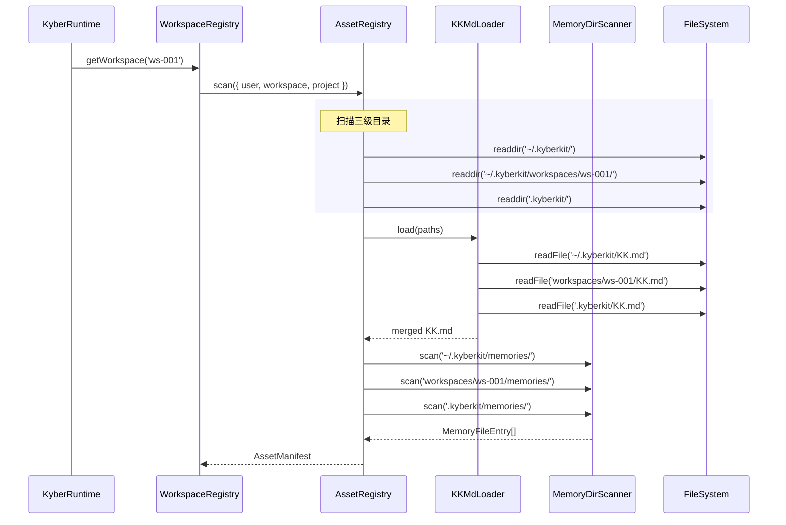

# Sprint 2：用户资产体系 — 详细设计规范 (Detailed Design Spec)

> **版本**: 2.0-sprint2-final
> **范围**: Sprint 1 遗留修复 + Step 4 (AssetRegistry) + Step 5 (PromptAssembler) + Step 6 (Command System)
> **前置依赖**: Sprint 1 (流式基础设施)
> **关键决策**: KK.md 命名 / Workspace 级多租户 / EventBus 不注入 AgentLoop / gray-matter 依赖

---

## 0. Sprint 1 实现评估与遗留债务

### 0.1 实现完成度总览


| Spec 要求                                         | 实现状态                                                   | 评定      |
| ----------------------------------------------- | ------------------------------------------------------ | ------- |
| `StreamEvent` 联合类型 (`src/types/model.ts`)       | 完整匹配 Spec                                              | PASS    |
| `AgentEvent` 联合类型 (`src/types/agent-events.ts`) | 完整匹配 Spec                                              | PASS    |
| `ChatResponse.stopReason` bug 修复                | 已修复                                                    | PASS    |
| `AnthropicProvider.chatStream()`                | raw stream + 手动累加                                      | PASS    |
| `StreamMiddleware` 接口 + `MiddlewarePipeline`    | 同步设计，正确实现                                              | PASS    |
| `TokenCounterMiddleware`                        | 已实现                                                    | PASS    |
| `ContentAccumulatorMiddleware`                  | 存在缺陷 D1/D2                                             | PARTIAL |
| `ToolDispatcherMiddleware`                      | 已实现                                                    | PASS    |
| `agentLoop()` async generator                   | 存在缺陷 D3-D4                                             | PARTIAL |
| `runAgentLoop()` 兼容封装层                          | 已实现                                                    | PASS    |
| `KyberRuntime` 适配                               | `createMiddlewarePipeline()` + `createAgentLoopDeps()` | PASS    |
| `KyberEvents` 流式事件扩充                            | 类型已定义                                                  | PASS    |


### 0.2 已识别缺陷

#### D1: ContentAccumulatorMiddleware 未处理 thinking 内容

**位置**: [ContentAccumulatorMiddleware.ts:48-73](file:///Users/shawn/Data/Kyberkit/src/agent/middleware/ContentAccumulatorMiddleware.ts#L48-L73)

`turn_complete` 处理分支中，`thinkingBuffer` 被累加但未构建到 `context.accumulatedContent`。Spec 要求将 thinking 内容包装为 `<thinking>...</thinking>` 格式。

#### D2: ContentAccumulatorMiddleware 工具输入双重解析

**位置**: [ContentAccumulatorMiddleware.ts:55-68](file:///Users/shawn/Data/Kyberkit/src/agent/middleware/ContentAccumulatorMiddleware.ts#L55-L68)

`turn_complete` 阶段对 `toolUseBuffers` 中的字符串执行 `JSON.parse()`，但 `tool_use_complete` 事件到达时 `context.pendingToolUses` 已写入预解析的对象。两条路径并存导致数据不一致。

#### D3: agentLoop 中 tool_use_complete 映射逻辑分散

**位置**: [AgentLoop.ts:47-48](file:///Users/shawn/Data/Kyberkit/src/agent/AgentLoop.ts#L47-L48) + [AgentLoop.ts:134-151](file:///Users/shawn/Data/Kyberkit/src/agent/AgentLoop.ts#L134-L151)

`tool_use_stop` → `tool_use_complete` 映射硬编码 `toolName=''`, `input=null`，后续 enrichment 逻辑冗余且脆弱。

#### D4: agentLoop 中 L164-L170 Dead Code

空分支 `if (context.accumulatedContent.length === 0)` 无实现。

#### D5: stream 生命周期事件未发射 → 调整为外层消费者职责

**决策**: 对齐 DeepCC 架构 — `agentLoop` 仅通过 `yield` 传递事件，**不依赖 EventBus**。`stream.started` / `stream.completed` 事件由外层消费者 (Sprint 3 TUI / SDK) 在消费 `agentLoop` 事件时发射到 EventBus。此缺陷不在 Sprint 2 修复，转为 Sprint 3 范围。

#### D7: chatStream 缺少单元测试

[AnthropicProvider.test.ts](file:///Users/shawn/Data/Kyberkit/src/model/AnthropicProvider.test.ts) 仅覆盖 `chat()` 方法，完全缺少 `chatStream()` 测试。

### 0.3 测试健康度问题


| 问题                | 详情                                                                                         |
| ----------------- | ------------------------------------------------------------------------------------------ |
| 14 个测试失败          | MemoryStore (3), KevinPrompt (1), SqliteTrajectoryStore (3+), RetryStrategy (1), 编码乱码 (若干) |
| MemoryStore 超时    | SQLite 初始化 await 未 resolve，导致 ~18491s 超时                                                   |
| KevinPrompt 框架不一致 | `vitest` 而非 `bun:test`                                                                     |


---

## 1. Sprint 2 范围定义

### 1.1 Step 0: Sprint 1 遗留修复 + 测试修复 (Carry-Over)


| 修复项                                                                             | 优先级 |
| ------------------------------------------------------------------------------- | --- |
| 修复 14 个失败测试 (MemoryStore / SqliteTrajectoryStore / KevinPrompt / RetryStrategy) | P0  |
| D1: ContentAccumulator thinking 缺失                                              | P0  |
| D2: ContentAccumulator 工具输入双重解析                                                 | P0  |
| D3: StreamEventMapper 重构                                                        | P1  |
| D4: Dead code 清理                                                                | P2  |
| D7: chatStream 单元测试补写                                                           | P1  |
| KevinPrompt.test.ts vitest → bun:test 统一                                        | P1  |


### 1.2 Step 4-6: 用户资产体系 (New Scope)


| Step   | 模块                     | 产出                                 |
| ------ | ---------------------- | ---------------------------------- |
| Step 4 | 用户资产目录 & AssetRegistry | 目录扫描、Workspace 隔离、热更新              |
| Step 5 | 动态 Prompt 组装管线         | PromptAssembler + SectionProviders |
| Step 6 | Command 系统             | CommandRegistry + 内置命令             |


---

## 2. Step 0: Sprint 1 遗留修复 — 详细设计

### 2.1 D1 修复: ContentAccumulatorMiddleware thinking 处理

```typescript
// src/agent/middleware/ContentAccumulatorMiddleware.ts
// turn_complete case 修改:

case 'turn_complete': {
  const content: MessageContent[] = [];

  // 新增: thinking 内容包装
  if (this.thinkingBuffer) {
    content.push({ type: 'text', text: `<thinking>${this.thinkingBuffer}</thinking>` });
  }

  if (this.textBuffer) {
    content.push({ type: 'text', text: this.textBuffer });
  }

  // D2 修复: 从 context.pendingToolUses 构建 (消除双重解析)
  for (const pending of context.pendingToolUses) {
    content.push({
      type: 'tool_use',
      id: pending.id,
      name: pending.name,
      input: pending.input,
    });
  }

  context.accumulatedContent = content;
  this.reset();
  return event;
}
```

### 2.2 D3 修复: StreamEventMapper 抽取

将 `agentLoop` 中分散的 `toolUseBlocks` 追踪和 enrichment 逻辑统一为 `StreamEventMapper` 类:

```typescript
// src/agent/StreamEventMapper.ts [NEW]

export class StreamEventMapper {
  private toolUseBlocks = new Map<string, { name: string; inputJson: string }>();

  mapEvent(streamEvent: StreamEvent): AgentEvent | null {
    switch (streamEvent.type) {
      case 'text_delta':
        return { type: 'text_delta', text: streamEvent.text };
      case 'thinking_delta':
        return { type: 'thinking_delta', text: streamEvent.text };
      case 'tool_use_start':
        this.toolUseBlocks.set(streamEvent.id, { name: streamEvent.name, inputJson: '' });
        return { type: 'tool_use_start', toolUseId: streamEvent.id, toolName: streamEvent.name };
      case 'tool_use_input': {
        const block = this.toolUseBlocks.get(streamEvent.id);
        if (block) block.inputJson += streamEvent.inputFragment;
        return { type: 'tool_use_input', toolUseId: streamEvent.id, fragment: streamEvent.inputFragment };
      }
      case 'tool_use_stop': {
        const b = this.toolUseBlocks.get(streamEvent.id);
        let parsedInput: unknown = {};
        if (b) {
          try { parsedInput = b.inputJson ? JSON.parse(b.inputJson) : {}; } catch { parsedInput = {}; }
        }
        return {
          type: 'tool_use_complete',
          toolUseId: streamEvent.id,
          toolName: b?.name ?? '',
          input: parsedInput,
        };
      }
      case 'usage':
        return {
          type: 'usage',
          usage: streamEvent.usage,
          cumulative: { totalInputTokens: 0, totalOutputTokens: 0, totalCacheCreationTokens: 0, totalCacheReadTokens: 0, turnCount: 0 },
        };
      case 'message_stop':
        return null;
      default:
        return null;
    }
  }

  reset(): void {
    this.toolUseBlocks.clear();
  }
}
```

---

## 3. Workspace 级多租户架构 (贯穿 Step 4-6)

### 3.1 设计决策

采用 **Workspace-Scoped Configuration（方案 A，tenant → workspace）**。每个 workspace 持有独立的 AssetRegistry、PromptAssembler、MemoryStore 实例。

### 3.2 目录结构

```
~/.kyberkit/                        (用户级, 全局默认)
├── KK.md                           (全局行为规范)
├── memories/
│   ├── MEMORY.md                   (索引, 自动维护)
│   └── *.md
├── skills/
│   └── {name}/SKILL.md
└── commands/
    └── *.yaml

workspaces/                         (多 Workspace 隔离)
├── workspace-001/
│   ├── KK.md                       (Workspace 专属行为规范)
│   ├── identity.yaml               (Workspace Identity 定义)
│   ├── memories/                   (Workspace 专属 Memory)
│   ├── skills/
│   └── commands/
├── workspace-002/
│   └── ...

.kyberkit/                          (项目级, 项目根目录)
├── KK.md                           (项目行为规范)
├── memories/
├── skills/
└── commands/
```

### 3.3 三级合并规则

```
优先级 (低 → 高):
  1. 用户级 (~/.kyberkit/)          ← 全局默认
  2. Workspace 级 (workspaces/xxx/) ← Workspace 隔离覆盖
  3. 项目级 (.kyberkit/)            ← 项目粒度覆盖

KK.md: 三级内容依次追加 (用户级 + Workspace 级 + 项目级)
同名 skill/command: 高优先级覆盖低优先级
Memory: 各级独立存储, 查询时合并
```

### 3.4 WorkspaceConfig 类型

> 文件路径: `src/types/workspace.ts` [NEW]

```typescript
/**
 * Workspace 配置 — 定义一个隔离的用户工作空间
 */
export interface WorkspaceConfig {
  /** Workspace 唯一标识 */
  readonly workspaceId: string;
  /** Workspace 显示名称 */
  readonly name: string;
  /** Workspace 专属 Identity prompt (注入到 PromptAssembler) */
  readonly identityPrompt?: string;
  /** Workspace 资产路径 */
  readonly assetPaths: import('./assets.js').AssetPaths;
  /** Workspace 模型配置覆盖 */
  readonly modelConfig?: {
    model?: string;
    apiKey?: string;
  };
  /** 资源配额 */
  readonly quotas?: {
    maxTokensPerSession?: number;
    maxSessionsPerDay?: number;
  };
}

/**
 * Workspace 资产路径配置 (扩展为三级)
 */
export interface WorkspaceAssetPaths {
  /** 用户级: ~/.kyberkit/ */
  user: string;
  /** Workspace 级: ~/.kyberkit/workspaces/{id}/ (可选) */
  workspace?: string;
  /** 项目级: ./.kyberkit/ (可选) */
  project?: string;
}
```

### 3.5 核心隔离架构

```
KyberRuntime (单例, 进程级)
  ├─ WorkspaceRegistry (Workspace 注册表)
  │    ├─ Workspace-001
  │    │    ├─ AssetRegistry (独立实例)
  │    │    ├─ PromptAssembler (独立实例, 注入 Workspace Identity)
  │    │    ├─ CommandRegistry (共享内置命令 + Workspace 自定义)
  │    │    └─ MemoryStore (独立实例, 隔离存储路径)
  │    └─ Workspace-002
  │         └─ ...
  ├─ ModelProvider (共享, 可被 Workspace 配置覆盖)
  └─ EventBus (共享)

每次 agentLoop 调用:
  deps.workspace → 决定使用哪个 AssetRegistry / PromptAssembler / MemoryStore
```

---

## 4. Step 4: 用户资产目录 & AssetRegistry

### 4.1 类型定义

> 文件路径: `src/types/assets.ts` [NEW]

```typescript
export type AssetType = 'kk_md' | 'memory' | 'skill' | 'command';

export type AssetScope = 'user' | 'workspace' | 'project';

export interface AssetEntry {
  readonly id: string;
  readonly type: AssetType;
  readonly scope: AssetScope;
  readonly absolutePath: string;
  readonly relativePath: string;
  content?: string;
  metadata?: Record<string, unknown>;
  lastModified: number;
}

export interface AssetPaths {
  user: string;
  workspace?: string;
  project?: string;
}

export interface AssetManifest {
  entries: AssetEntry[];
  byType: Map<AssetType, AssetEntry[]>;
  scannedAt: number;
}

export interface AssetChangeEvent {
  type: 'added' | 'modified' | 'removed';
  entry: AssetEntry;
}

export interface AssetFilter {
  type?: AssetType;
  scope?: AssetScope;
  pattern?: string;
}
```

### 4.2 AssetRegistry 接口

> 文件路径: `src/assets/AssetRegistry.ts` [NEW]

```typescript
import { AssetPaths, AssetManifest, AssetEntry, AssetFilter, AssetChangeEvent } from '../types/assets.js';
import { Disposable } from '../types/common.js';

export interface AssetRegistry {
  scan(paths: AssetPaths): Promise<AssetManifest>;
  watch(paths: AssetPaths, onChange: (event: AssetChangeEvent) => void): Disposable;
  query(filter: AssetFilter): AssetEntry[];
  getMergedKKMd(): string | null;
  getMemories(): AssetEntry[];
  getManifest(): AssetManifest | null;
}
```

### 4.3 DefaultAssetRegistry 实现伪代码

```
class DefaultAssetRegistry implements AssetRegistry:

  private manifest: AssetManifest | null = null

  async scan(paths: AssetPaths) → AssetManifest:
    entries = []

    // 按优先级顺序扫描 (user → workspace → project)
    for scope, dir of [(user, paths.user), (workspace, paths.workspace), (project, paths.project)]:
      if dir && exists(dir):
        entries.push(...scanDirectory(dir, scope))

    manifest = buildManifest(entries)
    return manifest

  private scanDirectory(root: string, scope: AssetScope) → AssetEntry[]:
    entries = []

    // KK.md (原 AGENTS.md)
    kkPath = join(root, 'KK.md')
    if exists(kkPath):
      entries.push(createEntry('kk_md', scope, kkPath, root))

    // memories/*.md (使用 gray-matter 解析 frontmatter)
    memoriesDir = join(root, 'memories')
    if exists(memoriesDir):
      for file in glob(memoriesDir, '*.md'):
        if basename(file) == 'MEMORY.md': continue
        entry = createEntry('memory', scope, file, root)
        entry.metadata = grayMatter(readFile(file)).data
        entry.content = grayMatter(readFile(file)).content
        entries.push(entry)

    // skills/{name}/SKILL.md
    // commands/*.yaml
    // ... (同上一版 Spec)

    return entries

  getMergedKKMd() → string | null:
    kkEntries = query({ type: 'kk_md' })
    if kkEntries.length == 0: return null

    // 三级合并: user → workspace → project (按 scope 顺序追加)
    scopeOrder = ['user', 'workspace', 'project']
    parts = scopeOrder
      .map(s => kkEntries.find(e => e.scope == s)?.content)
      .filter(Boolean)

    return parts.join('\n\n---\n\n')
```

### 4.4 KKMdLoader

> 文件路径: `src/assets/KKMdLoader.ts` [NEW]

```typescript
export class KKMdLoader {
  /**
   * 加载并合并三级 KK.md
   * 合并策略: 用户级 + workspace 级 + 项目级依次追加
   */
  async load(paths: AssetPaths): Promise<string | null> {
    const contents: string[] = [];

    const sources = [
      { path: paths.user, name: 'user' },
      { path: paths.workspace, name: 'workspace' },
      { path: paths.project, name: 'project' },
    ];

    for (const src of sources) {
      if (!src.path) continue;
      const kkPath = join(src.path, 'KK.md');
      if (await fileExists(kkPath)) {
        contents.push(await readFile(kkPath, 'utf-8'));
      }
    }

    return contents.length > 0 ? contents.join('\n\n---\n\n') : null;
  }
}
```

### 4.5 MemoryDirScanner (使用 gray-matter)

> 文件路径: `src/assets/MemoryDirScanner.ts` [NEW]

```typescript
import matter from 'gray-matter';

export interface MemoryFileEntry {
  path: string;
  metadata: {
    title?: string;
    category?: string;
    tags?: string[];
    createdAt?: string;
    updatedAt?: string;
    source?: 'auto' | 'manual';
  };
  body: string;
}

export class MemoryDirScanner {
  async scan(dirPath: string): Promise<MemoryFileEntry[]> {
    const results: MemoryFileEntry[] = [];

    if (!await dirExists(dirPath)) return results;

    const files = await glob(dirPath, '*.md');
    for (const file of files) {
      if (basename(file) === 'MEMORY.md') continue;

      const raw = await readFile(file, 'utf-8');
      const { data, content } = matter(raw);

      results.push({
        path: file,
        metadata: {
          title: data.title,
          category: data.category,
          tags: data.tags,
          createdAt: data.createdAt,
          updatedAt: data.updatedAt,
          source: data.source,
        },
        body: content,
      });
    }

    return results;
  }
}
```

### 4.6 UML: AssetRegistry 扫描流程




### 4.7 验收标准

- `scan()` 正确扫描三级目录 (user / workspace / project)
- 目录不存在时不报错，返回空 manifest
- 三级 KK.md 内容按 user → workspace → project 顺序追加
- Memory 文件的 YAML frontmatter 由 gray-matter 正确解析
- `query({ type: 'memory' })` 返回所有 memory 条目
- `query({ scope: 'workspace' })` 仅返回 workspace 级资产
- `watch()` 在文件变更后触发 `AssetChangeEvent` 回调
- `watch()` 返回的 `Disposable` 可正确取消监听

---

## 5. Step 5: 动态 Prompt 组装管线

### 5.1 类型定义

> 文件路径: `src/types/prompt.ts` [NEW]

```typescript
export interface PromptSection {
  readonly id: string;
  content: string;
  readonly cacheable: boolean;
  readonly priority: number;
  readonly source: 'system' | 'user' | 'workspace' | 'project' | 'dynamic';
}

export interface AssembledPrompt {
  text: string;
  sections: PromptSection[];
  estimatedTokens: number;
  cacheBreakpoints: number[];  // Sprint 5 使用
}

export interface PromptSectionProvider {
  readonly id: string;
  readonly priority: number;
  readonly cacheable: boolean;
  readonly source: PromptSection['source'];
  provide(context: AssemblyContext): Promise<string | null>;
}

export interface AssemblyContext {
  budget: number;
  cwd?: string;
  tools?: Array<{ name: string; description: string; inputSchema: unknown }>;
  assets?: import('./assets.js').AssetManifest;
  workspaceConfig?: import('./workspace.js').WorkspaceConfig;
}
```

### 5.2 PromptAssembler

> 文件路径: `src/prompt/PromptAssembler.ts` [NEW]

```typescript
export class PromptAssembler {
  private providers: PromptSectionProvider[] = [];

  register(provider: PromptSectionProvider): this {
    this.providers.push(provider);
    this.providers.sort((a, b) => a.priority - b.priority);
    return this;
  }

  async assemble(context: AssemblyContext): Promise<AssembledPrompt> {
    const sections: PromptSection[] = [];
    let totalTokens = 0;

    for (const provider of this.providers) {
      const content = await provider.provide(context);
      if (!content) continue;

      const sectionTokens = estimateTokens(content);

      // Priority 1 无条件保留; 其他在超预算时裁剪
      if (provider.priority > 1 && (totalTokens + sectionTokens) > context.budget) {
        continue;
      }

      sections.push({
        id: provider.id,
        content,
        cacheable: provider.cacheable,
        priority: provider.priority,
        source: provider.source,
      });

      totalTokens += sectionTokens;
    }

    return {
      text: sections.map(s => s.content).join('\n\n'),
      sections,
      estimatedTokens: totalTokens,
      cacheBreakpoints: [],
    };
  }
}

function estimateTokens(text: string): number {
  return Math.ceil(text.length / 3.5);
}
```

### 5.3 Section Providers

#### 5.3.1 IdentityProvider (Priority 1, 必保留)

> 文件路径: `src/prompt/providers/IdentityProvider.ts` [NEW]

```typescript
/**
 * Identity section — 从 WorkspaceConfig 或 KyberConfig 读取。
 * 支持 Workspace 级覆盖: 不同 workspace 可定义不同 Identity。
 */
export class IdentityProvider implements PromptSectionProvider {
  readonly id = 'identity';
  readonly priority = 1;
  readonly cacheable = true;
  readonly source = 'system' as const;

  constructor(
    private readonly defaultPrompt: string,
    private readonly getWorkspaceIdentity?: () => string | undefined,
  ) {}

  async provide(context: AssemblyContext): Promise<string> {
    // Workspace 级 Identity 覆盖
    const wsIdentity = context.workspaceConfig?.identityPrompt
      ?? this.getWorkspaceIdentity?.();

    return wsIdentity ?? this.defaultPrompt;
  }
}
```

#### 5.3.2 ToolSchemaProvider (Priority 1)

> 文件路径: `src/prompt/providers/ToolSchemaProvider.ts` [NEW]

注入 Skill 工作流描述（SKILL.md 内容），而非 tool 的 JSON Schema（后者由 API `tools` 参数传递）。

```typescript
export class ToolSchemaProvider implements PromptSectionProvider {
  readonly id = 'tool_schemas';
  readonly priority = 1;
  readonly cacheable = true;
  readonly source = 'system' as const;

  async provide(context: AssemblyContext): Promise<string | null> {
    if (!context.tools || context.tools.length === 0) return null;

    const lines = ['# Available Tools', ''];
    for (const tool of context.tools) {
      lines.push(`## ${tool.name}`);
      lines.push(tool.description);
      lines.push('');
    }
    return lines.join('\n');
  }
}
```

#### 5.3.3 UserDirectiveProvider (Priority 2, 高优先) — 读取 KK.md

> 文件路径: `src/prompt/providers/UserDirectiveProvider.ts` [NEW]

```typescript
export class UserDirectiveProvider implements PromptSectionProvider {
  readonly id = 'user_directives';
  readonly priority = 2;
  readonly cacheable = true;
  readonly source = 'user' as const;

  constructor(private readonly getKKMd: () => string | null) {}

  async provide(): Promise<string | null> {
    const kkMd = this.getKKMd();
    if (!kkMd) return null;

    return `# User Directives (KK.md)\n\n${kkMd}`;
  }
}
```

#### 5.3.4 MemoryProvider (Priority 3)

> 文件路径: `src/prompt/providers/MemoryProvider.ts` [NEW]

```typescript
export class MemoryProvider implements PromptSectionProvider {
  readonly id = 'memory_context';
  readonly priority = 3;
  readonly cacheable = false;
  readonly source = 'dynamic' as const;

  constructor(private readonly getMemoryContext: () => string) {}

  async provide(): Promise<string | null> {
    const ctx = this.getMemoryContext();
    if (!ctx || ctx.trim().length === 0) return null;
    return `# Memory Context\n\n${ctx}`;
  }
}
```

#### 5.3.5 EnvironmentProvider (Priority 4, 可裁剪)

> 文件路径: `src/prompt/providers/EnvironmentProvider.ts` [NEW]

```typescript
export class EnvironmentProvider implements PromptSectionProvider {
  readonly id = 'environment';
  readonly priority = 4;
  readonly cacheable = false;
  readonly source = 'dynamic' as const;

  async provide(context: AssemblyContext): Promise<string | null> {
    const lines = ['# Environment'];
    if (context.cwd) lines.push(`- Working Directory: ${context.cwd}`);
    lines.push(`- OS: ${process.platform} ${process.arch}`);
    lines.push(`- Time: ${new Date().toISOString()}`);

    try {
      const { execSync } = await import('child_process');
      const branch = execSync('git rev-parse --abbrev-ref HEAD', {
        cwd: context.cwd, encoding: 'utf-8', timeout: 2000,
      }).trim();
      lines.push(`- Git Branch: ${branch}`);
    } catch { /* not a git repo */ }

    return lines.join('\n');
  }
}
```

### 5.4 裁剪优先级

```
Priority 1 (必保留):  Identity + Tool/Skill Descriptions
Priority 2 (高优先):  KK.md (User Directives)
Priority 3 (中优先):  Memory Context
Priority 4 (可裁剪):  Environment Snapshot
```

### 5.5 agentLoop 集成

```typescript
// AgentLoopDeps 扩展 (向后兼容)
export interface AgentLoopDeps {
  agent: DefaultAgentInstance;
  model: ModelProvider;
  tools: ToolIntegrationFacade;
  sandbox: PermissionSandbox;
  pipeline: MiddlewarePipeline;
  reliability: ReliabilityLayer;
  // Sprint 2 新增 (可选)
  promptAssembler?: PromptAssembler;
  commandRegistry?: CommandRegistry;
}

// agentLoop 中每个 turn:
const systemPrompt = deps.promptAssembler
  ? (await deps.promptAssembler.assemble({
      budget: 30000,
      cwd: process.cwd(),
      tools: tools.listAll().map(t => ({ name: t.name, description: 'tool', inputSchema: t.inputSchema })),
    })).text
  : `${agent.definition.systemPrompt ?? ''}\n\n${memoryContext}`;
```

### 5.6 验收标准

- 无 KK.md 时系统正常运行 (Identity + Tools 总能注入)
- 有 KK.md 时内容出现在 system prompt 中
- 有 `memories/` 时相关内容出现在 system prompt 中
- 预算不足时 Environment section (priority 4) 被裁剪
- 无 `promptAssembler` 时 fallback 到旧逻辑
- Workspace 级 Identity 覆盖用户级 Identity
- `estimatedTokens` 值合理

---

## 6. Step 6: Command 系统

### 6.1 类型定义

> 文件路径: `src/types/command.ts` [NEW]

```typescript
export interface CommandResult {
  output: string;
  success: boolean;
  continueConversation: boolean;
}

export interface CommandContext {
  cumulative?: import('../types/agent-events.js').CumulativeUsage;
  assets?: import('./assets.js').AssetManifest;
  cwd: string;
}

export interface Command {
  readonly name: string;
  readonly description: string;
  readonly subcommands?: string[];
  parse?(input: string): Record<string, unknown>;
  execute(args: Record<string, unknown>, context: CommandContext): Promise<CommandResult>;
  isEnabled?(context: CommandContext): boolean;
}
```

### 6.2 CommandRegistry

> 文件路径: `src/commands/CommandRegistry.ts` [NEW]

```typescript
export class CommandRegistry {
  private commands = new Map<string, Command>();

  register(command: Command): this {
    this.commands.set(command.name, command);
    return this;
  }

  isCommand(input: string): boolean {
    return input.trimStart().startsWith('/');
  }

  parseInput(input: string): { name: string; rawArgs: string } | null {
    const trimmed = input.trimStart();
    if (!trimmed.startsWith('/')) return null;
    const withoutSlash = trimmed.slice(1);
    const spaceIndex = withoutSlash.indexOf(' ');
    if (spaceIndex === -1) return { name: withoutSlash, rawArgs: '' };
    return { name: withoutSlash.slice(0, spaceIndex), rawArgs: withoutSlash.slice(spaceIndex + 1).trim() };
  }

  async execute(input: string, context: CommandContext): Promise<CommandResult> {
    const parsed = this.parseInput(input);
    if (!parsed) return { output: 'Invalid command format', success: false, continueConversation: false };

    const command = this.commands.get(parsed.name);
    if (!command) {
      return { output: `Unknown command: /${parsed.name}\nUse /help to see available commands.`, success: false, continueConversation: false };
    }

    if (command.isEnabled && !command.isEnabled(context)) {
      return { output: `Command /${parsed.name} is not available in the current context.`, success: false, continueConversation: false };
    }

    const args = command.parse ? command.parse(parsed.rawArgs) : { _raw: parsed.rawArgs };
    return command.execute(args, context);
  }

  list(): Command[] {
    return Array.from(this.commands.values());
  }
}
```

### 6.3 内置命令


| 命令             | 文件                                       | 描述                |
| -------------- | ---------------------------------------- | ----------------- |
| `/help`        | `src/commands/builtin/HelpCommand.ts`    | 显示所有已注册命令         |
| `/cost`        | `src/commands/builtin/CostCommand.ts`    | 显示 Token 用量和估算费用  |
| `/memory list` | `src/commands/builtin/MemoryCommand.ts`  | 列出 memories/ 目录内容 |
| `/compact`     | `src/commands/builtin/CompactCommand.ts` | 占位 (Sprint 4 实现)  |


命令拦截在 Sprint 2 暂时放在 `agentLoop` 的前置检查中（过渡方案）。Sprint 3 TUI REPL 实现后将移到 REPL Input 层。

### 6.4 验收标准

- `/help` 输出所有已注册命令及描述
- `/cost` 输出 Token 用量和估算费用
- `/memory list` 输出 memories/ 目录内容
- `/compact` 输出占位消息
- `/unknown` 返回 "Unknown command" 错误
- 非 `/` 开头的输入正常走 LLM 路径

---

## 7. KyberRuntime 集成变更

### 7.1 引入 WorkspaceRegistry

```typescript
export class KyberRuntime {
  // ... 现有字段 ...
  private workspaceRegistry!: WorkspaceRegistry;

  async bootstrap(): Promise<void> {
    // ... 现有初始化 1-6 ...

    // 7. Init Workspace Registry
    this.workspaceRegistry = new WorkspaceRegistry();

    // 8. Init default workspace
    const defaultWs = await this.workspaceRegistry.createWorkspace({
      workspaceId: 'default',
      name: 'Default Workspace',
      assetPaths: {
        user: join(homedir(), '.kyberkit'),
        project: join(process.cwd(), '.kyberkit'),
      },
    });
  }

  getWorkspace(id?: string): WorkspaceInstance {
    return this.workspaceRegistry.get(id ?? 'default');
  }
}
```

### 7.2 WorkspaceInstance 封装

```typescript
/**
 * WorkspaceInstance — 一个完整的 Workspace 运行时实例
 * 持有独立的 AssetRegistry / PromptAssembler / CommandRegistry
 */
export class WorkspaceInstance {
  readonly assets: AssetRegistry;
  readonly promptAssembler: PromptAssembler;
  readonly commandRegistry: CommandRegistry;

  constructor(config: WorkspaceConfig, sharedModel: ModelProvider) {
    this.assets = new DefaultAssetRegistry();
    this.promptAssembler = new PromptAssembler()
      .register(new IdentityProvider(config.identityPrompt ?? DEFAULT_IDENTITY))
      .register(new UserDirectiveProvider(() => this.assets.getMergedKKMd()))
      .register(new MemoryProvider(() => /* ... */))
      .register(new EnvironmentProvider());

    this.commandRegistry = new CommandRegistry()
      .register(new HelpCommand(() => this.commandRegistry.list()))
      .register(new CostCommand())
      .register(new MemoryCommand(() => this.assets.getMemories()))
      .register(new CompactCommand());
  }
}
```

---

## 8. 文件变更摘要


| 文件路径                                                   | 操作     | 描述                                                                       |
| ------------------------------------------------------ | ------ | ------------------------------------------------------------------------ |
| **Step 0: Sprint 1 修复**                                |        |                                                                          |
| `src/agent/middleware/ContentAccumulatorMiddleware.ts` | MODIFY | D1+D2 修复                                                                 |
| `src/agent/AgentLoop.ts`                               | MODIFY | D3 (使用 StreamEventMapper) + D4 (清理) + 集成 PromptAssembler/CommandRegistry |
| `src/agent/StreamEventMapper.ts`                       | NEW    | D3 重构: StreamEvent → AgentEvent 统一映射                                     |
| `src/model/AnthropicProvider.test.ts`                  | MODIFY | D7: 补写 chatStream 测试                                                     |
| `src/intelligence/KevinPrompt.test.ts`                 | MODIFY | vitest → bun:test                                                        |
| 14 个失败测试修复                                             | MODIFY | MemoryStore / SqliteTrajectoryStore / RetryStrategy                      |
| **Step 4: AssetRegistry**                              |        |                                                                          |
| `src/types/assets.ts`                                  | NEW    | AssetEntry / AssetPaths / AssetManifest 类型                               |
| `src/types/workspace.ts`                               | NEW    | WorkspaceConfig / WorkspaceAssetPaths                                    |
| `src/assets/AssetRegistry.ts`                          | NEW    | scan / query / watch / getMergedKKMd                                     |
| `src/assets/KKMdLoader.ts`                             | NEW    | KK.md 三级加载与合并                                                            |
| `src/assets/MemoryDirScanner.ts`                       | NEW    | memories/ 扫描 + gray-matter 解析                                            |
| **Step 5: PromptAssembler**                            |        |                                                                          |
| `src/types/prompt.ts`                                  | NEW    | PromptSection / AssembledPrompt 类型                                       |
| `src/prompt/PromptAssembler.ts`                        | NEW    | register / assemble                                                      |
| `src/prompt/providers/IdentityProvider.ts`             | NEW    | Identity (priority 1, Workspace 覆盖)                                      |
| `src/prompt/providers/ToolSchemaProvider.ts`           | NEW    | Tool/Skill schemas (priority 1)                                          |
| `src/prompt/providers/UserDirectiveProvider.ts`        | NEW    | KK.md (priority 2)                                                       |
| `src/prompt/providers/MemoryProvider.ts`               | NEW    | Memory context (priority 3)                                              |
| `src/prompt/providers/EnvironmentProvider.ts`          | NEW    | Environment info (priority 4)                                            |
| **Step 6: Command System**                             |        |                                                                          |
| `src/types/command.ts`                                 | NEW    | Command / CommandResult 类型                                               |
| `src/commands/CommandRegistry.ts`                      | NEW    | 命令注册、解析、执行                                                               |
| `src/commands/builtin/HelpCommand.ts`                  | NEW    | /help                                                                    |
| `src/commands/builtin/CostCommand.ts`                  | NEW    | /cost                                                                    |
| `src/commands/builtin/MemoryCommand.ts`                | NEW    | /memory                                                                  |
| `src/commands/builtin/CompactCommand.ts`               | NEW    | /compact 占位                                                              |
| **Runtime 集成**                                         |        |                                                                          |
| `src/runtime/KyberRuntime.ts`                          | MODIFY | 增加 WorkspaceRegistry + PromptAssembler + CommandRegistry + createSession() |
| `src/runtime/WorkspaceInstance.ts`                     | NEW    | Workspace 封装                                                              |
| `src/runtime/WorkspaceRegistry.ts`                     | NEW    | Workspace 注册表                                                             |
| `src/runtime/AgentSession.ts`                          | NEW    | L3 Session 层 — 统一应用级入口（见下）                                               |
| `src/runtime/AgentSession.test.ts`                     | NEW    | Session 层单元测试 (13 项)                                                      |


**新增**: 22 个文件 | **修改**: 7 个文件

---

## 9. 测试策略

### 9.1 Step 0 修复

- D1: 新增 thinking 累加测试
- D2: 新增工具输入一致性测试
- D7: 4 组 chatStream 测试 (纯文本 / tool_use / thinking / usage)
- 14 个失败测试逐一修复

### 9.2 Step 4 测试

- `AssetRegistry.test.ts`: 空目录、三级合并、query 过滤
- `MemoryDirScanner.test.ts`: gray-matter 解析、skip MEMORY.md
- `KKMdLoader.test.ts`: 三级 KK.md 合并

### 9.3 Step 5 测试

- `PromptAssembler.test.ts`: 空/满/超预算场景
- 各 Provider 单测: null 返回、内容正确性
- Workspace Identity 覆盖测试

### 9.4 Step 6 测试

- `CommandRegistry.test.ts`: isCommand / parseInput / execute / unknown
- 各内置命令单测

---

## 10. 外部依赖


| 依赖            | 用途                      | 状态     |
| ------------- | ----------------------- | ------ |
| `gray-matter` | Markdown frontmatter 解析 | **新增** |


文件监听使用 `fs.watch` (Node.js 内置)，不引入 `chokidar`。

---

## 11. L3 Session 层架构 (AgentSession)

> **实现时机**: Sprint 2 后期，基于架构评估补充。

### 11.1 定位与职责

`AgentSession` 是 L3 会话层，位于 `KyberRuntime`（L2 组件装配）之上，所有消费者（TUI / 脚本 / SDK）之下。

```
L4: 消费者  repl-test / stream-test / Sprint 3 TUI / SDK
L3: Session AgentSession  ← send() / close() / 事件流
L2: Runtime KyberRuntime  ← bootstrap() / createSession()
L1: 原语    ModelProvider / ToolFacade / AssetRegistry / PromptAssembler
```

职责范围：

- 会话生命周期（create / multi-turn send / close）
- ReliabilityLayer 装配（`buildReliability()` helper，支持 `real` / `inmemory` 模式）
- 多轮状态复位（每次 `send()` 前将 `completed` 重置为 `running`）
- 对外暴露统一 `AsyncIterable<AgentEvent>` 事件流

**不承担**：Prompt 合成、工具执行、资产扫描、UI 渲染。

### 11.2 公开 API

```typescript
// src/runtime/AgentSession.ts
export interface CreateSessionOptions {
  workspaceId?: string;
  agentId?: string;
  reliability?: 'real' | 'inmemory' | ReliabilityLayer;
  middleware?: MiddlewarePipeline;
}

export class AgentSession {
  readonly id: string;
  readonly agent: DefaultAgentInstance;
  send(input: string, opts?: { signal?: AbortSignal }): AsyncGenerator<AgentEvent>;
  close(): Promise<void>;
}

// KyberRuntime — 唯一工厂
runtime.createSession(opts?: CreateSessionOptions): Promise<AgentSession>
```

环境变量 `KYBER_RELIABILITY=real|inmemory` 控制默认 reliability 模式（默认 `real`）。

### 11.3 后续 Sprint 挂载点

| Sprint | 挂载点 | 说明 |
|--------|--------|------|
| Sprint 3 TUI | `session.send()` 事件流 → `<REPL>` | TUI 只关心渲染，无需接触 middleware / deps |
| Sprint 4 压缩/记忆 | `opts.middleware` 注入 `CompactionGuardMiddleware` / `MemoryTriggerMiddleware` | 对外契约不变 |
| Sprint 5 Hook | `AgentSession` 增加 `onTurnStart/onTurnComplete/onError` hook 点 | 复用事件流衍生，无需改 `send()` 签名 |
| Sprint 6 Coordinator | `Coordinator` 实现相同 `send()` / `close()` 契约，对内 fan-out 到子 session | |

---

## 12. 决策记录 (Decision Log)


| #   | 决策                                                                      | 来源                                           |
| --- | ----------------------------------------------------------------------- | -------------------------------------------- |
| 1   | `AGENTS.md` → `**KK.md`**                                               | User Review                                  |
| 2   | 多租户: **方案 A, tenant → workspace**                                       | User Review (Workspace-Scoped Configuration) |
| 3   | EventBus: **不注入 AgentLoopDeps**, agentLoop 仅 yield, 外层消费者发射 EventBus 事件 | User Review + DeepCC 逆向分析                    |
| 4   | frontmatter: **引入 gray-matter**                                         | User Review                                  |
| 5   | 测试失败: **Sprint 2 Step 0 优先修复**                                          | User Review                                  |
| 6   | IdentityProvider: **从 WorkspaceConfig / KyberConfig 读取** (非硬编码)         | Multi-tenancy 方案 A                           |
| 7   | D5 (stream 事件): **转为 Sprint 3 范围** (外层消费者职责)                            | DeepCC 对齐                                    |


