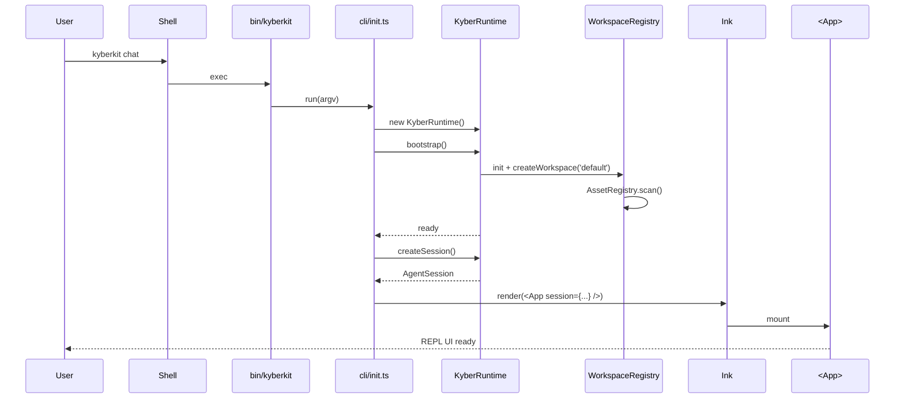
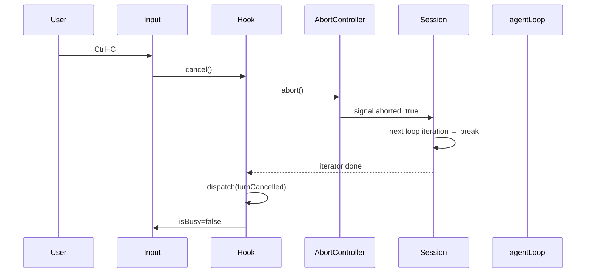

# Sprint 3：TUI 交互层 — 详细设计规范 (Detailed Design Spec)

> **版本**: 2.0-sprint3-draft
> **范围**: Sprint 2 遗留修复 (Step 0) + Step 7 (终端 REPL / Ink TUI) + D5 流生命周期事件外置
> **前置依赖**: Sprint 1 (流式基础设施) + Sprint 2 (用户资产体系 + AgentSession L3)
> **关键决策**: Ink (React for Terminal) / 外层消费者承担 EventBus 发射 / 命令拦截退出 AgentLoop

---

## 0. 概述 (Overview)

### 0.1 问题陈述 (Problem Statement)

经过 Sprint 1-2 的基础设施建设，KyberKit 已具备：

- **流式 Agent Loop** (Sprint 1) — `agentLoop()` 异步生成器 + Middleware Pipeline
- **用户资产体系** (Sprint 2) — `AssetRegistry` / `PromptAssembler` / `CommandRegistry` / `WorkspaceInstance`
- **L3 Session 层** (Sprint 2) — `AgentSession.send()` 统一事件流 API

但**用户尚无法直接交互**。当前唯一入口是 `scripts/repl-test.ts` —— 一个手写 `readline` 的测试脚本，不具备：

1. **流式增量渲染** 的结构化 UI 组件；
2. **工具调用可视化** (展开/折叠、错误高亮、结果预览)；
3. **状态栏** (模型、Token 累计、Workspace、Session ID)；
4. **命令自动补全** / 历史记录 / 多行输入；
5. **中断控制** (Ctrl+C 取消当前 turn 而不退出 REPL)；
6. **CLI 入口脚本** (`kyberkit chat` 可执行命令)。

同时，Sprint 2 评审 (`docs/reviews/sprint2-implementation-review.md`) 识别的 **P0/P1 问题**亟需在 Sprint 3 前置修复，否则 TUI 场景下会放大风险（例如命令拦截导致 `agent.status = 'completed'` 后，REPL 的下一轮 `send()` 依赖状态复位，一旦逻辑偏差会出现"单命令后无法继续对话"的体验故障）。

### 0.2 目标 (Goal)

1. **Day 1 体验闭环**：用户执行 `bun run kyberkit` 即进入可用的流式 TUI，支持自然语言对话 + 斜杠命令 + 工具调用可视化。
2. **AgentSession 消费者典范**：TUI 作为 `AgentSession.send()` 事件流的**第一个正式消费者**，落地 D5 外层 EventBus 发射契约 (`stream.started/completed/error`)，为未来 SDK 消费者提供参考实现。
3. **修复 Sprint 2 遗留 P0/P1 问题**：确保命令拦截、AssetRegistry watch、文件 mtime、skills/commands 扫描均达验收标准。

### 0.3 设计原则 (Design Principles)

- **渲染/状态分离**：Ink 组件只负责渲染；会话状态由 React Hook (`useSession`) 封装 `AgentSession` 事件流。
- **事件驱动 UI**：不通过"轮询"或"直接读 agent.messages"更新视图；所有 UI 状态均来自 `AgentEvent` 流。
- **无阻塞 I/O**：Ctrl+C 通过 `AbortController` 取消当前 turn，事件流及时 `break`，不杀进程。
- **最小依赖**：仅引入 Ink + React 最必要集合，避免 `chokidar`/`commander` 之外的重量级库（Sprint 4+ 再按需扩展）。
- **向后兼容**：`scripts/repl-test.ts` 保留作为低阶冒烟测试入口；TUI 不替代它。

---

## 1. Sprint 3 范围定义

| Step                | 内容                                                                  | 前置依赖   |
| ------------------- | ------------------------------------------------------------------- | ------ |
| **Step 0** (carry)  | Sprint 2 P0/P1 遗留修复 (D7 / 命令拦截生命周期 / watch 事件 / mtime / skills 扫描) | Sprint 2 |
| **Step 7.1**        | CLI 入口 & Ink App 骨架 (`bin/kyberkit` + `src/cli/init.ts` + `App.tsx`) | Step 0 |
| **Step 7.2**        | REPL 核心组件 (`<REPL>` + `useSession` + `<PromptInput>`)                | Step 7.1 |
| **Step 7.3**        | 流式输出与工具调用可视化 (`<TranscriptView>` + `<ToolCallRenderer>`)            | Step 7.2 |
| **Step 7.4**        | 状态栏 & 快捷键 (`<StatusBar>` + Ctrl+C / Esc / ↑↓ 历史)                    | Step 7.3 |
| **Step 7.5** (D5)   | 外层 EventBus 发射 (`stream.started/completed/error`)                    | Step 7.2 |

---

## 2. Step 0: Sprint 2 遗留修复 — 详细设计

### 2.1 D7: `AnthropicProvider.chatStream()` 单元测试 (P0)

**问题**: Sprint 1/2 累积的 Anthropic 流式实现无独立单元测试，回归风险高。

**修复**:

在 `src/model/AnthropicProvider.test.ts` 补写 4 组流式测试：

```typescript
describe('AnthropicProvider.chatStream()', () => {
  it('yields text_delta + message_stop + usage for pure text response', async () => {
    const mockStream = makeRawStream([
      { type: 'message_start', message: { usage: { input_tokens: 10, output_tokens: 0 } } },
      { type: 'content_block_start', index: 0, content_block: { type: 'text', text: '' } },
      { type: 'content_block_delta', index: 0, delta: { type: 'text_delta', text: 'Hello' } },
      { type: 'content_block_delta', index: 0, delta: { type: 'text_delta', text: ' world' } },
      { type: 'content_block_stop', index: 0 },
      { type: 'message_delta', delta: { stop_reason: 'end_turn' }, usage: { output_tokens: 3 } },
      { type: 'message_stop' },
    ]);
    const events = await collect(provider.chatStream({ model: 'claude-sonnet-4', messages: [] }));

    expect(events.filter(e => e.type === 'text_delta').map(e => e.text)).toEqual(['Hello', ' world']);
    expect(events.at(-2)).toEqual({ type: 'message_stop', stopReason: 'end_turn' });
    expect(events.at(-1)).toMatchObject({ type: 'usage', usage: { inputTokens: 10, outputTokens: 3 } });
  });

  it('yields tool_use_start / tool_use_input / tool_use_stop for tool_use response', async () => { /* ... */ });
  it('yields thinking_delta for extended thinking content', async () => { /* ... */ });
  it('accumulates cache_creation_input_tokens and cache_read_input_tokens', async () => { /* ... */ });
});

/** 辅助: 构造符合 Anthropic SDK Stream 接口的 mock 异步迭代器 */
function makeRawStream(events: RawMessageStreamEvent[]): AsyncIterable<RawMessageStreamEvent> {
  return { async *[Symbol.asyncIterator]() { for (const e of events) yield e; } };
}
async function collect<T>(it: AsyncIterable<T>): Promise<T[]> {
  const out: T[] = []; for await (const e of it) out.push(e); return out;
}
```

`AnthropicProvider.chatStream()` 的 `this.client.messages.create({ stream: true })` 以 DI 形式允许测试替换（现有实现已支持 `clientOverride` 参数则直接复用；若未支持，在测试中 Mock 整个 `this.client`）。

**验收**:
- 4 组测试全部通过；覆盖 `text / tool_use / thinking / cache_usage` 四条核心路径。
- `bun test src/model/AnthropicProvider.test.ts` 运行时间 < 2s。

---

### 2.2 命令拦截生命周期修复 (P0)

**问题**: Sprint 2 实现中，`agentLoop` 前置检测到斜杠命令后调用 `agent.transition('task_done')`，将 `agent.status` 置为 `completed`。虽然 `AgentSession.send()` 在下一轮会执行 `status = 'running'` 复位，但：

1. 发射了虚假的 `TurnComplete` / 校验流水线事件，污染事件流；
2. 提前 `task_done` 让 `VerificationPipeline` 错误执行一次；
3. 未来多消费者（TUI + SDK 同时订阅）场景下状态机语义难以对齐。

**修复方向**: **命令不进入 AgentLoop**。把命令拦截上移到 `AgentSession.send()`：

```typescript
// src/runtime/AgentSession.ts — send() 改造
async *send(input: string, opts?: { signal?: AbortSignal }): AsyncGenerator<AgentEvent> {
  if (opts?.signal?.aborted) return;

  // [NEW] 斜杠命令拦截 — 不进入 agentLoop，不触碰 agent.status
  const cmdRegistry = this.deps.commandRegistry;
  if (cmdRegistry?.isCommand(input)) {
    const result = await cmdRegistry.execute(input, {
      cumulative: this.currentCumulative(),
      assets: this.deps.workspace?.assets.getManifest() ?? undefined,
      cwd: process.cwd(),
    });
    yield { type: 'text_delta', text: result.output };
    yield { type: 'turn_complete', turnNumber: this.nextTurnNumber(), stopReason: 'end_turn', content: [] };
    return;
  }

  this.agent.addMessage('user', input);
  if (this.agent.status === 'completed' || this.agent.status === 'completing') {
    this.agent.status = 'running';
  }
  for await (const event of agentLoop(this.deps)) {
    if (opts?.signal?.aborted) break;
    yield event;
  }
}
```

**副作用移除**: 删除 `AgentLoop.ts` 中所有 `commandRegistry.isCommand(...)` 前置分支与其相关 `transition('task_done')` 调用。`commandRegistry` 字段从 `AgentLoopDeps` 中**标记为 deprecated** 但保留，避免破坏兼容签名（Sprint 4 清理）。

**验收**:
- 在 TUI/REPL 中连续执行 `"/help"` → `"你好"` → `"/cost"` → `"继续上文"`，agent 消息历史正确累积，无虚假 `task_done` 转换。
- 新增测试 `AgentSession.test.ts` — `handles slash command without touching agent lifecycle`：执行 `/help` 后 `agent.status === 'running'`、`agent.messages.length === 0`。

---

### 2.3 `AssetRegistry.watch()` 触发 AssetChangeEvent (P1)

**问题**: 当前 `watch()` 仅完成 `fs.watch` 注册，回调体为空。

**修复**:

```typescript
// src/assets/AssetRegistry.ts — watch() 改造
watch(paths: AssetPaths, onChange: (event: AssetChangeEvent) => void): Disposable {
  const watchers: FSWatcher[] = [];

  const watchScope = (scope: AssetScope, root: string | undefined) => {
    if (!root || !existsSync(root)) return;
    const w = fs.watch(root, { recursive: true }, (eventType, filename) => {
      if (!filename) return;
      const absolutePath = join(root, filename);
      const entry = this.buildEntryFromPath(absolutePath, scope, root);
      if (!entry) return; // 非资产文件 (忽略)

      const existing = this.manifest?.entries.find(e => e.absolutePath === absolutePath);

      if (eventType === 'rename' && !existsSync(absolutePath)) {
        if (existing) {
          this.removeFromManifest(existing);
          onChange({ type: 'removed', entry: existing });
        }
        return;
      }

      const isAdded = !existing;
      const refreshed = this.reloadEntry(entry);
      this.upsertManifest(refreshed);
      onChange({ type: isAdded ? 'added' : 'modified', entry: refreshed });
    });
    watchers.push(w);
  };

  watchScope('user', paths.user);
  watchScope('workspace', paths.workspace);
  watchScope('project', paths.project);

  return { dispose: () => watchers.forEach(w => w.close()) };
}
```

**去抖策略**: `fs.watch` 在多数平台会对单次文件保存触发 2-3 次 `rename`/`change`。采用 50ms 去抖 (`Map<absolutePath, NodeJS.Timeout>`) 合并同一文件的连续事件，只在最后一次触发 `onChange`。

**验收**:
- `AssetRegistry.test.ts` 新增场景：创建文件 → 触发 `added`；修改 → `modified`；删除 → `removed`；去抖后单次修改仅回调一次。

---

### 2.4 `lastModified` 使用真实 mtime (P1)

**问题**: `buildEntryFromPath` 内使用 `Date.now()`，在 watch/compare 场景下不准确。

**修复**:

```typescript
// src/assets/AssetRegistry.ts — scanDirectory 中
const stat = await stat(absolutePath);
entries.push({
  ...createEntry(type, scope, absolutePath, root),
  lastModified: stat.mtimeMs,  // 真实 mtime
});
```

同步扫描路径也统一为异步 `fs.promises.stat`。

**验收**: `AssetRegistry.test.ts` 新增断言：`entry.lastModified` 与 `stat.mtimeMs` 完全一致。

---

### 2.5 Skills / Commands 目录扫描补全 (P1)

**问题**: `scanDirectory` 仅扫描 `KK.md` 与 `memories/`，遗漏 `skills/{name}/SKILL.md` 与 `commands/*.yaml`。

**修复**:

```typescript
// scanDirectory 增补 (伪代码)
const skillsDir = join(root, 'skills');
if (existsSync(skillsDir)) {
  for (const sub of await readdir(skillsDir)) {
    const skillFile = join(skillsDir, sub, 'SKILL.md');
    if (existsSync(skillFile)) {
      const entry = await createEntry('skill', scope, skillFile, root);
      entry.metadata = matter(await readFile(skillFile, 'utf-8')).data;
      entry.content = matter(await readFile(skillFile, 'utf-8')).content;
      entries.push(entry);
    }
  }
}

const commandsDir = join(root, 'commands');
if (existsSync(commandsDir)) {
  for (const file of await glob(commandsDir, '*.yaml')) {
    const entry = await createEntry('command', scope, file, root);
    entry.metadata = yaml.parse(await readFile(file, 'utf-8'));
    entries.push(entry);
  }
}
```

`AssetEntry.metadata` 字段沿用 Sprint 2 类型；YAML 解析复用已安装的 `yaml` 依赖。

**验收**:
- `AssetRegistry.scan()` 返回的 manifest 中包含 `type: 'skill'` / `type: 'command'` 的条目。
- `query({ type: 'skill' })` 正确返回。

---

### 2.6 Step 0 验收清单

- [ ] D7: 4 组 `chatStream()` 单元测试全部通过。
- [ ] 命令不再调用 `agent.transition('task_done')`；`AgentSession` 层拦截。
- [ ] `watch()` 完整触发 `added/modified/removed` 事件，50ms 去抖。
- [ ] `AssetEntry.lastModified` 使用真实 `mtime`。
- [ ] `AssetRegistry` 扫描覆盖 KK.md / memories / skills / commands 四类资产。
- [ ] 全量 `bun test` 绿色 (≥ 121 用例)。

---

## 3. TUI 架构总览

### 3.1 进程启动链路

```
┌──────────────────────────────────────────────────────────────┐
│  shell:  bun run kyberkit                                   │
│          └─ bin/kyberkit          (#!/usr/bin/env bun)       │
│              └─ src/cli/init.ts   (Commander 子命令派发)     │
│                  └─ chat subcommand                          │
│                      ├─ await KyberRuntime.bootstrap()       │
│                      ├─ await runtime.createSession()        │
│                      └─ Ink render(<App session={...} />)    │
└──────────────────────────────────────────────────────────────┘
```

### 3.2 组件拓扑

```
<App>                          // 全局 Context Provider (session, runtime, bus)
  └─ <REPL>                    // 主交互面板
       ├─ <TranscriptView />   // 滚动的历史消息 (turn 堆叠)
       │    └─ <TurnRenderer />  // 单轮消息 (user input + assistant streaming + tools)
       │         ├─ <StreamingText />    // text_delta 实时增量
       │         ├─ <ThinkingBlock />    // thinking_delta (dim/italic, 可折叠)
       │         └─ <ToolCallRenderer /> // tool_use_start → tool_result 生命周期
       ├─ <StatusBar />        // 底部栏: model / tokens / cost / workspace / hint
       └─ <PromptInput />      // ink-text-input + 斜杠命令自动补全 + ↑↓ 历史
```

### 3.3 数据流

```
  PromptInput.onSubmit(text)
      │
      ▼
  useSession.send(text)   ← Hook 封装 session.send() 并 reducer 更新 state
      │
      ▼ (async generator)
  AgentEvent 流
      │
      ├── dispatch('TEXT_DELTA')      → 更新当前 turn 的 assistant text
      ├── dispatch('THINKING_DELTA')  → 更新 thinking buffer
      ├── dispatch('TOOL_START')      → 插入 pending tool card
      ├── dispatch('TOOL_RESULT')     → 填入 tool card 结果
      ├── dispatch('USAGE')           → StatusBar cumulative 更新
      ├── dispatch('TURN_COMPLETE')   → 当前 turn 定稿, 开启下一轮可输入
      └── dispatch('ERROR')           → toast / inline error banner

  同时:
  bus.emit('stream.started', { agentId, turnNumber })    (Step 7.5 D5)
  bus.emit('stream.completed', { agentId, turnNumber, stopReason })
```

---

## 4. Step 7.1: CLI 入口 & Ink App 骨架

### 4.1 bin/kyberkit

> 文件路径: `bin/kyberkit` [NEW]

```bash
#!/usr/bin/env bun
import('../src/cli/init.js').then(m => m.run(process.argv.slice(2))).catch(err => {
  console.error('[kyberkit] fatal:', err);
  process.exit(1);
});
```

添加到 `package.json.bin`:

```json
{
  "bin": { "kyberkit": "bin/kyberkit" }
}
```

### 4.2 CLI 入口扩展

> 文件路径: `src/cli/init.ts` [MODIFY]

保留现有 `init` 命令（Sprint 0 已实现），新增 `chat` 子命令。采用**手写轻量 argv 解析**（不引入 `commander` 以保持零依赖）：

```typescript
// src/cli/init.ts
export async function run(argv: string[]): Promise<void> {
  const [cmd, ...rest] = argv;

  switch (cmd) {
    case 'init':        return runInit(rest);
    case 'chat':
    case undefined:     return runChat(rest);   // 默认即 chat
    case '--help':
    case '-h':          return printUsage();
    case '--version':
    case '-v':          return printVersion();
    default:
      console.error(`Unknown command: ${cmd}`);
      printUsage();
      process.exit(1);
  }
}

async function runChat(argv: string[]): Promise<void> {
  const { runtime, session } = await bootstrapSession(argv);
  const { render } = await import('ink');
  const React = await import('react');
  const { App } = await import('../tui/App.js');

  const { waitUntilExit } = render(React.createElement(App, { runtime, session }));
  await waitUntilExit();
  await session.close();
}
```

**解析的 flag** (chat 子命令):

| Flag              | 默认值        | 说明                              |
| ----------------- | ---------- | ------------------------------- |
| `--workspace <id>` | `default` | 指定 workspace                    |
| `--model <name>`   | 配置值      | 临时覆盖模型                          |
| `--reliability <mode>` | `real`  | `real` / `inmemory`              |
| `--no-tui`         | false      | 回退到 readline 模式（复用 `scripts/repl-test.ts` 主体逻辑） |

### 4.3 App 组件

> 文件路径: `src/tui/App.tsx` [NEW]

```typescript
import React from 'react';
import { Box } from 'ink';
import { SessionContext } from './contexts/SessionContext.js';
import { REPL } from './REPL.js';
import type { KyberRuntime } from '../runtime/KyberRuntime.js';
import type { AgentSession } from '../runtime/AgentSession.js';

export interface AppProps {
  runtime: KyberRuntime;
  session: AgentSession;
}

export const App: React.FC<AppProps> = ({ runtime, session }) => (
  <SessionContext.Provider value={{ runtime, session }}>
    <Box flexDirection="column" width="100%" height="100%">
      <REPL />
    </Box>
  </SessionContext.Provider>
);
```

### 4.4 依赖

| 依赖                    | 用途                        | 状态   |
| --------------------- | ------------------------- | ---- |
| `ink`                 | Terminal React 渲染          | 新增   |
| `react`               | Ink 的 peer dependency      | 新增   |
| `ink-text-input`      | 受控文本输入组件                    | 新增   |
| `@types/react`        | 类型                          | 新增   |
| `ink-spinner`         | Thinking / 工具加载指示          | 新增 (轻量) |

Bun 对 Ink/React 的 ESM 兼容性已良好；无需额外构建配置（开发时 `bun run` 直接跑 `.tsx`）。

---

## 5. Step 7.2: REPL 核心 — useSession Hook + PromptInput

### 5.1 State Reducer

> 文件路径: `src/tui/state/sessionReducer.ts` [NEW]

```typescript
export type TurnState = {
  turnNumber: number;
  userInput: string;
  thinking: string;
  assistantText: string;
  toolCalls: ToolCallState[];
  status: 'streaming' | 'executing_tools' | 'done' | 'error';
  error?: string;
  stopReason?: StopReason;
};

export type ToolCallState = {
  toolUseId: string;
  toolName: string;
  inputFragment: string;          // 流式累积的 JSON 片段
  input?: unknown;                // 解析完成后填入
  result?: string;
  isError?: boolean;
  status: 'pending' | 'running' | 'done' | 'error';
};

export type REPLState = {
  turns: TurnState[];
  cumulative: CumulativeUsage;
  currentTurn: number | null;     // null = 等待用户输入
  inputHistory: string[];         // ↑↓ 切换
};

export type REPLAction =
  | { kind: 'userInput'; text: string }
  | { kind: 'agentEvent'; event: AgentEvent }
  | { kind: 'turnCancelled' }
  | { kind: 'resetError' };

export function replReducer(state: REPLState, action: REPLAction): REPLState {
  switch (action.kind) {
    case 'userInput': {
      const turn: TurnState = {
        turnNumber: state.turns.length + 1,
        userInput: action.text,
        thinking: '',
        assistantText: '',
        toolCalls: [],
        status: 'streaming',
      };
      return {
        ...state,
        turns: [...state.turns, turn],
        currentTurn: turn.turnNumber,
        inputHistory: [...state.inputHistory, action.text].slice(-50),
      };
    }
    case 'agentEvent':
      return applyAgentEvent(state, action.event);
    case 'turnCancelled':
      return patchCurrentTurn(state, { status: 'error', error: 'Cancelled (Ctrl+C)' });
    case 'resetError':
      return { ...state, turns: state.turns.map(t => ({ ...t, error: undefined })) };
  }
}
```

**`applyAgentEvent`** 是核心映射函数，处理 9 种 `AgentEvent` 类型 → `TurnState` 字段增量更新：

| AgentEvent               | State 变更                                                            |
| ------------------------ | ------------------------------------------------------------------- |
| `text_delta`             | `currentTurn.assistantText += event.text`                            |
| `thinking_delta`         | `currentTurn.thinking += event.text`                                 |
| `tool_use_start`         | push `ToolCallState(status='pending')`                               |
| `tool_use_input`         | 更新对应 toolCall 的 `inputFragment += event.fragment`                    |
| `tool_use_complete`      | 对应 toolCall: `status='running'`, `input=event.input`                 |
| `tool_result`            | 对应 toolCall: `status=isError ? 'error' : 'done'`, `result`, `isError` |
| `usage`                  | `cumulative = event.cumulative`                                      |
| `turn_complete`          | `currentTurn.status='done'`, `stopReason=event.stopReason`, `currentTurn=null` |
| `error`                  | `currentTurn.status='error'`, `error=event.error.message`            |

### 5.2 useSession Hook

> 文件路径: `src/tui/hooks/useSession.ts` [NEW]

```typescript
import { useReducer, useRef, useContext, useCallback } from 'react';
import { SessionContext } from '../contexts/SessionContext.js';
import { replReducer, initialState } from '../state/sessionReducer.js';

export function useSession() {
  const { session, runtime } = useContext(SessionContext)!;
  const [state, dispatch] = useReducer(replReducer, initialState());
  const abortRef = useRef<AbortController | null>(null);
  const busyRef = useRef(false);

  const send = useCallback(async (text: string) => {
    if (busyRef.current) return;            // 防止并发 send
    if (!text.trim()) return;
    busyRef.current = true;

    const controller = new AbortController();
    abortRef.current = controller;

    dispatch({ kind: 'userInput', text });

    // D5: 外层发射 stream.started
    runtime.eventBus.emit('stream.started', {
      agentId: session.agent.id,
      turnNumber: state.turns.length + 1,
    });

    try {
      let lastStopReason: StopReason = 'end_turn';
      for await (const event of session.send(text, { signal: controller.signal })) {
        dispatch({ kind: 'agentEvent', event });
        if (event.type === 'turn_complete') lastStopReason = event.stopReason;
      }
      runtime.eventBus.emit('stream.completed', {
        agentId: session.agent.id, turnNumber: state.turns.length + 1,
        stopReason: lastStopReason,
      });
    } catch (err) {
      runtime.eventBus.emit('stream.error', {
        agentId: session.agent.id, turnNumber: state.turns.length + 1,
        error: err as Error,
      });
      dispatch({ kind: 'agentEvent', event: { type: 'error', error: err as Error, recoverable: false } });
    } finally {
      busyRef.current = false;
      abortRef.current = null;
    }
  }, [session, runtime, state.turns.length]);

  const cancel = useCallback(() => {
    abortRef.current?.abort();
    dispatch({ kind: 'turnCancelled' });
  }, []);

  return { state, send, cancel, isBusy: busyRef.current };
}
```

### 5.3 PromptInput 组件

> 文件路径: `src/tui/components/PromptInput.tsx` [NEW]

```typescript
import React, { useState } from 'react';
import { Box, Text, useInput } from 'ink';
import TextInput from 'ink-text-input';

export interface PromptInputProps {
  disabled: boolean;
  onSubmit: (text: string) => void;
  history: string[];
  onCancel?: () => void;
  commandSuggestions: string[];   // ['help', 'cost', 'memory', 'compact', 'quit']
}

export const PromptInput: React.FC<PromptInputProps> = ({
  disabled, onSubmit, history, onCancel, commandSuggestions,
}) => {
  const [value, setValue] = useState('');
  const [historyIdx, setHistoryIdx] = useState(history.length);

  useInput((input, key) => {
    if (disabled) return;
    if (key.ctrl && input === 'c') {
      if (value.length > 0) { setValue(''); return; }
      onCancel?.();
      return;
    }
    if (key.upArrow && historyIdx > 0) {
      const next = historyIdx - 1;
      setHistoryIdx(next); setValue(history[next] ?? '');
    }
    if (key.downArrow && historyIdx < history.length) {
      const next = historyIdx + 1;
      setHistoryIdx(next); setValue(history[next] ?? '');
    }
  });

  const isCommand = value.startsWith('/');
  const matchingCommand = isCommand
    ? commandSuggestions.filter(c => c.startsWith(value.slice(1)))
    : [];

  return (
    <Box flexDirection="column">
      <Box>
        <Text color={disabled ? 'gray' : 'cyan'}>▶ </Text>
        <TextInput
          value={value}
          onChange={setValue}
          onSubmit={v => { if (!disabled && v.trim()) { onSubmit(v); setValue(''); setHistoryIdx(history.length + 1); } }}
          placeholder={disabled ? '(agent is thinking...)' : 'Type a message, / for commands'}
        />
      </Box>
      {matchingCommand.length > 0 && (
        <Box marginLeft={2}><Text dimColor>candidates: {matchingCommand.map(c => `/${c}`).join('  ')}</Text></Box>
      )}
    </Box>
  );
};
```

### 5.4 REPL 容器

> 文件路径: `src/tui/REPL.tsx` [NEW]

```typescript
import React from 'react';
import { Box, useApp } from 'ink';
import { useSession } from './hooks/useSession.js';
import { TranscriptView } from './components/TranscriptView.js';
import { StatusBar } from './components/StatusBar.js';
import { PromptInput } from './components/PromptInput.js';
import { SessionContext } from './contexts/SessionContext.js';

export const REPL: React.FC = () => {
  const { runtime } = React.useContext(SessionContext)!;
  const { state, send, cancel, isBusy } = useSession();
  const { exit } = useApp();

  const handleSubmit = (text: string) => {
    if (text.trim() === '/quit' || text.trim() === '/exit') { exit(); return; }
    send(text);
  };

  const commandSuggestions = runtime.getCommandRegistry()?.list().map(c => c.name) ?? [];

  return (
    <Box flexDirection="column" flexGrow={1}>
      <Box flexDirection="column" flexGrow={1}>
        <TranscriptView turns={state.turns} />
      </Box>
      <StatusBar cumulative={state.cumulative} isBusy={isBusy} />
      <PromptInput
        disabled={isBusy}
        onSubmit={handleSubmit}
        onCancel={cancel}
        history={state.inputHistory}
        commandSuggestions={[...commandSuggestions, 'quit', 'exit']}
      />
    </Box>
  );
};
```

---

## 6. Step 7.3: 流式输出 & 工具调用可视化

### 6.1 TranscriptView

> 文件路径: `src/tui/components/TranscriptView.tsx` [NEW]

```typescript
import React from 'react';
import { Box, Static } from 'ink';
import { TurnRenderer } from './TurnRenderer.js';
import type { TurnState } from '../state/sessionReducer.js';

export const TranscriptView: React.FC<{ turns: TurnState[] }> = ({ turns }) => {
  const completed = turns.filter(t => t.status === 'done' || t.status === 'error');
  const active = turns.find(t => t.status === 'streaming' || t.status === 'executing_tools');

  return (
    <Box flexDirection="column">
      {/* Static: 已完成的 turn 不再 re-render，避免大历史下的性能问题 */}
      <Static items={completed}>{t => <TurnRenderer key={t.turnNumber} turn={t} />}</Static>
      {/* Dynamic: 正在流式的 turn */}
      {active && <TurnRenderer key={active.turnNumber} turn={active} />}
    </Box>
  );
};
```

**关键技巧**: 使用 Ink 的 `<Static>` 让已完成 turn 永不 re-render，性能开销 O(1)。当前 turn 用常规 `<Box>` 保持增量刷新。

### 6.2 TurnRenderer

> 文件路径: `src/tui/components/TurnRenderer.tsx` [NEW]

```typescript
export const TurnRenderer: React.FC<{ turn: TurnState }> = ({ turn }) => (
  <Box flexDirection="column" marginBottom={1}>
    {/* User input */}
    <Box><Text color="cyan" bold>You: </Text><Text>{turn.userInput}</Text></Box>

    {/* Thinking (可折叠，默认 dim) */}
    {turn.thinking && (
      <Box marginLeft={2} marginTop={1} flexDirection="column">
        <Text dimColor italic>💭 {truncate(turn.thinking, 200)}</Text>
      </Box>
    )}

    {/* Tool calls */}
    {turn.toolCalls.map(tc => <ToolCallRenderer key={tc.toolUseId} toolCall={tc} />)}

    {/* Assistant text */}
    {turn.assistantText && (
      <Box marginTop={1} flexDirection="column">
        <Box><Text color="green" bold>Kyber: </Text></Box>
        <Box marginLeft={2}><Text>{turn.assistantText}</Text></Box>
      </Box>
    )}

    {/* Error banner */}
    {turn.status === 'error' && turn.error && (
      <Box marginTop={1}><Text color="red">⚠ {turn.error}</Text></Box>
    )}

    {/* Spinner when streaming */}
    {turn.status === 'streaming' && !turn.assistantText && !turn.thinking && (
      <Box marginLeft={2}><Spinner type="dots" /><Text dimColor> thinking...</Text></Box>
    )}
  </Box>
);
```

### 6.3 ToolCallRenderer

> 文件路径: `src/tui/components/ToolCallRenderer.tsx` [NEW]

```typescript
export const ToolCallRenderer: React.FC<{ toolCall: ToolCallState }> = ({ toolCall }) => {
  const statusIcon = {
    pending:  '⏳',
    running:  '⚙',
    done:     '✓',
    error:    '✗',
  }[toolCall.status];
  const color = toolCall.status === 'error' ? 'red' : toolCall.status === 'done' ? 'green' : 'yellow';

  return (
    <Box flexDirection="column" marginLeft={2} marginTop={1} borderStyle="single" borderColor={color}>
      <Box><Text color={color}>{statusIcon} tool: </Text><Text bold>{toolCall.toolName}</Text></Box>
      {toolCall.input !== undefined && (
        <Box marginLeft={2}><Text dimColor>input: {previewJson(toolCall.input, 120)}</Text></Box>
      )}
      {toolCall.result && (
        <Box marginLeft={2} marginTop={0}>
          <Text color={toolCall.isError ? 'red' : 'gray'}>
            {toolCall.isError ? 'error: ' : 'output: '}
            {truncate(toolCall.result, 200)}
          </Text>
        </Box>
      )}
    </Box>
  );
};
```

### 6.4 格式化工具函数

> 文件路径: `src/tui/utils/format.ts` [NEW]

```typescript
export const truncate = (s: string, n: number) => s.length > n ? `${s.slice(0, n)}…` : s;
export const previewJson = (v: unknown, n: number) => truncate(JSON.stringify(v), n);
export const formatTokens = (n: number) => n >= 1000 ? `${(n/1000).toFixed(1)}k` : String(n);
export const estimateCost = (u: CumulativeUsage, rates = SONNET_RATES) =>
  (u.totalInputTokens * rates.input + u.totalOutputTokens * rates.output) / 1_000_000;

const SONNET_RATES = { input: 3, output: 15 }; // USD per MTok
```

---

## 7. Step 7.4: 状态栏 & 快捷键

### 7.1 StatusBar

> 文件路径: `src/tui/components/StatusBar.tsx` [NEW]

```typescript
export const StatusBar: React.FC<{ cumulative: CumulativeUsage; isBusy: boolean }> = ({ cumulative, isBusy }) => {
  const { runtime, session } = React.useContext(SessionContext)!;
  const cost = estimateCost(cumulative);
  const model = runtime.getConfig().model.name;

  return (
    <Box borderStyle="single" borderTop={true} borderBottom={false} borderLeft={false} borderRight={false} paddingX={1}>
      <Box width="100%" justifyContent="space-between">
        <Text>
          <Text bold>{model}</Text>
          <Text dimColor> · ws=</Text>
          <Text>{runtime.getActiveWorkspace()?.id ?? 'default'}</Text>
        </Text>
        <Text dimColor>
          turns={cumulative.turnCount} ·
          in={formatTokens(cumulative.totalInputTokens)} ·
          out={formatTokens(cumulative.totalOutputTokens)} ·
          cache-r={formatTokens(cumulative.totalCacheReadTokens)} ·
          ${cost.toFixed(4)}
        </Text>
        <Text>{isBusy ? <><Spinner type="dots"/> <Text color="yellow">busy</Text></> : <Text color="green">ready</Text>}</Text>
      </Box>
    </Box>
  );
};
```

### 7.2 全局快捷键

| 快捷键       | 行为                                                     |
| --------- | ------------------------------------------------------ |
| `Enter`   | 提交输入                                                   |
| `Ctrl+C`  | 1) 输入非空 → 清空输入；2) 输入为空且 agent 忙 → 取消当前 turn；3) 空闲时 → 无操作 |
| `Ctrl+D`  | 退出 REPL                                                |
| `↑ / ↓`   | 历史命令切换                                                 |
| `Esc`     | 清空当前输入                                                 |
| `/quit`   | 退出 REPL (不依赖 Ctrl 组合键)                                  |

实现位于 `src/tui/hooks/useGlobalShortcuts.ts`，内部使用 Ink 的 `useInput`。

---

## 8. Step 7.5: 外层 EventBus 发射 (D5)

### 8.1 契约

Sprint 2 决策 D5 明确：`agentLoop` 只通过 `yield` 传递事件，**不依赖 EventBus**。流生命周期事件的发射责任移交外层消费者 —— 即 `useSession` Hook。

已在 §5.2 `useSession` 中实现。以下补充 EventBus 类型约束：

> 文件路径: `src/types/events.ts` [MODIFY]

```typescript
// Sprint 1 引入但未发射; Sprint 3 由 TUI/SDK 消费者发射
'stream.started':   { agentId: string; turnNumber: number };
'stream.completed': { agentId: string; turnNumber: number; stopReason: StopReason };
'stream.error':     { agentId: string; turnNumber: number; error: Error };
```

### 8.2 SDK 消费者示例（文档）

> 文件路径: `docs/examples/sdk-consumer-eventbus.md` [NEW, 轻量文档]

提供一个最小示例，说明非 TUI 消费者如何正确发射 `stream.*` 事件，作为未来 SDK 用户的参考。

---

## 9. KyberRuntime 增强

### 9.1 新增 API (非破坏性)

> 文件路径: `src/runtime/KyberRuntime.ts` [MODIFY]

```typescript
// 暴露 EventBus 供 TUI 消费者使用
get eventBus(): TypedEventBus<KyberEvents> { return this.bus; }

// 暴露 CommandRegistry (供 PromptInput 自动补全)
getCommandRegistry(workspaceId?: string): CommandRegistry | undefined {
  return this.workspaceRegistry.get(workspaceId ?? 'default')?.commandRegistry;
}

// 暴露当前 active workspace (status bar)
getActiveWorkspace(): WorkspaceInstance | undefined {
  return this.workspaceRegistry.get('default');
}
```

### 9.2 createSession 不变

`createSession()` 签名与 Sprint 2 完全一致，避免破坏现有调用方 (`scripts/repl-test.ts`、`AgentSession.test.ts`)。

---

## 10. 时序图

### 10.1 启动序列



### 10.2 单 turn 交互

```mermaid
sequenceDiagram
    participant User
    participant Input as <PromptInput>
    participant Hook as useSession
    participant Session as AgentSession
    participant Loop as agentLoop
    participant Bus as EventBus
    participant View as <TranscriptView>

    User->>Input: 输入文本 → Enter
    Input->>Hook: send(text)
    Hook->>Hook: dispatch(userInput)
    Hook->>Bus: emit('stream.started')

    alt 斜杠命令
        Hook->>Session: send('/help')
        Session->>Session: CommandRegistry.execute
        Session-->>Hook: yield text_delta + turn_complete
        Hook->>View: 渲染 help 输出
    else 自然语言
        Hook->>Session: send('你好')
        Session->>Loop: agentLoop(deps)

        loop StreamEvents
            Loop-->>Session: yield AgentEvent
            Session-->>Hook: yield
            Hook->>Hook: dispatch(agentEvent)
            Hook->>View: re-render (text/tool/etc)
        end

        Loop-->>Session: yield turn_complete
        Session-->>Hook: yield
        Hook->>Bus: emit('stream.completed')
    end

    Hook->>Input: isBusy=false (解锁)
```

### 10.3 Ctrl+C 取消



---

## 11. 错误处理与边界场景

| 场景                                   | 处理                                                                   |
| ------------------------------------ | -------------------------------------------------------------------- |
| Anthropic API 超时                     | `agentLoop` 已通过 `ExceptionHandler` 处理; TUI 收到 `error` event 渲染 banner |
| JSON 解析失败 (tool input)               | `StreamEventMapper` 已 try/catch; 以 `{}` 代入, UI 显示原始 input fragment    |
| Ctrl+C 在 tool 执行中                    | AbortController 取消 `session.send()` 迭代; 正在执行的 tool 无法中途取消, 但事件流停止    |
| 终端窗口 resize                          | Ink 自动处理; `TranscriptView` 使用 `Static` 已完成 turn 部分不 re-render          |
| 极长输出 (e.g. >5000 字符)                  | TurnRenderer 不裁剪, 依赖 Ink 的 overflow; StatusBar 永远钉在底部                   |
| 多 tool 并行 (Sprint 5)                  | `toolCalls` 数组顺序稳定即可, 按 `toolUseId` 匹配                                  |
| session 内部报错 (bootstrap 失败)          | CLI 层捕获 `main()` 异常, 打印 `[fatal]` 后退出                                   |
| stdin 不是 TTY (e.g. 管道输入)             | 回退到 `--no-tui` 模式, 复用 readline 流程                                       |

---

## 12. 文件变更摘要

| 文件路径                                             | 操作     | 描述                                          |
| ------------------------------------------------ | ------ | ------------------------------------------- |
| **Step 0: Sprint 2 修复**                          |        |                                             |
| `src/model/AnthropicProvider.test.ts`            | MODIFY | D7: 补 4 组 chatStream 单测                     |
| `src/runtime/AgentSession.ts`                    | MODIFY | 命令拦截上移 (P0)                                 |
| `src/agent/AgentLoop.ts`                         | MODIFY | 移除 commandRegistry 前置分支 (命令生命周期修复)           |
| `src/assets/AssetRegistry.ts`                    | MODIFY | watch() 事件发射 + mtime 修复 + skills/commands 扫描 |
| `src/assets/AssetRegistry.test.ts`               | MODIFY | 新增 watch/mtime/skills/commands 用例           |
| `src/runtime/AgentSession.test.ts`               | MODIFY | 命令不污染 agent lifecycle 用例                    |
| **Step 7.1: CLI & App**                          |        |                                             |
| `bin/kyberkit`                                   | NEW    | 可执行脚本                                       |
| `src/cli/init.ts`                                | MODIFY | 新增 chat 子命令                                 |
| `src/tui/App.tsx`                                | NEW    | Ink App 容器                                  |
| `src/tui/contexts/SessionContext.tsx`            | NEW    | React Context                               |
| **Step 7.2: REPL 核心**                            |        |                                             |
| `src/tui/REPL.tsx`                               | NEW    | 主交互组件                                       |
| `src/tui/state/sessionReducer.ts`                | NEW    | State + Reducer + applyAgentEvent           |
| `src/tui/hooks/useSession.ts`                    | NEW    | 封装 AgentSession + dispatch                  |
| `src/tui/hooks/useGlobalShortcuts.ts`            | NEW    | Ctrl+C / Ctrl+D / Esc                       |
| `src/tui/components/PromptInput.tsx`             | NEW    | ink-text-input + 命令补全                       |
| **Step 7.3: 渲染组件**                               |        |                                             |
| `src/tui/components/TranscriptView.tsx`          | NEW    | Static + Dynamic 混合渲染                       |
| `src/tui/components/TurnRenderer.tsx`            | NEW    | 单 turn 视图                                   |
| `src/tui/components/ToolCallRenderer.tsx`        | NEW    | 工具调用卡片                                      |
| `src/tui/utils/format.ts`                        | NEW    | truncate / previewJson / formatTokens       |
| **Step 7.4: 状态栏**                                |        |                                             |
| `src/tui/components/StatusBar.tsx`               | NEW    | model / tokens / cost / workspace            |
| **Step 7.5: D5 EventBus**                        |        |                                             |
| `src/types/events.ts`                            | MODIFY | 确认 stream.* 契约 (类型已存在, 加注释)                 |
| `src/runtime/KyberRuntime.ts`                    | MODIFY | 暴露 eventBus / commandRegistry 访问器           |
| `docs/examples/sdk-consumer-eventbus.md`         | NEW    | SDK 消费者 EventBus 示例文档                       |
| **测试**                                           |        |                                             |
| `src/tui/state/sessionReducer.test.ts`           | NEW    | reducer 纯函数测试 (每种 AgentEvent 均覆盖)            |
| `src/tui/hooks/useSession.test.ts`               | NEW    | Hook 行为测试 (含 stream.* 发射, Abort 路径)         |
| `src/tui/components/__snapshot__/*.snap.txt`     | NEW    | Ink renderer 快照测试 (ink-testing-library)     |

**新增**: 20 个源文件 + 3 个测试 | **修改**: 7 个文件

---

## 13. 测试策略

### 13.1 Step 0 回归

- 全量 `bun test` 保持 ≥ 121 通过, 新增 ~15 用例 (D7 + watch + mtime + skills + 命令隔离)。
- 新增 `AgentSession.test.ts` 场景: 连续 `/help` → 自然对话 → `/cost` → 自然对话, 验证 agent 消息历史与状态无污染。

### 13.2 Step 7 单元测试 (不启 Ink)

- **`sessionReducer.test.ts`**: 对每种 `AgentEvent` 独立断言 state 变化 (覆盖 9 种事件)。
- **`format.test.ts`**: truncate / estimateCost 边界。
- **`useSession.test.ts`**: 使用 `@testing-library/react-hooks` 或 `bun:test` + 手写 renderHook; mock `session.send()` 返回异步迭代器, 验证 dispatch + EventBus 发射。

### 13.3 Step 7 渲染测试 (ink-testing-library)

```typescript
import { render } from 'ink-testing-library';

it('renders user input and streaming assistant text', () => {
  const { lastFrame, stdin } = render(<REPL />); // 预置 mock session
  stdin.write('hello\r');
  // 下一次事件循环后断言 lastFrame() 包含 'You: hello' + 'Kyber:' + 流式字符
});
```

- `ink-testing-library` 作为 devDependency 引入。
- 覆盖: empty state / streaming / tool call 卡片 / error banner / status bar 渲染。

### 13.4 E2E (可选, 依赖 ANTHROPIC_API_KEY)

`scripts/tui-live-test.ts` — 启动真实 runtime + 在 TUI 中脚本化输入, 由人工观察。不纳入 CI。

---

## 14. 外部依赖

| 依赖                     | 版本           | 用途                      |
| ---------------------- | ------------ | ----------------------- |
| `ink`                  | ^5.0.1       | Terminal React 渲染器       |
| `ink-text-input`       | ^6.0.0       | 受控文本输入                   |
| `ink-spinner`          | ^5.0.0       | 加载指示                    |
| `react`                | ^18.2.0      | Ink peer dependency      |
| `@types/react`         | ^18.2.0      | 类型                       |
| `ink-testing-library`  | ^4.0.0       | 渲染单测 (devDep)            |

**不引入**: `commander` / `chokidar` / `tui-react` 等重量级库。`fs.watch` (Sprint 2 已用) 继续沿用。

Bun 1.1+ 对 ESM-only 的 Ink v5 已原生支持。若遇 `react` 双包问题, 在 `package.json.overrides` 中锁定单一 react 版本。

---

## 15. 验收标准总览

### 15.1 Step 0

- [x] `bun test` ≥ 121 用例全绿, 含新增 D7 + watch + mtime + skills + AgentSession 命令隔离共 ≥ 15 用例。
- [x] 连续 `/help` → 自然对话 → `/help` 行为正常, agent 消息历史与生命周期无污染。

### 15.2 Step 7

- [x] `bun run kyberkit chat` 成功启动 TUI (< 1.5s 冷启动)。
- [x] 用户输入自然语言 → 流式显示 `text_delta` 增量。
- [x] 工具调用显示 pending → running → done/error 三阶段卡片。
- [x] `thinking_delta` 以 dim italic 样式分区展示。
- [x] StatusBar 实时显示 `model / turns / tokens / cost / workspace`。
- [x] `/help` / `/cost` / `/memory list` 在 TUI 中可用且不影响后续对话。
- [x] Ctrl+C 取消当前 turn (不退出 REPL); Ctrl+D 退出。
- [x] ↑↓ 切换输入历史。
- [x] TUI 消费者正确发射 `stream.started` / `stream.completed` / `stream.error` 到 EventBus。
- [x] `--no-tui` flag 回退到 readline 模式; stdin 非 TTY 时自动回退。

### 15.3 性能

- [x] 50 turns 历史 (约 200KB 文本) 下, 新 turn 渲染无可感延迟 (得益于 `<Static>`)。
- [x] 连续 `text_delta` 吞吐 ≥ 200 events/s 无卡顿。

---

## 16. 后续 Sprint 挂载点

| Sprint                 | 挂载点                                                                                    |
| ---------------------- | -------------------------------------------------------------------------------------- |
| Sprint 4 (压缩/记忆)       | `useSession` 订阅新增的 `memory.extracted` / `context.compacted` 事件, 在 StatusBar 显示 "🗜 compacted" / "💾 memory saved" 通知 |
| Sprint 5 (Hook/Cache)  | TUI 可订阅 Hook 事件 (`onToolUseStart`) 显示"权限确认"对话框; Prompt Cache 命中率在 StatusBar 暴露 `cache-r` 字段 (已预留) |
| Sprint 6 (Coordinator) | `<TranscriptView>` 扩展为 Tab 结构, 每个子 Agent 一个 pane; 使用同样的 `TurnRenderer` 保持一致性                    |
| 未来 (Web UI)             | `useSession` + reducer + `AgentEvent` 契约可完整移植到 Web React, Ink 组件替换为 DOM 组件即可              |

---

## 17. 决策记录 (Decision Log)

| # | 决策                                                                 | 理由                                                   |
| - | ------------------------------------------------------------------ | ---------------------------------------------------- |
| 1 | **Ink v5 (React 18)** 作为 TUI 渲染层                                   | v2-upgrade-plan 明确 UI=TUI; 参考 DeepCC 架构; React 生态复用 |
| 2 | **AgentSession 拦截命令**, 不进入 agentLoop                              | Sprint 2 P0 风险; 避免虚假 task_done; 状态机语义清晰             |
| 3 | **EventBus 流生命周期由外层消费者发射** (D5 闭环)                                | Sprint 2 决策 3 延续; TUI 作为首个消费者落地契约                    |
| 4 | **reducer + useReducer + AbortController** 作为 Hook 实现              | 可预测状态变更; 单元可测; AbortController 是 Web/Node 通用抽象        |
| 5 | **不引入 commander**, 手写 argv 解析                                      | 当前命令树极小 (init / chat); 减少依赖                          |
| 6 | **`<Static>` + 动态 turn 混合渲染**                                      | Ink 官方推荐长列表性能方案; 对历史 turn 零重渲染开销                     |
| 7 | **不实现 WebUI / Headless SDK 分叉**                                    | v2-upgrade-plan 已明确 Day 1 仅 TUI; 未来扩展只需替换渲染层, 状态层可复用 |
| 8 | **`lastModified` 改 mtimeMs** (Sprint 2 P1)                         | 为 Sprint 4 缓存/摘要失效检测打基础                              |
