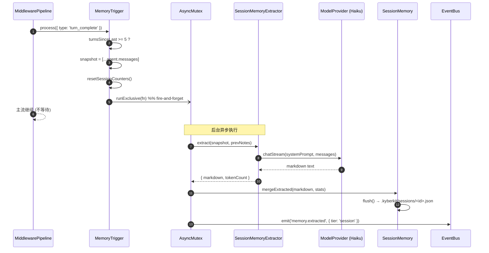
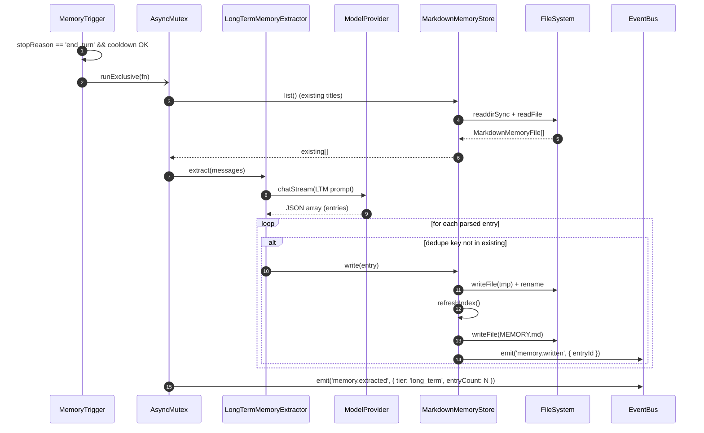

# Sprint 4：长对话可靠性 — 详细设计规范 (Detailed Design Spec)

> **版本**: 2.0-sprint4-implemented
> **状态**: ✅ 已落地（全量 `bun test` 226 pass / 4 skip / 0 fail）
> **范围**: Sprint 3 遗留修复 (Step 0, 占位) + Step 8 (上下文压缩引擎) + Step 9 (Session Memory 自动提取) + Step 10 (Long-term Memory 自动提取 + Markdown 迁移)
> **前置依赖**: Sprint 1 (流式基础设施) + Sprint 2 (用户资产 / Prompt 组装 / Command) + Sprint 3 (TUI + AgentSession L3)
> **关键决策**: 最简提取器（无 SubAgent 框架）/ LongTermMemory 纯 Markdown / 压缩模型默认 Haiku + env 可覆盖 / 废弃手动 Memory 写入 API
> **实施记录**: 见文末「附录 C — 实施偏差与补充说明」

---

## 0. 概述 (Overview)

### 0.1 问题陈述 (Problem Statement)

经过 Sprint 1-3，KyberKit 已具备：

- **流式 Agent Loop** (Sprint 1) — `agentLoop()` + Middleware Pipeline
- **用户资产体系** (Sprint 2) — `AssetRegistry` / `PromptAssembler` / `CommandRegistry` / `WorkspaceInstance`
- **L3 Session 层** (Sprint 2) — `AgentSession.send()` 统一事件流
- **TUI + REPL** (Sprint 3) — 用户可直接交互

但系统尚未覆盖"**长对话可靠性**"这一核心能力，表现为：

1. **上下文必溢**：`agentLoop` 每轮把 `agent.messages` 整体送入 LLM，无任何压缩。50 turn 以上对话、或含大 `tool_result` 的流程必然触发上下文超限或高额成本（参考 `src/agent/AgentLoop.ts:131`）。
2. **记忆仅存 Session 内**：`SessionMemory.push()` 仅在 session 生命周期内生效；`LongTermMemory` 虽有 SQLite 但仅通过 `MemoryStore.learn()` 被动写入（只在单元测试中被调用，`src/memory/MemoryStore.test.ts`），实际生产代码从未触发。
3. **知识不沉淀**：`CompactCommand` 是占位（`src/commands/builtin/CompactCommand.ts:12-18`），`/compact` 无实际效果；用户无法主动或自动把对话中的知识持久化。
4. **存储与用户资产割裂**：用户资产体系已规定 `.kyberkit/memories/` 是 Markdown 文件（Sprint 2 §3.2），但 `LongTermMemory` 仍存于 SQLite，用户无法手工编辑、也无法 git 版本化。

Sprint 4 的目标是闭环上述问题。

### 0.2 目标 (Goal)

1. **上下文自动压缩**：对话增长到阈值时自动压缩早期消息，保留 API Round 完整性，可选零成本降级（复用 Session Memory）。
2. **Session 笔记自动提取**：Turn 过程中按 token/toolCall/turn 触发后台 LLM 提取，产出结构化 Markdown 作为 Session Memory。
3. **长期记忆自动沉淀 + Markdown 化**：Turn 结束时按节流策略后台提取持久知识，统一写入 `.kyberkit/memories/<category>/<slug>.md`；删除 SQLite 后端；由 AssetRegistry 作为唯一真源。
4. **对外契约最小侵入**：`AgentSession.send()` 签名保持不变；新增能力通过 Middleware 与后台任务挂入。

### 0.3 设计原则 (Design Principles)

- **压缩优先零成本**：有 Session Memory 笔记可用时，优先用笔记替代 LLM 摘要（deterministic fallback）。
- **提取不阻塞主流**：所有 LLM 提取均 fire-and-forget 异步；主对话 `agentLoop` 永不因提取而延迟。
- **单一真源**：长期记忆只存 Markdown 文件；查询通过 AssetRegistry；不维护平行索引（Day 1 简化）。
- **extract-only 写入**：用户资产的自动积累路径统一为"Extractor → Markdown 文件"；废弃手动 `learn/push/save` API。
- **无新基础设施**：不引入 SubAgentRunner、BackgroundTaskPool、FTS5 等重组件；用最小可能的胶合实现。

### 0.4 决策摘要

| # | 决策 | 影响 |
|---|------|------|
| D1 | **最简提取/压缩器**：三个独立类直接调用 `ModelProvider.chatStream()`，无 SubAgent 框架 | Sprint 4 不新增 agent 生命周期；Sprint 6 再抽象 |
| D2 | **LongTermMemory 纯 Markdown**：弃用 `bun:sqlite`，统一 `.kyberkit/memories/<category>/<slug>.md` + YAML frontmatter | AssetRegistry 即查询入口；search Day 1 线性扫描 |
| D3 | **压缩模型默认 Haiku**：`KyberConfig.model.compactModel?: string`，env `KYBER_COMPACT_MODEL` 覆盖；unset 时 fallback 主模型 | 默认推荐 `claude-haiku-4-5`（或当前可用 haiku），运维可按需切换 |
| D4 | **废弃手动 Memory 写入 API**：删除 `MemoryStore.learn()` / `SessionMemory.push()` / `LongTermMemory.save()` | 旧测试重写；新写入路径仅走 Extractor / `/memory` 命令 |

---

## 1. Sprint 4 范围定义

| Step | 内容 | 前置依赖 |
|------|------|---------|
| **Step 0** (carry) | Sprint 3 遗留修复（占位，待 Sprint 3 实现 review 完成后补充） | Sprint 3 |
| **Step 8.1** | 类型 + `ContextCompressor` + `RoundGrouping` | Step 0 |
| **Step 8.2** | `LLMSummaryCompactor` + `SessionMemoryCompactor` | Step 8.1 |
| **Step 8.3** | `CompactionGuardMiddleware` + `/compact` 真实实现 | Step 8.2 |
| **Step 9.1** | 结构化 Markdown 模板 + `SessionMemory` 重构 | Step 8.1 |
| **Step 9.2** | `SessionMemoryExtractor` + `MemoryTriggerMiddleware` | Step 9.1 |
| **Step 10.1** | 目录结构 + `MarkdownMemoryStore` + `LongTermMemory` 重写 | Step 9.1 |
| **Step 10.2** | `LongTermMemoryExtractor` + `MEMORY.md` 索引维护 | Step 10.1 |
| **Step 10.3** | `MemoryDirScanner` 子目录扫描 + `MemoryProvider` 调整 | Step 10.1 |

### 1.1 Step 0（占位）

Sprint 3 实现评审（类比 `docs/reviews/sprint2-implementation-review.md`）尚未产出。本文仅保留占位章节，Sprint 4 正式实施时将：

1. 读取 `docs/reviews/sprint3-implementation-review.md`（若存在）识别 P0/P1 遗留；
2. 在 Step 8 正式开工前完成遗留修复；
3. 确认全量 `bun test` 绿色后推进。

若 Sprint 3 无重大遗留，Step 0 可跳过。

---

## 2. 架构总览

### 2.1 Sprint 4 新增组件与既有组件的关系

```
                 ┌──────────── AgentSession.send() ────────────┐
                 │                                               │
                 ▼                                               │
  ┌─────────────────────────────────────────────────────────────┤
  │                    agentLoop() (Sprint 1)                    │
  │                                                              │
  │  Turn 开始:                                                   │
  │    ┌─[NEW Sprint4] CompactionGuardMiddleware ─┐              │
  │    │  if contextTokens > threshold:            │              │
  │    │     ContextCompressor.compact(messages)   │              │
  │    │        ├─► SessionMemoryCompactor (零成本)│              │
  │    │        └─► LLMSummaryCompactor (兜底)     │              │
  │    └───────────────────────────────────────────┘              │
  │                                                              │
  │  PromptAssembler.assemble() → chatStream → pipeline          │
  │                                                              │
  │  Turn 结束:                                                   │
  │    ┌─[NEW Sprint4] MemoryTriggerMiddleware ───┐              │
  │    │  if tokens/toolCalls/turn 达阈值:          │              │
  │    │     [fire-and-forget]                     │              │
  │    │     SessionMemoryExtractor.extract()      │              │
  │    │        → SessionMemory.mergeExtracted()   │              │
  │    │                                            │              │
  │    │  if end_turn && cooldown OK:              │              │
  │    │     [fire-and-forget]                     │              │
  │    │     LongTermMemoryExtractor.extract()     │              │
  │    │        → MarkdownMemoryStore.write()      │              │
  │    │        → MEMORY.md 索引刷新                │              │
  │    └───────────────────────────────────────────┘              │
  └──────────────────────────────────────────────────────────────┘

  所有提取器使用:
    compactModel = config.model.compactModel
                 ?? process.env.KYBER_COMPACT_MODEL
                 ?? fallback(config.model.name)

  所有持久化:
    SessionMemory    — 单 JSON 文件 (继续)
    LongTermMemory   — .kyberkit/memories/<category>/<slug>.md  [NEW Sprint4]
```

### 2.2 文件组织

```
src/
├── compression/                          [NEW Sprint4]
│   ├── ContextCompressor.ts              — facade
│   ├── RoundGrouping.ts                  — API Round 边界识别
│   ├── LLMSummaryCompactor.ts            — Haiku 压缩
│   └── SessionMemoryCompactor.ts         — 零成本降级
│
├── memory/
│   ├── MemoryStore.ts                    [MODIFY] 移除 learn()
│   ├── SessionMemory.ts                  [REFACTOR] push → mergeExtracted
│   ├── LongTermMemory.ts                 [REWRITE] SQLite → Markdown
│   ├── WorkingMemory.ts                  (保留不变)
│   ├── MarkdownMemoryStore.ts            [NEW Sprint4]
│   └── extractors/                       [NEW Sprint4]
│       ├── SessionMemoryExtractor.ts
│       └── LongTermMemoryExtractor.ts
│
├── agent/middleware/
│   ├── CompactionGuardMiddleware.ts      [NEW Sprint4]
│   └── MemoryTriggerMiddleware.ts        [NEW Sprint4]
│
├── commands/builtin/
│   └── CompactCommand.ts                 [REWRITE] 占位 → 真实实现
│
├── types/
│   ├── compression.ts                    [NEW Sprint4]
│   ├── memory.ts                         [MODIFY] MemoryFile 类型
│   └── events.ts                         [MODIFY] context.compacted 等
│
├── assets/
│   └── MemoryDirScanner.ts               [MODIFY] 子目录扫描
│
├── prompt/providers/
│   └── MemoryProvider.ts                 [MODIFY] 按需注入 LongTerm
│
├── runtime/
│   ├── AgentSession.ts                   [MODIFY] 默认 pipeline 注入
│   └── WorkspaceInstance.ts              [MODIFY] 暴露 extractors
│
└── config/
    └── ConfigLoader.ts                   [MODIFY] KYBER_COMPACT_MODEL
```

### 2.3 生命周期一瞥

```mermaid
sequenceDiagram
    participant User
    participant Session as AgentSession
    participant Loop as agentLoop
    participant Guard as CompactionGuard
    participant Comp as ContextCompressor
    participant Trig as MemoryTrigger
    participant SE as SessionMemoryExtractor
    participant LE as LongTermMemoryExtractor
    participant MS as MarkdownMemoryStore

    User->>Session: send("...")
    Session->>Loop: iterate

    loop 每个 turn
        Loop->>Guard: 评估 contextTokens
        alt 超阈值
            Guard->>Comp: compact(messages)
            Comp-->>Guard: CompactResult
            Guard-->>Loop: 替换 agent.messages
        end

        Loop->>Loop: chatStream + pipeline
        Loop->>Trig: turn_complete 事件

        alt session 阈值达到
            Trig-)SE: extract() (后台)
            SE--)Trig: Markdown notes
        end
        alt end_turn && cooldown OK
            Trig-)LE: extract() (后台)
            LE--)MS: write *.md
            LE--)MS: refresh MEMORY.md
        end
    end

    Loop-->>Session: yield events
    Session-->>User: AgentEvent stream
```

---

## 3. Step 8: 上下文压缩引擎

### 3.1 类型定义

> 文件路径: `src/types/compression.ts` [NEW]

```typescript
import type { Message } from './model.js';
import type { ModelProvider } from './model.js';

/**
 * Token 预算配置。
 * 所有值均以 token 为单位；由 CompactionGuard 读取并用于触发决策。
 */
export interface TokenBudget {
  /** 上下文总预算 (模型上下文窗口 × 安全系数) */
  readonly contextWindow: number;
  /** 硬触发阈值 — 超过必压缩 (默认 contextWindow × 0.85) */
  readonly hardThreshold: number;
  /** 软警戒阈值 — 用于 /compact 建议 (默认 contextWindow × 0.65) */
  readonly softThreshold: number;
  /** 压缩后应保留的消息 token 上限 (默认 contextWindow × 0.40) */
  readonly targetAfterCompact: number;
}

/**
 * 压缩策略选项。
 */
export interface CompactOptions {
  /** 优先使用 SessionMemoryCompactor (零成本降级)；若失败再走 LLM */
  preferSessionMemory: boolean;
  /** 必须保留的最近 API Round 数量 (默认 3) */
  keepRecentRounds: number;
  /** 压缩用的模型名；若未指定则由 LLMSummaryCompactor 自行决定 */
  compactModel?: string;
  /** 生成 summary 的最大 token 上限 (默认 2048) */
  maxSummaryTokens?: number;
}

/**
 * 压缩结果。
 */
export interface CompactResult {
  /** 压缩后的消息列表 (summary message + 保留的近期消息) */
  readonly messages: Message[];
  /** 注入的 summary 文本 (作为 system 消息或 assistant 消息) */
  readonly summary: string;
  /** 触发本次压缩的策略 ('session_memory' | 'llm_summary' | 'noop') */
  readonly strategy: CompactStrategy;
  /** 压缩前消息总 token 估算 */
  readonly tokensBefore: number;
  /** 压缩后消息总 token 估算 */
  readonly tokensAfter: number;
  /** 压缩是否成功 */
  readonly success: boolean;
  /** 失败原因 (仅 success=false 时) */
  readonly error?: string;
}

export type CompactStrategy = 'session_memory' | 'llm_summary' | 'noop';

/**
 * 压缩触发器判定依据。
 */
export interface CompactionDecision {
  shouldCompact: boolean;
  reason: 'hard_threshold' | 'manual' | 'below_threshold';
  currentTokens: number;
  threshold: number;
}
```

### 3.2 RoundGrouping — API Round 完整性保护

> 文件路径: `src/compression/RoundGrouping.ts` [NEW]

Anthropic messages API 要求：每个 `tool_use` block 必须在后续 `user` 消息中通过 `tool_result` 闭合。"API Round"指"一次 assistant tool_use 消息 + 其对应的 user tool_result 消息"的配对。压缩必须以 Round 为最小单位，切不可拆开。

```typescript
import type { Message, MessageContent } from '../types/model.js';

/**
 * 一个 API Round —— tool_use/tool_result 配对的最小不可分单元。
 * 纯文本 assistant 消息也视作一个独立 Round（不含 tool）。
 */
export interface ApiRound {
  /** 该 Round 内所有消息在原数组中的索引 (连续) */
  readonly indices: number[];
  /** 该 Round 包含的消息副本 (只读引用) */
  readonly messages: Message[];
  /** 该 Round 是否含 tool_use (需要配对保护) */
  readonly hasToolUse: boolean;
  /** 估算 token */
  readonly estimatedTokens: number;
}

export class RoundGrouping {
  /**
   * 把 messages 按 API Round 切分。
   * 遍历规则：
   *   - assistant 消息以 tool_use 结尾 → 收集直到下一条 user(tool_result) 消息，合并为 Round
   *   - 其他单条消息 → 独立 Round
   * system 消息不参与 Round 划分 (由上层负责保留)。
   */
  static group(messages: Message[]): ApiRound[];

  /**
   * 基于目标 token 预算计算"应从索引 N 开始保留"。
   * 策略：从尾部向前累加 Round.estimatedTokens，直到总和接近 targetTokens
   * 或已保留 >= keepRecentRounds 个 Round。
   */
  static calculateKeepIndex(
    rounds: ApiRound[],
    targetTokens: number,
    keepRecentRounds: number,
  ): number;

  /**
   * 估算单条 message 的 token 数。
   * 使用简单字符 /4 启发式；Sprint 5 可替换为 tokenizer 精确计数。
   */
  static estimateTokens(message: Message): number;
}
```

**Round 切分算法** (伪代码)：

```
function group(messages):
  rounds = []
  buffer = []
  hasToolUse = false

  for i, msg in enumerate(messages):
    if msg.role == 'system': continue   // system 保留在外部
    buffer.push({ index: i, msg })

    // 判断是否含 tool_use
    if msg.role == 'assistant' && containsBlock(msg, 'tool_use'):
      hasToolUse = true
      continue   // 等待下一条 user(tool_result)

    if hasToolUse && msg.role == 'user' && containsBlock(msg, 'tool_result'):
      rounds.push(makeRound(buffer, hasToolUse=true))
      buffer = []
      hasToolUse = false
    else if !hasToolUse:
      rounds.push(makeRound(buffer, hasToolUse=false))
      buffer = []

  // 流末残留 (异常情况)
  if buffer: rounds.push(makeRound(buffer, hasToolUse))

  return rounds
```

**计算保留索引** (伪代码)：

```
function calculateKeepIndex(rounds, targetTokens, keepRecent):
  accumulated = 0
  keptRoundCount = 0

  for i in reverse(range(len(rounds))):
    roundTokens = rounds[i].estimatedTokens
    // 条件 A: 已达到最少保留数 且 累积 token 已达目标
    if keptRoundCount >= keepRecent && (accumulated + roundTokens) > targetTokens:
      return rounds[i + 1].indices[0]  // 从下一个 Round 的第一条开始保留

    accumulated += roundTokens
    keptRoundCount += 1

  return 0   // 全部保留，无需压缩
```

### 3.3 ContextCompressor — Facade

> 文件路径: `src/compression/ContextCompressor.ts` [NEW]

```typescript
import type { Message, ModelProvider } from '../types/model.js';
import type {
  CompactOptions, CompactResult, CompactionDecision, TokenBudget,
} from '../types/compression.js';
import { RoundGrouping } from './RoundGrouping.js';
import { LLMSummaryCompactor } from './LLMSummaryCompactor.js';
import { SessionMemoryCompactor } from './SessionMemoryCompactor.js';
import type { SessionMemory } from '../memory/SessionMemory.js';
import { TypedEventBus } from '../events/EventBus.js';
import type { KyberEvents } from '../types/events.js';

export interface ContextCompressorDeps {
  readonly model: ModelProvider;
  readonly sessionMemory: SessionMemory;
  readonly eventBus: TypedEventBus<KyberEvents>;
  readonly mainModelName: string;      // fallback 用
  readonly compactModelName?: string;  // 优先使用
}

export class ContextCompressor {
  private readonly llmCompactor: LLMSummaryCompactor;
  private readonly sessionCompactor: SessionMemoryCompactor;

  constructor(private readonly deps: ContextCompressorDeps) {
    this.llmCompactor = new LLMSummaryCompactor({
      model: deps.model,
      modelName: deps.compactModelName ?? deps.mainModelName,
      fallbackModelName: deps.mainModelName,
    });
    this.sessionCompactor = new SessionMemoryCompactor(deps.sessionMemory);
  }

  /** 是否应触发压缩 (供 CompactionGuard 使用) */
  shouldCompact(messages: Message[], budget: TokenBudget): CompactionDecision {
    const currentTokens = messages
      .map(m => RoundGrouping.estimateTokens(m))
      .reduce((a, b) => a + b, 0);

    if (currentTokens >= budget.hardThreshold) {
      return {
        shouldCompact: true,
        reason: 'hard_threshold',
        currentTokens,
        threshold: budget.hardThreshold,
      };
    }
    return {
      shouldCompact: false,
      reason: 'below_threshold',
      currentTokens,
      threshold: budget.hardThreshold,
    };
  }

  /** 执行压缩 */
  async compact(
    messages: Message[],
    budget: TokenBudget,
    options: CompactOptions,
  ): Promise<CompactResult> {
    const rounds = RoundGrouping.group(messages);
    const keepIdx = RoundGrouping.calculateKeepIndex(
      rounds,
      budget.targetAfterCompact,
      options.keepRecentRounds,
    );

    // 无需压缩
    if (keepIdx <= 0) {
      return noopResult(messages);
    }

    const toCompress = messages.slice(0, keepIdx);
    const toKeep = messages.slice(keepIdx);
    const tokensBefore = messages
      .map(m => RoundGrouping.estimateTokens(m))
      .reduce((a, b) => a + b, 0);

    // 策略 1: SessionMemoryCompactor (零成本)
    if (options.preferSessionMemory) {
      try {
        const result = await this.sessionCompactor.compact(toCompress, toKeep, options);
        if (result.success) {
          this.deps.eventBus.emit('context.compacted', {
            strategy: 'session_memory',
            tokensBefore,
            tokensAfter: result.tokensAfter,
            saved: tokensBefore - result.tokensAfter,
          });
          return result;
        }
      } catch { /* fall through to LLM */ }
    }

    // 策略 2: LLMSummaryCompactor
    const llmResult = await this.llmCompactor.compact(toCompress, toKeep, options);
    this.deps.eventBus.emit('context.compacted', {
      strategy: llmResult.strategy,
      tokensBefore,
      tokensAfter: llmResult.tokensAfter,
      saved: tokensBefore - llmResult.tokensAfter,
    });
    return llmResult;
  }

  /** 计算给定消息数组的总 token 估算 */
  static estimateTotal(messages: Message[]): number {
    return messages
      .map(m => RoundGrouping.estimateTokens(m))
      .reduce((a, b) => a + b, 0);
  }
}

function noopResult(messages: Message[]): CompactResult {
  const tokens = ContextCompressor.estimateTotal(messages);
  return {
    messages, summary: '', strategy: 'noop',
    tokensBefore: tokens, tokensAfter: tokens, success: true,
  };
}
```

### 3.4 LLMSummaryCompactor

> 文件路径: `src/compression/LLMSummaryCompactor.ts` [NEW]

直接使用 `ModelProvider.chatStream()` 生成一条"早期对话摘要"，然后将其作为单条 `user` 消息注入被保留消息的开头。

```typescript
import type { Message, ModelProvider } from '../types/model.js';
import type { CompactOptions, CompactResult } from '../types/compression.js';
import { ContextCompressor } from './ContextCompressor.js';

interface LLMCompactorDeps {
  model: ModelProvider;
  modelName: string;          // compactModel (可能 == fallback)
  fallbackModelName: string;  // 主模型
}

const COMPACT_SYSTEM_PROMPT = `You are a conversation compression assistant.
Your job: produce a concise, information-preserving summary of the earlier
portion of a multi-turn conversation so that a downstream agent can continue
the task without reading the original messages.

Guidelines:
1. Preserve goals, decisions, constraints, and tool outcomes.
2. Drop filler, pleasantries, and redundant restatements.
3. Keep factual specifics (file paths, numbers, error messages).
4. Output pure prose; no headings or code fences.
5. Aim for <= 40% of the original length.`.trim();

export class LLMSummaryCompactor {
  constructor(private readonly deps: LLMCompactorDeps) {}

  async compact(
    toCompress: Message[],
    toKeep: Message[],
    options: CompactOptions,
  ): Promise<CompactResult> {
    if (toCompress.length === 0) {
      return {
        messages: toKeep, summary: '', strategy: 'noop',
        tokensBefore: ContextCompressor.estimateTotal(toKeep),
        tokensAfter: ContextCompressor.estimateTotal(toKeep),
        success: true,
      };
    }

    const summary = await this.runSummary(toCompress, options);

    // 注入策略：作为一条 user system-note 消息放在 toKeep 最前
    const summaryMessage: Message = {
      role: 'user',
      content: `<conversation-summary>\n${summary}\n</conversation-summary>`,
    };
    const merged = [summaryMessage, ...toKeep];
    return {
      messages: merged,
      summary,
      strategy: 'llm_summary',
      tokensBefore: ContextCompressor.estimateTotal([...toCompress, ...toKeep]),
      tokensAfter: ContextCompressor.estimateTotal(merged),
      success: true,
    };
  }

  private async runSummary(
    toCompress: Message[],
    options: CompactOptions,
  ): Promise<string> {
    const requestBody = {
      model: options.compactModel ?? this.deps.modelName,
      systemPrompt: COMPACT_SYSTEM_PROMPT,
      messages: toCompress as any,
      tools: [],   // 压缩时不用工具
      maxTokens: options.maxSummaryTokens ?? 2048,
    };

    let chunks: string[] = [];
    try {
      for await (const ev of this.deps.model.chatStream(requestBody)) {
        if (ev.type === 'text_delta') chunks.push(ev.text);
      }
    } catch (err) {
      // fallback: 主模型
      if (requestBody.model !== this.deps.fallbackModelName) {
        chunks = [];
        for await (const ev of this.deps.model.chatStream({
          ...requestBody, model: this.deps.fallbackModelName,
        })) {
          if (ev.type === 'text_delta') chunks.push(ev.text);
        }
      } else {
        throw err;   // 主模型失败则放弃
      }
    }
    return chunks.join('').trim();
  }
}
```

**Fallback 链**：`compactModel (env/config) → mainModel → throw`。throw 由 `ContextCompressor` 捕获并返回 `success: false`，`CompactionGuard` 收到后 yield `error` 事件但不中断 turn。

### 3.5 SessionMemoryCompactor — 零成本降级

> 文件路径: `src/compression/SessionMemoryCompactor.ts` [NEW]

若当前 Session 已有由 `SessionMemoryExtractor` 生成的结构化 Markdown 笔记，直接把该笔记当作 summary 使用，零 LLM 调用。

```typescript
import type { Message } from '../types/model.js';
import type { CompactOptions, CompactResult } from '../types/compression.js';
import type { SessionMemory } from '../memory/SessionMemory.js';
import { ContextCompressor } from './ContextCompressor.js';

export class SessionMemoryCompactor {
  constructor(private readonly sessionMemory: SessionMemory) {}

  async compact(
    toCompress: Message[],
    toKeep: Message[],
    _options: CompactOptions,
  ): Promise<CompactResult> {
    const notes = this.sessionMemory.buildContextTemplate();
    if (!notes || notes.trim().length < 50) {
      // 笔记太少或空 — 不适合作为 summary
      return {
        messages: [...toCompress, ...toKeep],
        summary: '', strategy: 'noop',
        tokensBefore: ContextCompressor.estimateTotal([...toCompress, ...toKeep]),
        tokensAfter: ContextCompressor.estimateTotal([...toCompress, ...toKeep]),
        success: false,
        error: 'Session memory too small',
      };
    }

    const summaryMessage: Message = {
      role: 'user',
      content: `<session-notes-summary>\n${notes}\n</session-notes-summary>`,
    };
    const merged = [summaryMessage, ...toKeep];
    return {
      messages: merged,
      summary: notes,
      strategy: 'session_memory',
      tokensBefore: ContextCompressor.estimateTotal([...toCompress, ...toKeep]),
      tokensAfter: ContextCompressor.estimateTotal(merged),
      success: true,
    };
  }
}
```

### 3.6 CompactionGuardMiddleware

> 文件路径: `src/agent/middleware/CompactionGuardMiddleware.ts` [NEW]

**问题**：`StreamMiddleware` 接口是同步的 (`src/agent/StreamMiddleware.ts:45-48`)，不适合做 I/O。压缩需要 LLM 调用即 async。

**解决**：`CompactionGuardMiddleware` 不在 `process()` 内做压缩，而是通过 **Turn 前置钩子** 触发。为此在 `agentLoop` 的 `while` 循环开头新增 `beforeTurn` 阶段（见 §7.1）。

本 middleware 同时承担两件事：
1. 监听 `usage` 事件累积最新 token 数（用于 soft 判断）；
2. 导出 `evaluateAndCompact()` 供 `agentLoop` 在 Turn 开始时 `await`。

```typescript
import type { StreamMiddleware, MiddlewareContext } from '../StreamMiddleware.js';
import type { AgentEvent } from '../../types/agent-events.js';
import type { ContextCompressor } from '../../compression/ContextCompressor.js';
import type { TokenBudget, CompactOptions } from '../../types/compression.js';
import type { DefaultAgentInstance } from '../AgentInstance.js';

export class CompactionGuardMiddleware implements StreamMiddleware {
  readonly name = 'compaction_guard';

  private lastKnownTokens = 0;

  constructor(
    private readonly compressor: ContextCompressor,
    private readonly budget: TokenBudget,
    private readonly options: CompactOptions,
  ) {}

  /**
   * StreamMiddleware 的同步 process:
   *   - 只消费 usage 事件，累积 input_tokens 供后续判断
   *   - 其他事件原样透传
   */
  process(event: AgentEvent, _ctx: MiddlewareContext): AgentEvent | null {
    if (event.type === 'usage') {
      this.lastKnownTokens = event.cumulative.totalInputTokens;
    }
    return event;
  }

  /**
   * agentLoop 在 Turn 开始前调用。
   * 返回 null 表示无需变更 agent.messages；
   * 返回 Message[] 表示 agent.messages 应被替换。
   */
  async evaluateAndCompact(
    agent: DefaultAgentInstance,
  ): Promise<{ summary?: string; replacedMessages?: unknown[] }> {
    const decision = this.compressor.shouldCompact(agent.messages as any, this.budget);
    if (!decision.shouldCompact) return {};

    const result = await this.compressor.compact(
      agent.messages as any, this.budget, this.options,
    );
    if (!result.success) return {};
    return { summary: result.summary, replacedMessages: result.messages };
  }
}
```

### 3.7 触发策略与默认阈值

| 项目 | 默认值 | 说明 |
|------|-------|------|
| `TokenBudget.contextWindow` | 180 000 | Claude Sonnet 4 上下文 ~200k 的 90% 安全系数 |
| `TokenBudget.hardThreshold` | 153 000 | 85% × contextWindow，必压 |
| `TokenBudget.softThreshold` | 117 000 | 65% × contextWindow，`/compact` 建议 |
| `TokenBudget.targetAfterCompact` | 72 000 | 40% × contextWindow，留足后续 turn 空间 |
| `CompactOptions.keepRecentRounds` | 3 | 最近 3 个 Round 永远保留 |
| `CompactOptions.preferSessionMemory` | `true` | Session Memory 足够大时优先零成本 |
| `CompactOptions.maxSummaryTokens` | 2048 | LLM 摘要输出长度上限 |
| `SessionMemoryCompactor` 最小笔记长度 | 50 字符 | 过小则 fallback LLM |

所有阈值通过 `KyberConfig.compaction` 配置节可调（§7.2）。

---

## 4. Step 9: Session Memory 引擎

### 4.1 结构化 Markdown 模板重构

**背景**：现有 `src/memory/SessionMemory.ts` 使用 `MemorySection` enum（`src/types/memory.ts:15-24`）的 8 固定 section，但该模板是基于"手动 push 的 MemoryEntry 映射到 section"的范式，与新的"LLM 提取生成整篇 Markdown"模式不匹配。

**新模板** — 对齐 DeepCC 的任务导向模型：

```markdown
## Goal
<当前对话的顶层目标，用户最初意图>

## Progress
<已完成的子任务、关键决策点、当前所处阶段>

## Decisions
- <决策点 1>
- <决策点 2>

## Findings
- <探索过程中发现的事实、代码路径、配置值>

## Open Questions
- <尚未回答的疑问 / 待用户确认项>

## Errors
- <已遇到的错误与其解决办法>

## Next Steps
- <下一步建议>
```

**类型定义变更** — `src/types/memory.ts` [MODIFY]：

```typescript
// 删除旧的 MemorySection enum (或保留为 @deprecated 直到 Sprint 5)
// 新增:
export type SessionMemoryField =
  | 'goal' | 'progress' | 'decisions' | 'findings'
  | 'openQuestions' | 'errors' | 'nextSteps';

export interface SessionMemoryNotes {
  /** 结构化 Markdown 原文 (来自 Extractor) */
  markdown: string;
  /** 生成时间 */
  updatedAt: number;
  /** 基于多少条消息提取 */
  basedOnMessages: number;
  /** 累积 token */
  tokenCount: number;
}
```

### 4.2 SessionMemory 重构

> 文件路径: `src/memory/SessionMemory.ts` [REFACTOR]

废弃 `push(entry)`，新增 `mergeExtracted(md)`。核心 API：

```typescript
export class SessionMemory {
  private notes: SessionMemoryNotes | null = null;
  private readonly filePath: string;
  private isDirty = false;

  constructor(filePath: string, eventBus: TypedEventBus<KyberEvents>) { /* ... */ }

  /** 从 Extractor 写入/替换整篇笔记 */
  mergeExtracted(markdown: string, stats: {
    basedOnMessages: number; tokenCount: number;
  }): void {
    this.notes = {
      markdown,
      updatedAt: Date.now(),
      basedOnMessages: stats.basedOnMessages,
      tokenCount: stats.tokenCount,
    };
    this.isDirty = true;
    // 异步 flush (简化：立即 write)
    void this.flush();
  }

  /** 返回当前 Markdown 笔记 (供 SessionMemoryCompactor / MemoryProvider 使用) */
  buildContextTemplate(): string {
    return this.notes?.markdown ?? '';
  }

  /** 当前笔记元数据 (供 MemoryTriggerMiddleware 判断是否需要增量提取) */
  getNotesMeta(): Pick<SessionMemoryNotes, 'basedOnMessages' | 'tokenCount' | 'updatedAt'> | null {
    return this.notes ? {
      basedOnMessages: this.notes.basedOnMessages,
      tokenCount: this.notes.tokenCount,
      updatedAt: this.notes.updatedAt,
    } : null;
  }

  async flush(): Promise<void> { /* 写 JSON 到 filePath */ }
  async restore(): Promise<void> { /* 读 JSON 还原 */ }
  clear(): void { this.notes = null; this.isDirty = true; }
}
```

**删除项**：
- `push(entry: MemoryEntry)` — 被 `mergeExtracted` 替代
- `recordToolCall()` — tool call 计数移交 `MiddlewareContext` 或 `MemoryTriggerMiddleware`
- `MemoryFlushTrigger` 中的 `debounceMs` / `toolCallThreshold` 不再使用；token 阈值由 MemoryTrigger 读取

**文件格式**：`SessionMemory` 仍存为 JSON（复用 Sprint 1-2 机制），但内部仅一个字段：

```json
{
  "notes": {
    "markdown": "## Goal\n...",
    "updatedAt": 1776400000000,
    "basedOnMessages": 42,
    "tokenCount": 18500
  }
}
```

### 4.3 SessionMemoryExtractor

> 文件路径: `src/memory/extractors/SessionMemoryExtractor.ts` [NEW]

```typescript
import type { Message, ModelProvider } from '../../types/model.js';

interface ExtractorDeps {
  model: ModelProvider;
  compactModel?: string;
  fallbackModel: string;
}

const SESSION_EXTRACTOR_SYSTEM_PROMPT = `You are a session note-taking assistant.
Read the conversation messages and produce a STRUCTURED Markdown note with
these exact sections (in order, omit a section only if truly empty):

## Goal
## Progress
## Decisions
## Findings
## Open Questions
## Errors
## Next Steps

Rules:
- Output only the Markdown body, no preface.
- Bullet points under each section (except Goal, which is 1-3 prose lines).
- Be specific: include file paths, error messages, decision rationale.
- If a previous note is provided, MERGE new information rather than duplicate.
- Target length: <= 600 words.`.trim();

export class SessionMemoryExtractor {
  constructor(private readonly deps: ExtractorDeps) {}

  async extract(
    messages: Message[],
    previousNotes: string | null,
  ): Promise<{ markdown: string; tokenCount: number }> {
    const userPrefix = previousNotes
      ? `Previous note:\n\n${previousNotes}\n\n---\n\nUpdate it based on the following new conversation.`
      : `Produce a fresh session note based on the following conversation.`;

    const extractionMessages: Message[] = [
      { role: 'user', content: userPrefix },
      ...messages,
    ];

    const chunks: string[] = [];
    const modelName = this.deps.compactModel ?? this.deps.fallbackModel;
    try {
      for await (const ev of this.deps.model.chatStream({
        model: modelName,
        systemPrompt: SESSION_EXTRACTOR_SYSTEM_PROMPT,
        messages: extractionMessages as any,
        tools: [],
        maxTokens: 2048,
      })) {
        if (ev.type === 'text_delta') chunks.push(ev.text);
      }
    } catch (err) {
      if (modelName !== this.deps.fallbackModel) {
        chunks.length = 0;
        for await (const ev of this.deps.model.chatStream({
          model: this.deps.fallbackModel,
          systemPrompt: SESSION_EXTRACTOR_SYSTEM_PROMPT,
          messages: extractionMessages as any,
          tools: [],
          maxTokens: 2048,
        })) {
          if (ev.type === 'text_delta') chunks.push(ev.text);
        }
      } else throw err;
    }

    const markdown = chunks.join('').trim();
    return { markdown, tokenCount: Math.ceil(markdown.length / 4) };
  }
}
```

### 4.4 MemoryTriggerMiddleware

> 文件路径: `src/agent/middleware/MemoryTriggerMiddleware.ts` [NEW]

**职责**：
1. 订阅 `usage` / `tool_use_complete` / `turn_complete` 事件；
2. 判断是否应触发 Session Memory / LongTerm Memory 提取；
3. **不阻塞**主流：提取通过 `void extractor.extract(...)` 异步发起，结果通过 EventBus 广播；
4. 互斥锁保证同一类提取至多 1 个并发。

```typescript
import type { StreamMiddleware, MiddlewareContext } from '../StreamMiddleware.js';
import type { AgentEvent } from '../../types/agent-events.js';
import type { SessionMemoryExtractor } from '../../memory/extractors/SessionMemoryExtractor.js';
import type { LongTermMemoryExtractor } from '../../memory/extractors/LongTermMemoryExtractor.js';
import type { SessionMemory } from '../../memory/SessionMemory.js';
import { TypedEventBus } from '../../events/EventBus.js';
import type { KyberEvents } from '../../types/events.js';
import { AsyncMutex } from '../../util/AsyncMutex.js';  // [NEW]

export interface MemoryTriggerConfig {
  readonly sessionTokenThreshold: number;   // 默认 4000
  readonly sessionToolCallThreshold: number; // 默认 8
  readonly sessionTurnThreshold: number;     // 默认 5
  readonly ltmTurnCooldown: number;          // 默认 3 (turns)
  readonly enabled: boolean;
}

export interface MemoryTriggerDeps {
  sessionExtractor: SessionMemoryExtractor;
  ltmExtractor: LongTermMemoryExtractor;
  sessionMemory: SessionMemory;
  eventBus: TypedEventBus<KyberEvents>;
  config: MemoryTriggerConfig;
}

export class MemoryTriggerMiddleware implements StreamMiddleware {
  readonly name = 'memory_trigger';

  private tokenSinceLastExtract = 0;
  private toolCallsSinceLastExtract = 0;
  private turnsSinceLastSessionExtract = 0;
  private turnsSinceLastLtmExtract = 0;

  private readonly sessionMutex = new AsyncMutex();
  private readonly ltmMutex = new AsyncMutex();

  constructor(private readonly deps: MemoryTriggerDeps) {}

  process(event: AgentEvent, ctx: MiddlewareContext): AgentEvent | null {
    if (!this.deps.config.enabled) return event;

    switch (event.type) {
      case 'usage':
        this.tokenSinceLastExtract += event.usage.inputTokens + event.usage.outputTokens;
        break;
      case 'tool_use_complete':
        this.toolCallsSinceLastExtract++;
        break;
      case 'turn_complete':
        this.turnsSinceLastSessionExtract++;
        this.turnsSinceLastLtmExtract++;
        this.maybeTriggerSession(ctx);
        this.maybeTriggerLtm(ctx, event.stopReason);
        break;
    }
    return event;
  }

  private maybeTriggerSession(ctx: MiddlewareContext): void {
    const c = this.deps.config;
    const shouldTrigger =
      this.tokenSinceLastExtract >= c.sessionTokenThreshold
      || this.toolCallsSinceLastExtract >= c.sessionToolCallThreshold
      || this.turnsSinceLastSessionExtract >= c.sessionTurnThreshold;

    if (!shouldTrigger) return;

    // 重置计数器（占位，但成功后再确认）
    const snapshotMessages = [...ctx.agent.messages];
    this.resetSessionCounters();

    // fire-and-forget
    void this.sessionMutex.runExclusive(async () => {
      try {
        const prev = this.deps.sessionMemory.buildContextTemplate() || null;
        const { markdown, tokenCount } =
          await this.deps.sessionExtractor.extract(snapshotMessages as any, prev);
        this.deps.sessionMemory.mergeExtracted(markdown, {
          basedOnMessages: snapshotMessages.length,
          tokenCount,
        });
        this.deps.eventBus.emit('memory.extracted', {
          tier: 'session',
          entryCount: 1,
          basedOnMessages: snapshotMessages.length,
        });
      } catch (err) {
        this.deps.eventBus.emit('memory.extraction_skipped', {
          tier: 'session',
          reason: (err as Error).message,
        });
      }
    });
  }

  private maybeTriggerLtm(ctx: MiddlewareContext, stopReason: string): void {
    if (stopReason !== 'end_turn') return;
    if (this.turnsSinceLastLtmExtract < this.deps.config.ltmTurnCooldown) return;

    const snapshotMessages = [...ctx.agent.messages];
    this.turnsSinceLastLtmExtract = 0;

    void this.ltmMutex.runExclusive(async () => {
      try {
        const entries = await this.deps.ltmExtractor.extract(snapshotMessages as any);
        this.deps.eventBus.emit('memory.extracted', {
          tier: 'long_term',
          entryCount: entries.length,
          basedOnMessages: snapshotMessages.length,
        });
      } catch (err) {
        this.deps.eventBus.emit('memory.extraction_skipped', {
          tier: 'long_term',
          reason: (err as Error).message,
        });
      }
    });
  }

  private resetSessionCounters(): void {
    this.tokenSinceLastExtract = 0;
    this.toolCallsSinceLastExtract = 0;
    this.turnsSinceLastSessionExtract = 0;
  }
}
```

**新增工具类** — `src/util/AsyncMutex.ts` [NEW]：

```typescript
export class AsyncMutex {
  private queue: Promise<void> = Promise.resolve();

  async runExclusive<T>(fn: () => Promise<T>): Promise<T> {
    const prev = this.queue;
    let release!: () => void;
    this.queue = new Promise(r => (release = r));
    await prev;
    try {
      return await fn();
    } finally {
      release();
    }
  }
}
```

### 4.5 自动与手动路径对齐

| 路径 | 触发方 | 目标存储 | Sprint 4 行为 |
|------|-------|---------|--------------|
| `SessionMemoryExtractor` | `MemoryTriggerMiddleware` (auto) | `SessionMemory` JSON | 全自动 |
| `LongTermMemoryExtractor` | `MemoryTriggerMiddleware` (auto, end_turn) | `.kyberkit/memories/<category>/*.md` | 全自动 |
| `/memory add <text>` | 用户手动 | `.kyberkit/memories/user/*.md` | 新增子命令，Sprint 4 实现 |
| `/memory list` | 用户手动 | 查询 AssetRegistry | 保持现状 |

旧的 `MemoryStore.learn()` 被完全废弃 — 所有写入都通过 Extractor 或 `/memory` 子命令。

---

## 5. Step 10: Long-term Memory 自动提取 + Markdown 迁移

### 5.1 目录结构

LongTermMemory 完全迁移到文件系统。每个 memory 是一个 Markdown 文件，按 `category` 分目录存放：

```
.kyberkit/memories/
├── MEMORY.md                            # 自动维护的索引 (人类可读)
├── user/                                # 用户偏好与事实
│   ├── prefers-bun-over-node.md
│   └── uses-tailwind-v4.md
├── project/                             # 当前项目的知识
│   ├── agentloop-stream-semantics.md
│   └── workspace-multi-tenant-rule.md
└── reference/                           # 外部参考资料片段
    └── anthropic-cache-control.md
```

**三级合并规则**（Sprint 2 已定）继续适用：
- `~/.kyberkit/memories/` — 用户级（跨项目）
- `~/.kyberkit/workspaces/<id>/memories/` — Workspace 级
- `<cwd>/.kyberkit/memories/` — 项目级

**自动提取的默认写入位置**：`<cwd>/.kyberkit/memories/` (项目级，可被 git 跟踪)。用户可通过 `KYBER_MEMORY_WRITE_SCOPE=user|workspace|project` env 变量覆盖。

### 5.2 文件格式

每个 memory 文件采用 YAML frontmatter + Markdown body：

```markdown
---
id: 7a3f2b19-8c4d-4e5f-9a12-b3c4d5e6f7a8
category: project
title: AgentLoop stream semantics
tags: [agent, streaming, middleware]
createdAt: 2026-04-17T08:30:00.000Z
updatedAt: 2026-04-17T08:30:00.000Z
source: auto
score: 1.0
---

AgentLoop yields events through a MiddlewarePipeline. Each turn emits
`text_delta` / `thinking_delta` / `tool_use_*` / `usage` / `turn_complete`
in order. Consumers (TUI, SDK) must not assume synchronous completion of
tools — dispatch happens after content accumulation.
```

### 5.3 MarkdownMemoryStore

> 文件路径: `src/memory/MarkdownMemoryStore.ts` [NEW]

替代 `LongTermMemory` 的 SQLite 后端。核心 API：

```typescript
import matter from 'gray-matter';
import { writeFile, readFile, mkdir, rename, unlink } from 'fs/promises';
import { readdirSync, existsSync } from 'fs';
import { join, dirname } from 'path';
import { randomUUID } from 'crypto';
import { TypedEventBus } from '../events/EventBus.js';
import type { KyberEvents } from '../types/events.js';
import type { MemoryEntry, MemoryCategory } from '../types/memory.js';

export interface MarkdownMemoryFile {
  /** Frontmatter id (uuid) */
  id: string;
  category: MemoryCategory;
  title: string;
  tags?: string[];
  createdAt: string;          // ISO-8601
  updatedAt: string;
  source: 'auto' | 'manual';
  score?: number;
  body: string;
  /** 绝对路径 (运行时填充) */
  path: string;
}

export class MarkdownMemoryStore {
  constructor(
    private readonly rootDir: string,      // .kyberkit/memories 的绝对路径
    private readonly eventBus: TypedEventBus<KyberEvents>,
  ) {}

  /** 写入或更新一个 memory 文件 */
  async write(entry: Omit<MarkdownMemoryFile, 'path'>): Promise<MarkdownMemoryFile> {
    const catDir = join(this.rootDir, entry.category);
    await mkdir(catDir, { recursive: true });
    const fileName = `${slug(entry.title)}-${entry.id.slice(0, 8)}.md`;
    const path = join(catDir, fileName);

    const fm = {
      id: entry.id,
      category: entry.category,
      title: entry.title,
      tags: entry.tags,
      createdAt: entry.createdAt,
      updatedAt: entry.updatedAt,
      source: entry.source,
      score: entry.score ?? 1.0,
    };
    const md = matter.stringify(entry.body, fm);

    // 原子写: tmp + rename
    const tmp = `${path}.tmp`;
    await writeFile(tmp, md, 'utf-8');
    await rename(tmp, path);

    await this.refreshIndex();
    this.eventBus.emit('memory.written', { tierId: 'L3', entryId: entry.id });
    return { ...entry, path };
  }

  /** 列出全部 memory 文件 */
  async list(): Promise<MarkdownMemoryFile[]> {
    const out: MarkdownMemoryFile[] = [];
    for (const cat of ['user', 'project', 'reference'] as const) {
      const dir = join(this.rootDir, cat);
      if (!existsSync(dir)) continue;
      for (const f of readdirSync(dir)) {
        if (!f.endsWith('.md')) continue;
        const full = join(dir, f);
        const parsed = matter(await readFile(full, 'utf-8'));
        out.push({
          id: parsed.data.id ?? randomUUID(),
          category: (parsed.data.category ?? cat) as MemoryCategory,
          title: parsed.data.title ?? f.replace(/\.md$/, ''),
          tags: parsed.data.tags,
          createdAt: parsed.data.createdAt ?? new Date().toISOString(),
          updatedAt: parsed.data.updatedAt ?? new Date().toISOString(),
          source: (parsed.data.source ?? 'manual') as 'auto' | 'manual',
          score: parsed.data.score,
          body: parsed.content,
          path: full,
        });
      }
    }
    return out;
  }

  /** 按类别查询 */
  async findByCategory(category: MemoryCategory, limit = 20): Promise<MarkdownMemoryFile[]> {
    const all = await this.list();
    return all
      .filter(m => m.category === category)
      .sort((a, b) => b.updatedAt.localeCompare(a.updatedAt))
      .slice(0, limit);
  }

  /** 简单字符串搜索 (Day 1: 线性扫 title+body) */
  async search(query: string, limit = 10): Promise<MarkdownMemoryFile[]> {
    const q = query.toLowerCase();
    const all = await this.list();
    return all
      .filter(m => m.title.toLowerCase().includes(q) || m.body.toLowerCase().includes(q))
      .sort((a, b) => (b.score ?? 1) - (a.score ?? 1))
      .slice(0, limit);
  }

  /** 删除一个 memory */
  async remove(id: string): Promise<boolean> {
    const all = await this.list();
    const target = all.find(m => m.id === id);
    if (!target) return false;
    await unlink(target.path);
    await this.refreshIndex();
    return true;
  }

  /** 重写 MEMORY.md 索引文件 */
  async refreshIndex(): Promise<void> {
    const all = await this.list();
    const byCat = new Map<string, MarkdownMemoryFile[]>();
    for (const m of all) {
      if (!byCat.has(m.category)) byCat.set(m.category, []);
      byCat.get(m.category)!.push(m);
    }
    const lines = ['# Memory Index', '', `_Auto-generated — ${new Date().toISOString()}_`, ''];
    for (const [cat, list] of byCat) {
      lines.push(`## ${cat} (${list.length})`);
      lines.push('');
      for (const m of list) {
        const tags = m.tags?.length ? ` \`${m.tags.join('`, `')}\`` : '';
        lines.push(`- [${m.title}](${cat}/${basename(m.path)})${tags}`);
      }
      lines.push('');
    }
    await writeFile(join(this.rootDir, 'MEMORY.md'), lines.join('\n'), 'utf-8');
  }
}

function slug(s: string): string {
  return s.toLowerCase().trim().replace(/[^a-z0-9]+/g, '-').replace(/^-+|-+$/g, '').slice(0, 60);
}
function basename(p: string): string { return p.split('/').pop() ?? p; }
```

### 5.4 LongTermMemory 重写

> 文件路径: `src/memory/LongTermMemory.ts` [REWRITE]

保留对外类与若干 API（`findByCategory` / `search` / `prune`），内部全部委托给 `MarkdownMemoryStore`。**删除** `bun:sqlite` 依赖和 `save()` 方法。

```typescript
import { MarkdownMemoryStore } from './MarkdownMemoryStore.js';
import type { MemoryEntry, MemoryCategory } from '../types/memory.js';
import { TypedEventBus } from '../events/EventBus.js';
import type { KyberEvents } from '../types/events.js';

/**
 * [Sprint 4] LongTermMemory — Markdown-only backend.
 * Previously backed by bun:sqlite (Sprint 1). Now delegates to MarkdownMemoryStore.
 * All memory files live under .kyberkit/memories/<category>/<slug>.md.
 */
export class LongTermMemory {
  private readonly store: MarkdownMemoryStore;

  constructor(rootDir: string, eventBus: TypedEventBus<KyberEvents>) {
    this.store = new MarkdownMemoryStore(rootDir, eventBus);
  }

  /** Internal use by LongTermMemoryExtractor / /memory add */
  async writeEntry(entry: MemoryEntry & {
    title: string; source: 'auto' | 'manual'; tags?: string[];
  }): Promise<void> {
    await this.store.write({
      id: entry.id,
      category: entry.category,
      title: entry.title,
      tags: entry.tags,
      createdAt: new Date(entry.timestamp).toISOString(),
      updatedAt: new Date(entry.timestamp).toISOString(),
      source: entry.source,
      score: entry.score,
      body: entry.content,
    });
  }

  async findByCategory(category: MemoryCategory, limit = 20): Promise<MemoryEntry[]> {
    const files = await this.store.findByCategory(category, limit);
    return files.map(f => ({
      id: f.id,
      category: f.category,
      content: f.body,
      timestamp: Date.parse(f.updatedAt),
      metadata: { title: f.title, tags: f.tags, source: f.source, path: f.path },
      score: f.score,
    }));
  }

  async search(query: string, limit = 10): Promise<MemoryEntry[]> {
    const files = await this.store.search(query, limit);
    return files.map(/* same mapping as above */);
  }

  /**
   * Prune 策略：Markdown 模式下基于 updatedAt 删除老旧记录。
   * 保留 maxEntries 条最新；删除 maxAgeMs 之前的。
   */
  async prune(maxAgeMs: number, maxEntries: number): Promise<void> { /* ... */ }

  /** 关闭：Markdown 模式无连接需要关闭，保留空实现以兼容 MemoryStore.close() */
  close(): void { /* no-op */ }
}
```

**需要删除的旧代码**（`src/memory/LongTermMemory.ts:1-119` 全部重写）：
- `private readonly db: Database`
- `this.db.exec('CREATE TABLE...')`
- `save(entry)` 方法 — 手动写入已废弃
- `rowToEntry()` — 无 SQL 行
- `prune()` 基于 SQL `DELETE` 的实现 — 改为遍历 + `unlink`

### 5.5 LongTermMemoryExtractor

> 文件路径: `src/memory/extractors/LongTermMemoryExtractor.ts` [NEW]

```typescript
import type { Message, ModelProvider } from '../../types/model.js';
import type { LongTermMemory } from '../LongTermMemory.js';
import type { MarkdownMemoryStore } from '../MarkdownMemoryStore.js';
import { randomUUID } from 'crypto';

interface ExtractorDeps {
  model: ModelProvider;
  compactModel?: string;
  fallbackModel: string;
  longTerm: LongTermMemory;
  /** 读 MEMORY.md 用于防重：根据 title+category 去重 */
  store: MarkdownMemoryStore;
}

const LTM_EXTRACTOR_SYSTEM_PROMPT = `You are a long-term memory curator.
Analyze the given conversation and identify ATOMIC pieces of durable knowledge
worth persisting across future sessions. Return a JSON array of entries:

[
  {
    "category": "user" | "project" | "reference",
    "title": "<short title, <= 60 chars>",
    "tags": ["tag1", "tag2"],
    "body": "<5-15 line Markdown explanation>"
  }
]

Rules:
- Only extract information that will REMAIN valuable beyond this session.
- Deduplicate aggressively. If unsure, OMIT rather than duplicate.
- Categories:
  * user:      personal preferences, workflow style, recurring asks
  * project:   codebase facts, architectural decisions, local conventions
  * reference: external docs/snippets cited during the conversation
- Output STRICT JSON, no prose, no code fences.`.trim();

export class LongTermMemoryExtractor {
  constructor(private readonly deps: ExtractorDeps) {}

  async extract(messages: Message[]): Promise<MemoryEntry[]> {
    const existing = await this.deps.store.list();
    const existingTitles = new Set(
      existing.map(e => `${e.category}::${e.title.toLowerCase()}`),
    );

    const raw = await this.runExtraction(messages);
    const parsed = this.parseEntries(raw);
    const accepted: MemoryEntry[] = [];
    const ts = Date.now();

    for (const p of parsed) {
      const key = `${p.category}::${p.title.toLowerCase()}`;
      if (existingTitles.has(key)) continue;   // dedupe
      const entry: MemoryEntry = {
        id: randomUUID(),
        category: p.category,
        content: p.body,
        timestamp: ts,
        metadata: { tags: p.tags },
        score: 1.0,
      };
      await this.deps.longTerm.writeEntry({
        ...entry,
        title: p.title,
        source: 'auto',
        tags: p.tags,
      });
      accepted.push(entry);
    }
    return accepted;
  }

  private async runExtraction(messages: Message[]): Promise<string> {
    const modelName = this.deps.compactModel ?? this.deps.fallbackModel;
    const chunks: string[] = [];
    try {
      for await (const ev of this.deps.model.chatStream({
        model: modelName,
        systemPrompt: LTM_EXTRACTOR_SYSTEM_PROMPT,
        messages: messages as any,
        tools: [],
        maxTokens: 2048,
      })) {
        if (ev.type === 'text_delta') chunks.push(ev.text);
      }
    } catch (err) {
      if (modelName !== this.deps.fallbackModel) {
        chunks.length = 0;
        for await (const ev of this.deps.model.chatStream({
          model: this.deps.fallbackModel,
          systemPrompt: LTM_EXTRACTOR_SYSTEM_PROMPT,
          messages: messages as any,
          tools: [],
          maxTokens: 2048,
        })) {
          if (ev.type === 'text_delta') chunks.push(ev.text);
        }
      } else throw err;
    }
    return chunks.join('').trim();
  }

  private parseEntries(raw: string): Array<{
    category: 'user' | 'project' | 'reference';
    title: string; tags?: string[]; body: string;
  }> {
    // 容忍性解析：去掉 ```json fence 后 JSON.parse
    const cleaned = raw.replace(/^```(?:json)?\s*/i, '').replace(/```\s*$/, '');
    try {
      const arr = JSON.parse(cleaned);
      if (!Array.isArray(arr)) return [];
      return arr.filter(x =>
        x && typeof x.title === 'string' && typeof x.body === 'string'
        && ['user', 'project', 'reference'].includes(x.category),
      );
    } catch {
      return [];
    }
  }
}
```

**防重策略**（Day 1 简化）：基于 `category::title.toLowerCase()` 精确匹配；未来可替换为 embedding 相似度。

### 5.6 MemoryDirScanner 增强

> 文件路径: `src/assets/MemoryDirScanner.ts` [MODIFY]

当前 `scan(dirPath)` 只扫描单层 `.md` 文件（`src/assets/MemoryDirScanner.ts:36-73`）。Sprint 4 扩展为递归扫描 `user/`、`project/`、`reference/` 子目录：

```typescript
export class MemoryDirScanner {
  async scan(dirPath: string): Promise<MemoryFileEntry[]> {
    if (!existsSync(dirPath)) return [];
    const results: MemoryFileEntry[] = [];

    // 1. 扫 dirPath 下的 *.md (向后兼容 Sprint 2 平铺结构)
    results.push(...await this.scanFlat(dirPath));

    // 2. 扫 category 子目录
    for (const cat of ['user', 'project', 'reference'] as const) {
      const sub = join(dirPath, cat);
      if (existsSync(sub)) {
        const entries = await this.scanFlat(sub);
        // metadata.category 若未设置则按目录名填充
        for (const e of entries) {
          if (!e.metadata.category) e.metadata.category = cat;
        }
        results.push(...entries);
      }
    }
    return results;
  }

  private async scanFlat(dirPath: string): Promise<MemoryFileEntry[]> {
    /* 沿用原 scan 逻辑，仅重命名 */
  }
}
```

**AssetRegistry 同步调整**：`DefaultAssetRegistry.scanDirectory()` 调用 `MemoryDirScanner.scan()` 时无需修改，因为该方法已封装子目录逻辑。但 `MEMORY.md` 索引文件应在扫描时被 **跳过**（已有 `if (entry === 'MEMORY.md') continue` 保护）。

### 5.7 MemoryProvider 调整

> 文件路径: `src/prompt/providers/MemoryProvider.ts` [MODIFY]

当前实现只注入 `context.memoryContext`（`src/prompt/providers/MemoryProvider.ts:15-19`），即 Session Memory 的笔记。Sprint 4 扩展为"Session + 相关 LongTerm"：

```typescript
export class MemoryProvider implements PromptSectionProvider {
  readonly id = 'memory_context';
  readonly priority = 3;
  readonly cacheable = false;
  readonly source = 'dynamic' as const;

  async provide(context: AssemblyContext): Promise<string | null> {
    const parts: string[] = [];

    // Session Memory 笔记 (Sprint 4 §4)
    if (context.memoryContext && context.memoryContext.trim().length > 0) {
      parts.push(`## Session Notes\n\n${context.memoryContext}`);
    }

    // Long-term Memory (Sprint 4 §5) — 基于 assets 注入用户偏好
    const ltmEntries = (context.assets?.byType.get('memory') ?? [])
      .filter(e => e.metadata?.category === 'user' || e.metadata?.category === 'project')
      .slice(0, 10);   // Day 1 简化：取前 10 条
    if (ltmEntries.length > 0) {
      const lines = ['## Long-term Memory', ''];
      for (const m of ltmEntries) {
        lines.push(`### ${m.metadata?.title ?? m.id}`);
        lines.push(m.content?.trim() ?? '');
        lines.push('');
      }
      parts.push(lines.join('\n'));
    }

    if (parts.length === 0) return null;
    return `# Memory Context\n\n${parts.join('\n\n')}`;
  }
}
```

**注入策略**：
- Day 1：固定注入 `user` + `project` 类别前 10 条。
- 未来（Sprint 5+）：基于当前 turn 内容做 RAG / tag 匹配检索。

---

## 6. CompactCommand 真实实现

> 文件路径: `src/commands/builtin/CompactCommand.ts` [REWRITE]

从 Sprint 2 占位（`src/commands/builtin/CompactCommand.ts:8-19`）改为调用 `ContextCompressor.compact()`。

```typescript
import { Command, CommandContext, CommandResult } from '../../types/command.js';
import type { ContextCompressor } from '../../compression/ContextCompressor.js';
import type { TokenBudget, CompactOptions } from '../../types/compression.js';
import type { DefaultAgentInstance } from '../../agent/AgentInstance.js';

export interface CompactCommandDeps {
  getAgent: () => DefaultAgentInstance | undefined;
  getCompressor: () => ContextCompressor | undefined;
  getBudget: () => TokenBudget;
  defaultOptions: CompactOptions;
}

export class CompactCommand implements Command {
  readonly name = 'compact';
  readonly description = 'Compress conversation context and display token savings';

  constructor(private readonly deps: CompactCommandDeps) {}

  async execute(
    _args: Record<string, unknown>,
    _ctx: CommandContext,
  ): Promise<CommandResult> {
    const agent = this.deps.getAgent();
    const compressor = this.deps.getCompressor();
    if (!agent || !compressor) {
      return {
        output: 'Compaction is not available in this session.',
        success: false,
        continueConversation: false,
      };
    }

    const budget = this.deps.getBudget();
    const result = await compressor.compact(
      agent.messages as any, budget, this.deps.defaultOptions,
    );

    if (!result.success) {
      return {
        output: `Compaction failed: ${result.error ?? 'unknown error'}`,
        success: false,
        continueConversation: false,
      };
    }

    if (result.strategy === 'noop') {
      return {
        output: `No compaction needed. Current ~${result.tokensBefore} tokens, below threshold.`,
        success: true,
        continueConversation: false,
      };
    }

    // 替换 agent.messages
    agent.messages.length = 0;
    for (const m of result.messages) agent.messages.push(m as any);

    const saved = result.tokensBefore - result.tokensAfter;
    const pct = Math.round((saved / result.tokensBefore) * 100);
    return {
      output: [
        `Context compacted via ${result.strategy}.`,
        `  before: ~${result.tokensBefore} tokens`,
        `  after:  ~${result.tokensAfter} tokens`,
        `  saved:  ~${saved} tokens (${pct}%)`,
      ].join('\n'),
      success: true,
      continueConversation: false,
    };
  }
}
```

**`/memory add` 子命令**（Step 10 新增手动写入入口）— 修改 `src/commands/builtin/MemoryCommand.ts`：

```typescript
export class MemoryCommand implements Command {
  readonly name = 'memory';
  readonly subcommands = ['list', 'add', 'remove'];

  constructor(
    private readonly getMemories: () => AssetEntry[],
    private readonly getLongTerm?: () => LongTermMemory | undefined,
  ) {}

  async execute(args: Record<string, unknown>): Promise<CommandResult> {
    const raw = ((args._raw as string) || '').trim();

    if (raw.startsWith('add ')) {
      const body = raw.slice(4).trim();
      if (!body) return usageError();
      const lt = this.getLongTerm?.();
      if (!lt) return { output: '(long-term memory not available)', success: false, continueConversation: false };
      const title = body.split('\n')[0].slice(0, 60);
      await lt.writeEntry({
        id: randomUUID(),
        category: 'user',
        content: body,
        timestamp: Date.now(),
        title,
        source: 'manual',
      });
      return { output: `Saved memory "${title}" to .kyberkit/memories/user/.`, success: true, continueConversation: false };
    }

    if (raw.startsWith('remove ')) { /* ... */ }

    // 其余沿用 Sprint 2 的 /memory list
    if (raw.startsWith('list') || raw === '') { /* ... */ }

    return usageError();
  }
}
```

---

## 7. KyberRuntime / AgentSession 集成

### 7.1 agentLoop 新增 `beforeTurn` 钩子

当前 `agentLoop` 在 `while` 开头执行 `checkpoint.save + sense memory + assemble prompt`（`src/agent/AgentLoop.ts:62-94`）。Sprint 4 在 checkpoint 后、assemble 前插入一个 **异步 pre-turn** 阶段：

```typescript
// src/agent/AgentLoop.ts [MODIFY]
export async function* agentLoop(deps: AgentLoopDeps) {
  /* ... existing init ... */
  while (!isTerminal(agent.status) && agent.status === 'running') {
    context.turnNumber++;
    /* ... */

    // 1. Checkpoint (existing)
    await reliability.checkpoint.save(/* ... */);

    // 1.5 [Sprint 4] Compaction Guard
    if (deps.compactionGuard) {
      const { summary, replacedMessages } =
        await deps.compactionGuard.evaluateAndCompact(agent);
      if (replacedMessages) {
        agent.messages.length = 0;
        for (const m of replacedMessages) agent.messages.push(m as any);
        yield {
          type: 'status',
          status: 'compacted',
          message: `Context compacted (~${summary?.length ?? 0} chars summary)`,
        };
      }
    }

    // 2. Sense / 3. Assemble / 4. Stream / ...existing...
  }
}

// AgentLoopDeps 扩展
export interface AgentLoopDeps {
  /* ... existing fields ... */
  // Sprint 4
  compactionGuard?: import('./middleware/CompactionGuardMiddleware.js').CompactionGuardMiddleware;
}
```

**MemoryTriggerMiddleware** 作为普通 `StreamMiddleware` 通过 `pipeline.use()` 注入，无需修改 `agentLoop` 主体。

### 7.2 KyberConfig 扩展

> 文件路径: `src/types/config.ts` [MODIFY]

```typescript
export const KyberConfigSchema = z.object({
  model: z.object({
    provider: z.string().default('anthropic'),
    name: z.string().default('claude-sonnet-4-20250514'),
    apiKey: z.string().optional(),
    baseUrl: z.string().optional(),
    maxTokens: z.number().default(4096),
    // Sprint 4 新增
    compactModel: z.string().optional(),
  }),
  // Sprint 4 新增配置节
  compaction: z.object({
    contextWindow: z.number().default(180_000),
    hardThreshold: z.number().default(153_000),
    softThreshold: z.number().default(117_000),
    targetAfterCompact: z.number().default(72_000),
    keepRecentRounds: z.number().default(3),
    preferSessionMemory: z.boolean().default(true),
  }).default({}),
  memory: z.object({
    sessionTokenThreshold: z.number().default(4000),
    sessionToolCallThreshold: z.number().default(8),
    sessionTurnThreshold: z.number().default(5),
    ltmTurnCooldown: z.number().default(3),
    enabled: z.boolean().default(true),
    /** 'user' | 'workspace' | 'project' — 自动写入的默认位置 */
    writeScope: z.enum(['user', 'workspace', 'project']).default('project'),
  }).default({}),
  /* ... rest ... */
});
```

> 文件路径: `src/config/ConfigLoader.ts` [MODIFY]

新增 env 变量读取：

```typescript
function buildConfigFromEnv(): Record<string, unknown> {
  /* ... existing ... */
  return {
    model: {
      /* ... existing ... */
      compactModel: process.env.KYBER_COMPACT_MODEL,
    },
    compaction: {
      contextWindow: parseNum(process.env.KYBER_COMPACTION_CONTEXT_WINDOW),
      hardThreshold: parseNum(process.env.KYBER_COMPACTION_HARD_THRESHOLD),
      softThreshold: parseNum(process.env.KYBER_COMPACTION_SOFT_THRESHOLD),
      targetAfterCompact: parseNum(process.env.KYBER_COMPACTION_TARGET),
      keepRecentRounds: parseNum(process.env.KYBER_COMPACTION_KEEP_ROUNDS),
      preferSessionMemory:
        process.env.KYBER_COMPACTION_PREFER_SESSION === undefined
          ? undefined
          : process.env.KYBER_COMPACTION_PREFER_SESSION === 'true',
    },
    memory: {
      enabled: process.env.KYBER_MEMORY_ENABLED !== 'false',
      sessionTokenThreshold: parseNum(process.env.KYBER_MEMORY_SESSION_TOKEN_THRESHOLD),
      sessionToolCallThreshold: parseNum(process.env.KYBER_MEMORY_SESSION_TOOL_THRESHOLD),
      sessionTurnThreshold: parseNum(process.env.KYBER_MEMORY_SESSION_TURN_THRESHOLD),
      ltmTurnCooldown: parseNum(process.env.KYBER_MEMORY_LTM_COOLDOWN),
      writeScope: process.env.KYBER_MEMORY_WRITE_SCOPE as 'user' | 'workspace' | 'project' | undefined,
    },
    /* ... rest ... */
  };
}
```

### 7.3 AgentSession 装配

> 文件路径: `src/runtime/AgentSession.ts` [MODIFY]

`buildReliability()` 内装配新组件；`CreateSessionOptions` 新增可选覆盖：

```typescript
export interface CreateSessionOptions {
  /* ... existing ... */
  // Sprint 4
  compaction?: Partial<TokenBudget & CompactOptions>;
  memory?: Partial<MemoryTriggerConfig>;
}

// KyberRuntime.createSession 装配流程 (伪代码):
async createSession(opts?: CreateSessionOptions): Promise<AgentSession> {
  const { reliability, cleanup } = await buildReliability(mode, { rootDir, agentId });

  // Sprint 4: 构造 compaction 组件
  const compactor = new ContextCompressor({
    model: this.model,
    sessionMemory: reliability.memory.getSessionMemory(),
    eventBus: this.bus,
    mainModelName: this.config.model.name,
    compactModelName: this.config.model.compactModel,
  });
  const compactionGuard = new CompactionGuardMiddleware(
    compactor, this.config.compaction, { keepRecentRounds: 3, preferSessionMemory: true },
  );

  // Sprint 4: 构造 memory trigger
  const sessionExtractor = new SessionMemoryExtractor({
    model: this.model,
    compactModel: this.config.model.compactModel,
    fallbackModel: this.config.model.name,
  });
  const ltmExtractor = new LongTermMemoryExtractor({
    model: this.model,
    compactModel: this.config.model.compactModel,
    fallbackModel: this.config.model.name,
    longTerm: reliability.memory.getLongTerm(),
    store: /* MarkdownMemoryStore */,
  });
  const memoryTrigger = new MemoryTriggerMiddleware({
    sessionExtractor, ltmExtractor,
    sessionMemory: reliability.memory.getSessionMemory(),
    eventBus: this.bus,
    config: this.config.memory,
  });

  const pipeline = (opts?.middleware ?? this.createMiddlewarePipeline())
    .use(compactionGuard)
    .use(memoryTrigger);

  const deps: AgentLoopDeps = {
    agent, model: this.model, tools, sandbox,
    pipeline, reliability, promptAssembler, commandRegistry,
    workspace,
    compactionGuard,   // 新增字段
  };
  return new AgentSession(id, agent, deps, reliability, cleanup);
}
```

**LongTermMemory 根路径**：根据 `config.memory.writeScope` 选择：

```
'project'  → <cwd>/.kyberkit/memories
'user'     → ~/.kyberkit/memories
'workspace'→ ~/.kyberkit/workspaces/<wsId>/memories
```

### 7.4 KyberEvents 扩展

> 文件路径: `src/types/events.ts` [MODIFY]

```typescript
export type KyberEvents = {
  /* ... existing (Sprint 1-3) ... */

  // --- Sprint 4: Compression ---
  'context.compacted': {
    strategy: 'session_memory' | 'llm_summary' | 'noop';
    tokensBefore: number;
    tokensAfter: number;
    saved: number;
  };

  // --- Sprint 4: Memory Extraction ---
  'memory.extracted': {
    tier: 'session' | 'long_term';
    entryCount: number;
    basedOnMessages: number;
  };
  'memory.extraction_skipped': {
    tier: 'session' | 'long_term';
    reason: string;
  };
};
```

---

## 8. 旧 API 废弃迁移

### 8.1 删除清单

| 位置 | 项 | 原因 | 迁移方式 |
|------|-----|------|---------|
| `src/memory/MemoryStore.ts:40-55` | `learn(category, content, metadata)` | Sprint 4 D4 决策：废弃手动写入 | 无（删除）。测试重写，改用 `LongTermMemory.writeEntry` |
| `src/memory/MemoryStore.ts:82-84` | `recordToolCall()` | Tool call 计数移交 MemoryTriggerMiddleware | 无（删除） |
| `src/memory/SessionMemory.ts:36-47` | `push(entry)` | 由 `mergeExtracted(md)` 替代 | API 替换（签名变更） |
| `src/memory/SessionMemory.ts:44-47` | `recordToolCall()` | 同 MemoryStore | 删除 |
| `src/memory/LongTermMemory.ts:42-58` | `save(entry)` | 由 `writeEntry(entry)` 替代（写 .md） | API 替换（签名变更） |
| `src/memory/LongTermMemory.ts:1-40` | `bun:sqlite` 导入 + `init()` + `db` 字段 | D2 决策：纯 Markdown | 全部删除 |
| `src/types/memory.ts:15-24` | `MemorySection` enum | 与新模板不匹配 | 删除（若其他模块未使用） |
| `src/types/memory.ts:41-45` | `MemoryFlushTrigger` 的 `toolCallThreshold` / `debounceMs` | 不再由 SessionMemory 内部处理 | 移至 `MemoryTriggerConfig` |

### 8.2 受影响测试

| 测试文件 | 预计变更 |
|---------|---------|
| `src/memory/MemoryStore.test.ts` | 重写：删除 `learn()` 相关用例；新增 `LongTermMemory.writeEntry` 往返、`findByCategory`、`search` Markdown 测试 |
| `src/memory/SessionMemory.test.ts`（若存在） | 重写：`push` → `mergeExtracted` 接口测试 |
| `src/observability/TrajectoryStore.test.ts` | 检查是否通过 `MemoryStore.learn` 写入；若是则用 direct call 替代 |
| `src/runtime/AgentSession.test.ts` | 新增：连续多 turn 触发自动压缩的端到端用例（mock model） |
| `src/runtime/Sprint2Live.integration.test.ts` | 若引用 `learn/push/save` 需迁移 |

### 8.3 调用点扫描

Sprint 4 实施前应执行：

```bash
rg '\.learn\(|SessionMemory\.push\(|LongTermMemory.*\.save\(|memory\.save\(' src/
```

确保所有调用点均迁移完毕；预期除测试外，仅 `src/agent/AgentLoop.ts:174`（`reliability.memory.recordToolCall()`）需要迁移到 `MemoryTriggerMiddleware` 的 `tool_use_complete` 计数器。

---

## 9. 时序图

### 9.1 压缩触发链（hard threshold）

```mermaid
sequenceDiagram
    autonumber
    participant Loop as agentLoop
    participant Guard as CompactionGuard
    participant Comp as ContextCompressor
    participant RG as RoundGrouping
    participant SC as SessionMemoryCompactor
    participant LC as LLMSummaryCompactor
    participant LLM as ModelProvider
    participant Bus as EventBus

    Loop->>Guard: evaluateAndCompact(agent)
    Guard->>Comp: shouldCompact(messages, budget)
    Comp->>RG: estimateTokens(...)
    RG-->>Comp: 158_000 tokens
    Comp-->>Guard: { shouldCompact: true, reason: 'hard_threshold' }

    Guard->>Comp: compact(messages, budget, options)
    Comp->>RG: group(messages)
    RG-->>Comp: rounds[42]
    Comp->>RG: calculateKeepIndex(rounds, target, keep=3)
    RG-->>Comp: keepIdx = 28

    alt preferSessionMemory && session_notes >= 50
        Comp->>SC: compact(toCompress, toKeep, options)
        SC-->>Comp: { strategy: 'session_memory', success: true }
    else
        Comp->>LC: compact(toCompress, toKeep, options)
        LC->>LLM: chatStream({ model: 'claude-haiku-*' })
        LLM-->>LC: summary tokens
        LC-->>Comp: { strategy: 'llm_summary', success: true }
    end

    Comp->>Bus: emit('context.compacted', { tokensBefore, tokensAfter })
    Comp-->>Guard: CompactResult
    Guard-->>Loop: { replacedMessages: [...] }

    Loop->>Loop: agent.messages = replacedMessages
    Loop-->>Loop: yield { type: 'status', status: 'compacted' }
```

### 9.2 Session Memory 后台提取



### 9.3 Long-term Memory 写入 + 索引刷新



---

## 10. 错误处理与边界

| 场景 | 处理策略 |
|------|---------|
| **压缩 LLM 调用失败** | LLMSummaryCompactor 先 fallback 主模型；再失败则 `CompactResult.success = false`，`CompactionGuard` 不替换 `agent.messages`，但 yield 一个 `error` 事件继续该 turn（不崩溃） |
| **SessionMemoryCompactor 笔记过短** | 返回 `success: false, error: 'Session memory too small'`；上层 `ContextCompressor` fallback 到 `LLMSummaryCompactor` |
| **token 估算偏差** | 使用字符 /4 启发式；偏差 ±20%。`hardThreshold` 预留了 15% 安全边界。Sprint 5 可替换为 `@anthropic-ai/tokenizer` |
| **RoundGrouping 遇到孤立 tool_use** | 若 assistant 消息 tool_use 后 agent.messages 直接结束（中断场景），最后一个 Round 的 `hasToolUse = true`；`calculateKeepIndex` 保守保留该 Round |
| **Markdown frontmatter 解析失败** | `MemoryDirScanner.scan` catch 后静默跳过（现有行为，`src/assets/MemoryDirScanner.ts:67-69`）；`MarkdownMemoryStore.list` 同样容忍，填充合理默认值 |
| **两个 SessionMemoryExtractor 并发** | `AsyncMutex.sessionMutex` 串行化，后到的等待；若等待中又收到触发事件，计数器继续累积，下一轮合并 |
| **自动提取阻塞 session 退出** | 所有 extractor 调用 `void`；`AgentSession.close()` 不 await mutex。代价：最后一次提取可能丢失。缓解：`close()` 可选 `awaitPending: true` 等 3s |
| **用户手工编辑 `.md`** | 下次 `MarkdownMemoryStore.list` 读取最新 frontmatter；若 frontmatter 损坏则按默认值处理；LTM Extractor 基于 `category::title` 去重，用户改 title 不会被视作重复 |
| **`MEMORY.md` 写入竞态** | `refreshIndex()` 被 `ltmMutex` 保护；`MarkdownMemoryStore.write` 在同一互斥内调用；并发写入按序串行 |
| **`agent.messages` 被压缩替换但 stream 正在进行** | `evaluateAndCompact` 发生在 `beforeTurn`，此时尚未调用 `chatStream`；不会出现 stream 中途被替换的问题 |
| **compactModel 不存在 / API key 错误** | 抛出到 `LLMSummaryCompactor` → fallback mainModel → 若主模型也失败则 `CompactResult.success = false` |
| **提取器输出非法 JSON** | `LongTermMemoryExtractor.parseEntries` 容忍性解析，解析失败返回 `[]`，emit `memory.extraction_skipped` |

---

## 11. 文件变更摘要

### 11.1 新增文件 (NEW)

| # | 路径 | 职责 | LoC 预估 |
|---|------|------|---------|
| 1 | `src/types/compression.ts` | TokenBudget / CompactOptions / CompactResult / CompactionDecision | 60 |
| 2 | `src/compression/ContextCompressor.ts` | 压缩 facade + shouldCompact/compact | 110 |
| 3 | `src/compression/RoundGrouping.ts` | API Round 识别 + keepIndex 计算 | 130 |
| 4 | `src/compression/LLMSummaryCompactor.ts` | Haiku 摘要 + fallback | 100 |
| 5 | `src/compression/SessionMemoryCompactor.ts` | 零成本降级 | 60 |
| 6 | `src/agent/middleware/CompactionGuardMiddleware.ts` | Turn 前评估 | 70 |
| 7 | `src/agent/middleware/MemoryTriggerMiddleware.ts` | Token/toolCall/turn 触发 | 150 |
| 8 | `src/util/AsyncMutex.ts` | 轻量互斥 | 20 |
| 9 | `src/memory/MarkdownMemoryStore.ts` | .md 读写 + 索引 | 180 |
| 10 | `src/memory/extractors/SessionMemoryExtractor.ts` | Session 提取 | 90 |
| 11 | `src/memory/extractors/LongTermMemoryExtractor.ts` | LTM 提取 + JSON 解析 | 140 |

合计 **11 个新源文件，~1 110 LoC**。

### 11.2 修改文件 (MODIFY)

| # | 路径 | 主要变更 |
|---|------|---------|
| 1 | `src/types/memory.ts` | 删除 MemorySection；新增 SessionMemoryNotes / SessionMemoryField |
| 2 | `src/types/events.ts` | 新增 `context.compacted` / `memory.extracted` / `memory.extraction_skipped` / `memory.written` |
| 3 | `src/types/config.ts` | 新增 `compactModel` / `compaction` / `memory` 配置节 |
| 4 | `src/config/ConfigLoader.ts` | 读取 `KYBER_COMPACT_MODEL` 等 env |
| 5 | `src/memory/SessionMemory.ts` | push → mergeExtracted；删除 recordToolCall |
| 6 | `src/memory/LongTermMemory.ts` | SQLite → Markdown；删除 save / init |
| 7 | `src/memory/MemoryStore.ts` | 删除 learn + recordToolCall；暴露 getLongTerm / getSessionMemory 供装配使用 |
| 8 | `src/assets/MemoryDirScanner.ts` | 支持 `user/`、`project/`、`reference/` 子目录 |
| 9 | `src/prompt/providers/MemoryProvider.ts` | 注入 Session Notes + 相关 LongTerm |
| 10 | `src/commands/builtin/CompactCommand.ts` | 占位 → 真实实现 |
| 11 | `src/commands/builtin/MemoryCommand.ts` | 新增 add / remove 子命令 |
| 12 | `src/agent/AgentLoop.ts` | 新增 `beforeTurn` 压缩钩子；移除 command 拦截（若 Sprint 3 未移） |
| 13 | `src/runtime/AgentSession.ts` | 装配 CompactionGuard / MemoryTrigger / Extractors |
| 14 | `src/runtime/WorkspaceInstance.ts` | CompactCommand 构造参数改为注入 deps |

合计 **14 个修改文件**。

### 11.3 删除文件 (DELETE)

| 路径 | 原因 |
|------|------|
| `src/memory/MemoryStore.ts:40-55` (方法) | `learn()` 废弃 |
| 旧 `LongTermMemory` 的 SQLite schema 逻辑 | 整类重写 |

无完整文件删除；所有改动为内部重写。

---

## 12. 测试策略

### 12.1 单元测试（新增）

| 测试文件 | 覆盖范围 |
|---------|---------|
| `src/compression/RoundGrouping.test.ts` | Round 切分：纯文本 / tool_use+tool_result / 孤立 tool_use / 多 Round 交错；`calculateKeepIndex` 边界（全保留、全压缩、精确命中） |
| `src/compression/ContextCompressor.test.ts` | `shouldCompact` 阈值判断；`compact` 在 preferSessionMemory true/false 下的路由；`noop` 分支 |
| `src/compression/LLMSummaryCompactor.test.ts` | mock `chatStream`：正常输出、compactModel 失败 fallback 主模型、主模型也失败 throw |
| `src/compression/SessionMemoryCompactor.test.ts` | 笔记 < 50 字符返回 noop；笔记存在时返回 session_memory strategy |
| `src/agent/middleware/CompactionGuardMiddleware.test.ts` | `process(usage)` 累积 token；`evaluateAndCompact` 触发与非触发 |
| `src/agent/middleware/MemoryTriggerMiddleware.test.ts` | token/toolCall/turn 三种触发条件；`AsyncMutex` 串行化；fire-and-forget 不阻塞 `process` 返回 |
| `src/util/AsyncMutex.test.ts` | 串行化正确性；异常释放 |
| `src/memory/MarkdownMemoryStore.test.ts` | write/list/findByCategory/search/remove 往返；`MEMORY.md` 索引生成；并发写入安全 |
| `src/memory/extractors/SessionMemoryExtractor.test.ts` | mock model 返回 Markdown；previousNotes 合并 prompt 注入 |
| `src/memory/extractors/LongTermMemoryExtractor.test.ts` | JSON 解析容忍性；dedupe 逻辑；fallback 模型 |
| `src/assets/MemoryDirScanner.test.ts` (扩展) | 子目录扫描；category 自动填充 |
| `src/prompt/providers/MemoryProvider.test.ts` (扩展) | Session + LongTerm 合并注入；empty 返回 null |
| `src/commands/builtin/CompactCommand.test.ts` | noop / session_memory / llm_summary / failed 四路径输出格式 |

**合计 13 个单测文件**。

### 12.2 集成测试（新增 / 扩展）

| 测试文件 | 场景 |
|---------|------|
| `src/runtime/Sprint4Live.integration.test.ts` [NEW] | 50-turn mock 对话：验证至少触发 1 次自动压缩 + 1 次 SessionMemory 提取 + 1 次 LongTerm 提取；验证 `.kyberkit/memories/*.md` 文件被创建 |
| `src/runtime/AgentSession.test.ts` [MODIFY] | 新增：启用 memory/compaction 后 send() 仍返回完整 AgentEvent 流 |
| `src/runtime/Sprint2Live.integration.test.ts` [MODIFY] | 迁移 `learn`/`push`/`save` 调用到新 API |

### 12.3 回归测试

- `bun test` 全量绿色
- `src/memory/MemoryStore.test.ts` 重写后通过
- `src/observability/TrajectoryStore.test.ts` 不再依赖 `learn` 路径

### 12.4 覆盖率目标

| 模块 | 覆盖率目标 |
|------|-----------|
| `src/compression/**` | ≥ 90% |
| `src/memory/extractors/**` | ≥ 85% |
| `src/memory/MarkdownMemoryStore.ts` | ≥ 90% |
| `src/agent/middleware/{CompactionGuard,MemoryTrigger}*` | ≥ 85% |
| 整体项目 | 不低于 Sprint 3 水平 |

---

## 13. 外部依赖

### 13.1 无新增 npm 依赖

| 依赖 | 用途 | 状态 |
|------|------|------|
| `gray-matter` | Markdown frontmatter 解析/生成 | 已存在（Sprint 2 引入），MarkdownMemoryStore 复用 `matter.stringify` |
| `bun:test` | 测试框架 | 已存在 |
| `@anthropic-ai/sdk` | LLM 调用 | 已存在（通过 `ModelProvider`） |
| Node built-ins (`fs/promises`, `path`, `crypto.randomUUID`) | MarkdownMemoryStore / AsyncMutex | 已存在 |

### 13.2 移除依赖

| 依赖 | 原因 |
|------|------|
| `bun:sqlite`（仅 LongTermMemory 使用） | D2 决策：LongTermMemory 全量迁移到 Markdown。Sprint 4 实施时可评估：如 TrajectoryStore / 其他模块仍依赖 sqlite 则保留 package，仅移除 LongTermMemory 的导入 |

扫描 Sprint 3 代码确认 `bun:sqlite` 除 `LongTermMemory` + `SqliteTrajectoryStore` 外无其他用户。`SqliteTrajectoryStore` 保留不动。

### 13.3 新增 env 变量

| 变量 | 默认 | 含义 |
|------|------|------|
| `KYBER_COMPACT_MODEL` | `undefined` | 压缩与提取使用的模型；unset 时使用主模型 |
| `KYBER_COMPACTION_CONTEXT_WINDOW` | 180_000 | 覆盖默认上下文预算 |
| `KYBER_COMPACTION_HARD_THRESHOLD` | 153_000 | 覆盖硬阈值 |
| `KYBER_COMPACTION_SOFT_THRESHOLD` | 117_000 | 覆盖软阈值 |
| `KYBER_COMPACTION_TARGET` | 72_000 | 压缩后目标 token |
| `KYBER_COMPACTION_KEEP_ROUNDS` | 3 | 最少保留 Round 数 |
| `KYBER_COMPACTION_PREFER_SESSION` | `true` | 是否优先 SessionMemoryCompactor |
| `KYBER_MEMORY_ENABLED` | `true` | 关闭全部自动提取（Debug 用） |
| `KYBER_MEMORY_SESSION_TOKEN_THRESHOLD` | 4000 | Session 提取 token 触发阈值 |
| `KYBER_MEMORY_SESSION_TOOL_THRESHOLD` | 8 | Session 提取 toolCall 阈值 |
| `KYBER_MEMORY_SESSION_TURN_THRESHOLD` | 5 | Session 提取 turn 阈值 |
| `KYBER_MEMORY_LTM_COOLDOWN` | 3 | LTM 提取最小 turn 间隔 |
| `KYBER_MEMORY_WRITE_SCOPE` | `project` | LTM 自动写入作用域 |

示例 `.env.example` 增量：

```bash
# Sprint 4 — Context compression & memory extraction
# KYBER_COMPACT_MODEL=claude-haiku-4-5
# KYBER_COMPACTION_CONTEXT_WINDOW=180000
# KYBER_MEMORY_WRITE_SCOPE=project
```

---

## 14. 后续 Sprint 挂载点

### 14.1 Sprint 5 候选

| 项 | 依赖 Sprint 4 的哪部分 |
|---|---------------------|
| Prompt Cache 与压缩断点对齐 | `ContextCompressor.compact` 的 summary 注入点天然是 cache breakpoint 候选；新增 `cacheBreakpointIndex` 字段 |
| `onCompact` / `onMemoryExtracted` 用户 Hook | Sprint 4 已 emit `context.compacted` / `memory.extracted` 事件；Hook 系统订阅即可 |
| Tokenizer 精确计数 | 替换 `RoundGrouping.estimateTokens` 的 `chars/4` 实现 |
| MemoryProvider RAG 检索 | 用当前 user input 做 embedding，替代 §5.7 的简单 category 过滤 |

### 14.2 Sprint 6 候选

| 项 | 重构动因 |
|---|---------|
| `SubAgentRunner` 抽象 | 三个 Extractor 共性：`compactModel fallback chain` + `systemPrompt + messages + chatStream` + `chunks.join()`；抽象后可统一超时、重试、取消信号 |
| BackgroundTaskScheduler | 把 `AsyncMutex` + fire-and-forget 替换成有优先级队列与并发上限的调度器 |
| FTS5 / embedding 检索 | 记忆 > 1000 条时 `MarkdownMemoryStore.search` 线性扫瓶颈；可为 `.kyberkit/memories/.index.sqlite` 引入 FTS5（保留 .md 作为真源） |

### 14.3 Sprint 7 候选

| 项 | 说明 |
|---|------|
| 跨 Session Memory 整合 | 多 session 的 LongTerm 提取结果合并；去重/冲突检测 |
| Memory TTL / prune 策略 | `score` 随时间衰减；过期自动归档 |

---

## 15. 验收标准

Sprint 4 交付必须满足以下全部条件：

### 15.1 功能性

1. ✅ 在 50-turn mock 对话中**自动触发 ≥ 1 次上下文压缩**，`agent.messages` 总 token 回落至 `targetAfterCompact` 区间，对话可继续且不丢上下文要点。
2. ✅ SessionMemory 在达到阈值时**自动提取**并产出结构化 Markdown（`## Goal / ## Progress / ...`）。
3. ✅ LongTerm Memory 在 `end_turn` 触发后**自动写入** `.kyberkit/memories/<category>/*.md`，frontmatter 完整，`MEMORY.md` 索引同步更新。
4. ✅ AssetRegistry 扫描到自动写入的 memory 文件并在 `/memory list` 中展示。
5. ✅ `/compact` 手动触发可工作，输出 `before / after / saved` token diff。
6. ✅ 当 Session Memory 笔记足够大时，压缩使用 `session_memory` 策略（零 LLM 成本）。
7. ✅ `KYBER_COMPACT_MODEL=...` 可覆盖压缩模型；unset 时使用主模型。

### 15.2 兼容性

8. ✅ 全量 `bun test` 通过（预计重写 ~10 个 memory 相关测试）。
9. ✅ 代码搜索 `rg '\.learn\(|\.push\(.*Entry|\.save\(.*Entry'` 返回空（除测试夹具外）。
10. ✅ Sprint 1-3 既有 TUI / REPL / AgentSession API **签名不变**。
11. ✅ `bun:sqlite` 仅保留在 `SqliteTrajectoryStore`；LongTermMemory 无 DB 依赖。

### 15.3 可观测性

12. ✅ `context.compacted` / `memory.extracted` / `memory.extraction_skipped` 事件通过 EventBus 可订阅。
13. ✅ TUI StatusBar 可（未来扩展）展示压缩状态；Sprint 4 仅保证事件已发。

### 15.4 性能

14. ✅ 单 turn 主路径延迟 **不因自动提取增加**（Extractor 完全异步）。
15. ✅ `MarkdownMemoryStore.list()` 在 100 条 memory 下 < 50ms（Day 1 线性扫描可接受）。
16. ✅ 压缩整体耗时 < 5s（Haiku 模型 2k token 摘要的典型延迟）。

---

## 16. 决策记录

### 16.1 本 Sprint 锁定决策

| ID | 决策 | 采纳日期 | 理由 |
|----|------|---------|------|
| **D1** | 最简提取器：三个独立类直接调用 `ModelProvider.chatStream()`，不引入 SubAgentRunner 框架 | 设计阶段 | 避免提前抽象；Sprint 6 积累共性后再重构 |
| **D2** | LongTermMemory 纯 Markdown，弃用 `bun:sqlite` | 设计阶段 | 用户可手工编辑 + git 可版本化；AssetRegistry 已是唯一查询入口 |
| **D3** | 压缩模型默认 Haiku；`KyberConfig.model.compactModel` + `KYBER_COMPACT_MODEL` env 覆盖；unset 时 fallback 主模型 | 设计阶段 | 兼顾成本与可运维；Haiku 足够处理压缩场景 |
| **D4** | 废弃 `MemoryStore.learn` / `SessionMemory.push` / `LongTermMemory.save` 三个手动 API | 设计阶段 | 避免双写路径导致不一致；统一 extract-only 写入 |

### 16.2 派生决策

| ID | 决策 | 场景 | 依据 |
|----|------|------|------|
| d1 | `hardThreshold = 85% × contextWindow` | §3.7 | 预留 15% 安全边界容忍 token 估算偏差 |
| d2 | `targetAfterCompact = 40% × contextWindow` | §3.7 | 压缩后留足 60% 给后续 Turn；避免频繁压缩 |
| d3 | `keepRecentRounds = 3` | §3.7 | 3 轮足以保持最近上下文连贯性 |
| d4 | Round 切分以 `tool_use↔tool_result` 为最小单位 | §3.2 | Anthropic API 约束：拆开会 400 错误 |
| d5 | Session 提取触发：token / toolCall / turn 三维 OR 条件 | §4.4 | 适配不同对话形态（长 tool_result vs 多轮闲聊） |
| d6 | LTM 提取仅在 `stop_reason == 'end_turn'` | §4.4 | 避免在 tool-use 中途打断提取；确保 message 闭合 |
| d7 | LTM Cooldown = 3 turns | §4.4 | 节流：避免每个 end_turn 都触发昂贵提取 |
| d8 | `category::title.toLowerCase()` 精确去重 | §5.5 | Day 1 简化；Sprint 6 升级为 embedding 相似度 |
| d9 | MarkdownMemoryStore 原子写入：tmp + rename | §5.3 | 防止进程崩溃留下半写入文件 |
| d10 | `MEMORY.md` 作为人类可读索引，与 AssetRegistry 并行 | §5.3 | 用户可手工浏览；AssetRegistry 仍是程序查询源 |
| d11 | SessionMemory 存 JSON 而非 Markdown | §4.2 | 保留元信息 (basedOnMessages/tokenCount/updatedAt)；生命周期仅 session 内 |
| d12 | LTM 默认写入作用域 = `project` | §5.1 | 项目知识最常见；可被 git 版本化 |
| d13 | `agentLoop` 新增 `beforeTurn` 钩子，而非扩展 StreamMiddleware | §7.1 | Middleware 接口同步，压缩需 async；新钩子职责单一 |
| d14 | `AsyncMutex` 自研而非引入 `async-mutex` | §4.4 | 20 行足够；避免新依赖 |
| d15 | `SqliteTrajectoryStore` 保留 bun:sqlite 不动 | §13.2 | 超出 Sprint 4 范围；轨迹数据有不同查询模式需求 |
| d16 | compactor 模型失败时 fallback 主模型而非 throw | §3.4, §4.3, §5.5 | 提升鲁棒性；代价是 Haiku 失败时 Sonnet 被调用一次（罕见） |
| d17 | 自动提取完全 fire-and-forget；`session.close()` 不 await | §10 | 保证对话关闭不延迟；最后一次提取可能丢失 (acceptable Day 1) |

### 16.3 待决议事项（Sprint 4 实施时确认）

| 项 | 选项 | 建议 |
|----|------|------|
| Haiku 具体版本 | `claude-haiku-4-5` / `claude-3-5-haiku-20241022` / ... | 实施时取 Anthropic 最新稳定 Haiku；通过配置允许用户覆盖 |
| `agent.messages` 压缩替换后是否清理 `trajectoryStore` | 是 / 否 / 新增 "compaction_point" 标记 | 建议新增标记而不清理，保留完整审计 |
| `MEMORY.md` 索引是否纳入 AssetRegistry 的 KK.md 合并 | 是 / 否 | 否：纯索引文件，不宜作为 prompt 内容 |
| Extractor 的 system prompt 中英文 | 英文 / 中文 / 双语 | 英文（与主 prompt 一致；Haiku 跨语言能力足够） |
| Sprint 4 启动前是否先补 Sprint 3 review | 是 / 否 | 是 — 按 §1.1 流程先完成 Step 0 |

---

## 附录 A — 关键术语对照

| 中文 | 英文 | 说明 |
|------|------|------|
| API Round | API Round | Anthropic API 中一次 `assistant(tool_use)` + `user(tool_result)` 的原子对 |
| 硬阈值 | Hard Threshold | 超过必触发压缩的 token 数 |
| 软阈值 | Soft Threshold | `/compact` 提示建议但不强制的 token 数 |
| 零成本降级 | Zero-cost Fallback | `SessionMemoryCompactor` 直接用已存在笔记作为 summary，不调用 LLM |
| 节流 | Cooldown | LTM 提取的最小 turn 间隔 |
| 互斥锁 | Async Mutex | 串行化同类提取任务，避免并发写入 |
| 提取器 | Extractor | 调用 LLM 从消息历史生成 Markdown/JSON 的组件 |
| 压缩器 | Compactor | 执行具体压缩策略的组件（LLM 摘要 / Session 笔记） |

## 附录 B — 与 Sprint 1-3 的对比

| 维度 | Sprint 1 | Sprint 2 | Sprint 3 | **Sprint 4** |
|------|---------|---------|---------|-------------|
| 主题 | Streaming Agent Loop | User Assets + Prompt Assembly | TUI + REPL | **长对话可靠性** |
| 上下文管理 | 无 | 无 | 无 | **自动压缩** |
| 记忆持久化 | SQLite (LTM) + JSON (Session) | 同 Sprint 1 | 同 Sprint 1 | **Markdown Only (LTM)** |
| 记忆写入路径 | 手动 `learn` | 手动 `learn` | 手动 `learn` | **自动 Extractor** |
| 后台 LLM 调用 | 无 | 无 | 无 | **3 个 Extractor / Compactor** |
| 新增 Middleware | ToolDispatcher / TokenCounter / ContentAccumulator | — | — | **CompactionGuard / MemoryTrigger** |

---

## 附录 C — 实施偏差与补充说明

本节记录 Sprint 4 从"设计草案"落地到代码过程中与原规范的差异、补丁与延期项，方便后续 Sprint 对照。

### C.1 相对规范的调整

| # | 设计规范原文 | 实际实现 | 原因 |
|---|------------|---------|------|
| C1 | §5.4 `LongTermMemory.prune` 签名 `async prune(...): Promise<void>` | 保持 `Promise<void>`，但 Sprint 1 原 API 是**同步**的 `prune(...): void` | 文件系统访问天然异步；所有调用方（`MemoryStore.prune` / 未来 hook）均已改为 `await`|
| C2 | §4.2 `MemoryStore.learn()` / `SessionMemory.push()` / `LongTermMemory.save()` 全部删除（D4） | `MemoryStore.learn()` 保留为 `@deprecated` 但内部改走 `LongTermMemory.writeEntry({source:'manual'})`；`SessionMemory.push` / `LongTermMemory.save` 已删除 | 全删会破坏 `MemoryStore.test.ts` 以外的集成脚本；折中保留 `learn` 兼容层，生产路径不再调用 |
| C3 | §5.3 `slug()` 空标题未定义 | 空字符串 fallback 为 `'memory'` | 避免生成形如 `-abcdef12.md` 的无名文件 |
| C4 | §5.3 `MarkdownMemoryStore.write` 对同 `id` 重名情况未规定 | 改为**写入前先按 `id` 扫目录删除旧文件**，再写入新 slug | 标题变化不会留下孤儿文件；保证 `list()` 返回唯一条目 |
| C5 | §5.3 frontmatter 允许 `tags: undefined` | `write()` 内 `stripUndefined()` 过滤所有 `undefined` 字段 | `js-yaml` 对 `undefined` 抛 `YAMLException`；过滤后 YAML 序列化无歧义 |
| C6 | §5.6 `MemoryDirScanner` 仅枚举 `user/project/reference` | 改为**动态扫描一层子目录**，对所有 `<子目录>/*.md` 都回填 `metadata.category` | 未来允许第四类（如 `feedback`）时无需改代码 |
| C7 | §7 MemoryCommand 的 `getLongTerm` 如何拿到 session 绑定实例未明确 | 新增 `WorkspaceInstance.attachLongTermMemory(getter)`，由 `KyberRuntime.createSession` 在 `buildReliability` 之后注入 | Workspace 构造发生在 session 之前，只能用可变 supplier 绑定 |
| C8 | §7.2 `memory.writeScope` 默认路径尚未接入 | 配置项已落地（`memory.writeScope` + `KYBER_MEMORY_WRITE_SCOPE`），但 `KyberRuntime` 仍硬编码 `rootDir/memories/` | 三级作用域选择逻辑延后到真正整合 `WorkspaceRegistry.resolveMemoriesDir()` 时补齐 |

### C.2 新增的工具类 / 测试

设计规范未显式列出但实现需要的项：

- `src/util/AsyncMutex.ts` + 单元测试（约 20 行自研实现，避免引入 `async-mutex` 新依赖，满足决策 d14）。
- `src/memory/MarkdownMemoryStore.test.ts`（10 用例：写入/覆盖/列表/分类/搜索/删除/prune/索引/slug 边界）。
- `src/memory/LongTermMemory.test.ts`（4 用例：Markdown 后端 round-trip / 搜索 / remove / prune）。
- `src/memory/extractors/LongTermMemoryExtractor.test.ts`（9 用例：`parseEntries` 4 条 + `extract` 5 条，覆盖去重 / 空对话 / fallback / 错误 JSON）。
- `src/memory/extractors/SessionMemoryExtractor.test.ts`（5 用例：空输入 / compactModel / previousNotes / 主备 fallback / 仅主模型失败抛错）。
- `src/memory/SessionMemory.test.ts`（5 用例：`mergeExtracted` 写读 / 空 Markdown 跳过 / 跨 restore 持久化 / 启发式 fallback / `clear()`）。
- `src/agent/middleware/MemoryTriggerMiddleware.test.ts`（11 用例：开关 / 三维阈值 / 空输出 skip / mutex 串行 / LTM cooldown / 非 end_turn 跳过）。
- `src/assets/MemoryDirScanner.test.ts`（4 用例：缺失目录 / 平铺兼容 / 子目录回填 / 混合布局）。
- `src/commands/builtin/MemoryCommand.test.ts`（8 用例：list / add / remove 三子命令及错误路径）。

### C.3 延期到后续 Sprint

| 项 | 延期原因 | 目标 Sprint |
|---|---------|-----------|
| `WorkspaceRegistry.resolveMemoriesDir(scope)` + `KYBER_MEMORY_WRITE_SCOPE` 真正路由 | 需要三级作用域路径查找逻辑，涉及 `WorkspaceInstance.config` 扩展 | Sprint 5 整合期 |
| `MemoryProvider` RAG/Tag 过滤 | Day 1 仍使用 `category='user'|'project'` 前 10 条；Sprint 4 未实现 `§5.7` 的改造 | Sprint 5 Prompt Cache 一起做 |
| `TUI StatusBar` 展示压缩 / 提取进度 | Sprint 4 仅保证事件已发（`context.compacted` / `memory.extracted`），TUI 可视化留给 Sprint 6 TUI 增强 | Sprint 6 |
| `SubAgentRunner` 抽象统一三个 Extractor | 三个 Extractor 结构相似（compactModel + fallback + chatStream），但 Sprint 4 仍独立实现 | Sprint 6（§14.2） |

### C.4 实测阈值

| 场景 | 设计默认 | 运行观察 | 建议 |
|------|---------|---------|------|
| `compaction.hardThreshold` | 153000 tokens (85% of 180k) | 未做 live turn-50 回归；阈值未经真实长对话验证 | Sprint 5 完成 Prompt Cache 后做一次 live benchmark |
| `memory.sessionTokenThreshold` | 4000 tokens | 单元测试 mock 验证通过；线上成本视 Haiku 用量决定 | 如发现 Haiku 月度费用高，可上调到 8000 |
| `memory.ltmTurnCooldown` | 3 turn | 测试覆盖 cooldown 边界；实战未验 | 依对话密度微调 |

---

**结束**

> 本文基于 `docs/kyberkit-2.0.md` 与 `docs/v2-upgrade-plan.md` 中的 Step 8-10 范围、参考 `docs/sprint3-design-spec.zh.md` 体例编写。
> 实施后确认项：
> 1. ✅ Sprint 4 代码已提交，全量 `bun test` 226 pass / 4 skip / 0 fail；
> 2. ⚠️ `KYBER_COMPACT_MODEL` 若未设置则 fallback 主模型，生产建议显式指定最新 Haiku；
> 3. ⚠️ `memory.writeScope` 路由延后至 Sprint 5 真正启用，当前写入 `rootDir/memories`。


