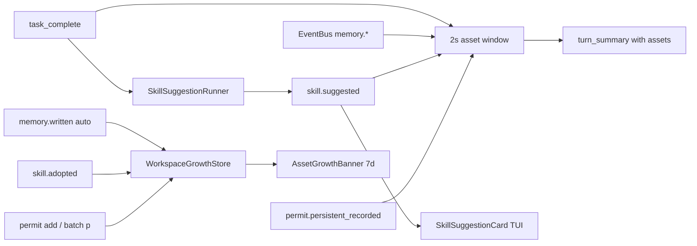

# Sprint 5 / Track B — 资产演进闭环（设计规范）

**状态**: 已落地（与实现一致）  
**范围**: 默认单工作区；多租户见 v3.0 与 [ADR-0001](./decisions/0001-track-strategy-and-multitenancy-deferral.md)。

## 目标

兑现「User grows Agent」：任务结束后用户能**看到**记忆沉淀、技能草稿、授权与增长曲线，而不是只在下一轮对话中偶然发现。

## 架构总览

## B1 · Skill 半自动建议

- **触发**: `task_complete` 且 `task.toolCalls >= 3`、本会话建议次数 `< 3`、且 `turnToolLog.length >= 3`。
- **实现**: [src/skills/SkillSuggestionRunner.ts](../src/skills/SkillSuggestionRunner.ts) 使用 `compactModel` 调用 `model.chat` 生成 Markdown+YAML；通过 `eventBus` 发 `skill.suggested`（不阻塞主循环）。
- **TUI**: [SkillSuggestionCard](../src/tui/components/SkillSuggestionCard.tsx) — `e` 打开 `$EDITOR`（默认 `vi`），`s` 直接落盘，Esc 发 `skill.discarded`。
- **落盘**: [commitSkillDraft](../src/skills/SkillSuggestionRunner.ts) → `skills/<slug>/SKILL.md`，发 `skill.adopted`。

## B2 · TurnSummary 资产

- [AgentSession](../src/runtime/AgentSession.ts) 在 `task_complete` 后 **await** `gatherTaskAssets(2000ms)`，聚合：
  - `memory.extracted` / `memory.written` (auto)
  - `skill.suggested`
  - `permit.persistent_recorded`
- [TurnSummaryCard](../src/tui/components/TurnSummaryCard.tsx) 展示 memory / skill / permit 行。

## B3 · Memory BM25 召回

- [Bm25LiteRecaller](../src/memory/recall/Bm25LiteRecaller.ts) + 扩展的 [MemoryProvider](../src/prompt/providers/MemoryProvider.ts)：对 L3 `LongTermMemory.list()` 全量做 BM25，取 top 5，与 L2 会话 `memoryContext` 分节输出。
- 无 `userTurnText` 或不具备 L3 时行为与仅会话记忆一致。

## B4 · 跨会话增长

- [WorkspaceGrowthStore](../src/observability/WorkspaceGrowthStore.ts): `<user>/.kyberkit/growth.sqlite`
- 订阅：`memory.written` (source=auto)、`skill.adopted`；`permit.persistent_recorded` 在持久授权变化时 +1
- [KyberRuntime.getAssetGrowth7d()](../src/runtime/KyberRuntime.ts) 供 TUI
- [AssetGrowthBanner](../src/tui/components/AssetGrowthBanner.tsx) 显示近 7 天累计行

## B5 · 持久授权

- [PermitStore](../src/permission/PermitStore.ts)：`permit.yaml` 读写；`loadFromDisk` 在启动时
- 批量卡 **p** → [BatchAuthDecision `allow_persistent`](../src/permission/ToolPermissionGate.ts)
- CLI: `/permit add persistent <tool> <L#>` , `/permit revoke <tool>`

## 验收（手工）

1. 多工具任务完成后约 2s 内 `TurnSummary` 含「沉淀资产」行（记忆/技能建议/授权至少其一）。
2. 技能卡片保存后 `skills/` 出现新目录，`/assets` 可扫到；Banner 7d 技能 +1（新会话亦可验证 growth sqlite）。
3. 持久授权写入 `~/.kyberkit/permit.yaml` 后重启 REPL，同一工具不再弹批权（在策略允许范围内）。
