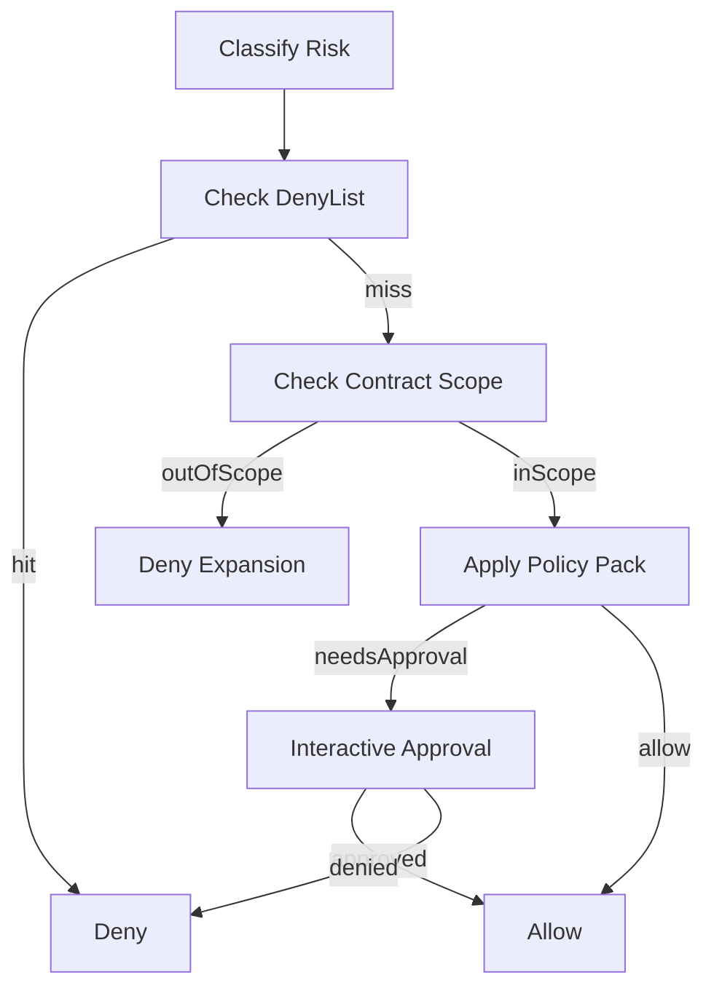

# Policy Pack And Permission Gate (3.0)

状态: Draft  
范围: P0 决策内核

---

## 1. 决策公式

`EffectiveAgentPermission = UserPermission ∩ TaskPermission ∩ PolicyConstraint`

其中：

- `UserPermission`: 账号原始权限（KyberKit 不扩展）
- `TaskPermission`: 当前任务合约声明
- `PolicyConstraint`: 策略包 + deny-list + 审批规则

---

## 2. 策略包

3.0 内置三档策略包：

- `development`
  - 公司内 dogfood 默认档
  - 更低审批密度，优先验证价值链路
- `balanced`
  - 对外试点默认档
  - L2 更严格，写操作提醒更完整
- `conservative`
  - 企业审慎档
  - 默认最小授权，审批覆盖更高

策略包决定：

- L1/L2/L3 是否需要审批
- 未声明工具是否直接拒绝
- 是否允许 persistent grant 应用于某风险等级

---

## 3. deny-list（不可变）

deny-list 是不可变强约束：

- 命中即 `deny`
- 不受 prompt、工具输出、会话 grant 影响
- 仅允许通过版本升级变更（`denyListVersion`）

3.0 首批 deny-list 示例：

- 跨工作区路径写入
- 对 `.kyberkit` 关键目录的破坏性操作
- 特权 shell（`sudo` / `su`）

---

## 4. Gate 决策顺序

---

## 5. 与现有授权机制兼容

当前 `PermitStore` 的 task/session/persistent grant 继续保留，但需要服从以下约束：

1. grant 只能在 `inScope` 且未命中 deny-list 前提下生效。
2. grant 不能提升风险等级上限（例如 L1 grant 不能放行 L2）。
3. 策略包明确要求每次审批时（如 L3），grant 不可跳过审批。

---

## 6. 审计要求

Gate 每次决策都要输出可审计结构：

- `toolName`
- `riskLevel`
- `taskId`
- `actorUserId`
- `contractType`
- `policyPack`
- `effectivePermission`
- `approvalStatus`
- `policyDecision.code`
- `policyDecision.reason`
