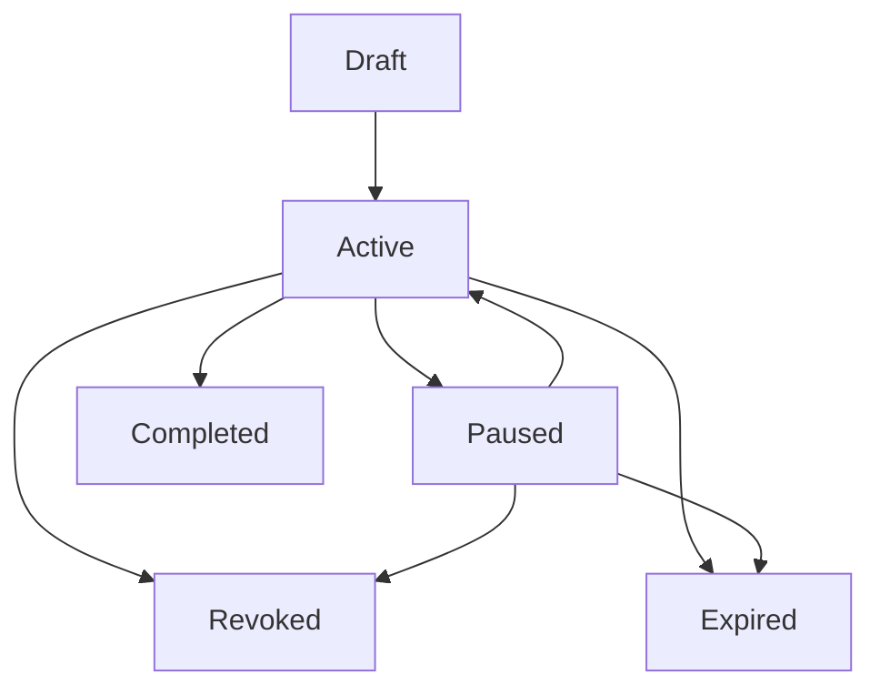

# Task Permission Contract (3.0)

状态: Draft  
范围: P0 schema + Ad-hoc runtime

---

## 1. 设计目标

Task Permission Contract 是任务执行前的权限声明，不等于账号静态权限。  
3.0 的目标是让每次工具调用都能回答三件事：

- 该调用是否属于本任务声明范围？
- 该调用在当前策略包下是否允许？
- 该调用是否需要审批或被强制拒绝？

---

## 2. 合约类型

- `ad_hoc`: 用户主动发起的一次性任务（P0 真正执行）
- `recurring`: 周期任务（P0 只定义 schema，不执行调度）
- `triggered`: 事件触发任务（P0 只定义 schema，不执行调度）

---

## 3. Contract Schema（核心字段）

最小字段集合：

- 身份字段
  - `taskId`
  - `actorUserId`
  - `agentSessionId`
  - `contractType`
- 权限声明字段
  - `requestedTools[]`: 工具名、风险等级、是否需要审批
  - `requestedContext[]`: 数据源、scope、mode
  - `effectivePermissionRule`: 固定为 `user_permission ∩ task_permission ∩ policy_constraint`
- 约束字段
  - `denyListVersion`
  - `policyPack`（`development` | `balanced` | `conservative`）
- 生命周期字段
  - `status`（`draft` | `active` | `paused` | `revoked` | `expired` | `completed`）
  - `createdAt` / `updatedAt`

扩展字段（P0 schema 预埋）：

- recurring: `schedule`, `expiresAt`, `scopeDriftLimit`
- triggered: `trigger.source`, `trigger.match`, `trigger.backoff`

---

## 4. 状态机

P0 运行时只需保证：

- `ad_hoc` 至少支持 `draft -> active -> completed`
- 任意状态进入 `revoked` 后不可再执行工具调用

---

## 5. 扩权与防注入规则

1. 合约一旦 `active`，`requestedTools` 不可被运行时追加。
2. 若模型请求未声明工具，视为扩权请求并拒绝执行。
3. 扩权请求必须通过新合约草稿流程，而非就地修改旧合约。
4. deny-list 命中优先级高于所有 allow 决策。

---

## 6. 与 Gate 的接口

Gate 输入应至少包含：

- 当前工具调用（toolName、riskLevel）
- 当前 task contract 快照
- policy pack
- permit store 状态（task/session/persistent）

Gate 输出应至少包含：

- `effectivePermission`: `allow` | `deny` | `needs_approval`
- `policyDecision`: 结构化原因（contract_miss、deny_list_hit、approval_required 等）
- `approvalStatus`: `not_required` | `required` | `approved` | `denied`
