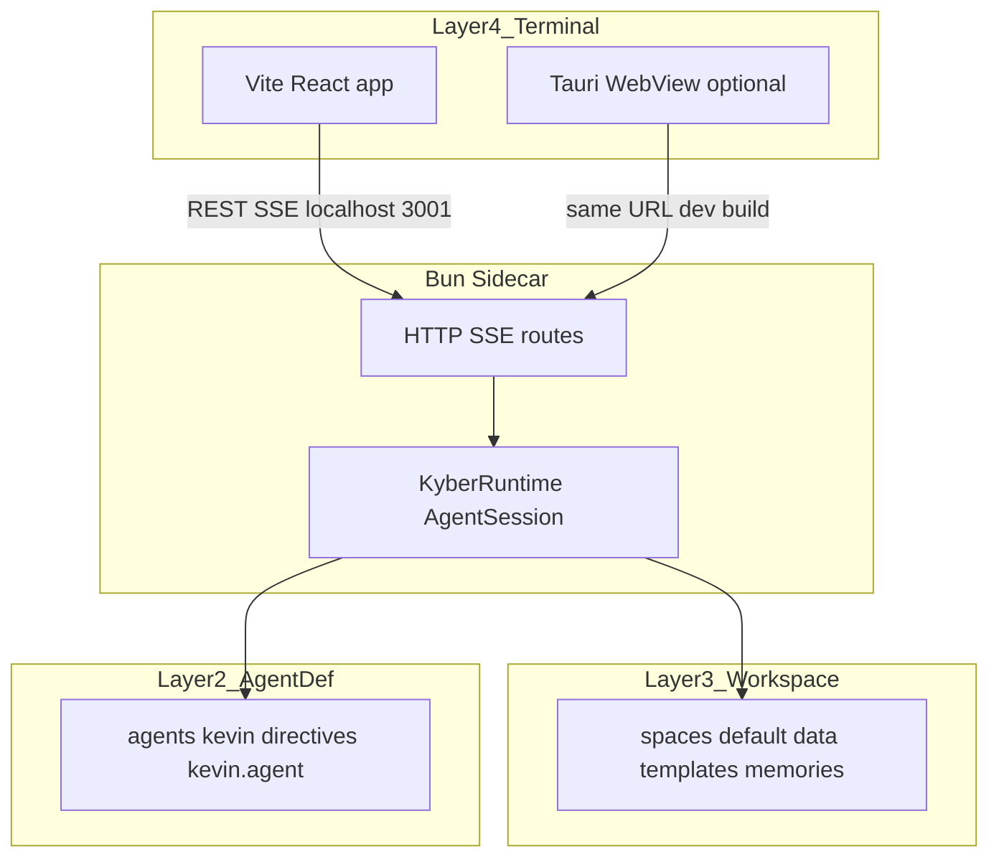

# Kevin 1.0 — 系统设计（实现态）

> **文档类型**: 系统设计与运行手册（As-built）  
> **更新日期**: 2026-05-04  
> **范围**: `app/`（Terminal）、`src-sidecar/`（Bun HTTP+SSE）、`agents/kevin/`（Agent 定义）、`spaces/`（Workspace 数据）

本文档在执行 Sprint 1–4 过程中维护，与 [agent-network-architecture.md](agent-network-architecture.md)、[sprint-plan-v2.md](sprint-plan-v2.md) 互为补充：**架构原则见 agent-network；排期与验收见 sprint-plan；本文件描述当前真实行为与边界。**

---

## 1. 系统上下文

Kevin 是 KyberKit 的 **Terminal 层** 产品形态之一：用户通过三面板 UI 与会话化 Sidecar 交互，Sidecar 内嵌 **KyberRuntime**，按 `agents/kevin/` 中的产品定义执行 Agent 循环，并可挂载 MCP（如本地 Filesystem）。

---

## 2. 进程与端口

| 进程 | 技术 | 默认端口 / 产物 | 说明 |
|------|------|-----------------|------|
| 前端开发服务器 | Vite | `http://127.0.0.1:5173` | `app` 内 `npm run dev`；`VITE_SIDECAR_URL` 可改 Sidecar 基址 |
| Kevin Sidecar | Bun + `src-sidecar/index.ts` | `http://127.0.0.1:3001` | 固定端口；健康检查 `GET /health` |
| Tauri 壳 | Rust + WebView | 无独立 HTTP | `npm run tauri:dev` / `tauri:build`；见 §7 |

**并发约定**：同一台机器上只应有一个 Sidecar 监听 `3001`。`app/kevin` 脚本与 Tauri 内建启动逻辑均应避免重复拉起（Tauri 在端口已占用时跳过 spawn，见 §7）。

---

## 3. Sidecar HTTP API（摘要）

实现以 [sprint3-Sessions&ScenarioA.md](sprint3-Sessions%26ScenarioA.md) 为准，当前路由包括但不限于：

| 方法 | 路径 | 说明 |
|------|------|------|
| GET | `/health` | 存活与版本、会话数量 |
| GET | `/sessions` | 会话列表元数据 |
| POST | `/sessions` | 创建会话 |
| GET | `/sessions/:id` | 会话详情（含 `artifactContent`、持久化消息等，以代码为准） |
| DELETE | `/sessions/:id` | 删除会话 |
| POST | `/sessions/:id/messages` | 用户消息，**SSE** 流式响应 |
| POST | `/chat` | 兼容旧客户端；内部路由到默认会话（deprecated） |

---

## 4. SSE 事件与 Artifact 管道

Sidecar 在流式转发 LLM `text_delta` 时，经 **`ArtifactParser`**（`src-sidecar/ArtifactParser.ts`）将 `<artifact>…</artifact>` 边界解析为结构化事件，再 JSON 封装进 SSE `data:` 行。

Terminal 侧 **`RightPanel`** 解析 SSE，并调用 **`ArtifactContext`**（`app/src/contexts/ArtifactContext.tsx`）更新 `artifact_start` / `artifact_delta` / `artifact_end` 对应状态；**`CenterPanel`** 订阅 Context，用 Milkdown `replaceAll` 刷新画布。

**设计约束**（与 sprint-plan 一致）：不在浏览器内用正则从整段聊天文本中「事后」抠 `<artifact>` 作为唯一数据源；结构化事件为真源。

常见事件类型（非穷举，以 Sidecar 实现为准）：

- `text_delta`, `tool_use_start`, `tool_result`, `task_narration`, `turn_complete`, `error`
- `artifact_start`, `artifact_delta`, `artifact_end`（可带 `artifact_id`、`summary` 等扩展字段）
- `session_updated` — 驱动左侧会话列表刷新（`refreshSessions`）

---

## 5. 持久化（SQLite）

Sidecar 使用 `bun:sqlite`。数据库路径由 **`KYBER_SPACES_ROOT`**（及 `KYBER_USER_NAME` 等）推导，落在 `spaces/<user>/.kyberkit/sessions.db` 一类目录（详见 `src-sidecar/db.ts`）。

表结构包含 **sessions**、**artifacts**、**messages**（对话轮次可按需持久化；与早期 sprint 文案「仅 artifact」相比为增强项）。

---

## 6. Terminal 状态分层

| 机制 | 职责 |
|------|------|
| `SessionContext` | `activeSessionId`、会话列表 CRUD、轮询 `/sessions` |
| `ArtifactContext` | 当前会话产物内容、流式 `streaming` 标志、`loadArtifact` / `clearArtifact` |
| `RightPanel` 本地 state | 气泡 UI、工具轨迹、同会话多 artifact 条带（与 Sidecar 扩展字段对齐） |

**Tab 切换**：`CenterPanel` 在切换会话 Tab 时必须 `GET /sessions/:id` 并 `loadArtifact`，与 `LeftSidebar` 选择会话行为一致，避免「Tab 标题已换、画布仍为旧 session」。

---

## 7. Tauri 桌面壳与 Sidecar 生命周期

源码：`app/src-tauri/`（Rust 1.88，见 `rust-toolchain.toml`）。

### 7.1 开发态（`tauri dev`）

- `beforeDevCommand` 仍为 `npm run dev`，由 Tauri 拉起 Vite。
- **`setup` 阶段**：若 `127.0.0.1:3001` 已有监听，则 **不** 再 spawn Sidecar（便于与 `./app/kevin start` 并存调试）。
- 否则尝试执行：`bun <repo>/src-sidecar/index.ts`，`current_dir` 设为仓库根；为子进程设置 **`KYBER_SPACES_ROOT=<repo>/spaces`**。
- 仓库根解析顺序（摘要）：`KYBERKIT_REPO_ROOT` → 自 `current_exe` 向上查找含 `src-sidecar/index.ts` 的目录 → `cwd` / `cwd/..` → Resource 相对路径（兜底）。

### 7.2 退出

在 `RunEvent::Exit` 时，若本进程曾 spawn Sidecar，则 **`kill` + `wait`** 子进程，避免僵尸 Bun。

### 7.3 环境变量开关

| 变量 | 含义 |
|------|------|
| `KEVIN_SKIP_SIDECAR_SPAWN=1` | Tauri **不** 自动启动 Sidecar（自行用 `kevin` 脚本或其它方式起） |
| `KYBERKIT_REPO_ROOT` | 显式指定 Kyberkit 仓库根（含 `src-sidecar`） |

### 7.4 生产打包（已知缺口）

- 当前仍假设目标机安装 **`bun`** 且可访问源码树中的 `src-sidecar/index.ts`。**正式 `.app` 分发**应改为：编译 Sidecar 为独立二进制、用 Tauri `externalBin` 或安装器释放资源，并在启动时注入 `KYBER_SPACES_ROOT` 指向 **应用数据目录**（非用户源码目录）。详见 [demo-and-packaging.md](demo-and-packaging.md)。

---

## 8. 环境变量一览（与 Kevin 强相关）

| 变量 | 层级 | 说明 |
|------|------|------|
| `VITE_SIDECAR_URL` | 前端 build | 覆盖默认 `http://localhost:3001` |
| `KYBER_SPACES_ROOT` | Sidecar / Tauri 子进程 | SQLite 与空间数据根 |
| `KYBER_USER_NAME`, `KYBER_WORKSPACE_ID` 等 | Runtime / Sidecar | 与 KyberKit `.env.example` 一致 |
| `KYBER_AGENT_DEF` | Runtime | Agent 定义入口（如 `agents/kevin/kevin.agent.ts`） |
| `KYBER_MCP_SERVER_*` | Runtime | MCP 进程配置；Filesystem 见 [mcp-filesystem-runbook.md](mcp-filesystem-runbook.md) |
| `KYBERKIT_REPO_ROOT` | Tauri | 显式仓库根 |
| `KEVIN_SKIP_SIDECAR_SPAWN` | Tauri | 跳过自动 Sidecar |

---

## 9. 历史架构偏差与纠正状态

以下问题曾在 [sprint-plan-v2.md](sprint-plan-v2.md) §1.2 记录，**当前实现已纠正或替代**，保留条目仅供审计：

| 原问题 | 状态 | 实现要点 |
|--------|------|----------|
| Sidecar `process.chdir` 硬编码 | 已移除 | 路径由 env + `resolveWorkspacePaths` 类逻辑管理 |
| 单例 Session | 已替代 | `SessionManager` + 多路由 |
| DOM `CustomEvent` 传 Artifact | 已替代 | Sidecar `ArtifactParser` + `ArtifactContext` |
| 左/中面板纯 Mock | 已替代 | `/sessions`、动态 Tab、Milkdown 订阅 |

---

## 10. 快速启动与 Scenario A

预置 Prompt 与标签定义在 **`app/src/data/templates.ts`**（`QUICK_TEMPLATES`），Workspace 内模板文件位于 **`spaces/default/data/templates/`**。产品叙述见 [kevin-product-plan-mvp.md](kevin-product-plan-mvp.md)。

---

## 11. 修订记录

| 日期 | 内容 |
|------|------|
| 2026-05-04 | 初版：整合 Sidecar、SSE、SQLite、Terminal 状态、Tauri 启停与环境变量 |
