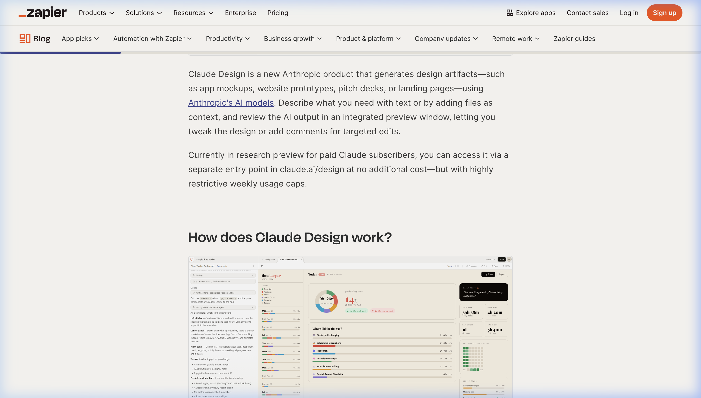
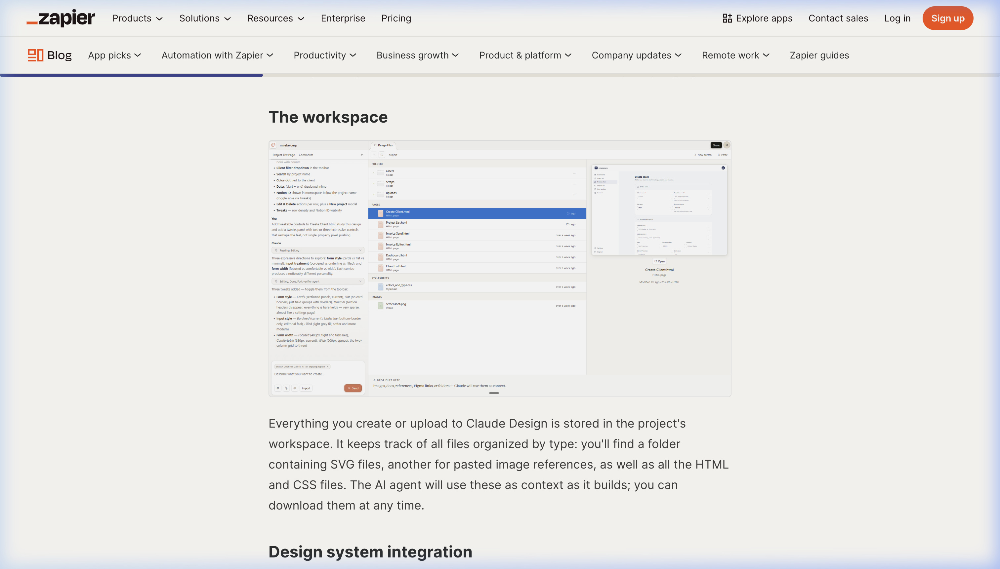
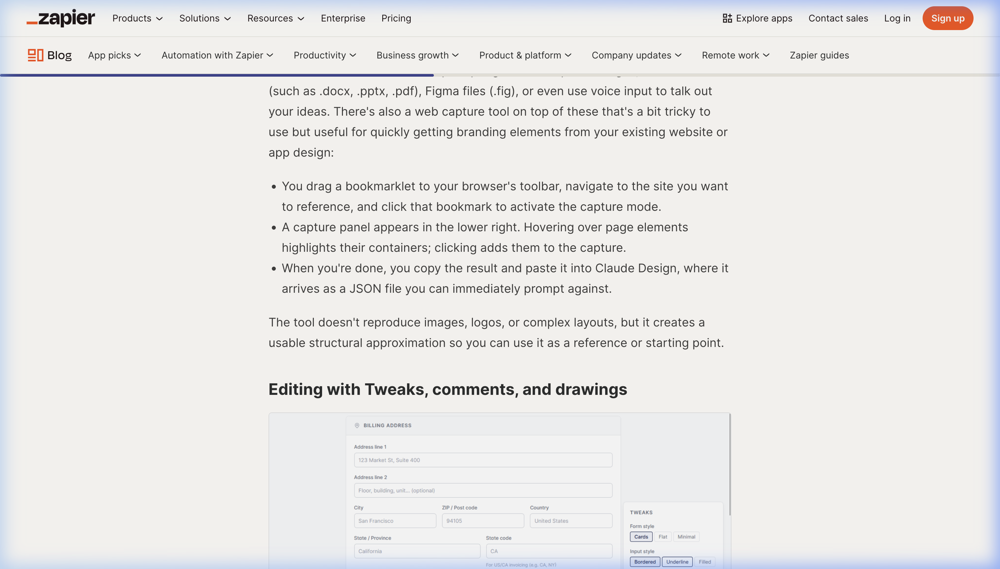
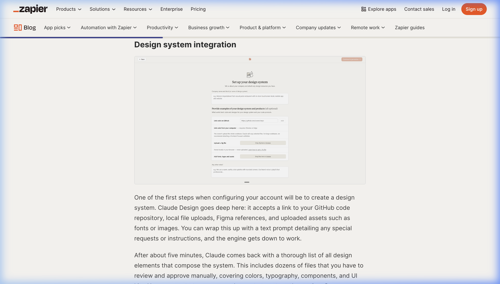

# Kevin 2.0 设计参考报告：Claude Design 深度解析与借鉴

## 第一部分：Claude Design 深度拆解 (Claude Design Breakdown)

基于对 Anthropic 最新设计理念的分析，Claude Design 代表了从“对话框”向“交互式画布”的范式转移。其产品设计精髓可拆解为以下维度：

### 1. 核心交互架构：从聊天到“设计画布”
Claude 不再仅仅是输出代码，而是直接提供了一个**设计视图 (Design View)**。
- **画布编辑器**: 用户可以直观地看到生成的 UI 组件，并支持响应式（Mobile/Desktop）切换。
- **图层与结构**: 侧边栏提供了类似 Figma 的图层/组件结构视图，让生成的结果变得可控。

*图 1：全新的 Claude Design 画布，顶部支持响应式预览切换，中心为可交互的设计区域*

*图 2：左侧集成了“视图 (Views)”管理，允许用户在不同的 UI 状态间快速跳转*

### 2. 深度样式控制 (Precision Styling)
Claude Design 引入了精细化的样式调整面板，允许用户通过 GUI 直接修改生成物的视觉属性。
- **视觉变量**: 涵盖色值 (Color)、间距 (Spacing)、边角 (Corners) 等基础变量。
- **实时同步**: GUI 上的每一处微调都会即时重写底层的 Tailwind/CSS 代码。

*图 3：精细化的 Style 面板，实现了“零代码”级别的视觉修正*

### 3. 设计系统集成 (Design System Integration)
这是 Claude Design 最具工业感的部分：它允许定义一套全局的设计规范，并将其作为“真值来源 (Source of Truth)”。
- **仓库关联**: 支持将生成的代码直接推送 (Push) 到指定的代码仓库。
- **全局配置**: 一次性定义主色、字体和基础组件风格。

*图 4：设计系统全局配置，关联了代码仓库与视觉规范的同步逻辑*

---

## 第二部分：Kevin 2.0 借鉴与提炼 (Borrowing for Kevin 2.0)

针对 Kevin 2.0 的“AI 助手”定位，我们可以从上述拆解中提取以下高价值元素进行进阶：

### 1. 引入“Kevin 画布”概念 (The Canvas)
- **借鉴点**: 目前 Kevin 仅有预览，没有“编辑器”。
- **Kevin 2.0 改进**: 
    - 实现**双模切换**: 在“预览模式”和“架构模式（Layers View）”之间切换。
    - **响应式预览**: 默认在预览区提供 iPhone/iPad/Desktop 切换按钮。

### 2. GUI 驱动的局部微调 (GUI-Driven Tweaks)
- **借鉴点**: 避免“为了改一个颜色而写一段 Prompt”。
- **Kevin 2.0 改进**: 
    - 结合**动态岛 (Dynamic Island)**：当用户在画布上选中一个组件，动态岛展开显示常用的样式控制器（如：圆角、主题色）。

### 3. 系统级变量管理 (Systemic Theming)
- **借鉴点**: 保持输出风格的一致性。
- **Kevin 2.0 改进**: 
    - 建立 **Kevin Design Registry**: 允许用户预设一套企业级视觉变量（HSL, Border-Radius, Padding），确保 Kevin 生成的所有 UI 片段都自动继承这些规范。

### 4. 协作闭环：从预览到代码库 (Preview to Repo)
- **借鉴点**: Claude 的一键推送功能。
- **Kevin 2.0 改进**: 
    - 实现 **Live Sync**: 预览区的最终效果可以一键转换为 Pull Request，直接推送到项目的 Git 仓库。

---

## 结论：设计演进路径
Kevin 2.0 应成为一个**“具备 UI 感知能力的设计工作站”**。
- **短期目标**: 引入 Layers 视图，实现基础视觉变量的 GUI 控制。
- **长期目标**: 实现“设计系统级”的输出约束，让生成的代码即生产环境代码。
