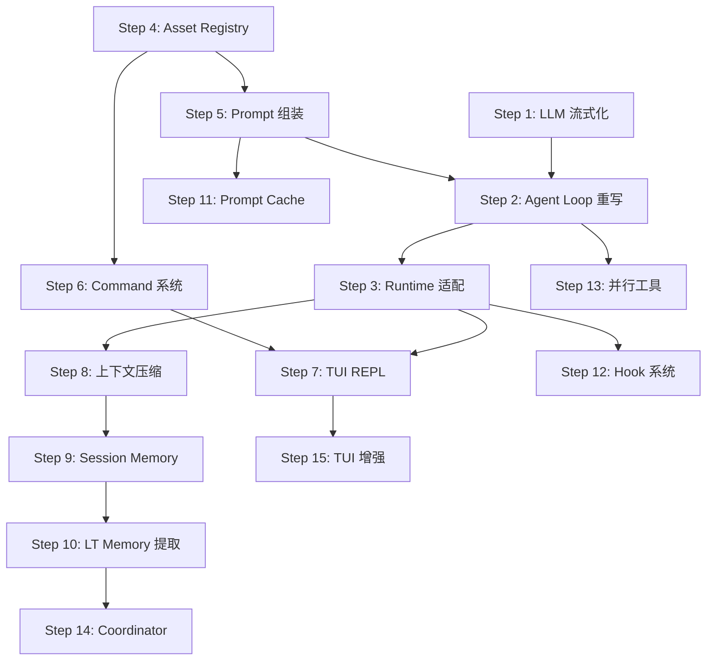

# KyberKit v2.0 升级实施计划

> **版本**: 2.0
> **基于**: 14 章 DeepCC 逆向工程综合分析 + Hermes Agent 参考
> **用户决策**: UI = TUI (Ink) / 记忆提取 = 全自动 / 模型 = 仅 Anthropic (Day 1)

---

## 总览

```
Sprint 1 (流式基础设施)     Step 1-3    ← Agent 可流式运行
Sprint 2 (用户资产体系)     Step 4-6    ← 用户可积累 Skills/Memories/Prompts
Sprint 3 (TUI 交互层)      Step 7      ← 终端 REPL 可用
Sprint 4 (长对话可靠性)     Step 8-10   ← 上下文压缩 + 记忆自动提取
Sprint 5 (扩展性)          Step 11-13  ← Prompt Cache + Hook + 并行工具
Sprint 6 (多 Agent)        Step 14-15  ← Coordinator + TUI 增强
```

每个 Sprint 结束后系统可独立运行 & 所有测试通过。

---

## Sprint 1: 流式基础设施 (Step 1-3)

### Step 1: LLM Gateway 流式化

**目标**: `AnthropicProvider.chatStream()` 从占位符变为完整实现。

**变更文件**:
- [MODIFY] `src/types/model.ts` — 新增 `StreamEvent` 联合类型
- [MODIFY] `src/model/AnthropicProvider.ts` — 实现 `chatStream()`, 新增 Usage 累积

**StreamEvent 类型定义**:
```typescript
type StreamEvent =
  | { type: 'text_delta'; text: string }
  | { type: 'tool_use_start'; id: string; name: string }
  | { type: 'tool_use_input'; id: string; inputFragment: string }
  | { type: 'tool_use_stop'; id: string }
  | { type: 'thinking_delta'; text: string }
  | { type: 'message_stop'; stopReason: StopReason }
  | { type: 'usage'; usage: UsageInfo };

interface UsageInfo {
  inputTokens: number;
  outputTokens: number;
  cacheCreationTokens?: number;
  cacheReadTokens?: number;
}
```

**验收标准**:
- `chatStream()` 以 `AsyncIterable<StreamEvent>` 返回
- 每个 `text_delta` 包含增量文本
- `tool_use_start/input/stop` 三阶段完整覆盖
- `message_stop` 时携带准确的 Usage 统计

---

### Step 2: Streaming Agent Loop 重写

**目标**: `AgentLoop.ts` 从批量 `model.chat()` 改为 async generator + middleware pipeline。

**变更文件**:
- [NEW] `src/agent/StreamMiddleware.ts` — Middleware 接口 + Pipeline
- [MODIFY] `src/agent/AgentLoop.ts` — 重写为 `agentLoop()` async generator
- [NEW] `src/agent/middleware/TokenCounterMiddleware.ts`
- [NEW] `src/agent/middleware/ContentAccumulatorMiddleware.ts`
- [NEW] `src/agent/middleware/ToolDispatcherMiddleware.ts`

**Middleware 接口**:
```typescript
interface StreamMiddleware {
  readonly name: string;
  process(
    event: AgentEvent,
    context: MiddlewareContext,
    next: () => Promise<AgentEvent | null>
  ): Promise<AgentEvent | null>;
}

interface MiddlewarePipeline {
  use(middleware: StreamMiddleware): void;
  process(event: AgentEvent, context: MiddlewareContext): Promise<AgentEvent | null>;
}
```

**agentLoop 签名**:
```typescript
async function* agentLoop(deps: AgentLoopDeps): AsyncGenerator<AgentEvent, void, void>;

interface AgentLoopDeps {
  agent: DefaultAgentInstance;
  model: ModelProvider;
  tools: ToolIntegrationFacade;
  sandbox: PermissionSandbox;
  pipeline: MiddlewarePipeline;
  reliability: ReliabilityLayer;
}
```

**验收标准**:
- 消费端 `for await (const event of agentLoop(deps))` 可逐块接收
- 工具调用在 ContentAccumulator 完整聚合 tool_use 后分发给 ToolDispatcher
- TokenCounter 在每个 usage event 后累积
- 现有 `AgentStateMachine` 状态转换保持不变

---

### Step 3: KyberRuntime 适配

**目标**: Runtime 初始化流程适配新的 Middleware pipeline。

**变更文件**:
- [MODIFY] `src/runtime/KyberRuntime.ts` — 增加 pipeline 初始化
- [MODIFY] 现有测试 — 适配新签名

**验收标准**:
- `bun test` 全部通过
- `KyberRuntime.createAgent()` + `agentLoop()` 端到端可用

---

## Sprint 2: 用户资产体系 (Step 4-6)

### Step 4: 用户资产目录 & Registry

**目标**: 建立 `.kyberkit/` 目录扫描和热更新机制。

**变更文件**:
- [NEW] `src/assets/AssetRegistry.ts` — scan() / query() / watch()
- [NEW] `src/assets/KKMdLoader.ts` — KK.md 多级加载与合并
- [NEW] `src/assets/MemoryDirScanner.ts` — memories/ 目录扫描 + frontmatter 解析
- [NEW] `src/types/assets.ts` — AssetEntry / AssetPaths / AssetManifest 类型

**目录结构约定**:
```
~/.kyberkit/             (用户级)
.kyberkit/               (项目级, 项目根)
├── KK.md                (行为规范)
├── memories/            (持久记忆)
│   ├── MEMORY.md        (索引, 自动维护)
│   └── *.md             (各条记忆)
├── skills/              (用户技能)
│   └── {name}/SKILL.md
└── commands/            (自定义命令)
    └── *.yaml
```

**验收标准**:
- `scan()` 正确合并用户级 + 项目级资产
- 项目级 KK.md 优先于用户级
- 文件修改后 `watch()` 触发 `AssetChangeEvent`

---

### Step 5: 动态 Prompt 组装管线

**目标**: System Prompt 从静态字符串变为多源动态组装。

**变更文件**:
- [NEW] `src/prompt/PromptAssembler.ts` — register() / assemble()
- [NEW] `src/prompt/providers/IdentityProvider.ts`
- [NEW] `src/prompt/providers/ToolSchemaProvider.ts`
- [NEW] `src/prompt/providers/UserDirectiveProvider.ts`
- [NEW] `src/prompt/providers/MemoryProvider.ts`
- [NEW] `src/prompt/providers/EnvironmentProvider.ts`
- [NEW] `src/types/prompt.ts` — PromptSection / AssembledPrompt 类型
- [MODIFY] `src/agent/AgentLoop.ts` — 使用 PromptAssembler 替代静态 systemPrompt

**组装优先级 (预算裁剪顺序)**:
```
Priority 1 (必保留): Identity + Tool Schemas
Priority 2 (高优先): KK.md
Priority 3 (中优先): Memory Context
Priority 4 (可裁剪): Environment Snapshot
```

**验收标准**:
- 无 KK.md 时系统正常运行 (Identity + Tools 总能注入)
- 有 KK.md 时 Agent 行为符合规范
- 有 memories/ 时相关内容出现在 System Prompt 中
- 预算不足时低优先级 section 被裁剪

---

### Step 6: Command 系统

**目标**: 用户可通过 / 前缀执行快捷命令。

**变更文件**:
- [NEW] `src/commands/CommandRegistry.ts`
- [NEW] `src/commands/builtin/HelpCommand.ts`
- [NEW] `src/commands/builtin/CostCommand.ts`
- [NEW] `src/commands/builtin/MemoryCommand.ts`
- [NEW] `src/commands/builtin/CompactCommand.ts` — 占位 (Sprint 4 实现逻辑)
- [NEW] `src/types/command.ts`
- [MODIFY] `src/agent/AgentLoop.ts` — 命令拦截逻辑

**验收标准**:
- `/help` 输出所有已注册命令
- `/cost` 输出当前 session Token 用量
- `/memory list` 输出 .kyberkit/memories/ 目录内容
- `/unknown` 返回 "Unknown command" 错误
- 非 / 开头的输入正常走 LLM 路径

---

## Sprint 3: TUI 交互层 (Step 7)

### Step 7: 终端 REPL 框架

**目标**: 用户可通过 `kyberkit` 命令启动终端 REPL 交互。

**变更文件**:
- [NEW] `src/tui/REPL.tsx` — 主 REPL 组件
- [NEW] `src/tui/components/PromptInput.tsx` — 输入组件
- [NEW] `src/tui/components/StreamingOutput.tsx` — 流式输出渲染
- [NEW] `src/tui/components/StatusBar.tsx` — 状态栏
- [NEW] `src/tui/app.tsx` — Ink App 入口
- [MODIFY] `src/cli/init.ts` — 增加 `kyberkit chat` 子命令
- [NEW] `bin/kyberkit` — CLI 入口脚本

**架构**:
```
bin/kyberkit
  → cli.ts (Commander 解析)
  → KyberRuntime.bootstrap()
  → Ink render(<App />) 
  → <REPL>
       ├─ <StreamingOutput /> — for await agentLoop → 实时渲染
       ├─ <StatusBar />       — model / tokens / cost
       └─ <PromptInput />     — readline + Command 拦截
```

**验收标准**:
- `kyberkit chat` 启动 REPL
- 输入文本后流式显示 LLM 响应
- 工具调用显示 tool name + 结果摘要
- Ctrl+C 中断当前响应 (不退出 REPL)
- `/help` 等命令在 REPL 中可用
- 状态栏显示当前模型和 Token 计数

---

## Sprint 4: 长对话可靠性 (Step 8-10)

### Step 8: 上下文压缩引擎

**变更文件**:
- [NEW] `src/compression/ContextCompressor.ts`
- [NEW] `src/compression/RoundGrouping.ts` — API Round 配对保护
- [NEW] `src/compression/LLMSummaryCompactor.ts` — Haiku 压缩
- [NEW] `src/agent/middleware/CompactionGuardMiddleware.ts`

### Step 9: Session Memory 引擎

**变更文件**:
- [MODIFY] `src/memory/SessionMemory.ts` — 结构化 Markdown 模板
- [NEW] `src/memory/SessionMemoryExtractor.ts` — Fork LLM 提取
- [NEW] `src/agent/middleware/MemoryTriggerMiddleware.ts`
- [NEW] `src/compression/SessionMemoryCompactor.ts` — 零成本压缩降级

### Step 10: Long-term Memory 自动提取

**变更文件**:
- [NEW] `src/memory/LongTermMemoryExtractor.ts`
- [MODIFY] `src/memory/LongTermMemory.ts` — Markdown + frontmatter 写入
- [MODIFY] `src/assets/MemoryDirScanner.ts` — 支持自动写入的记忆文件

---

## Sprint 5: 扩展性 (Step 11-13)

### Step 11: Prompt Cache 优化
- AnthropicProvider cache_control 支持
- PromptAssembler cacheBreakpoints 输出

### Step 12: Hook 系统
- 三层 Hook: Internal / Event / User Shell

### Step 13: 并行工具执行
- ConcurrentToolExecutor (Promise.allSettled)

---

## Sprint 6+: 多 Agent (Step 14-15)

### Step 14: Coordinator Mode
### Step 15: TUI 增强 (Transcript / 搜索 / 后台任务)

---

## 依赖关系图



> [!IMPORTANT]
> **推荐执行顺序**: Step 1 → 4 → 5 → 2 → 6 → 3 → 7 → 8 → 9 → 10 → 11 → 12 → 13 → 14 → 15
>
> 理由: Step 4 (AssetRegistry) 和 Step 5 (PromptAssembler) 是 Step 2 (Agent Loop) 的前置依赖 —— Agent Loop 需要 PromptAssembler 来组装 System Prompt。Step 1 (LLM 流式化) 和 Step 4/5 可并行开发。
